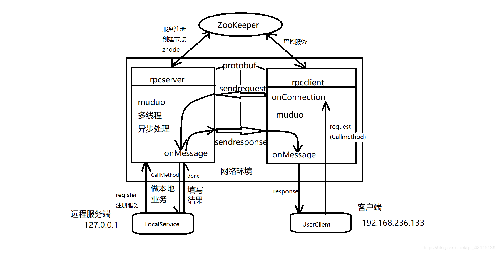

[(47条消息) C++实现的RPC网络通信框架_c++ rpc_施瓦辛帝的博客-CSDN博客](https://blog.csdn.net/qq_42119136/article/details/104124546?ops_request_misc=&request_id=&biz_id=102&utm_term=C++rpc&utm_medium=distribute.pc_search_result.none-task-blog-2~all~sobaiduweb~default-7-104124546.142^v87^insert_down28,239^v2^insert_chatgpt&spm=1018.2226.3001.4187)

### C++语言实现的RPC网络通信框架

-   [目录](https://blog.csdn.net/qq_42119136/article/details/104124546?ops_request_misc=&request_id=&biz_id=102&utm_term=C++rpc&utm_medium=distribute.pc_search_result.none-task-blog-2~all~sobaiduweb~default-7-104124546.142^v87^insert_down28,239^v2^insert_chatgpt&spm=1018.2226.3001.4187#_2)
-   -   [项目概述](https://blog.csdn.net/qq_42119136/article/details/104124546?ops_request_misc=&request_id=&biz_id=102&utm_term=C++rpc&utm_medium=distribute.pc_search_result.none-task-blog-2~all~sobaiduweb~default-7-104124546.142^v87^insert_down28,239^v2^insert_chatgpt&spm=1018.2226.3001.4187#_3)
    -   [环境](https://blog.csdn.net/qq_42119136/article/details/104124546?ops_request_misc=&request_id=&biz_id=102&utm_term=C++rpc&utm_medium=distribute.pc_search_result.none-task-blog-2~all~sobaiduweb~default-7-104124546.142^v87^insert_down28,239^v2^insert_chatgpt&spm=1018.2226.3001.4187#_6)
    -   -   [muduo库](https://blog.csdn.net/qq_42119136/article/details/104124546?ops_request_misc=&request_id=&biz_id=102&utm_term=C++rpc&utm_medium=distribute.pc_search_result.none-task-blog-2~all~sobaiduweb~default-7-104124546.142^v87^insert_down28,239^v2^insert_chatgpt&spm=1018.2226.3001.4187#muduo_8)
        -   [protobuf](https://blog.csdn.net/qq_42119136/article/details/104124546?ops_request_misc=&request_id=&biz_id=102&utm_term=C++rpc&utm_medium=distribute.pc_search_result.none-task-blog-2~all~sobaiduweb~default-7-104124546.142^v87^insert_down28,239^v2^insert_chatgpt&spm=1018.2226.3001.4187#protobuf_10)
        -   [zookeeper](https://blog.csdn.net/qq_42119136/article/details/104124546?ops_request_misc=&request_id=&biz_id=102&utm_term=C++rpc&utm_medium=distribute.pc_search_result.none-task-blog-2~all~sobaiduweb~default-7-104124546.142^v87^insert_down28,239^v2^insert_chatgpt&spm=1018.2226.3001.4187#zookeeper_12)
    -   [RPC框架图](https://blog.csdn.net/qq_42119136/article/details/104124546?ops_request_misc=&request_id=&biz_id=102&utm_term=C++rpc&utm_medium=distribute.pc_search_result.none-task-blog-2~all~sobaiduweb~default-7-104124546.142^v87^insert_down28,239^v2^insert_chatgpt&spm=1018.2226.3001.4187#RPC_14)
    -   [代码](https://blog.csdn.net/qq_42119136/article/details/104124546?ops_request_misc=&request_id=&biz_id=102&utm_term=C++rpc&utm_medium=distribute.pc_search_result.none-task-blog-2~all~sobaiduweb~default-7-104124546.142^v87^insert_down28,239^v2^insert_chatgpt&spm=1018.2226.3001.4187#_16)
    -   -   [1.proto文件](https://blog.csdn.net/qq_42119136/article/details/104124546?ops_request_misc=&request_id=&biz_id=102&utm_term=C++rpc&utm_medium=distribute.pc_search_result.none-task-blog-2~all~sobaiduweb~default-7-104124546.142^v87^insert_down28,239^v2^insert_chatgpt&spm=1018.2226.3001.4187#1proto_17)
        -   [2.RPC服务器端](https://blog.csdn.net/qq_42119136/article/details/104124546?ops_request_misc=&request_id=&biz_id=102&utm_term=C++rpc&utm_medium=distribute.pc_search_result.none-task-blog-2~all~sobaiduweb~default-7-104124546.142^v87^insert_down28,239^v2^insert_chatgpt&spm=1018.2226.3001.4187#2RPC_68)
        -   [3.远程服务端](https://blog.csdn.net/qq_42119136/article/details/104124546?ops_request_misc=&request_id=&biz_id=102&utm_term=C++rpc&utm_medium=distribute.pc_search_result.none-task-blog-2~all~sobaiduweb~default-7-104124546.142^v87^insert_down28,239^v2^insert_chatgpt&spm=1018.2226.3001.4187#3_126)
        -   [4.RPC客户端](https://blog.csdn.net/qq_42119136/article/details/104124546?ops_request_misc=&request_id=&biz_id=102&utm_term=C++rpc&utm_medium=distribute.pc_search_result.none-task-blog-2~all~sobaiduweb~default-7-104124546.142^v87^insert_down28,239^v2^insert_chatgpt&spm=1018.2226.3001.4187#4RPC_189)
        -   [5.用户端](https://blog.csdn.net/qq_42119136/article/details/104124546?ops_request_misc=&request_id=&biz_id=102&utm_term=C++rpc&utm_medium=distribute.pc_search_result.none-task-blog-2~all~sobaiduweb~default-7-104124546.142^v87^insert_down28,239^v2^insert_chatgpt&spm=1018.2226.3001.4187#5_235)
    -   [项目github地址](https://blog.csdn.net/qq_42119136/article/details/104124546?ops_request_misc=&request_id=&biz_id=102&utm_term=C++rpc&utm_medium=distribute.pc_search_result.none-task-blog-2~all~sobaiduweb~default-7-104124546.142^v87^insert_down28,239^v2^insert_chatgpt&spm=1018.2226.3001.4187#github_271)
    -   [参考](https://blog.csdn.net/qq_42119136/article/details/104124546?ops_request_misc=&request_id=&biz_id=102&utm_term=C++rpc&utm_medium=distribute.pc_search_result.none-task-blog-2~all~sobaiduweb~default-7-104124546.142^v87^insert_down28,239^v2^insert_chatgpt&spm=1018.2226.3001.4187#_274)


**声明：本篇博客是本人学习时的探索，涉及知识表述不正确不恰当的情况敬请谅解，欢迎大家指导指正。**

# 目录

## 项目概述

RPC(Remote Procedure Call Protocol)–远程过程调用协议，它是一种通过网络从远程计算机程序上请求服务，而不需要了解底层网络技术的协议。RPC协议假定某些传输协议的存在，如TCP或UDP，为通信程序之间携带信息数据。在OSI网络通信模型中，RPC跨越了传输层和应用层。RPC使得开发包括网络分布式多程序在内的应用程序更加容易。  
本框架是C++语言编写开发的一个RPC调用框架，网络服务器基于muduo库实现，RPC服务器和RPC客户端通讯的数据系列化和反序列化使用protobuf，服务配置中心采用zookeeper，配置文件加载采用tinyxml。

## 环境

本框架在Linux平台上运行，需要安装配置muduo库，protobuf以及zookeeper

### muduo库

muduo库是一个基于reactor反应堆模型的多线程C++网络库。muduo网络库在多线程环境下性能非常高，借助muduo库可以将rpcserver实现成IO多线程，并且处理RPC框架的rpcserver端和rpcclient端的连接和消息事件，我们只需要在接口里实现具体做什么。

### protobuf

Protocol Buffers (ProtocolBuffer/ protobuf )是Google公司开发的一种数据描述语言，类似于XML能够将结构化数据序列化。并且由于它是一种二进制的格式，比使用xm|、 json进行数据交换快许多。作为一种效率和兼容性都很优秀的二进制数据传输格式，可以用于诸如网络传输、配置文件、数据存储等诸多领域。我们借助protobuf来处理解析介于RPC框架rpcserver端和rpcclient端的数据，并且RPC框架基于Protobuf文件自动生成Client以及Server接口，用于rpcclient的构建，以及rpcserver的实现。

### zookeeper

zookeeper是一个分布式服务框架，是Apache Hadoop 的一个子项目，它主要是用来解决分布式应用中经常遇到的一些数据管理问题，可以实现诸如分布式应用配置管理、统一命名服务、状态同步服务、集群管理等功能。在这里我们借助zookeeper来充当服务配置中心，将RPC服务器以及远程的本地服务注册到zookeeper上进行管理。

## RPC框架图

图片: 

## 代码

### 1.proto文件

service.proto

```cpp
// protobuf的版本
syntax = "proto3";

// 添加该标识，让protoc产生service服务类和服务方法
option cc_generic_services = true;
//option py_generic_services = true;  
//option java_generic_services = true;  

// 1. 定义服务方法的参数打包类型和返回值的打包类型
message LoginRequest{
string name = 1;
string pwd = 2;
}
message LoginResponse{
bool isLoginSuccess = 1; 
}

message RegRequest{
int32 id = 1;
string name = 2;
string pwd = 3;
string tel = 4;
}
message RegResponse{
bool isRegSuccess = 1;
}

// 定义service服务类和服务方法
service LocalServiceRpc{
rpc login(LoginRequest) returns(LoginResponse);
rpc reg(RegRequest) returns(RegResponse);
}
```

rpcmeta.proto

```cpp
syntax = "proto3"; // 声明protobuf版本号

// 让proto产生服务类和服务类方法
option cc_generic_services = true; 

message rpc_header{
string service_name = 1;
string method_name = 2;
}
```

### 2.RPC服务器端

```cpp
#include <muduo/net/TcpServer.h>
#include <muduo/net/EventLoop.h>
#include <muduo/base/Logging.h>
#include <functional>
#include <unordered_map>
#include <string>
using namespace muduo;
using namespace muduo::net;
using namespace std;
using namespace placeholders;
#include "google/protobuf/service.h"
#include "google/protobuf/descriptor.h"
#include "google/protobuf/message.h"
#include "zookeeperutils.h"

/*
基于C++和protobuf实现的RPC框架的服务端框架代码
*/
class RpcServer
{
public:
// 获取唯一实例的方法
static RpcServer* getInstance();
// epoll_ctl => listenfd => epoll
void start();
// 让用户调用该方法，向RpcServer注册RPC服务
void registerServer(google::protobuf::Service *service);
private:
// 初始化
RpcServer(EventLoop *loop, const InetAddress &addr, const string& name);
// 负责连接
void onConnection(const TcpConnectionPtr &con);
// 负责接收并发送响应消息的 
void onMessage(const TcpConnectionPtr& con,
Buffer *buf,
Timestamp time);
// do->Run（） 对应的回调
void sendRpcResponse(const TcpConnectionPtr &con,
google::protobuf::Message *response);
TcpServer server_;
EventLoop *loop_;
// unordered_map 记录服务以及服务对应的所有方法
// 包装服务对象和方法调用
struct ServerInfo
{
google::protobuf::Service *service_; // 指向服务对象
unordered_map<string, const google::protobuf::MethodDescriptor*> methodMap_; // 服务对象里面具体的方法
};
// 服务类名字   -   ServerInfo
unordered_map<string, ServerInfo> serverMap_;
// 设计唯一的实例
static RpcServer *rpcServer_;
// zk的客户端实例，用来启动zk客户端以及创造zonde节点
ZkClient zkclient_;
};
```

### 3.远程服务端

```cpp
#include "service.pb.h"
#include"rpcserver.h"
#include<iostream>
#include<string>

using namespace std;
//根据service.proto的形式将本地服务发布成rpc服务
//service.pb.h会有生成的服务类定义，本地服务继承该服务类，对虚函数进行重写，实现具体功能
class UserService:public LocalServiceRpc
{
public:
// 原先本地的服务方法
bool log(string name, string pwd)
{
cout << "call UserService::login->";
cout << "name:" << name << " ";
cout << "pwd:" << pwd << endl;
return true;
}
bool reg(int id, string name, string pwd, string tel)
{
cout << "call UserService::reg->";
cout << "id:" << id << " ";
cout << "name:" << name << " ";
cout << "pwd:" << pwd << endl;
cout << "tel:" << tel << endl;
}
// 支持RPC远程调用的服务方法
virtual void login(::google::protobuf::RpcController* controller,
const ::LoginRequest* request,
::LoginResponse* response,
::google::protobuf::Closure* done)
{
cout << "recv rpcclient call login:->" << request->name() << request->pwd() << endl;
//执行本地业务
bool isLoginSuccess = log(request->name(), request->pwd());
//将结果写道response中
response->set_isloginsuccess(isLoginSuccess);
//执行回调，由RpcServer将结果通过网络返回回去
done->Run();
}
virtual void reg(::google::protobuf::RpcController* controller,
const ::RegRequest* request,
::RegResponse* response,
::google::protobuf::Closure* done)
{
//reg注册业务...
}
};

int main0()
{
//调用RpcServer框架==》实例一个RpcServer对象，将本地服务注册到
RpcServer *rpcserver =RpcServer::getInstance();
rpcserver->registerServer(new UserService());
rpcserver->start();
return 0;
}

```

### 4.RPC客户端

```cpp
#include <muduo/net/TcpClient.h>
#include <muduo/net/EventLoop.h>
#include <muduo/base/Logging.h>
#include <functional>
#include <string>
#include <iostream>
#include <semaphore.h>
#include "service.pb.h"
#include "zookeeperutils.h"

using namespace std;
using namespace placeholders;
using namespace muduo;
using namespace muduo::net;
using namespace google::protobuf;


// stub(RpcChannel)
class RpcClient : public RpcChannel
{
public:
RpcClient();
~RpcClient();

/*
继承RpcChannel需要重写的方法，统一接收rpc client端的rpc方法
调用，序列化protobuf参数，发送rpc调用请求
*/
void CallMethod(const MethodDescriptor* method,
RpcController* controller, const Message* request,
Message* response, Closure* done);
private:
// 连接回调 - 有client连接或者断开连接，该函数会调用
void onConnection(const TcpConnectionPtr &conn);

// 消息回调
void onMessage(const TcpConnectionPtr& conn, Buffer*buf, Timestamp time);
TcpClient *client_; // bind listen accept
EventLoop loop_; // 事件循环 epoll
function<void(const TcpConnectionPtr&)> sendRpcCallBack_;
function<void(string)> responseCallBack_;
};
```

### 5.用户端

```cpp
#include "service.pb.h"
#include "rpcclient.h"
#include<iostream>
using namespace std;

//用户利用RPC框架调用远程server
int main()
{
//LocalServiceRpc_Stub(::PROTOBUF_NAMESPACE_ID::RpcChannel* channel);
//class RpcClient : public RpcChannel
/*
继承RpcChannel需要重写的方法，统一接收rpc client端的rpc方法
调用，序列化protobuf参数，发送rpc调用请求
*/
//virtual void CallMethod(const MethodDescriptor* method,
//RpcController* controller, const Message* request,
//Message* response, Closure* done) = 0;
LocalServiceRpc_Stub stub(new RpcClient());
LoginRequest request;
request.set_name("zhangsan");
request.set_pwd("88888888");

LoginResponse response;
stub.login(nullptr, &request, &response, nullptr);//调用CallMethod发送rpc调用请求
bool loginresponse = response.isloginsuccess();

cout << "loginresponse:" << loginresponse << endl;
return 0;
}
```

## 项目github地址

关于本框架的具体代码包请参阅我的github仓库地址