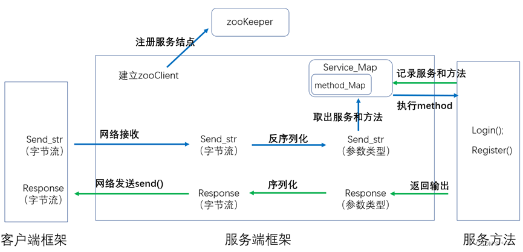

MpRPC框架项目总结

# 一、protobuf简介与使用

 [Protocol](https://so.csdn.net/so/search?q=Protocol&spm=1001.2101.3001.7020) Buffers 是一种轻便高效的结构化数据存储格式，可以用于结构化数据串行化，或者说序列化。它很适合做数据存储或 RPC 数据交换格式。可用于通讯协议、数据存储等领域的语言无关、平台无关、可扩展的序列化结构数据格式。

-   protobuf的使用：

 (1) 首先创建一个.proto文件，在这个文件中我们需要定义想要发布的服务（Service）、服务提供的方法（Method）以及输入参数和输出。  
(%% 每个服务（Service）相当于一个服务器，也对应于之后分布式系统中的一个结点（服务器），而方法（Method）代表该结点提供的一个函数功能。函数的输入参数和输出，在protobuf中使用message类型来定义

```cpp
// input 
message LoginRequest
{
    bytes name = 1;
    bytes pwd = 2;
}
// output
message LoginResponse
{
    ResultCode result = 1;
    bool sucess = 2;
}
```

```cpp
// 发布的服务
service UserServiceRpc
{
    //  服务提供的方法
    // 1.登录
    rpc Login(LoginRequest) returns(LoginResponse);
    // 2.注册
    rpc Register(RegisterRequest) returns(RegisterResponse);
}
```

 (2) 编译.proto文件将得到两个同名的.ph.b文件和.pb.cc文件。  
  
 (3) 在.ph.b文件和.pb.cc文件中，系统自动生成了很多类，其中的三个类我们之后会使用到：与服务同名的类Class Service（实现服务方法）；Class Service\_Stub 和 Class RpcChannel（实现客户端框架）。

# 二、rpc框架项目实现

本项目整体框架如下：  


项目由：用户调用 + RPC框架 + 服务方法实现三部分组成

## 1\. 服务方法的实现

-   本项目共发布了两种服务：用户管理UserServiceRpc（方法包括：登录Login()与注册Registert()）和好友管理FiendServiceRpc（方法包括：获取好友列表GetFriendsList()）

服务方法的实现基于protobuf，以用户管理UserServiceRpc服务为例，介绍Login()与Registert()方法的实现：

首先创建.proto文件，完成服务方法的定义：  


Class UserServiceRpc类下的同名方法：

```cpp
virtual void Login(::PROTOBUF_NAMESPACE_ID::RpcController* controller,
                       const ::fixbug::LoginRequest* request,
                       ::fixbug::LoginResponse* response,
                       ::google::protobuf::Closure* done);
```

重写该虚函数，完成Login()方法的实现（Register()的实现同理）：

```cpp
void Login(::google::protobuf::RpcController* controller,
                       const ::fixbug::LoginRequest* request,
                       ::fixbug::LoginResponse* response,
                       ::google::protobuf::Closure* done)
    {
        // 框架给业务上报了请求参数LoginRequest，应用获取相应数据做本地业务
        std::string name = request->name();
        std::string pwd = request->pwd();

        // 做本地业务
        bool login_result = Login(name, pwd); 

        // 把响应写入  包括错误码、错误消息、返回值
        fixbug::ResultCode *code = response->mutable_result();
        code->set_errcode(0);
        code->set_errmsg("");
        response->set_sucess(login_result);

        // 执行回调操作   执行响应对象数据的序列化和网络发送（都是由框架来完成的）
        done->Run();
    }
```

## 2\. 用户调用

用户方使用rpc的客户端框架实现远程调用方法：  


（1）定义Stub对象

```cpp
fixbug::UserServiceRpc_Stub stub(new MprpcChannel());
```

（2）设置request和response

```cpp
// （1）设置rpc方法的请求参数
fixbug::LoginRequest request;
    request.set_name("zhang san");
    request.set_pwd("123456");

// （2）设置 rpc方法的响应
    fixbug::LoginResponse response;
```

（3）远程调用服务，通过调用客户端框架实现

```cpp
// 底层调用CallMehtod完成框架功能
stub.Login(nullptr, &request, &response, nullptr);
```

（4）返回结果

```cpp
response.result().errcode()
```

## 3\. RPC框架实现（客户框架+服务框架）

### 【1】客户方框架：

客户方框架的主要功能如下：


用户远程调用方法时，使用客户代理类的同名方法，底层执行RpcChannel类的CallMethod()。

```cpp
// RpcChannel->RpcChannel::callMethod 集中来做所有rpc方法调用的参数序列化和网络发送
    stub.Login(nullptr, &request, &response, nullptr); 
```

因此客户端框架：通过自定义子类MprpcChannel继承RpcChannel类并重写CallMethod()实现

```cpp
class MprpcChannel : public google::protobuf::RpcChannel
{
public:
    // 所有通过stub代理对象调用的rpc方法，都走到这，统一做rpc方法调用的数据数据序列化和网络发送 
    void CallMethod(const google::protobuf::MethodDescriptor* method,
                          google::protobuf::RpcController* controller, 
                          const google::protobuf::Message* request,
                          google::protobuf::Message* response,
                          google::protobuf:: Closure* done);
};
```

CallMethod()方法包括以下几部分：

1.  序列化：需要序列化的信息包括：

-   send\_rpc\_str： header\_size（4字节） + rpcheader（service\_name，method\_name ，args\_size） + args（request）

```cpp
// request
request->SerializeToString(&args_str)
// rpcheader
rpcHeader.SerializeToString(&rpc_header_str)
// head_size
send_rpc_str.insert(0, std::string((char*)&header_size, 4))
// 拼接要发送的信息
send_rpc_str += rpc_header_str; 
send_rpc_str += args_str; 
```

2.  启动zookeeper客户端，查询服务方法的网络位置

```cpp
ZkClient zkCli;
// 启动zookeeper客户端
    zkCli.Start();
    //  例：/UserServiceRpc/Login
    std::string method_path = "/" + service_name + "/" + method_name;
    // 在zk上查/UserServiceRpc/Login的ip与端口，例：127.0.0.1:8000
    std::string host_data = zkCli.GetData(method_path.c_str());
```

3.  返回结点位置（ip + port）

```cpp
std::string ip = host_data.substr(0, idx);
    uint16_t port = atoi(host_data.substr(idx+1, host_data.size()-idx).c_str());
```

4.  根据ip和port连接服务器

```cpp
connect(clientfd, (struct sockaddr*)&server_addr, sizeof(server_addr))
```

5.  发送序列化后的信息

```cpp
send(clientfd, send_rpc_str.c_str(), send_rpc_str.size(), 0)
```

6.  读取response并反序列化

```cpp
char recv_buf[1024] = {0};
recv_size = recv(clientfd, recv_buf, 1024, 0);
response->ParseFromArray(recv_buf, recv_size);
```

### 【2】服务方框架：

服务端框架的主要功能如下：  


以下为框架的具体实现（通过RpcProvide类实现）：

```cpp
class RpcProvider
{
    // 注册记录服务方法
    void NotifyService(google::protobuf::Service *service);
    // 建立启动服务器，循环处理调用方请求
    void Run();
    // 与客户端建立连接
    void OnConnection(const muduo::net::TcpConnectionPtr&); 
    // 框架功能实现
    void OnMessage(const muduo::net::TcpConnectionPtr&, muduo::net::Buffer*, muduo::Timestamp);
    // 框架功能实现
    void SendRpcResponse(const muduo::net::TcpConnectionPtr&, google::protobuf::Message*);

}
```

RpcProvide主要提供以下几个接口：

**<1> NotifyService（），记录提供的服务及其方法**

```cpp
// 1. 注册记录服务方法
void NotifyService(google::protobuf::Service *service);
```

定义两个unordered\_map表，

1.  m\_methodMap记录{方法名称，方法实现}

```cpp
std::unordered_map<std::string, const google::protobuf::MethodDescriptor*> m_methodMap; 
```

2.  m\_serviceMap，记录{服务名称，服务}

```cpp
std::unordered_map<std::string, ServiceInfo> m_serviceMap;

```

**\- <2> Run（），建立web服务器，处理远程调用**

```cpp
// 建立启动服务器，循环处理调用方请求
    void Run();
```

创建服务器，主线程使用epoll监听请求，3个工作线程（回调机制）处理具体请求：监听新连接（OnConnection），处理远程调用请求（OnMessage）  
向Zookeeper注册要发布的服务：存储服务名（/UserServiceRpc/Login）以及对应的ip和port  
**\- <3> OnConnection（），回调函数，用于处理新连接**  
创建新连接，使用accept返回新fd  
**\- <4> OnMessage（），回调函数，执行服本务器提供的服务和方法**  
\[1\] 反序列化参数，反序列send\_str；

```cpp
 // 反序列rpcHeader（Service_name,Method_name）
rpcHeader.ParseFromString(rpc_header_str)
// 反序列request
request->ParseFromString(args_str)
```

\[2\] 从服务方法map中取出method和Service

```cpp
// 取服务
auto it = m_serviceMap.find(service_name);
// 取方法
auto mit = it->second.m_methodMap.find(method_name);
```

\[3\] 执行本地服务方法并返回输出

```cpp
service->CallMethod(method, nullptr, request, response, done);
```

%% 其中done中执行Sendresponse()完成：response的序列化 + 网络发送

```cpp
// 为done绑定SendRpcResponse()，返回输出
    google::protobuf::Closure *done = google::protobuf::NewCallback<RpcProvider, 
                                                                    const muduo::net::TcpConnectionPtr&, 
                                                                    google::protobuf::Message*>
                                                                    (this, 
                                                                    &RpcProvider::SendRpcResponse, 
                                                                    conn, response);
                                                                    
```

```cpp
void RpcProvider::SendRpcResponse(const muduo::net::TcpConnectionPtr& conn, google::protobuf::Message *response)
{
    std::string response_str;
    if (response->SerializeToString(&response_str)) // response进行序列化
    {
        // 序列化成功后，通过网络把rpc方法执行的结果发送会rpc的调用方
        conn->send(response_str);
    }
    else
    {
        std::cout << "serialize response_str error!" << std::endl; 
    }
    conn->shutdown(); // 模拟http的短链接服务，由rpcprovider主动断开连接
}
```

## 总结

本项目总体流程图如下所示：  


 
