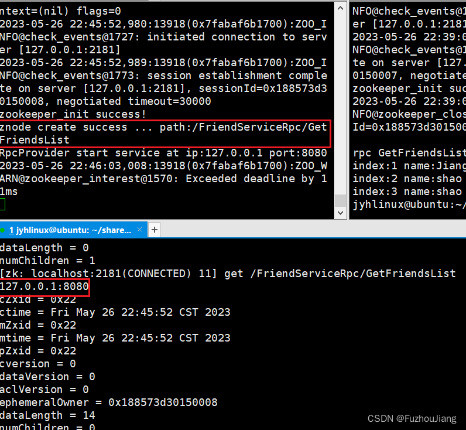

## 介绍

`zookeeper` C++客户端编程很类似于`MySQL`客户端编程，就是以C++代码实现zk客户端的常见功能，比如`get`、`delete`、`create`等.

## 代码实现

zookeeperutil类声明

```cpp
// zookeeperutil.h
#pragma once
#include <semaphore.h>
#include <zookeeper/zookeeper.h>
#include <string>

// 封装的zk客户端类
class ZkClient
{
public:
    ZkClient();
    ~ZkClient();
    // zkclient启动连接 zkserver
    void Start();
    // 在zkserver上根据指定的path创建znode节点
    void Create(const char *path, const char *data, int datalen, int state = 0);
    // 根据参数指定的znode节点路径，查找znode的值
    std::string GetData(const char *path);
private:
    // zk的客户端句柄
    zhandle_t *m_zhandle;
};
```

zookeeperutil类实现

```cpp
// zookeeperutil.cc
#include "zookeeperutil.h"
#include "mprpcapplication.h"
#include <semaphore.h>
#include <iostream>

// 全局的watcher观察器   zkserver给zkclient的通知
void global_watcher(zhandle_t *zh, int type,
                   int state, const char *path, void *watcherCtx)
{
    if (type == ZOO_SESSION_EVENT)  // 回调的消息类型是和会话相关的消息类型
{
if (state == ZOO_CONNECTED_STATE)  // zkclient和zkserver连接成功
{
sem_t *sem = (sem_t*)zoo_get_context(zh);
            sem_post(sem);
}
}
}

ZkClient::ZkClient() : m_zhandle(nullptr)
{
}

ZkClient::~ZkClient()
{
    if (m_zhandle != nullptr)
    {
        zookeeper_close(m_zhandle); // 关闭句柄，释放资源  MySQL_Conn
    }
}

// 连接zkserver
void ZkClient::Start()
{
    std::string host = MprpcApplication::GetInstance().GetConfig().Load("zookeeperip");
    std::string port = MprpcApplication::GetInstance().GetConfig().Load("zookeeperport");
    std::string connstr = host + ":" + port;
    
/*
zookeeper_mt：多线程版本
zookeeper的API客户端程序提供了三个线程
API调用线程 
网络I/O线程  pthread_create  poll
watcher回调线程 pthread_create
*/
    m_zhandle = zookeeper_init(connstr.c_str(), global_watcher, 30000, nullptr, nullptr, 0);
    if (nullptr == m_zhandle) 
    {
        std::cout << "zookeeper_init error!" << std::endl;
        exit(EXIT_FAILURE);
    }

    sem_t sem;
    sem_init(&sem, 0, 0);
    zoo_set_context(m_zhandle, &sem);

    sem_wait(&sem);
    std::cout << "zookeeper_init success!" << std::endl;
}

void ZkClient::Create(const char *path, const char *data, int datalen, int state)
{
    char path_buffer[128];
    int bufferlen = sizeof(path_buffer);
    int flag;
// 先判断path表示的znode节点是否存在，如果存在，就不再重复创建了
flag = zoo_exists(m_zhandle, path, 0, nullptr);
if (ZNONODE == flag) // 表示path的znode节点不存在
{
// 创建指定path的znode节点了
flag = zoo_create(m_zhandle, path, data, datalen,
&ZOO_OPEN_ACL_UNSAFE, state, path_buffer, bufferlen);
if (flag == ZOK)
{
std::cout << "znode create success... path:" << path << std::endl;
}
else
{
std::cout << "flag:" << flag << std::endl;
std::cout << "znode create error... path:" << path << std::endl;
exit(EXIT_FAILURE);
}
}
}

// 根据指定的path，获取znode节点的值
std::string ZkClient::GetData(const char *path)
{
    char buffer[64];
int bufferlen = sizeof(buffer);
int flag = zoo_get(m_zhandle, path, 0, buffer, &bufferlen, nullptr);
if (flag != ZOK)
{
std::cout << "get znode error... path:" << path << std::endl;
return "";
}
else
{
return buffer;
}
}

```

## RPC项目中使用zookeeper

在`RpcProvider::Run`函数使用`zkClient`向`zkServer`注册服务

```cpp
// rpcprovider.cc
void RpcProvider::Run()
{
    std::string ip = MprpcApplication::getInstance().getConfig().Load("rpcserverip");
    uint16_t port = atoi(MprpcApplication::getInstance().getConfig().Load("rpcserverport").c_str());
    muduo::net::InetAddress address(ip, port);
    // 创建TcpServer对象
    muduo::net::TcpServer server(&m_eventLoop, address, "RpcProvider");

    // 绑定连接回调和消息读写回调方法
    server.setConnectionCallback(std::bind(&RpcProvider::onConnection, this, std::placeholders::_1));
    server.setMessageCallback(std::bind(&RpcProvider::onMessage, this, std::placeholders::_1, std::placeholders::_2, std::placeholders::_3));

    // 设置muduo库线程数量
    server.setThreadNum(4);

    // 把当前rpc节点上要发布的服务全部注册到zk上，让rpc client可以从zk上发现服务
    // session timeout 30s zkclient 网络IO线程 1/3 * timeout时间发送ping消息
    ZkClient zkCli;
    zkCli.Start();

    // service_name为永久性节点， method为临时性节点
    for (auto &sp : m_serviceMap)
    {
        // 组织服务节点路径
        std::string service_path = "/" + sp.first;
        zkCli.Create(service_path.c_str(), nullptr, 0);
        for (auto &mp : sp.second.m_methodMap)
        {
            // 组织方法节点路径
            std::string method_path = service_path + "/" + mp.first;
            // 方法节点的数据，即ip+port
            char method_path_data[128] = {0};
            sprintf(method_path_data, "%s:%d", ip.c_str(), port);
            // ZOO_EPHEMERAL代表是临时节点
            zkCli.Create(method_path.c_str(), method_path_data, strlen(method_path_data), ZOO_EPHEMERAL);
        }
    }

    server.start();
    std::cout << "RpcProvider start service at ip:" << ip << " port:" << port << std::endl;
    m_eventLoop.loop(); // epoll_wait
}


```

以及在 `MprpcChannel::CallMethod` 中使用`ZkClient`来从`zkserver`（服务注册中心）获得服务的host（ip:port）从而获得服务

```cpp
// mprpcchannel.cc
void MprpcChannel::CallMethod(const google::protobuf::MethodDescriptor* method,
                          google::protobuf::RpcController* controller, const google::protobuf::Message* request,
                          google::protobuf::Message* response, google::protobuf::Closure* done)
{
    const google::protobuf::ServiceDescriptor *sd = method->service();
    std::string service_name = sd->name();
    std::string method_name = method->name();

    // 1.获取方法参数的序列化字符串长度
    
    // 2.定义rpc的请求header
    // header_size | service_name | method_name| args_size | args_str(name password)
    // 3.组织待发送的rpc请求字符串（注意这里发送字符串的内容
    std::string send_rpc_str;
    send_rpc_str.insert(0, (char*)&header_size, 4);
    send_rpc_str += rpc_header_str;
    send_rpc_str += args_str;

   
    // 4.使用tcp编程，完成rpc方法的远程调用
    int clientfd = socket(AF_INET, SOCK_STREAM, 0);
    if(-1 == clientfd)
    {
        char errtxt[512] = {0};
        sprintf(errtxt, "create socket error! errno:%d", errno);
        controller->SetFailed(errtxt);
        return ;
    }

    // 这个函数是从usercallservice.cc的main()进入，已调用过Init函数获得配置信息
    // 读取配置文件rpcserver信息
    // std::string ip = MprpcApplication::getInstance().getConfig().Load("rpcserverip");
    // uint16_t port = atoi(MprpcApplication::getInstance().getConfig().Load("rpcserverport").c_str());
    
    // !!!rpc方法向调用service_name的method_name服务，需要查询zk上该服务所在的host信息
    ZkClient zkCli;
    zkCli.Start();

    std::string method_path = "/" + service_name + "/" + method_name;
    std::string host_data = zkCli.GetData(method_path.c_str());

    if(host_data == "")
    {
        controller->SetFailed(method_path + "is not exist");
        return;
    }
    int idx = host_data.find(":");
    if(idx == -1)
    {
         controller->SetFailed(method_path + " address is invalid!");
        return;
    }
    std::string ip = host_data.substr(0, idx);
    uint32_t port = atoi(host_data.substr(idx + 1, host_data.size() - idx).c_str());

    struct sockaddr_in server_addr;
    server_addr.sin_family = AF_INET;
    server_addr.sin_port = htons(port);
    server_addr.sin_addr.s_addr = inet_addr(ip.c_str());

    // 连接rpc服务节点
    if(-1 == connect(clientfd, (struct sockaddr*)&server_addr, sizeof(server_addr)))
    {
        close(clientfd);
        char errtxt[512] = {0};
        sprintf(errtxt, "connect error! errno:%d", errno);
        controller->SetFailed(errtxt);
        return ;
    }

    // 发送rpc请求

    // 接收rpc请求的响应
    
    // 5.反序列化收到的rpc调用的响应数据
}

```

## 测试结果

rpc服务提供方发布服务后，看到zkserver上有服务节点已经注册了。




rpc服务提供方断开连接一段时间，由于`zkserver`没有按时收到[心跳](https://so.csdn.net/so/search?q=%E5%BF%83%E8%B7%B3&spm=1001.2101.3001.7020)就删除了服务方法节点（因为是**临时**节点`znode`）

