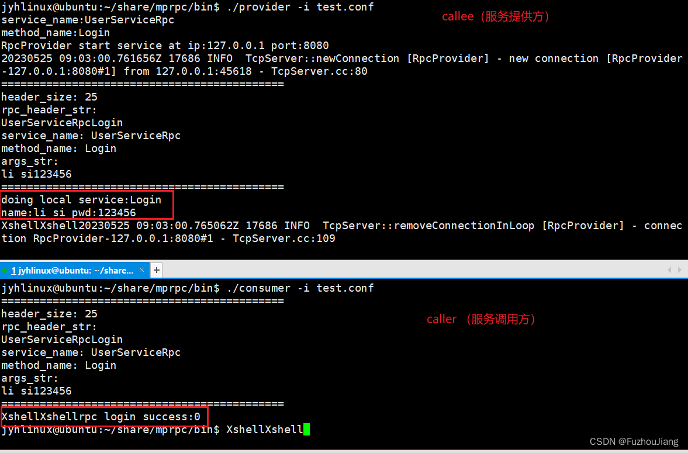

## 介绍

客户端使用`RpcChannel`对象来构造`UserServiceRpc_Stub`对象，并利用该对象中`RpcChannel::CallMethod`来进行rpc调用请求,`RpcChannel`完成的工作是如下rpc调用流程图的红圈部分：


## 客户端使用mp[rpc框架](https://so.csdn.net/so/search?q=rpc%E6%A1%86%E6%9E%B6&spm=1001.2101.3001.7020)的业务代码

```cpp
// calluserservice.cc
#include <iostream>
#include "mprpcapplication.h"
#include "mprpcchannel.h"
#include "user.pb.h"

int main(int argc, char **argv)
{
    // 1.程序启动后，想使用mprpc框架提供的rpc服务调用，一定要先调用框架的初始化函数
    MprpcApplication::Init(argc, argv);

    // 演示调用远程发布的rpc方法Login
    fixbug::UserServiceRpc_Stub stub(new MprpcChannel());
    // rpc方法请求参数组织
    fixbug::LoginRequest request;
    request.set_name("li si");
    request.set_pwd("123456");
    // rpc方法的响应
    fixbug::LoginResponse response;
    // 发起rpc方法调用，同步的rpc调用过程
    // 底层都是转发到RpcChannel::CallMethod方法多态调用
    // 所以要实现一个继承自 RpcChannel 的类，并重写CallMethod方法
    stub.Login(nullptr, &request, &response, nullptr);

    // 一次rpc 调用完成，读调用的结果
    if (0 == response.result().errcode())
    {
        std::cout << "rpc login success:" << response.success() << std::endl;
    }
    else 
    {
        std::cout << "rpc login response error :" << response.result().errcode() << std::endl;
    }

    return 0;
}
```

## MprpcChannel类实现

`MprpcChannel`是`mprpc`框架提供给客户端进行rpc调用

```cpp
// mprpcchannel.h
#pragma once
#include <google/protobuf/service.h>
#include <google/protobuf/descriptor.h>
#include <google/protobuf/message.h>

class MprpcChannel : public google::protobuf::RpcChannel //
{
public:
    // 客户端都是通过stub代理对象调用rpc方法，都到转发到这里调用，做rpc方法的数据序列化和网络发送
    void CallMethod(const google::protobuf::MethodDescriptor* method,
                          google::protobuf::RpcController* controller, const google::protobuf::Message* request,
                          google::protobuf::Message* response, google::protobuf::Closure* done); 
};

```

```cpp
// mprpcchannel.cpp
#include "mprpcchannel.h"
#include <string>
#include "rpcheader.pb.h"
#include <sys/types.h>
#include <sys/socket.h>
#include <arpa/inet.h>
#include <netinet/in.h>
#include <unistd.h>
#include <errno.h>
#include "mprpcapplication.h"

// 客户端都是通过stub代理对象调用rpc方法，都到转发到这里调用，做rpc方法的数据序列化和网络发送
void MprpcChannel::CallMethod(const google::protobuf::MethodDescriptor* method,
                          google::protobuf::RpcController* controller, const google::protobuf::Message* request,
                          google::protobuf::Message* response, google::protobuf::Closure* done)
{
    const google::protobuf::ServiceDescriptor *sd = method->service();
    std::string service_name = sd->name();
    std::string method_name = method->name();

    // 1.获取方法参数的序列化字符串长度
    uint32_t args_size = 0;
    std::string args_str;
    if(request->SerializeToString(&args_str))
    {
        args_size = args_str.size();
    }
    else 
    {
        std::cout << "serialize request error!" << std::endl;
        return;
    }

    // 2.定义rpc的请求header
    mprpc::RpcHeader rpcHeader;
    rpcHeader.set_service_name(service_name);
    rpcHeader.set_method_name(method_name);
    rpcHeader.set_args_size(args_size);

    uint32_t header_size = 0;
    std::string rpc_header_str;
    if(rpcHeader.SerializeToString(&rpc_header_str))
    {
        header_size = rpc_header_str.size();
    }
    else 
    {
        std::cout << "serialize rpc header error!" << std::endl;
        return;
    }
    // header_size | service_name | method_name| args_size | args_str(name password)
    // 3.组织待发送的rpc请求字符串（注意这里发送字符串的内容
    std::string send_rpc_str;
    send_rpc_str.insert(0, std::string((char*)&header_size), 4);
    send_rpc_str += rpc_header_str;
    send_rpc_str += args_str;

    // 打印调试信息
    std::cout << "============================================" << std::endl;
    std::cout << "header_size: " << header_size << std::endl; 
    std::cout << "rpc_header_str: " << rpc_header_str << std::endl; 
    std::cout << "service_name: " << service_name << std::endl; 
    std::cout << "method_name: " << method_name << std::endl; 
    std::cout << "args_str: " << args_str << std::endl; 
    std::cout << "============================================" << std::endl;

    // 4.使用tcp编程，完成rpc方法的远程调用
    int clientfd = socket(AF_INET, SOCK_STREAM, 0);
    if(-1 == clientfd)
    {
        char errtxt[512] = {0};
        sprintf(errtxt, "create socket error! errno:%d", errno);
        std::cout << errtxt << std::endl;
        return ;
    }

    // 这个函数是从usercallservice.cc的main()进入，已调用过Init函数获得配置信息
    // 读取配置文件rpcserver信息
    std::string ip = MprpcApplication::getInstance().getConfig().Load("rpcserverip");
    uint16_t port = atoi(MprpcApplication::getInstance().getConfig().Load("rpcserverport").c_str());

    struct sockaddr_in server_addr;
    server_addr.sin_family = AF_INET;
    server_addr.sin_port = htons(port);
    server_addr.sin_addr.s_addr = inet_addr(ip.c_str());

    // 连接rpc服务节点
    if(-1 == connect(clientfd, (struct sockaddr*)&server_addr, sizeof(server_addr)))
    {
        close(clientfd);
        char errtxt[512] = {0};
        sprintf(errtxt, "connect error! errno:%d", errno);
        std::cout << errtxt << std::endl;
        return ;
    }

    // 发送rpc请求
    if(-1 == send(clientfd, send_rpc_str.c_str(), send_rpc_str.size(), 0))
    {
        close(clientfd);
        char errtxt[512] = {0};
        sprintf(errtxt, "send error! errno:%d", errno);
        std::cout << errtxt << std::endl;
        return ;
    }

    // 接收rpc请求的响应
    char recv_buf[1024] = {0};
    int recv_size = 0;
    if(-1 == (recv_size = recv(clientfd, recv_buf, 1024, 0)))
    {
        close(clientfd);
        char errtxt[512] = {0};
        sprintf(errtxt, "recv error! errno:%d", errno);
        std::cout << errtxt << std::endl;
        return ;
    }

    // 5.反序列化收到的rpc调用的响应数据
    if(!response->ParseFromArray(recv_buf, recv_size))
    {
        close(clientfd);
        char errtxt[1024] = {0};
        sprintf(errtxt, "parse error! response_str:%s", recv_buf);
        std::cout << errtxt << std::endl;
        return ;
    }

    close(clientfd);
}

```

## 点对点RPC通信测试

