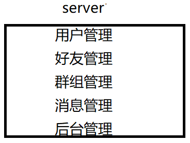

### 文章目录

-   [技术栈：](https://blog.csdn.net/qq_44599368/article/details/132005866?ops_request_misc=%257B%2522request%255Fid%2522%253A%2522169354952816800182195225%2522%252C%2522scm%2522%253A%252220140713.130102334..%2522%257D&request_id=169354952816800182195225&biz_id=0&utm_medium=distribute.pc_search_result.none-task-blog-2~all~baidu_landing_v2~default-4-132005866-null-null.142^v93^control&utm_term=mprpc&spm=1018.2226.3001.4187#_1)
-   [准备工作：](https://blog.csdn.net/qq_44599368/article/details/132005866?ops_request_misc=%257B%2522request%255Fid%2522%253A%2522169354952816800182195225%2522%252C%2522scm%2522%253A%252220140713.130102334..%2522%257D&request_id=169354952816800182195225&biz_id=0&utm_medium=distribute.pc_search_result.none-task-blog-2~all~baidu_landing_v2~default-4-132005866-null-null.142^v93^control&utm_term=mprpc&spm=1018.2226.3001.4187#_11)
-   -   [升级\`cmake\`：](https://blog.csdn.net/qq_44599368/article/details/132005866?ops_request_misc=%257B%2522request%255Fid%2522%253A%2522169354952816800182195225%2522%252C%2522scm%2522%253A%252220140713.130102334..%2522%257D&request_id=169354952816800182195225&biz_id=0&utm_medium=distribute.pc_search_result.none-task-blog-2~all~baidu_landing_v2~default-4-132005866-null-null.142^v93^control&utm_term=mprpc&spm=1018.2226.3001.4187#cmake_13)
    -   [配置文件的读取：](https://blog.csdn.net/qq_44599368/article/details/132005866?ops_request_misc=%257B%2522request%255Fid%2522%253A%2522169354952816800182195225%2522%252C%2522scm%2522%253A%252220140713.130102334..%2522%257D&request_id=169354952816800182195225&biz_id=0&utm_medium=distribute.pc_search_result.none-task-blog-2~all~baidu_landing_v2~default-4-132005866-null-null.142^v93^control&utm_term=mprpc&spm=1018.2226.3001.4187#_38)
    -   -   [\`test.conf\`：](https://blog.csdn.net/qq_44599368/article/details/132005866?ops_request_misc=%257B%2522request%255Fid%2522%253A%2522169354952816800182195225%2522%252C%2522scm%2522%253A%252220140713.130102334..%2522%257D&request_id=169354952816800182195225&biz_id=0&utm_medium=distribute.pc_search_result.none-task-blog-2~all~baidu_landing_v2~default-4-132005866-null-null.142^v93^control&utm_term=mprpc&spm=1018.2226.3001.4187#testconf_39)
        -   [\`MPrpcConfig.h\`：](https://blog.csdn.net/qq_44599368/article/details/132005866?ops_request_misc=%257B%2522request%255Fid%2522%253A%2522169354952816800182195225%2522%252C%2522scm%2522%253A%252220140713.130102334..%2522%257D&request_id=169354952816800182195225&biz_id=0&utm_medium=distribute.pc_search_result.none-task-blog-2~all~baidu_landing_v2~default-4-132005866-null-null.142^v93^control&utm_term=mprpc&spm=1018.2226.3001.4187#MPrpcConfigh_50)
        -   [\`MPrpcConfig.cpp\`：](https://blog.csdn.net/qq_44599368/article/details/132005866?ops_request_misc=%257B%2522request%255Fid%2522%253A%2522169354952816800182195225%2522%252C%2522scm%2522%253A%252220140713.130102334..%2522%257D&request_id=169354952816800182195225&biz_id=0&utm_medium=distribute.pc_search_result.none-task-blog-2~all~baidu_landing_v2~default-4-132005866-null-null.142^v93^control&utm_term=mprpc&spm=1018.2226.3001.4187#MPrpcConfigcpp_74)
-   [\`MPrpc\` 框架](https://blog.csdn.net/qq_44599368/article/details/132005866?ops_request_misc=%257B%2522request%255Fid%2522%253A%2522169354952816800182195225%2522%252C%2522scm%2522%253A%252220140713.130102334..%2522%257D&request_id=169354952816800182195225&biz_id=0&utm_medium=distribute.pc_search_result.none-task-blog-2~all~baidu_landing_v2~default-4-132005866-null-null.142^v93^control&utm_term=mprpc&spm=1018.2226.3001.4187#MPrpc__153)
-   -   [单机、集群和分布式对比：](https://blog.csdn.net/qq_44599368/article/details/132005866?ops_request_misc=%257B%2522request%255Fid%2522%253A%2522169354952816800182195225%2522%252C%2522scm%2522%253A%252220140713.130102334..%2522%257D&request_id=169354952816800182195225&biz_id=0&utm_medium=distribute.pc_search_result.none-task-blog-2~all~baidu_landing_v2~default-4-132005866-null-null.142^v93^control&utm_term=mprpc&spm=1018.2226.3001.4187#_157)
    -   -   [单台服务器搭建的系统，存在的问题：](https://blog.csdn.net/qq_44599368/article/details/132005866?ops_request_misc=%257B%2522request%255Fid%2522%253A%2522169354952816800182195225%2522%252C%2522scm%2522%253A%252220140713.130102334..%2522%257D&request_id=169354952816800182195225&biz_id=0&utm_medium=distribute.pc_search_result.none-task-blog-2~all~baidu_landing_v2~default-4-132005866-null-null.142^v93^control&utm_term=mprpc&spm=1018.2226.3001.4187#_159)
        -   [\*\*集群\*\*：](https://blog.csdn.net/qq_44599368/article/details/132005866?ops_request_misc=%257B%2522request%255Fid%2522%253A%2522169354952816800182195225%2522%252C%2522scm%2522%253A%252220140713.130102334..%2522%257D&request_id=169354952816800182195225&biz_id=0&utm_medium=distribute.pc_search_result.none-task-blog-2~all~baidu_landing_v2~default-4-132005866-null-null.142^v93^control&utm_term=mprpc&spm=1018.2226.3001.4187#_168)
        -   [\*\*分布式\*\*：](https://blog.csdn.net/qq_44599368/article/details/132005866?ops_request_misc=%257B%2522request%255Fid%2522%253A%2522169354952816800182195225%2522%252C%2522scm%2522%253A%252220140713.130102334..%2522%257D&request_id=169354952816800182195225&biz_id=0&utm_medium=distribute.pc_search_result.none-task-blog-2~all~baidu_landing_v2~default-4-132005866-null-null.142^v93^control&utm_term=mprpc&spm=1018.2226.3001.4187#_181)
    -   [\`RPC\` 通信原理：](https://blog.csdn.net/qq_44599368/article/details/132005866?ops_request_misc=%257B%2522request%255Fid%2522%253A%2522169354952816800182195225%2522%252C%2522scm%2522%253A%252220140713.130102334..%2522%257D&request_id=169354952816800182195225&biz_id=0&utm_medium=distribute.pc_search_result.none-task-blog-2~all~baidu_landing_v2~default-4-132005866-null-null.142^v93^control&utm_term=mprpc&spm=1018.2226.3001.4187#RPC__195)
    -   [\`MPrpc\` 框架的时序图：](https://blog.csdn.net/qq_44599368/article/details/132005866?ops_request_misc=%257B%2522request%255Fid%2522%253A%2522169354952816800182195225%2522%252C%2522scm%2522%253A%252220140713.130102334..%2522%257D&request_id=169354952816800182195225&biz_id=0&utm_medium=distribute.pc_search_result.none-task-blog-2~all~baidu_landing_v2~default-4-132005866-null-null.142^v93^control&utm_term=mprpc&spm=1018.2226.3001.4187#MPrpc__206)
    -   [项目的环境配置与编译：](https://blog.csdn.net/qq_44599368/article/details/132005866?ops_request_misc=%257B%2522request%255Fid%2522%253A%2522169354952816800182195225%2522%252C%2522scm%2522%253A%252220140713.130102334..%2522%257D&request_id=169354952816800182195225&biz_id=0&utm_medium=distribute.pc_search_result.none-task-blog-2~all~baidu_landing_v2~default-4-132005866-null-null.142^v93^control&utm_term=mprpc&spm=1018.2226.3001.4187#_211)
    -   [\`MPrpc\` 框架的使用：](https://blog.csdn.net/qq_44599368/article/details/132005866?ops_request_misc=%257B%2522request%255Fid%2522%253A%2522169354952816800182195225%2522%252C%2522scm%2522%253A%252220140713.130102334..%2522%257D&request_id=169354952816800182195225&biz_id=0&utm_medium=distribute.pc_search_result.none-task-blog-2~all~baidu_landing_v2~default-4-132005866-null-null.142^v93^control&utm_term=mprpc&spm=1018.2226.3001.4187#MPrpc__217)
    -   -   [\`example/callee/FriendService.cpp\`：](https://blog.csdn.net/qq_44599368/article/details/132005866?ops_request_misc=%257B%2522request%255Fid%2522%253A%2522169354952816800182195225%2522%252C%2522scm%2522%253A%252220140713.130102334..%2522%257D&request_id=169354952816800182195225&biz_id=0&utm_medium=distribute.pc_search_result.none-task-blog-2~all~baidu_landing_v2~default-4-132005866-null-null.142^v93^control&utm_term=mprpc&spm=1018.2226.3001.4187#examplecalleeFriendServicecpp_219)
        -   [\`example/caller/CallFriendService.cpp\`：](https://blog.csdn.net/qq_44599368/article/details/132005866?ops_request_misc=%257B%2522request%255Fid%2522%253A%2522169354952816800182195225%2522%252C%2522scm%2522%253A%252220140713.130102334..%2522%257D&request_id=169354952816800182195225&biz_id=0&utm_medium=distribute.pc_search_result.none-task-blog-2~all~baidu_landing_v2~default-4-132005866-null-null.142^v93^control&utm_term=mprpc&spm=1018.2226.3001.4187#examplecallerCallFriendServicecpp_539)
        -   [调用过程图：](https://blog.csdn.net/qq_44599368/article/details/132005866?ops_request_misc=%257B%2522request%255Fid%2522%253A%2522169354952816800182195225%2522%252C%2522scm%2522%253A%252220140713.130102334..%2522%257D&request_id=169354952816800182195225&biz_id=0&utm_medium=distribute.pc_search_result.none-task-blog-2~all~baidu_landing_v2~default-4-132005866-null-null.142^v93^control&utm_term=mprpc&spm=1018.2226.3001.4187#_753)
    -   [项目验证：](https://blog.csdn.net/qq_44599368/article/details/132005866?ops_request_misc=%257B%2522request%255Fid%2522%253A%2522169354952816800182195225%2522%252C%2522scm%2522%253A%252220140713.130102334..%2522%257D&request_id=169354952816800182195225&biz_id=0&utm_medium=distribute.pc_search_result.none-task-blog-2~all~baidu_landing_v2~default-4-132005866-null-null.142^v93^control&utm_term=mprpc&spm=1018.2226.3001.4187#_758)
-   [\`Protobuf\`入门：](https://blog.csdn.net/qq_44599368/article/details/132005866?ops_request_misc=%257B%2522request%255Fid%2522%253A%2522169354952816800182195225%2522%252C%2522scm%2522%253A%252220140713.130102334..%2522%257D&request_id=169354952816800182195225&biz_id=0&utm_medium=distribute.pc_search_result.none-task-blog-2~all~baidu_landing_v2~default-4-132005866-null-null.142^v93^control&utm_term=mprpc&spm=1018.2226.3001.4187#Protobuf_763)
-   -   [介绍：](https://blog.csdn.net/qq_44599368/article/details/132005866?ops_request_misc=%257B%2522request%255Fid%2522%253A%2522169354952816800182195225%2522%252C%2522scm%2522%253A%252220140713.130102334..%2522%257D&request_id=169354952816800182195225&biz_id=0&utm_medium=distribute.pc_search_result.none-task-blog-2~all~baidu_landing_v2~default-4-132005866-null-null.142^v93^control&utm_term=mprpc&spm=1018.2226.3001.4187#_765)
    -   [安装配置：](https://blog.csdn.net/qq_44599368/article/details/132005866?ops_request_misc=%257B%2522request%255Fid%2522%253A%2522169354952816800182195225%2522%252C%2522scm%2522%253A%252220140713.130102334..%2522%257D&request_id=169354952816800182195225&biz_id=0&utm_medium=distribute.pc_search_result.none-task-blog-2~all~baidu_landing_v2~default-4-132005866-null-null.142^v93^control&utm_term=mprpc&spm=1018.2226.3001.4187#_781)
    -   [使用案例：](https://blog.csdn.net/qq_44599368/article/details/132005866?ops_request_misc=%257B%2522request%255Fid%2522%253A%2522169354952816800182195225%2522%252C%2522scm%2522%253A%252220140713.130102334..%2522%257D&request_id=169354952816800182195225&biz_id=0&utm_medium=distribute.pc_search_result.none-task-blog-2~all~baidu_landing_v2~default-4-132005866-null-null.142^v93^control&utm_term=mprpc&spm=1018.2226.3001.4187#_805)
    -   -   [\`test.proto\`：](https://blog.csdn.net/qq_44599368/article/details/132005866?ops_request_misc=%257B%2522request%255Fid%2522%253A%2522169354952816800182195225%2522%252C%2522scm%2522%253A%252220140713.130102334..%2522%257D&request_id=169354952816800182195225&biz_id=0&utm_medium=distribute.pc_search_result.none-task-blog-2~all~baidu_landing_v2~default-4-132005866-null-null.142^v93^control&utm_term=mprpc&spm=1018.2226.3001.4187#testproto_807)
        -   [用\`-cpp\_out\`编译\`\*\*\*.proto\`：](https://blog.csdn.net/qq_44599368/article/details/132005866?ops_request_misc=%257B%2522request%255Fid%2522%253A%2522169354952816800182195225%2522%252C%2522scm%2522%253A%252220140713.130102334..%2522%257D&request_id=169354952816800182195225&biz_id=0&utm_medium=distribute.pc_search_result.none-task-blog-2~all~baidu_landing_v2~default-4-132005866-null-null.142^v93^control&utm_term=mprpc&spm=1018.2226.3001.4187#cpp_outproto_823)
        -   [生成的\`\*\*\*.pb.h\`和\`\*\*\*.pb.cc\`文件：](https://blog.csdn.net/qq_44599368/article/details/132005866?ops_request_misc=%257B%2522request%255Fid%2522%253A%2522169354952816800182195225%2522%252C%2522scm%2522%253A%252220140713.130102334..%2522%257D&request_id=169354952816800182195225&biz_id=0&utm_medium=distribute.pc_search_result.none-task-blog-2~all~baidu_landing_v2~default-4-132005866-null-null.142^v93^control&utm_term=mprpc&spm=1018.2226.3001.4187#pbhpbcc_831)
        -   [\`protoc\` 提供的序列化和反序列化的函数：](https://blog.csdn.net/qq_44599368/article/details/132005866?ops_request_misc=%257B%2522request%255Fid%2522%253A%2522169354952816800182195225%2522%252C%2522scm%2522%253A%252220140713.130102334..%2522%257D&request_id=169354952816800182195225&biz_id=0&utm_medium=distribute.pc_search_result.none-task-blog-2~all~baidu_landing_v2~default-4-132005866-null-null.142^v93^control&utm_term=mprpc&spm=1018.2226.3001.4187#protoc__859)
        -   [序列化和反序列化的demo：](https://blog.csdn.net/qq_44599368/article/details/132005866?ops_request_misc=%257B%2522request%255Fid%2522%253A%2522169354952816800182195225%2522%252C%2522scm%2522%253A%252220140713.130102334..%2522%257D&request_id=169354952816800182195225&biz_id=0&utm_medium=distribute.pc_search_result.none-task-blog-2~all~baidu_landing_v2~default-4-132005866-null-null.142^v93^control&utm_term=mprpc&spm=1018.2226.3001.4187#demo_874)
        -   [\`protobuf\` 描述 \`rpc\` 方法：](https://blog.csdn.net/qq_44599368/article/details/132005866?ops_request_misc=%257B%2522request%255Fid%2522%253A%2522169354952816800182195225%2522%252C%2522scm%2522%253A%252220140713.130102334..%2522%257D&request_id=169354952816800182195225&biz_id=0&utm_medium=distribute.pc_search_result.none-task-blog-2~all~baidu_landing_v2~default-4-132005866-null-null.142^v93^control&utm_term=mprpc&spm=1018.2226.3001.4187#protobuf__rpc__1030)
    -   [本项目中 \`protobuf\` 作用：](https://blog.csdn.net/qq_44599368/article/details/132005866?ops_request_misc=%257B%2522request%255Fid%2522%253A%2522169354952816800182195225%2522%252C%2522scm%2522%253A%252220140713.130102334..%2522%257D&request_id=169354952816800182195225&biz_id=0&utm_medium=distribute.pc_search_result.none-task-blog-2~all~baidu_landing_v2~default-4-132005866-null-null.142^v93^control&utm_term=mprpc&spm=1018.2226.3001.4187#_protobuf__1095)
    -   -   [定义整个框架的传输协议：](https://blog.csdn.net/qq_44599368/article/details/132005866?ops_request_misc=%257B%2522request%255Fid%2522%253A%2522169354952816800182195225%2522%252C%2522scm%2522%253A%252220140713.130102334..%2522%257D&request_id=169354952816800182195225&biz_id=0&utm_medium=distribute.pc_search_result.none-task-blog-2~all~baidu_landing_v2~default-4-132005866-null-null.142^v93^control&utm_term=mprpc&spm=1018.2226.3001.4187#_1097)
        -   [定义描述\`rpc\`方法的类型：](https://blog.csdn.net/qq_44599368/article/details/132005866?ops_request_misc=%257B%2522request%255Fid%2522%253A%2522169354952816800182195225%2522%252C%2522scm%2522%253A%252220140713.130102334..%2522%257D&request_id=169354952816800182195225&biz_id=0&utm_medium=distribute.pc_search_result.none-task-blog-2~all~baidu_landing_v2~default-4-132005866-null-null.142^v93^control&utm_term=mprpc&spm=1018.2226.3001.4187#rpc_1118)
-   [日志系统：](https://blog.csdn.net/qq_44599368/article/details/132005866?ops_request_misc=%257B%2522request%255Fid%2522%253A%2522169354952816800182195225%2522%252C%2522scm%2522%253A%252220140713.130102334..%2522%257D&request_id=169354952816800182195225&biz_id=0&utm_medium=distribute.pc_search_result.none-task-blog-2~all~baidu_landing_v2~default-4-132005866-null-null.142^v93^control&utm_term=mprpc&spm=1018.2226.3001.4187#_1303)
-   -   [介绍：](https://blog.csdn.net/qq_44599368/article/details/132005866?ops_request_misc=%257B%2522request%255Fid%2522%253A%2522169354952816800182195225%2522%252C%2522scm%2522%253A%252220140713.130102334..%2522%257D&request_id=169354952816800182195225&biz_id=0&utm_medium=distribute.pc_search_result.none-task-blog-2~all~baidu_landing_v2~default-4-132005866-null-null.142^v93^control&utm_term=mprpc&spm=1018.2226.3001.4187#_1305)
    -   [日志记录的规范：](https://blog.csdn.net/qq_44599368/article/details/132005866?ops_request_misc=%257B%2522request%255Fid%2522%253A%2522169354952816800182195225%2522%252C%2522scm%2522%253A%252220140713.130102334..%2522%257D&request_id=169354952816800182195225&biz_id=0&utm_medium=distribute.pc_search_result.none-task-blog-2~all~baidu_landing_v2~default-4-132005866-null-null.142^v93^control&utm_term=mprpc&spm=1018.2226.3001.4187#_1314)
    -   [源码：](https://blog.csdn.net/qq_44599368/article/details/132005866?ops_request_misc=%257B%2522request%255Fid%2522%253A%2522169354952816800182195225%2522%252C%2522scm%2522%253A%252220140713.130102334..%2522%257D&request_id=169354952816800182195225&biz_id=0&utm_medium=distribute.pc_search_result.none-task-blog-2~all~baidu_landing_v2~default-4-132005866-null-null.142^v93^control&utm_term=mprpc&spm=1018.2226.3001.4187#_1320)
    -   -   [异步日志缓冲队列 \`LockQueue.hpp\`：](https://blog.csdn.net/qq_44599368/article/details/132005866?ops_request_misc=%257B%2522request%255Fid%2522%253A%2522169354952816800182195225%2522%252C%2522scm%2522%253A%252220140713.130102334..%2522%257D&request_id=169354952816800182195225&biz_id=0&utm_medium=distribute.pc_search_result.none-task-blog-2~all~baidu_landing_v2~default-4-132005866-null-null.142^v93^control&utm_term=mprpc&spm=1018.2226.3001.4187#_LockQueuehpp_1324)
        -   [\`Logger.h\`：](https://blog.csdn.net/qq_44599368/article/details/132005866?ops_request_misc=%257B%2522request%255Fid%2522%253A%2522169354952816800182195225%2522%252C%2522scm%2522%253A%252220140713.130102334..%2522%257D&request_id=169354952816800182195225&biz_id=0&utm_medium=distribute.pc_search_result.none-task-blog-2~all~baidu_landing_v2~default-4-132005866-null-null.142^v93^control&utm_term=mprpc&spm=1018.2226.3001.4187#Loggerh_1374)
        -   [\`Logger.cpp\`：](https://blog.csdn.net/qq_44599368/article/details/132005866?ops_request_misc=%257B%2522request%255Fid%2522%253A%2522169354952816800182195225%2522%252C%2522scm%2522%253A%252220140713.130102334..%2522%257D&request_id=169354952816800182195225&biz_id=0&utm_medium=distribute.pc_search_result.none-task-blog-2~all~baidu_landing_v2~default-4-132005866-null-null.142^v93^control&utm_term=mprpc&spm=1018.2226.3001.4187#Loggercpp_1430)
-   [\`Zookeeper\` 入门：](https://blog.csdn.net/qq_44599368/article/details/132005866?ops_request_misc=%257B%2522request%255Fid%2522%253A%2522169354952816800182195225%2522%252C%2522scm%2522%253A%252220140713.130102334..%2522%257D&request_id=169354952816800182195225&biz_id=0&utm_medium=distribute.pc_search_result.none-task-blog-2~all~baidu_landing_v2~default-4-132005866-null-null.142^v93^control&utm_term=mprpc&spm=1018.2226.3001.4187#Zookeeper__1492)
-   -   [\`zookeeper\` 介绍：](https://blog.csdn.net/qq_44599368/article/details/132005866?ops_request_misc=%257B%2522request%255Fid%2522%253A%2522169354952816800182195225%2522%252C%2522scm%2522%253A%252220140713.130102334..%2522%257D&request_id=169354952816800182195225&biz_id=0&utm_medium=distribute.pc_search_result.none-task-blog-2~all~baidu_landing_v2~default-4-132005866-null-null.142^v93^control&utm_term=mprpc&spm=1018.2226.3001.4187#zookeeper__1496)
    -   -   [\`ZooKeeper\` 提供了什么：](https://blog.csdn.net/qq_44599368/article/details/132005866?ops_request_misc=%257B%2522request%255Fid%2522%253A%2522169354952816800182195225%2522%252C%2522scm%2522%253A%252220140713.130102334..%2522%257D&request_id=169354952816800182195225&biz_id=0&utm_medium=distribute.pc_search_result.none-task-blog-2~all~baidu_landing_v2~default-4-132005866-null-null.142^v93^control&utm_term=mprpc&spm=1018.2226.3001.4187#ZooKeeper__1504)
        -   [什么是分布式系统：](https://blog.csdn.net/qq_44599368/article/details/132005866?ops_request_misc=%257B%2522request%255Fid%2522%253A%2522169354952816800182195225%2522%252C%2522scm%2522%253A%252220140713.130102334..%2522%257D&request_id=169354952816800182195225&biz_id=0&utm_medium=distribute.pc_search_result.none-task-blog-2~all~baidu_landing_v2~default-4-132005866-null-null.142^v93^control&utm_term=mprpc&spm=1018.2226.3001.4187#_1519)
        -   [分布式系统带来的问题：](https://blog.csdn.net/qq_44599368/article/details/132005866?ops_request_misc=%257B%2522request%255Fid%2522%253A%2522169354952816800182195225%2522%252C%2522scm%2522%253A%252220140713.130102334..%2522%257D&request_id=169354952816800182195225&biz_id=0&utm_medium=distribute.pc_search_result.none-task-blog-2~all~baidu_landing_v2~default-4-132005866-null-null.142^v93^control&utm_term=mprpc&spm=1018.2226.3001.4187#_1528)
        -   -   [服务的动态注册和发现：](https://blog.csdn.net/qq_44599368/article/details/132005866?ops_request_misc=%257B%2522request%255Fid%2522%253A%2522169354952816800182195225%2522%252C%2522scm%2522%253A%252220140713.130102334..%2522%257D&request_id=169354952816800182195225&biz_id=0&utm_medium=distribute.pc_search_result.none-task-blog-2~all~baidu_landing_v2~default-4-132005866-null-null.142^v93^control&utm_term=mprpc&spm=1018.2226.3001.4187#_1530)
            -   [\`Job\` 协调问题：](https://blog.csdn.net/qq_44599368/article/details/132005866?ops_request_misc=%257B%2522request%255Fid%2522%253A%2522169354952816800182195225%2522%252C%2522scm%2522%253A%252220140713.130102334..%2522%257D&request_id=169354952816800182195225&biz_id=0&utm_medium=distribute.pc_search_result.none-task-blog-2~all~baidu_landing_v2~default-4-132005866-null-null.142^v93^control&utm_term=mprpc&spm=1018.2226.3001.4187#Job__1558)
            -   [分布式锁，多台机器上运行的不同的系统操作统一资源：](https://blog.csdn.net/qq_44599368/article/details/132005866?ops_request_misc=%257B%2522request%255Fid%2522%253A%2522169354952816800182195225%2522%252C%2522scm%2522%253A%252220140713.130102334..%2522%257D&request_id=169354952816800182195225&biz_id=0&utm_medium=distribute.pc_search_result.none-task-blog-2~all~baidu_landing_v2~default-4-132005866-null-null.142^v93^control&utm_term=mprpc&spm=1018.2226.3001.4187#_1566)
            -   [\`Zookeeper\` 作用：](https://blog.csdn.net/qq_44599368/article/details/132005866?ops_request_misc=%257B%2522request%255Fid%2522%253A%2522169354952816800182195225%2522%252C%2522scm%2522%253A%252220140713.130102334..%2522%257D&request_id=169354952816800182195225&biz_id=0&utm_medium=distribute.pc_search_result.none-task-blog-2~all~baidu_landing_v2~default-4-132005866-null-null.142^v93^control&utm_term=mprpc&spm=1018.2226.3001.4187#Zookeeper__1576)
            -   [\`Zookeeper\` 的特性：](https://blog.csdn.net/qq_44599368/article/details/132005866?ops_request_misc=%257B%2522request%255Fid%2522%253A%2522169354952816800182195225%2522%252C%2522scm%2522%253A%252220140713.130102334..%2522%257D&request_id=169354952816800182195225&biz_id=0&utm_medium=distribute.pc_search_result.none-task-blog-2~all~baidu_landing_v2~default-4-132005866-null-null.142^v93^control&utm_term=mprpc&spm=1018.2226.3001.4187#Zookeeper__1584)
    -   [安装与配置：](https://blog.csdn.net/qq_44599368/article/details/132005866?ops_request_misc=%257B%2522request%255Fid%2522%253A%2522169354952816800182195225%2522%252C%2522scm%2522%253A%252220140713.130102334..%2522%257D&request_id=169354952816800182195225&biz_id=0&utm_medium=distribute.pc_search_result.none-task-blog-2~all~baidu_landing_v2~default-4-132005866-null-null.142^v93^control&utm_term=mprpc&spm=1018.2226.3001.4187#_1592)
    -   [\`zookeeper\` 的原生开发API（c/c++接口）：](https://blog.csdn.net/qq_44599368/article/details/132005866?ops_request_misc=%257B%2522request%255Fid%2522%253A%2522169354952816800182195225%2522%252C%2522scm%2522%253A%252220140713.130102334..%2522%257D&request_id=169354952816800182195225&biz_id=0&utm_medium=distribute.pc_search_result.none-task-blog-2~all~baidu_landing_v2~default-4-132005866-null-null.142^v93^control&utm_term=mprpc&spm=1018.2226.3001.4187#zookeeper_APIcc_1636)
    -   [本项目 \`zookeeper\` 作为服务注册中心：](https://blog.csdn.net/qq_44599368/article/details/132005866?ops_request_misc=%257B%2522request%255Fid%2522%253A%2522169354952816800182195225%2522%252C%2522scm%2522%253A%252220140713.130102334..%2522%257D&request_id=169354952816800182195225&biz_id=0&utm_medium=distribute.pc_search_result.none-task-blog-2~all~baidu_landing_v2~default-4-132005866-null-null.142^v93^control&utm_term=mprpc&spm=1018.2226.3001.4187#_zookeeper__1670)

# 技术栈：

1.  集群和分布式概念以及原理。
2.  `RPC` 远程过程调用原理以及实现。
3.  `Protobuf` 数据序列化和反序列化协议。
4.  `ZooKeeper` 分布式一致性协调服务应用以及编程。
5.  [`muduo` 网络库编程。](https://blog.csdn.net/qq_44599368/article/details/131833423?spm=1001.2014.3001.5501)
6.  异步日志缓冲队列，实现了日志系统设计。
7.  [`CMake` 构建项目集成编译环境](https://blog.csdn.net/qq_44599368/article/details/131929941?spm=1001.2014.3001.5501)。

# 准备工作：

## 升级`cmake`：

```shell
# 在 CentOS 7 中升级 CMake 可以通过以下步骤实现：

# 添加 CMake 官方 YUM 仓库：使用以下命令添加 CMake 官方 YUM 仓库：
sudo yum install -y https://dl.fedoraproject.org/pub/epel/epel-release-latest-7.noarch.rpm
sudo yum install -y https://download-ib01.fedoraproject.org/pub/epel/7/x86_64/Packages/c/cmake3-3.6.3-1.el7.x86_64.rpm

# 命令查看可用的 CMake 版本
sudo yum search cmake

# 卸载旧版本的 CMake
sudo yum remove cmake 

# 安装新版本的 CMake：使用以下命令安装 CMake 3.17.5 版本：
sudo yum install cmake3

# 安装 CMake 3.17.5 版本，并创建一个名为 cmake3 的可执行文件，以避免与旧版本的 CMake 冲突这将。
# 如果您需要使用 cmake 命令启动 CMake，请创建一个软链接：
sudo ln -s /usr/bin/cmake3 /usr/bin/cmake

# 查看升级后的cmake版本：
cmake --version
```

## 配置文件的读取：

### `test.conf`：

```txt
# rpc节点的ip地址
rpcserverip=127.0.0.1
# rpc节点的端口号port
rpcserverport=8000
# zookeeper的ip地址
zookeeperip=127.0.0.1
# zookeeper的端口号port
zookeeperport=2181
```

### `MPrpcConfig.h`：

```cpp
#pragma once

#include <unordered_map>
using namespace std;

// 获取配置文件 configFile:
// zookeeper_ip=***、zookeeper_port=***、rpcserver_port=***、rpcserver_ip=***
class MPrpcConfig
{
public:
    // 负责加载解析配置文件
    void LoadConfigFile(const char* configFile);

    // 查询配置项信息
    string Load(const string& key);
private:
    unordered_map<string, string> _configMap;

    // 去掉字符串前后的空格
    void Trim(string& str);
};
```

### `MPrpcConfig.cpp`：

```cpp
#include "MPrpcConfig.h"
#include <iostream>
#define BUF_SIZE 512

// 负责加载解析配置文件
void MPrpcConfig::LoadConfigFile(const char* configFile)
{   
    FILE* fileptr = fopen(configFile, "r");
    if (fileptr == nullptr)
    {
        std::cout << configFile << " is note exist!" << std::endl;
        exit(EXIT_FAILURE);
    }

    // 一行一行操作：去掉注释、读取=后的配置项、去掉每行的前后多余的空格
    while (!feof(fileptr))
    {
        char buf[BUF_SIZE] = {0};
        fgets(buf, BUF_SIZE, fileptr);

        string conf_(buf);
        // 去掉字符串前/后多余的空格
        this->Trim(conf_);

        // 跳过注释和空行
        if (conf_[0] == '#' || conf_.empty())
        {
            continue;
        }

        // 解析配置项
        int idx =  conf_.find('=');
        if (idx == -1)  // 配置项所在的行格式不合法
        {
            continue;
        }

        // 获取配置项，并存放在_configMap中
        string key = conf_.substr(0, idx);
        // 避免出现这种`rpcserverip   =127.0.0.1`，即等号前面有空格
        this->Trim(key);

        // 避免出现这种`rpcserverip=127.0.0.1\n`
        int endidx = conf_.find('\n', idx); 
        string value = conf_.substr(idx + 1, endidx - idx - 1);
        // 避免出现这种`rpcserverip=   127.0.0.1`，即等号后面有空格
        this->Trim(value);
        _configMap[key] = value;
    }
}

// 查询配置项信息
string MPrpcConfig::Load(const string& key)
{
    if (_configMap.find(key) == _configMap.end())
    {
        return string();
    }
    return _configMap[key];
}

// 去掉字符串前后的空格
void MPrpcConfig::Trim(string& str)
{
    int idx = str.find_first_not_of(' ');
    if (idx != -1)
    {
        str = str.substr(idx, str.size() - idx);
    }

    idx = str.find_last_not_of(' ');
    if (idx != -1)
    {
        str = str.substr(0, idx + 1);
    }
}
```

# `MPrpc` [框架](https://so.csdn.net/so/search?q=%E6%A1%86%E6%9E%B6&spm=1001.2101.3001.7020)

业界优秀的 [RPC](https://so.csdn.net/so/search?q=RPC&spm=1001.2101.3001.7020) 框架：baidu 的 brpc，google 的 `grpc`。本项目基于 `Muduo` 高性能网络库 + `Protobuf` 开发，故命名项目为 `MPrpc`。

## 单机、集群和分布式对比：

### 单台服务器搭建的系统，存在的问题：



-   受到硬件资源的限制（`sockfd`文件描述符的最大限制），导致该`ChatServer`所能承受的用户的并发量是有限的。
-   任意模块的修改，都需要重新编译、部署整个项目代码。
-   整个业务不同模块可能是`CPU`密集型或`IO`密集型的，造成各个模块对于硬件资源的需求不一样，但在之前的项目中进行无差别的统一部署导致某些服务器资源可能被浪费挥着。

### **集群**：

每台服务器独立运行一个工程的所有模块，即每台服务器都是一个完整的系统。

[集群 `ChatServer` 项目](https://blog.csdn.net/qq_44599368/article/details/131929941?spm=1001.2014.3001.5501)中，使用`ChatServer`的集群来部署业务，将整个业务的不同模块（用户管理模块、好友管理模块、群组管理模块、消息管理模块、后台管理模块）作为一个整体部署在集群服务器的不同节点上。


优点：提升了并发量。部署方式简单。

缺点：由于集群中每台服务器都需要运行完整的系统，故需要多次配置部署。修改任意模块的代码，则需要编译整个项目代码并部署到集群的各节点上。有的服务模块不需要很高的并发量（如后台管理模块），故这里的无差别部署会浪费资源。

### **分布式**：

项目被拆分为多个模块，每一个模块独立部署运行在一个服务器主机上。所有服务器协同工作共同提供服务，每一台服务器称作分布式的一个节点，根据各个节点的并发要求可再做节点模块集群部署。


优点：可针对不同节点部署的模块的并发量和对资源的消耗，进行各自针对性的选择不同的机型和构建节点集群。某个模块的功能修改，不会影响其他模块的正常运行。

分布式部署项目带来的新问题：

1.  大系统的项目模块如何进行划分？
2.  各模块之间如何进行访问，即部署在不同服务器上的模块A如何访问模块B的某个业务方法？

## `RPC` 通信原理：

`RPC`（`Remote Procedure Call`）\***远程过程调用**。


黄色部分：设计 `rpc` 方法参数的打包和解析即数据的序列化和反序列化，使用 `Protobuf`。

绿色部分：网络部分，包括寻找 rpc 服务主机，发起 rpc 调用请求和响应 rpc 调用结果，使用 [muduo](https://so.csdn.net/so/search?q=muduo&spm=1001.2101.3001.7020) 网络库和 zookeeper 服务配置中心（专门做服务发现）。

## `MPrpc` 框架的时序图：


## 项目的环境配置与编译：

需要按照后文所说的，先安装配置`muduo`、`protobuf`和`zookeeper`，之后可运行`./autobuild.sh`一键编译。

注意：考虑到自己的虚拟机配置的`muduo`静态库，故本项目生成的`MPrpc`库也为静态库（否则会报链接失败的错误）。好处在于，该项目的部署移植到其他的linux服务器上，则不需要再考虑额外的配置`muduo`环境，因其已被加载进了本项目生成的`libmprpc.a`静态库中。

## `MPrpc` 框架的使用：

### `example/callee/FriendService.cpp`：

这里是将 `MPrpc` 和服务共同作为 “服务提供方” 发布在同一台服务器上。

-   `MPrpc` 框架会部署到一台服务器上，故需要先获取该框架监听的`host`信息即 `rpcserverip:rpcserverport` ，后续会提到这里也需要获取 `zookeeper` 所在的 `host` 信息即 `zookeeperip:zookeeperport`。
    
    ```cpp
    /* .................. src/MPrpcApplication.cpp .................. */
    
    MPrpcConfig MPrpcApplication::_mPrpcConfig;  // 初始化类中的静态变量
    
    void showArgsHelp()
    {
        cout << "format : command -i <configfile>" << endl;
    }
    
    // 负责框架的初始化工作
    void MPrpcApplication::Init(int argc, char** argv)
    {
        if (argc < 2)
        {
            showArgsHelp();
            exit(EXIT_FAILURE);
        }
    
        int c = 0;
        string configFile;
        // The getopt() function parses the command-line arguments.
        while ((c = getopt(argc, argv, "i:")) != -1)
        {
            switch (c)
            {
                case 'i':
                    configFile = optarg;
                    break;
                case '?':
                    showArgsHelp();
                    exit(EXIT_FAILURE);     
                    break;
                case ':':
                    showArgsHelp();
                    exit(EXIT_FAILURE);        
                default:
                    break;
            }
        }
    
        // 获取配置文件 configFile:
        // zookeeperip=***、zookeeperport=***、rpcserverport=***、rpcserverip=*** 
        _mPrpcConfig.LoadConfigFile(configFile.c_str());
    
        /*
        std::cout << "rpcserver_ip : " << _mPrpcConfig.Load("rpcserverip") << std::endl;
        std::cout << "rpcserver_port : " << _mPrpcConfig.Load("rpcserverport") << std::endl;
        std::cout << "zookeeper_ip : " << _mPrpcConfig.Load("zookeeperip") << std::endl;
        std::cout << "zookeeper_port : " << _mPrpcConfig.Load("zookeeperport") << std::endl;
        */
    }
    ```
    
-   创建一个网络服务对象 `provider`，将 `FriendService` 对象发布到 `rpc` 节点上。
    
    `MPRPC` 框架与待执行具体业务的节点是在同一个服务器上的。
    
    `MPRPC` 框架负责解析其他服务器传递过来的请求，将这些参数传递给本地的方法。并将返回值返回给其他服务器。
    
-   最后，让这个 `provider` 去 `run` 起来。
    

```cpp
#include <iostream>
#include <string>
#include <vector>

#include <friend.pb.h>
#include <friend.pb.cc>

#include "MPrpcApplication.h"
#include "MPRpcProvider.h"

/*
    UserService是一个本地服务，提供了两个进程内的本地方法，Login()和Singup()。
*/
class FriendService : public fixbug::FriendServiceRpc   // 使用在rpc服务发布端（rpc服务提供者）
{
public:
    std::vector<std::string> GetFriendLists(uint32_t userid)
    {
        std::cout << "do GetFriendLists() service, userid : [" << userid << "]" << std::endl;
        std::vector<std::string> friendLists;
        friendLists.push_back("li si");
        friendLists.push_back("zhang san");
        return friendLists;
    }

    /*
        一个GetFriendLists()方法参与rpc远程调用的调用过程：
        caller ==> GetFriendLists(GetFriendListsRequest) ==> muduo ==> callee ==> GetFriendLists(GetFriendListsRequest) ==> 重写的这个GetFriendLists方法上
    */ 
    // 重写基类FriendServiceRpc的虚函数
    void GetFriendLists(::google::protobuf::RpcController* controller,
                       const ::fixbug::GetFriendListsRequest* request,
                       ::fixbug::GetFriendListsResponse* response,
                       ::google::protobuf::Closure* done)
    {
        // 框架给业务上报了反序列化后的请求参数GetFriendListsRequest，应用获取相应的数据做本地业务
        uint32_t userid = request->userid(); 

        // 完成本地的的业务
        std::vector<std::string> friendLists = GetFriendLists(userid);

        // 将响应写入response：{ ResultCode:{ errcode、errmsg }、success }
        fixbug::ResultCode* resultCode = response->mutable_result(); 
        resultCode->set_errcode(0);
        resultCode->set_errmsg(""); 
        for (std::string& name : friendLists)
        {
            std::string* namePtr = response->add_friendlists();
            *namePtr = name;
        } 

        // 执行回调函数：将响应对象response数据序列化和网络发送，均由框架来完成
        // 本质上，执行的是RpcProvider::SendRpcResponse()
        done->Run();
    }
};

int main(int argc, char** argv)
{
    // 调用框架的初始化操作
    MPrpcApplication::Init(argc, argv);

    // provider是一个网络服务对象，将FriendService对象发布到rpc节点上
    RpcProvider provider;
    provider.NotifyService(new FriendService());

    // 启动一个rpc服务发布节点
    provider.Run();
    // 之后，进程会进入阻塞状态，等待远程的rpc调用请求

    return 0;
}
```

1.  `NotifyService` 干的事情如下：记录传入的服务对象和其所有的方法，并存入 `_servicemap` 表中。
    
2.  `Run` 干的事情如下：  
    2.1 调用注册了连接回调、读写事件回调函数的`muduo`网络库`TcpServer`来监听`rcpserverip:rpcserverport`，整个 `muduo` 网络库含有 1 个 `IO`线程和 3 个 `worker` 线程.  
    2.2 连接 `zookeeper` 配置中心，并根据 `_serviceMap` 中的信息，设置`znode`节点 `/service_name/method_name/`，并给其添加关联数据 `host`，即 `rpcserverip:repserver.port`。  
    2.3 然后开启本机服务器的事件循环，等待其他服务器的连接。
    

```cpp
/* .................. src/MPrpcProvider.cpp .................. */
#define ZNODE_ASSOCIATIONDATA_LEN 128

// 框架提供给外部发布rpc方法的函数接口
void RpcProvider::NotifyService(google::protobuf::Service* service)
{
    // service服务类型的信息
    ServiceInfo serviceInfo;
    serviceInfo._service = service;

    // 获取了service服务类型对象的描述信息
    const google::protobuf::ServiceDescriptor* serviceDescriptorPtr = service->GetDescriptor();
    std::cout << "service name : " << serviceDescriptorPtr->name() << std::endl;

    // 获取服务对象service的方法的数量
    int methodCnt = serviceDescriptorPtr->method_count();
    for (int i = 0; i < methodCnt; ++i)
    {
        // 获取服务对象指定下标的服务方法的“抽象描述”
        const google::protobuf::MethodDescriptor* methodDescriptorPtr = serviceDescriptorPtr->method(i); 
        std::cout << "method name : " << methodDescriptorPtr->name() << std::endl;

        // _methodMap中，存储着《方法名，方法描述符指针》
        serviceInfo._methodMap.insert({ methodDescriptorPtr->name(), methodDescriptorPtr });
    }

    // _serviceMap中，存储着《服务名，服务类型的详细信息》
    _serviceMap.insert({ serviceDescriptorPtr->name(), serviceInfo });
}

// 启动rpc服务节点，开始提供rpc远程网络调用服务
void RpcProvider::Run()
{
    // 封装配置文件中rpc服务的ip和port
    string ip = MPrpcApplication::GetInstance().getMPrpcConfig().Load("rpcserverip");
    uint16_t port = atoi(MPrpcApplication::GetInstance().getMPrpcConfig().Load("rpcserverport").c_str());
    muduo::net::InetAddress addr(ip, port);
    
    // 创建TcpServer对象
    muduo::net::TcpServer tcpServer(&_loop, addr, "RpcProvider");
    // 注册：连接/断开回调、读写回调函数
    tcpServer.setConnectionCallback(std::bind(&RpcProvider::onConnection, this, std::placeholders::_1));
    tcpServer.setMessageCallback(std::bind(&RpcProvider::onMessage, this, std::placeholders::_1, std::placeholders::_2, std::placeholders::_3));

    // 设置Muduo底层开启的线程数 
    tcpServer.setThreadNum(4);   /* One Loop Per Thread && threadNum:4   ===>   一个mainEventLoop、三个subEventLoop */

    // 将当前rpc节点上要发布的服务全部注册到zk上，让rpc client可以从zk上发现服务
    // zookeeper的客户端程序提供了三个线程：API调用线程、网络I/O线程、watcher回调线程。       
    //其中，zkClient的网络IO线程会在1/3timeout时间发送ping心跳包给zkServer，来告知其自己还存在。
    ZookeeperClient zkClient;
    zkClient.Start();
    // service_name为永久性节点，method_name为临时节点
    for (auto& service : _serviceMap)
    {
        // path ==> `/service_name`
        std::string service_path = "/" + service.first;
        zkClient.Create(service_path.c_str(), nullptr, 0);  // state=0，表示service_name为永久性节点
        for (auto& method : service.second._methodMap)
        {
            // path ==> `/service_name/method_name`
            std::string method_path = service_path + "/" + method.first;
            char method_path_associationData[ZNODE_ASSOCIATIONDATA_LEN] = {0};
            sprintf(method_path_associationData, "%s:%d", ip.c_str(), port);
            zkClient.Create(method_path.c_str(), method_path_associationData, strlen(method_path_associationData), ZOO_EPHEMERAL);   // state=ZOO_EPHEMERAL，表示method_name为临时节点
        }
    }

    // 启动网络服务并开启mainLoop的事件循环
    std::cout << "RpcServer start service at " << ip << ":" << port << "." << endl;
    tcpServer.start();
    _loop.loop();
}

// 创建的sockfd后的连接/断开事件发生后，执行的回调操作
void RpcProvider::onConnection(const muduo::net::TcpConnectionPtr& conn)
{
    if (!conn->connected())
    {
        // 将rpc的callee与caller断开
        conn->shutdown();   
    }
}
/*
    框架内部，RpcProvider和RpcConsumer协商好，相互之间通信的protobuf数据类型。
    serviceName、methodName、args
    定义proto的message类型`RpcHeader : {serviceName, methodName, args_size}`，进行数据的序列化和反序列化
    网路中传输的字符流：`header_size（4bytes）+ head_str + args_str`
*/
// 已建立连接的读写事件发生后，执行的回调操作
// 如果远程有一个rpc服务的调用请求，那么onMessage方法就会响应
void RpcProvider::onMessage(const muduo::net::TcpConnectionPtr& conn, muduo::net::Buffer* buf, muduo::Timestamp time)
{
    // 接收远程rpc请求的字符流
    std::string recvCharStream = buf->retrieveAllAsString();

    /* 网路中传输的字符流：`header_size（4bytes）+ head_str + args_str` */
    // 1. 从字符流中，读取前四个字节的内容做为`header_size（4bytes）`
    uint32_t header_size = 0;
    recvCharStream.copy((char*)&header_size, 4, 0);
    std::string rpc_header_str = recvCharStream.substr(4, header_size);
    
    // 2. 反序列化 rpc_header_str 数据，得到rpc请求的详细信息：service_name、method_name、args_size
    /* message类型`RpcHeader : {service_name, method_name, args_size}` */
    mprpc::RpcHeader rpcHeader;      
    string service_name, method_name; uint32_t args_size;
    if (rpcHeader.ParseFromString(rpc_header_str)) {
        // 数据反序列化成功
        service_name = rpcHeader.service_name();
        method_name = rpcHeader.method_name();
        args_size = rpcHeader.args_size();
    } else {
        std::cout << "rpc_header_str : " << rpc_header_str << "parse failure!" << std::endl;
    }

    // 3. 获取rpc方法参数的字符流数据
    std::string args_str = recvCharStream.substr(4 + header_size, args_size);

    std::cout << "................ recvCharStream : " << recvCharStream << " ................" << std::endl;
    std::cout << "................ header_size : " << header_size << " ................" << std::endl;
    std::cout << "rpc_head_str : " << rpc_header_str << ", { service_name : " << service_name << ", method_name : " << method_name << ", args_size : " << args_size << "} ................" << std::endl;
    std::cout << "................ args_str : " << args_str << " ................" << std::endl;

    

    // 获取service对象和method对象
    auto serviceIter = _serviceMap.find(service_name);
    if (serviceIter == _serviceMap.end())
    {
        std::cout << service_name << " is non-exist!" << endl;
    }
    google::protobuf::Service* service = serviceIter->second._service;      // 获取service对象

    auto methodIter = serviceIter->second._methodMap.find(method_name);
    if (methodIter == serviceIter->second._methodMap.end())
    {
        std::cout << service_name << "::" << method_name << " is non-exist!" << endl;
    } 
    const google::protobuf::MethodDescriptor* method = methodIter->second;  // 获取method对象

    //  生成rpc方法调用的请求和响应 ==> 请求`const ::fixbug::LoginRequest*`和响应`::fixbug::LoginResponse*`
    google::protobuf::Message* request = service->GetRequestPrototype(method).New();
    if (!request->ParseFromString(args_str))
    {
        std::cout << "Request parse failure!" << std::endl;
        return;
    }
    google::protobuf::Message* response = service->GetResponsePrototype(method).New();

    // 给下面method方法，绑定的Closure回调函数
    google::protobuf::Closure* done = google::protobuf::NewCallback<RpcProvider, const muduo::net::TcpConnectionPtr&, google::protobuf::Message*>(this, &RpcProvider::SendRpcResponse, conn, response);
    // 在框架上，根据远端rpc请求，调用当前rpc节点上发布的方法
    service->CallMethod(method, nullptr, request, response, done);
}   

// Closure的回调操作，用于序列化rpc响应和网络发送
void RpcProvider::SendRpcResponse(const muduo::net::TcpConnectionPtr& conn, google::protobuf::Message* response)
{
    std::string response_str;
    if (response->SerializeToString(&response_str)) {
        // 序列化后，将rpc方法的执行结果通过网络发送给rpc的调用方
        conn->send(response_str); 
    } else {
        std::cout << "Response serialize failure!" << std::endl;
    }
    conn->shutdown();   // 模拟http的“短连接”服务，由RpcProvider主动断开连接
}
```

### `example/caller/CallFriendService.cpp`：

将 `MPrpc` 和服务调用者共同作为 “服务请求方” 发布在同一台服务器上，发送请求并等待 `rpc` 服务端的返回结果。

```cpp
#include <iostream>
#include "MPrpcApplication.h" 
#include "MPrpcChannel.h"
#include "MPrpcController.h"

#include "friend.pb.cc"

int main(int argc, char** argv)
{
    // 想要使用mprpc框架提供的rpc服务调用，就必须先调用框架的初始化函数
    // 注：只需初始化一次即可。
    MPrpcApplication::Init(argc, argv);

    // 调用远程发布的rpc方法：如Login()方法
    fixbug::FriendServiceRpc_Stub stub(new MPrpcChannel());  // MPrpcChannel::callMethod()，集中来做所有rpc方法调用的参数序列化和网络发送
    /*
        父类中定义了虚函数virtual void google::protobuf::RpcChannel::callMethod()，子类MPrpcChannel进行了重写
        这里new了一个派生类MPrpcChannel对象，赋值给了父类指针google::protobuf::RpcChannel*，即“父类指针指向了子类对象”
    */

    /  rpc GetFriendLists()  /
    // rpc调用的方法请求参数
    fixbug::GetFriendListsRequest getFriendListsRequest;
    getFriendListsRequest.set_userid(1);

    // rpc调用的方法响应参数
    fixbug::GetFriendListsResponse getFriendListsResponse;

    // 发起rpc方法的调用:
    /* 
        GetFriendLists(::google::protobuf::RpcController* controller,
            const ::fixbug::GetFriendListsRequest* request,
            ::fixbug::GetFriendListsResponse* response,
            ::google::protobuf::Closure* done)
    */ 
    MPrpcController controller;  // 反应调用rpc方法过程中的一些状态信息
    stub.GetFriendLists(&controller, &getFriendListsRequest, &getFriendListsResponse, nullptr);   
    // 最终调用的是：RpcChannel::callMethod ==> MPrpcChannel::callMethod()，集中来做所有rpc方法调用的参数序列化和网络发送

    // 一次rpc调用完成，读取返回的结果
    if (controller.Failed())
    {
        std::cout << controller.ErrorText() << std::endl;
    } 
    else 
    {
        if (getFriendListsResponse.result().errcode() == 0) {
            std::cout << "rpc GetFriendLists response successfully." << std::endl; 
            for (int i = 0; i < getFriendListsResponse.friendlists_size(); ++i)
            {
                std::cout << getFriendListsResponse.friendlists(i) << std:: endl;
            }
        } else {
            std::cout << "rpc GetFriendLists reponse failure, " << getFriendListsResponse.result().errmsg() << "!" << std::endl;
        }
    }
 
    return 0;
}
```

组织要发送的 `sendCharStream` 字符串，从 `zookeeper` 中拿到服务端`/service_name/method_name/`的 `ip:port`，并发送字符串，之后接收服务端返回的 `recv_buf` 字符串并反序列化出结果 `response`。

```cpp
/* .................. src/MPrpcChannel.cpp .................. */
#define BUF_SIZE 1024

/*
    rpc网络传输的字符流的格式：header_size + header_str:{service_name、method_name、args_size} + args
*/
/* 所有通过stub代理对象调用的rpc方法，都会通过这里统一做rpc方法调用的数据序列化和网络发送 */
void MPrpcChannel::CallMethod(const google::protobuf::MethodDescriptor* method
                    , google::protobuf::RpcController* controller
                    , const google::protobuf::Message* request
                    , google::protobuf::Message* response
                    , google::protobuf::Closure* done)
{
    const google::protobuf::ServiceDescriptor* service = method->service();
    std::string service_name = service->name();  // service_name
    std::string method_name = method->name();    // method_name

    // 获取参数的序列化字符串长度
    uint32_t args_size = 0;
    std::string args_str;
    if (request->SerializeToString(&args_str)) {
        args_size = args_str.size();
    } else {
        controller->SetFailed("serialize the rpc args of request failure!");
        return;
    }

    // 获取rpc请求的header
    mprpc::RpcHeader rpcHeader;
    rpcHeader.set_service_name(service_name);
    rpcHeader.set_method_name(method_name);
    rpcHeader.set_args_size(args_size);

    uint32_t header_size = 0;
    std::string rpc_header_str;
    if (rpcHeader.SerializeToString(&rpc_header_str)) {
        header_size = rpc_header_str.size();
    } else {
        controller->SetFailed("serialize the rpc head of request failure!");
        return;
    }

    // 整合待发送的rpc请求的字符串
    // rpc网络传输的字符流的格式：header_size + header_str:{service_name、method_name、args_size} + args
    std::string sendCharStream;
    /*
        template<typename _CharT, typename _Traits, typename _Alloc>
        basic_string<_CharT, _Traits, _Alloc>& basic_string<_CharT, _Traits, _Alloc>::insert(
            size_type __pos
            , const _CharT* __s
            , size_type __n)
    */
    sendCharStream.insert(0, (char*)&header_size, 4);  // header_size
    sendCharStream += rpc_header_str;                               // header_str:{service_name、method_name、args_size}
    sendCharStream += args_str;                                     // args

    std::cout << "................ sendCharStream : " << sendCharStream << " ................" << std::endl;
    std::cout << "................ header_size : " << header_size << " ................" << std::endl;
    std::cout << "rpc_head_str : " << rpc_header_str << ", { service_name : " << service_name << ", method_name : " << method_name << ", args_size : " << args_size << "} ................" << std::endl;
    std::cout << "................ args_str : " << args_str << " ................" << std::endl;

    

    /* 使用tcp编程（无需高并发故不需要使用muduo网络库），完成请求rpc方法的远程调用 */
    /*
       #include <sys/types.h>   
       #include <sys/socket.h>
       int socket(int domain, int type, int protocol);
    */
    int clientfd = socket(AF_INET, SOCK_STREAM, 0);
    if (clientfd == -1)
    {
        controller->SetFailed("create socket failure, " + to_string(errno) + "!");
        return;  
    }

    /*
        // 封装配置文件中rpc服务的ip和port
        std::string ip = MPrpcApplication::GetInstance().getMPrpcConfig().Load("rpcserverip");
        uint16_t port = atoi(MPrpcApplication::GetInstance().getMPrpcConfig().Load("rpcserverport").c_str());
    */
    // rpc调用方想要调用service_name的method_name服务，则需要查询zookeeper上该服务所在的host信息{ip:port}
    ZookeeperClient zkClient;
    zkClient.Start();
    std::string method_path = "/" + service_name + "/" + method_name;
    std::string host_data = zkClient.GetData(method_path.c_str());
    if (host_data == "") 
    {
        controller->SetFailed("zookeeper don't have " + method_path + "!");
        return;
    } 
    int idx = host_data.find(":");
    if (idx == -1)
    {
        controller->SetFailed(method_path + " whom zookeeper have found is failure!");
        return;        
    }
    std::string ip = host_data.substr(0, idx);
    uint16_t port = atoi(host_data.substr(idx + 1, host_data.size() - idx).c_str());

    struct sockaddr_in server_addr;
    server_addr.sin_family = AF_INET;
    server_addr.sin_port = htons(port);
    server_addr.sin_addr.s_addr = inet_addr(ip.c_str());

    // 连接rpc的ip:port服务节点并发送数据
    if (connect(clientfd, (struct sockaddr*)&server_addr, sizeof(server_addr)) == -1)
    { 
        controller->SetFailed("connect failure, " + to_string(errno) + "!");
        close(clientfd);
        return; 
    }
    
    // 发送rpc请求
    std::string& send_rpc_str = sendCharStream;
    if (send(clientfd, send_rpc_str.c_str(), send_rpc_str.size(), 0) == -1)
    { 
        controller->SetFailed("send failure, " + to_string(errno) + "!");
        close(clientfd);
        return;
    }

    

    // 接收rpc请求的响应值
    char recv_buf[1024] = {0}; int recv_size = 0;
    if ((recv_size = recv(clientfd, recv_buf, BUF_SIZE, 0)) == -1)
    { 
        controller->SetFailed("receive failure, " + to_string(errno) + "!");
        close(clientfd);
        return;
    }

    // 反序列化recv_buf中的响应数据，并传给response
    if (!response->ParseFromArray(recv_buf, recv_size))
    { 
        controller->SetFailed("parse failure, response_str:" + string(recv_buf) + "!");
        close(clientfd);
        return;
    }
    
    close(clientfd);
}
```

### 调用过程图：


## 项目验证：

本项目通过`Muduo`网络库和`Protobuf`传输协议、`zookeeper`服务协调中心，实现了分布式系统中的`MPrpc`远程调用框架，使用者可以通过简单的定义`callee`和`caller`中的方法、`bin/test.conf`配置文件中`zookeeper`的`host`地址和`rpcserver`的`host`地址，来实现服务的发布和远程调用。同时，通过异步日志缓冲队列，可实现`MPrpc`框架在使用过程中的日志记录。  


# `Protobuf`入门：

## 介绍：

`protobuf`（`protocol buffer`）是 google 的一种数据交换的格式，提供了 `protobuf` 多种语言的实现：java、c#、c++、go 和 python，每一种实现都包含了相应语言的编译器以及库文件。


它是一种效率和兼容性都很优秀的**二进制数据传输格式**，比使用文本存储的 xml（20倍） 、json（10倍）进行数据交换快许多，可用于\*\*分布式应用之间的数据通信\*\*、异构环境下的数据交换。

[本图片的出处：](https://blog.csdn.net/Jiangtagong/article/details/119656782)

`protobuf`采用二进制编码，而`xml`和`json`采用文本文件编码，故`protobuf`效率更高。


## 安装配置：

```shell
# 解压压缩包
unzip protobuf-master.zip
cd ./protobuf-master

# 自动生成configure配置文件
./autogen.sh

# 配置环境
./configure

# 编译源代码（时间比较长）
make
# 安装
sudo make install

# 刷新动态库
sudo ldconfig
```

熟悉 `Protobuf` 的 `proto` 配置文件内容，以及 `protoc` 的编译命令。

## 使用案例：

### `test.proto`：

```protobuf
syntax = "proto3";  // 声明protobuf的版本

package fixbug;     // 声明代码所在的包，对应C++中的namespace

// message里面的都是变量，没有方法
message LoginRequest    
// message LoginRequest <==> class LoginRequest : public ::google::protobuf::Message
{
    bytes name = 1;
    bytes pwd = 2;
}
```

### 用`-cpp_out`编译`***.proto`：

```shell
// 运行protoc 来生成c++文件 
protoc ./test.proto --cpp_out=./ 
// 生成的文件：后缀为xxxx.pb.h的头文件，后缀为xxxx.pb.cc的源文件
```

### 生成的`***.pb.h`和`***.pb.cc`文件：

这里会在本文件目录下，生成`test.pb.h`和`test.pb.cc`两个文件夹，其中包含了 protoc 针对 c++ 的编译器会给各个字段添加相应的方法，比如：

```cpp
// string name = 1;
void clear_name();
const std::string& name() const;         // 读成员变量
void set_name(const std::string& value); // 写成员变量
void set_name(std::string&& value);
void set_name(const char* value);
void set_name(const char* value, size_t size);
std::string* mutable_name();
std::string* release_name();
void set_allocated_name(std::string* name);

// string pwd = 2;
void clear_pwd();
const std::string& pwd() const;
void set_pwd(const std::string& value);
void set_pwd(std::string&& value);
void set_pwd(const char* value);
void set_pwd(const char* value, size_t size);
std::string* mutable_pwd();
std::string* release_pwd();
void set_allocated_pwd(std::string* pwd);
```

### `protoc` 提供的序列化和反序列化的函数：

除了这些针对属性的函数，protoc 还实现了四个有关序列化和反序列化的函数：

```cpp
bool SerializeToString(string* output) const;   // 序列化消息，并将字节以string方式输出 
bool ParseFromString(const string& data);       // 解析给定的string 
bool SerializeToOstream(ostream* output) const; // 写消息给c++ ostream中
bool ParseFromIstreamstream(istream* input);    // 从给定的c++ istream中解析出消息
```

经过序列化编码之后，只需要把 `test.proto` 文件传输给对端，然后对端根据其针对不同语言的编译器去 `protoc` 生成不同语言版本函数，去处理收到的数据。

总结：这种方式可使得服务端和客户端，不需要采用同一种编码语言。

### 序列化和反序列化的demo：

`test.proto`：

```protobuf
syntax = "proto3";  // 声明protobuf的版本

package fixbug;     // 声明代码所在的包，对应C++中的namespace

/* 
    // 运行protoc 来生成c++文件 
    protoc ./test.proto --cpp_out=./ 
    // 生成的文件：后缀为xxxx.pb.h的头文件，后缀为xxxx.pb.cc的源文件
*/

// message里面的都是变量，没有方法 
message ErrorMsg
{
    int32 error = 1;
    bytes error_msg = 2;
}

// ==> class User:public google::protobuf::Message
message User
{
    bytes name = 1;
    uint32 age = 2;
    
    enum Sex
    {
        man = 0;
        woman = 1;
    }
    Sex sex = 3;
}

// 登录请求消息类型
message LoginRequest
// message LoginRequest <==> class LoginRequest : public ::google::protobuf::Message
{
    bytes name = 1;    //1表示是第一个字段
    bytes pwd = 2;
}

// 登录响应消息类型
message LoginResponse
// message LoginResponse <==> class LoginRequest : public ::google::protobuf::Message
{
    ErrorMsg error = 1;
    bool success = 2;
}

message GetFriendListRequest
// message GetFriendListRequest <==> class LoginRequest : public ::google::protobuf::Message
{
    uint32 userid = 1;
}

message GetFriendListResponse
// message GetFriendListResponse <==> class LoginRequest : public ::google::protobuf::Message
{
    ErrorMsg error = 1;
    repeated User friendlists = 2;   // repeated表示生成的friendlists字段可重复，即是一个列表
}
```

```shell
 protoc test.proto --cpp_out=./
 # 编译 test.proto 会在本地生成两个文件：test.pb.h和test.pb.cc
```

`main_1.cpp`：

```cpp
#include <iostream>
#include "test.pb.h"
using namespace fixbug;
using namespace std;

int main()
{
    // 封装了login请求对象的数据
    LoginRequest req_send;
    req_send.set_name("li si");
    req_send.set_pwd("123456");

    // 对象数据序列化 ==> char*
    string send_str;
    if (req_send.SerializeToString(&send_str))
    {
        cout << send_str.c_str() << endl;
    }

    // 根据send_str反序列化一个login请求对象
    LoginRequest req_recv;
    if (req_recv.ParseFromString(send_str))
    {
        cout << req_recv.name() << endl;
        cout << req_recv.pwd() << endl;
    }

    return 0;
}
```

```shell
 g++ main_1.cpp test.pb.cc -lprotobuf   # 编译
 ./a.out                                # 运行
```

`main_2.cpp`：

```cpp
#include <iostream>
#include "test.pb.h"
using namespace fixbug;
using namespace std;

int main()
{
    /* 
    元素为类中嵌套的类，则需要调用`mutable_类名()`返回该类对象的指针
    ，之后可正常按照变量/列表的方式添加元素 
    */
    LoginResponse login_rsp;
    ErrorMsg* error_msg = login_rsp.mutable_error();
    error_msg->set_error(1);
    error_msg->set_error_msg("login failure!");

    GetFriendListResponse friend_rsp;
    ErrorMsg *friend_msg = friend_rsp.mutable_error();
    friend_msg->set_error(1);
    friend_msg->set_error_msg("get friend list failure!");

    /* 字段为列表类型，添加元素实例如下：*/
    User* user1 = friend_rsp.add_friendlists();
    user1->set_name("zhang san");
    user1->set_age(20);
    user1->set_sex(User::man);
    
    User* user2 = friend_rsp.add_friendlists();
    user1->set_name("li sa");
    user1->set_age(18);
    user1->set_sex(User::woman);

    cout << "the size of the friendlists: " << friend_rsp.friendlists_size() << endl;

    return 0;
}
```

```shell
 g++ main_2.cpp test.pb.cc -lprotobuf   # 编译
 ./a.out                                # 运行
```

### `protobuf` 描述 `rpc` 方法：

```protobuf
// .................. user.proto .................. */

// 下面的选项，表示生成service服务类和rpc方法描述（默认不会生成）
option cc_generic_services = true;

service UserServiceRpc  
// service UserServiceRpc <==> class UserServiceRpc : public ::google::protobuf::Service
{
    rpc Login(LoginRequest) returns(LoginResponse);
    rpc GetFriendLists(GetFriendListsRequest) returns(GetFriendListsResponse);
}
// 注意：protobuf只提供了对rpc方法的描述，并不提供rpc功能
//，即protobuf中只是定义了rpc方法的定义/调用规范并没有具体的实现。
```

当调用 `UserServiceRpc_Stub`类的`Login/GetFriendLists`方法时，会去调用传递进来的 `channel` 的 `CallMethod` 方法：

```cpp
/* .................. user.pb.h/user.pc.cc .................. */
class UserServiceRpc_Stub : public UserServiceRpc
{
public:
    UserServiceRpc_Stub(::google::protobuf::RpcChannel* channel);
    UserServiceRpc_Stub(::google::protobuf::RpcChannel* channel,
    ::google::protobuf::Service::ChannelOwnership ownership);
    ~UserServiceRpc_Stub();

inline ::google::protobuf::RpcChannel* channel() { return channel_; }

// implements UserServiceRpc ------------------------------------------

    void Login(::google::protobuf::RpcController* controller,
                const ::ik::LoginRequest* request,
                ::ik::LoginResponse* response,
                ::google::protobuf::Closure* done);
    void GetFriendLists(::google::protobuf::RpcController* controller,
                const ::ik::RegisterRequest* request,
                ::ik::RegisterResponse* response,
                ::google::protobuf::Closure* done);
private:
    ::google::protobuf::RpcChannel* channel_;
    bool owns_channel_;
    GOOGLE_DISALLOW_EVIL_CONSTRUCTORS(UserServiceRpc_Stub);
};

void UserServiceRpc_Stub::Login(::google::protobuf::RpcController* controller,
                            const ::ik::LoginRequest* request,
                            ::ik::LoginResponse* response,
                            ::google::protobuf::Closure* done) 
{
channel_->CallMethod(descriptor()->method(0), controller, request, response, done);
} 

void UserServiceRpc_Stub::GetFriendLists(::google::protobuf::RpcController* controller,
                            const ::ik::LoginRequest* request,
                            ::ik::LoginResponse* response,
                            ::google::protobuf::Closure* done) 
{
channel_->CallMethod(descriptor()->method(1), controller, request, response, done);
}
```

## 本项目中 `protobuf` 作用：

### 定义整个框架的传输协议：

定义了整个框架的传输协议，即相互之间传递信息的格式：

`header_size（占4bytes） + header_str:{service_name、method_name、args_size} + args`。

`RpcHeader.proto`：

```protobuf
syntax = "proto3";

package mprpc;

message RpcHeader           
{
    bytes service_name = 1;   // 类名
    bytes method_name = 2;    // 方法名
    uint32 args_size = 3;     // 参数大小
}
```

### 定义描述`rpc`方法的类型：

要使用 `mprpc` 一般都是在`example/callee/` 和 `example/caller/` 目录下定义服务方法提供者和调用者，故需要在`exampel/` 目录下定义服务请求、响应和方法信息在 `***.proto` 文件中。


`user.proto`：编译后会产生 `user.pb.cc` 和 `user.pb.h` 两个文件。

```cpp
// 产生的 `user.pb.cc` 和 `user.pb.h` 文件中，最主要的就是包含了如下五个重要的类定义！！！
class LoginRequest : public ::google::protobuf::Message
{
    id();
    set_id();
    pwd();
    set_pwd();
}
class LoginResponse : public ::google::protobuf::Message   
{
    success();
    set_success();
}
class SignupRequest : public ::google::protobuf::Message
{
    name();
    set_name()
    pwd();
    set_pwd();   
}
class SignupResponse : public ::google::protobuf::Message
{
    success();
    set_success();    
}

// 最重要的类!!!
class UserServiceRpc : public ::google::protobuf::Service   
{
    ...
    void Login(::google::protobuf::RpcController* controller,
                const ::ik::LoginRequest* request,
                ::ik::LoginResponse* response,
                ::google::protobuf::Closure* done)
    {
        channel_->CallMethod(descriptor()->method(0), controller, request, response, done);
    }
    void Signup(::google::protobuf::RpcController* controller,
                const ::ik::RegisterRequest* request,
                ::ik::RegisterResponse* response,
                ::google::protobuf::Closure* done)
    {
        channel_->CallMethod(descriptor()->method(1), controller, request, response, done);
    }
    ...
}
```

```protobuf
syntax = "proto3";

package fixbug;

// 下面的选项，表示生成service服务类和rpc方法描述（默认不会生成）
option cc_generic_services = true;

message ResultCode
{
    int32 errcode = 1;
    bytes errmsg = 2;
}

message LoginRequest   
// message LoginRequest <==> class LoginRequest : public ::google::protobuf::Message
{
    uint32 id = 1;
    bytes pwd = 2;
}

message LoginResponse  
// message LoginResponse <==> class LoginResponse : public ::google::protobuf::Message
{
    ResultCode result = 1;
    bool success = 2;
}

message SignupRequest   
// message SignupRequest <==> class SignupRequest : public ::google::protobuf::Message
{
    bytes name = 1;
    bytes pwd = 2;
}

message SignupResponse  
// message SignupResponse <==> class SignupResponse : public ::google::protobuf::Message
{
    ResultCode result = 1;
    bool success = 2;
}

service UserServiceRpc  
// service UserServiceRpc <==> class UserServiceRpc : public ::google::protobuf::Service
{
    rpc Login(LoginRequest) returns(LoginResponse);
    rpc Signup(SignupRequest) returns(SignupResponse);
}

// 注意：protobuf只提供了对rpc方法的描述，并不提供rpc功能
//，即protobuf中只是定义了rpc方法的定义/调用规范并没有具体的实现。
```

`friend.proto`：编译后会产生 `friend.pb.cc` 和 `friend.pb.h` 两个文件。

```cpp
// 产生的 `user.pb.cc` 和 `user.pb.h` 文件中，最主要的就是包含了如下五个重要的类定义！！！
class ResultCode : public ::google::protobuf::Message
{
    errcode();
    set_errcode();
    errmsg();
    set_errmsg();    
}
class GetFriendListsRequest : public ::google::protobuf::Message
{
    userid();
    set_userid();    
}
class GetFriendListsResponse : public ::google::protobuf::Message    
{
    set_friendlists();
    add_friendlists();
}

// 最重要的类!!!
class FriendServiceRpc : public ::google::protobuf::Service   
{
    ...
    void GetFriendLists(::google::protobuf::RpcController* controller,
                const ::ik::LoginRequest* request,
                ::ik::LoginResponse* response,
                ::google::protobuf::Closure* done)
    {
        channel_->CallMethod(descriptor()->method(0), controller, request, response, done);
    }
    ...
}
```

```protobuf
syntax = "proto3";

package fixbug;

// 下面的选项，表示生成service服务类和rpc方法描述（默认不会生成）
option cc_generic_services = true;

message ResultCode        
// message ResultCode <==> class ResultCode : public ::google::protobuf::Message
{
    int32 errcode = 1;   
    bytes errmsg = 2;     
}

message GetFriendListsRequest  
// message GetFriendListsRequest <==> class GetFriendListsRequest : public ::google::protobuf::Message
{
    uint32 userid = 1;
}

message GetFriendListsResponse   
// message GetFriendListsResponse <==> class GetFriendListsResponse : public ::google::protobuf::Message
{
    ResultCode result = 1;
    repeated bytes friendlists = 2;
}

service FriendServiceRpc    
// service FriendServiceRpc <==> class FriendServiceRpc : public ::google::protobuf::Service
{
    rpc GetFriendLists(GetFriendListsRequest) returns(GetFriendListsResponse);
}
// 注意：protobuf只提供了对rpc方法的描述，并不提供rpc功能
//，即protobuf中只是定义了rpc方法的定义/调用规范并没有具体的实现。
```

# 日志系统：

## 介绍：

将日志信息写入 `queue`队列中（前提是保证队列的线程安全），之后 **“写日志线程”** 将队列中的日志写入文件中。


注意：当queue队列为空时，为了不影响 `mprpc` 框架中的 `epoll + multithread` 的效率，避免出现写日志线程一直占有锁导致主线程无法给队列写日志而阻塞，则需要 **“框架中的多线程”** 与 **“写日志线程”** 进行通信，即只有队列不用空时 “写日志线程才能抢占锁。

## 日志记录的规范：

日志文件命名规则：`year-month-day-log.txt`，即按天存储。

日志记录再日志文件中存储的规范：`hour-minute-second [INFO/ERROR] 日志记录`。

## 源码：

### 异步日志缓冲队列 `LockQueue.hpp`：

```cpp
#pragma once

#include <queue>
#include <thread>
#include <mutex>               // pthread_mutex_t
#include <condition_variable>  // pthread_condition_t

/*
    “异步”写日志的日志队列：
    所谓的 “异步”，指会如下两个操作分别在不同的线程中，
    1）MPrpc框架中的Muduo网络库中高并发时，多个worker线程会争夺给_queue中写日志；
    2）另一个独立的“写日志线程”，会将_queue中的日志写入文件中；
*/
template<typename T>
class LockQueue
{
public:
    // MPrpc框架中的Muduo网络库中，高并发时会有多个worker线程争夺给_queue中写日志
    void Push(const T& data)
    {
        std::lock_guard<std::mutex> lock(_mutex);
        _queue.push(data);
        // 一旦缓冲队列_queue中有数据，就会通知_conditionVar对wait状态的锁重新加锁
        _conditionVar.notify_one();
    }

    // 只有一个写日志线程，会从_queue中的不断取出日志记录，并写入文件中（在Logger::Logger()中执行）
    T Pop()
    {
        std::unique_lock<std::mutex> lock(_mutex);
        while (_queue.empty())
        {
            // 日志队列为空，写日志线程（即本线程）进入wait状态
            _conditionVar.wait(lock);  
            // wait() 会释放 mutex,直到被 notify 或者 notify_all 通知后才会重新加锁，并继续执行本线程
        }

        T data = _queue.front();
        _queue.pop();
        return data;
    }
    std::queue<T> _queue;
    std::mutex _mutex;
    std::condition_variable _conditionVar;
};
```

### `Logger.h`：

```cpp
#pragma once
 
#include "LockQueue.hpp"

enum LogLevel
{       
    INFO,   // 普通信息
    ERROR,  // 错误信息
};

#define LOG_LEN 1024

// MPrpc框架提供的日志系统
class Logger
{
public: 
    // 获取Logger单例
    static Logger& GetInstance();
     
    // 设置日志级别
    void SetLogLevel(LogLevel logLevel);

    // 将日志写入_lockQueue日志缓冲队列中
    void Log(std::string msg);
private:
    int _logLevel;   // 记录日志级别
    LockQueue<std::string> _lockQueue;   // 日志缓冲队列

    /* 采用单例模式 */
    // 开启“写日志线程”，将日志记录写入日志文件
    Logger();
    // 禁用拷贝构造函数和移动拷贝构造函数
    Logger(const Logger&) = delete;
    Logger(Logger&&) = delete;
};


#define LOG_INFO(logmsgformat, ...) do { \
        Logger& logger = Logger::GetInstance(); \
        logger.SetLogLevel(INFO); \ 
        char log[LOG_LEN] = {0}; \
        snprintf(log, LOG_LEN, logmsgformat, ##__VA_ARGS__); \
        logger.Log(log); \ 
    } while(0)
#define LOG_ERROR(logmsgformat, ...) do { \
        Logger& logger = Logger::GetInstance(); \
        logger.SetLogLevel(ERROR); \ 
        char log[LOG_LEN] = {0}; \
        snprintf(log, LOG_LEN, logmsgformat, ##__VA_ARGS__); \
        logger.Log(log); \ 
    } while(0)
```

### `Logger.cpp`：

```cpp
#include "Logger.h"
#include <time.h>
#include <iostream>

// 获取Logger单例
Logger& Logger::GetInstance()
{
    static Logger logger;
    return logger;
}

// 写日志线程（只有一个），会将_lockQueue中的日志记录写入文件中
Logger::Logger()
{
    std::thread writeLogTask([&]() {
        for (;;)
        {
            // 获取当前的日期，之后取日志信息，并追加到相应的日志文件中
            time_t now = time(nullptr);
            tm* nowtm = localtime(&now);

            char filename[128];
            sprintf(filename, "%d-%d-%d-log.txt", nowtm->tm_year + 1900, nowtm->tm_mon + 1, nowtm->tm_mday);

            FILE* pf = fopen(filename, "a+");
            if (pf == nullptr)
            {
                std::cout << "logger file [" << filename << "] open failure!" << std::endl;
                exit(EXIT_FAILURE);
            } 

            // 从日志缓冲队列_lockQueue中获取一条日志记录log
            std::string log = _lockQueue.Pop();
            char time_buf[128] = {0};   // 给该条日志记录加上时间前缀time_buf
            sprintf(time_buf, "%d:%d:%d [%s] ", nowtm->tm_hour, nowtm->tm_min, nowtm->tm_sec, (_logLevel == INFO ? "INFO" : "ERROR"));
            log.insert(0, time_buf);
            // 将从_lockQueue中获取的加了时间前缀的日志记录log，写入当前的日志文件filename中
            fputs((const char*)log.c_str(), pf);

            // 关闭日志文件
            fclose(pf);
        }
    });
    writeLogTask.detach();   // 设置线程为“分离状态”，即为守护线程
}

// 设置日志级别
void Logger::SetLogLevel(LogLevel logLevel)
{
    _logLevel = logLevel;
}

// 将日志写入_lockQueue日志缓冲队列中
void Logger::Log(std::string msg)
{
    _lockQueue.Push(msg);
}
```

# `Zookeeper` 入门：

本项目中，`zookeeper` 主要是起**服务配置中心**的目的，为分布式应用提供**一致性协调服务**，即 `zookeeper` 上标识了每个类的方法所对应的分布式节点地址，当需要远程访问 `RPC` 服务时，需要通过 `zookeeper` 来查询对应要调用的服务在哪个节点上。

## `zookeeper` 介绍：

`zookeeper` 是在分布式环境中应用非常广泛，功能很多如分布式环境中全局命名服务，服务注册中心，全局分布式锁等。

1.  为分布式应用提供**一致性协调服务**的中间件。
2.  作为集群的管理者，监视着集群中各个节点的状态，根据节点提交的反馈进行下一步合理操作。
3.  提供简单、易用的接口和性能高效、功能稳定的系统给用户。

### `ZooKeeper` 提供了什么：

-   文件系统：`zk`的数据是怎么组织？
    
    -   `Zookeeper` 提供一个多层级的节点命名空间（节点称为 `znode`）。**znode节点存储格式**：
        
        
        
    -   与文件系统不同的是，这些节点都**可以设置关联的数据**，而文件系统中只有文件节点可以存放数据而目录节点不行。
        
    -   `Zookeeper` 为了保证高吞吐和低延迟，在内存中维护了这个树状的目录结构，这种特性使得 `Zookeeper` **不能用于存放大量的数据**，每个节点的存放数据上限为**1M**。
    
-   通知机制
    
    -   `client` 端会对某个 `znode` 建立一个**watcher事件**，当该 `znode` 发生变化时，这些 `client` 会收到 `zk` 的通知并根据 `znode` 变化来做业务上的改变等。

### 什么是分布式系统：

-   很多台计算机组成一个整体, 一个整体一致对外并且处理同一请求。
-   内部的每台计算机都可以相互通信（rest/rpc）。
-   客户端到服务端的一次请求到响应结束会经历多台计算机。


### 分布式系统带来的问题：

#### 服务的动态注册和发现：

-   增加一个中间层–**注册中心**，来为客户端和服务提供者解除耦合。
    
-   注册中心中保存能提供的**服务名称**、**URL**。
    
    这些服务会先在注册中心注册，当客户端查询时只需要给服务名称，注册中心就会给出一个URL。
    
-   所有的客户端在访问服务前，都需要向这个**注册中心**进行询问，以获得最新的地址。
    


-   注册中心可以是树形结构，每个服务下面有若干节点，每个节点表示服务的实例。
    
    
    
-   注册中心和各个服务实例直接建立 `Session`（session会话存储了客户端与服务端所有发生过的状态信息），要求这些实例定期发送心跳。
    
    注意：\*\*“心跳机制”\*\*的说明，[参考该博客最后一章第5个小问题](https://blog.csdn.net/qq_44599368/article/details/131929941?spm=1001.2014.3001.5501)。
    
    1.  永久性节点：rpc节点超时未发送心跳消息，zk注册中心并不会删除节点。
    2.  临时性节点：rpc节点超时未发送心跳消息，zk注册中心会删除临时节点。
    
    
    

#### `Job` 协调问题：

-   使用**共享数据库表**。我们知道数据库主键不能冲突，可以让三个Job向表中插入同样的数据，谁成功谁就是Master。缺点是如果抢到Master的Job挂了，则记录永远存在，其他的Job无法插入数据。所以必须加上定期更新的机制。
-   让Job在启动之后，去**注册中心**注册，也就是创建一个树节点，谁成功谁是Master（**注册中心必须保证只能创建成功一次**）。


#### 分布式锁，多台机器上运行的不同的系统操作统一资源：


让每个系统在注册中心的`/distribute_lock`下创建子节点，然后编号，每个系统检查自己的编号，谁的编号小认为谁持有了锁。


#### `Zookeeper` 作用：

-   master节点选举，主节点down掉后，从节点就会接手工作，并且保证这个节点是唯一的，这也就是所谓首脑模式，从而保证我们集群是高可用的。
-   统一配置文件管理，即只需要部署一台服务器，则可以把相同的配置文件同步更新到其他所有服务器，此操作在云计算中用的特别多（例如修改了redis统一配置）。
-   数据发布与订阅，类似消息队列MQ。
-   分布式锁，分布式环境中不同进程之间争夺资源，类似于多进程中的锁。
-   集群管理，保证集群中数据的强一致性。

#### `Zookeeper` 的特性：

-   一致性：数据一致性，数据按照顺序分批入库。
-   原子性：事务要么成功要么失败。
-   单一视图：客户端连接集群中的任意zk节点，数据都是一致的。
-   可靠性：每次对zk的操作状态都会保存在服务端。
-   实时性：客户端可以读取到zk服务端的最新数据。

## 安装与配置：

注意：默认 `zookeeper` 的工作端口为 `2181`。

```shell
cd /opt
tar -zxvf ./zookeeper-3.4.10.tar.gzd
cd ./zookeeper-3.4.10

vim ./conf/zoo.cfg
    # 修改配置文件中的该项配置：
    # the directory where the snapshot is stored.
    # do not use /tmp for storage, /tmp here is just 
    # example sakes.
    dataDir=/var/zookeeper-3.4.10/data   # 记录zookeeper中的数据，避免重启后的丢失

# 运行zookeeper需要先配置Java开发环境
yum install java-1.8.0-openjdk java-1.8.0-openjdk-devel -y
vim /etc/profile  # 添加下面两行环境变量
JAVA_HOME=/usr/lib/jvm/java-1.8.0-openjdk-1.8.0
PATH=$PATH:$JAVA_HOME/bin    # 将java可执行文件的目录($JAVA_HOME/bin)添加到PATH
source /etc/profile
java -version   # 验证java环境是否配置成功

cd ./bin
 # Uasge : ./zkServer.sh {start|start-foreground|stop|restart|status|upgrade|print-cmd}
./zkServer.sh start

# 验证zkServer的状态
netstat -antp 
```


```shell
# 启动zookeeper的客户端
cd ./bin
./zkCli.sh

# zk客户端常用命令
ls、get、create、set、delete
```

## `zookeeper` 的原生开发API（c/c++接口）：

主要关注zookeeper怎么管理节点，zk-c API怎么创建节点，获取节点，删除节点以及watcher机制的API编程。

```shell
cd /opt/zookeeper-3.4.10/src/c

# zookeeper已经提供了原生的C/C++和Java API开发接口，需要通过源码编译生成，过程如下：
su root
./configure
make
make install  
# 会产生两个版本的so库：libzookeeper_mt多线程版本、libzookeeper_st单线程版本。

# 刷新链接库的缓存
ldconfig 
```

zookeeper原生提供了C和Java的客户端编程接口，但是使用起来相对复杂，几个要点：

1.  源码上，`session timeout=30s`，即在1/3的Timeout时间`zkClient`的网络IO线程会发送ping心跳消息给`zkServer`，接收到响应后会重置`session timeout=30s`并重新开始该心跳过程，以此`zkClient`证明了自己还存在。
    
    
    
    一旦超过`session timeout`时间`zkServer`仍未收到来自`zkClient`的心跳包，则证明服务已经下线，则zookeeper自动删除对应的`znode`临时节点，即就无法再通过zookeeper找到该服务的`ip:port`。
    
    
    
2.  设置监听 `watcher` 只能是一次性的，每次触发后需要重复设置。
    
3.  `znode` 节点只存储简单的`byte`字节数组，如果存储对象，需要自己转换对象生成字节数组。（本项目只在`znode`节点存储`ip`和`port`，故不会涉及该问题）
    

## 本项目 `zookeeper` 作为服务注册中心：

zookeeper起到了分布式应用的一致性协调作用，用于服务的注册和发现，即`分布式服务的注册中心`。

