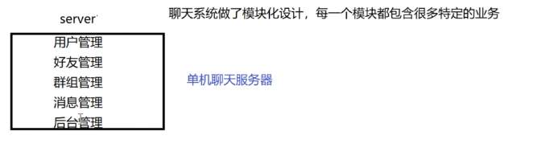
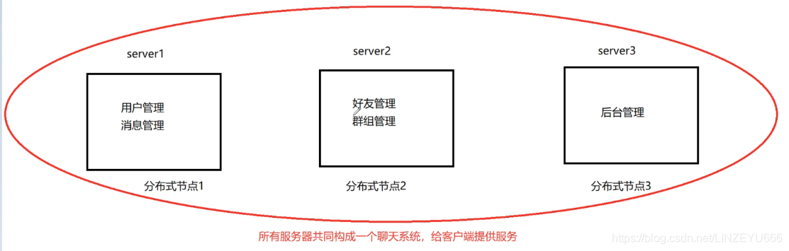
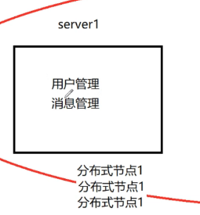
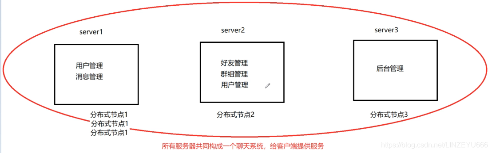
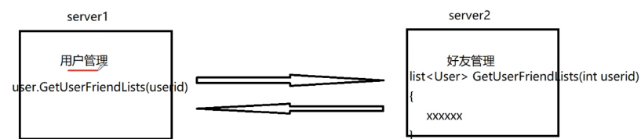

**集群**：每一台服务器独立运行一个工程的所有模块。

**分布式**：一个工程拆分了很多模块，每一个模块独立部署运行在一个服务器主机上，所有服务器协同工作共同提供服务，每一台服务器称作[分布式](https://so.csdn.net/so/search?q=%E5%88%86%E5%B8%83%E5%BC%8F&spm=1001.2101.3001.7020)的一个节点，根据节点的并发要求，对一个节点可以再做节点模块集群部署。

**我们以服务聊天器为例子，来讲解单机，集群，分布式**

## 单机服务器

  
**聊天服务器取名为server。**  
把用户管理，好友管理，群组管理，消息管理，后台管理等模块构成我们的聊天服务器。每个模块都包含了很多特定的业务。特定的业务：用户管理模块有用户登录，用户注册，用户注销，用户退出等功能业务。好友管理有添加好友，删除好友等功能业务。群组管理有添加群，创建群，解散群，群里踢人等功能业务。消息管理有离线消息，一对一的消息，群组消息等和功能业务。后台管理有广播消息，公告消息，活动消息等功能业务。

**单机版的服务器的性能，瓶颈？**  
**1、受限于硬件资源**。因为我们只有一台服务器，**聊天服务器所能承受的用户的并发量是有限的**。假设我们使用32位linux，给一个进程把资源开满，最多支持2万多人的在线。用户量上不去了。硬件资源不够，socket资源不够。  
**2、任意模块的修改都会导致整个项目代码重新编译，部署**。假设这个服务聊天器有5个模块，每个模块有几十上百个功能业务，这一套项目编译得花2个小时，部署得花3个小时。现在如果我们突然发现用户管理模块有个注销的业务里面有bug，但是改起来特别简单，就几行代码。但是这是一整套系统，得把整个项目的所有代码全部重新编译！！！这样又得花2个小时编译，运维部署3个小时！！！  
**3、系统中有些模块是属于CPU密集型（计算量大的），有些模块是属于I/O密集型的（接触 输入输出，网络I/O），造成各模块对硬件资源的需求是不一样。** 有些模块是CPU密集型的，这些模块应该部署在CPU资源非常好的机器上，有些模块是I/O密集型的，这些模块应该部署在内存大，带宽好的机器上，不需要太强的CPU资源。不同模块属于不同的型，对硬件的需求不一样，打包在一套机器上，只能综合所有模块，提出平衡的供给需求，没办法针对性。

## 集群

**操作简单，遇到双11，并发量上来了，直接扩充机器数量，加个负载均衡器。**  
**每一台服务器独立运行一个工程的所有模块。**  
  
**我们扩充了硬件资源。在水平方向上直接扩充成3台机器。每个机器独立运行着一台聊天服务器程序。**  
假如server2出问题，不影响聊天，因为server1和server3还可以独立地提供聊天服务，因为是独立的服务器。

但是每一台机器都还是独立运行着一套聊天服务器系统程序，现在对任意模块的修改，得把整套代码重新编译，因为模块根本没有分开去部署，都是在一个项目中部署，运行在一个服务器进程中。  
**编译一套代码，做多次部署。因为我们扩充成3台机器了！**

**集群的优点？**  
性能提升了，用户的[并发](https://so.csdn.net/so/search?q=%E5%B9%B6%E5%8F%91&spm=1001.2101.3001.7020)量提升了，因为水平扩充了硬件资源。  
**集群的缺点？**  
1、项目代码还是需要整体重新编译，而且需要进行多次部署。  
2、系统中有些模块是属于CPU密集型（计算量大的），有些模块是属于I/O密集型的（接触 输入输出，网络I/O），造成各模块对硬件资源的需求是不一样。

并不是说机器多，并发量就上来，性能就高。  
**像 后台管理 模块，这个模块使用的用户是不多的，能在聊天系统上发布公告，只有管理员，像学校的校长才能发布公告，而且后台管理员根本不需要高并发，但是把这个模块部署在3台机器上，就太浪费了！！！，像这些不常用的模块只需要部署在一台机器上就好啦，接下来我们讲解分布式！！！**

## 分布式

**分布式**：把这些管理模块抽出来，单独部署在不同的机器上。  
**从集群上看的话**，server2挂掉，还有完整的聊天服务器系统server1,server3。  
**但是在下图的分布式上**，对于红色圈，3台机器上分别运行着不同的模块，少了这3台机器的任意台，聊天系统就缺失了相应的业务了！！！所有机器共同构成一个聊天服务器系统。这就是分布式。  

**一个工程拆分了很多模块，每一个模块独立部署运行在一个服务器主机上，所有服务器协同工作共同提供服务，每一台服务器称作分布式的一个节点，根据节点的并发要求，对一个节点可以再做节点模块集群部署。**

**分布式的优点？**  
**1、**  
**用户登录成功，为了支持登录的并发量，我们可以把分布式节点1集群，扩充机器来部署运维用户管理，消息管理。**  
  
**比如说后台管理这个模块不需要高并发，一台机器足以！！！**

甚至我觉得用户管理（登录，退出）需要更多的并发量，没有人整体加好友删好友，建群，解散群。我们可以在server2节点上再部署用户管理，消息管理这2个业务功能。  
在server2中，当好友管理和群组管理无法使用完server2的网络I/O资源的时候，用户管理和消息管理可以再享受多余的server2的网络I/O资源提供给更多的客户端进行登录登出的聊天服务。  
  
**2、假设后台管理模块出问题，我只需要把server3这台机器的后台模块重新更新就可以了，其他模块不需要更新。**  
**3、把CPU密集型的模块部署在CPU资源好的机器上。把内存小的模块部署在硬盘资源少的机器上。把I/O密集型的模块部署在CPU不是很好的机器上。**  
**有的模块要求并发能力高，可以进行多机器集群部署。有的模块并发能力小，部署在一台机器就可以。**

**配置着高可用，容灾，主备服务器，不用担心就一套系统挂掉了怎么办。**

## 分布式面临的问题

**1、大系统的软件模块该怎么划分？**  
各模块可能实现大量重复的代码！  
模块和模块之间的界线不清晰（有的模块里面的函数调动另一个模块的函数代码）。  
处理不好，造成大量重复代码。而且你改你的，我改我的，重复的公共代码就出问题了，变成不可控制了。  
**2、各模块之间该怎么访问？**  
各模块可能运行不在一个机器上，或者不在一个进程上。  
  
如果用户登录成功了，想展示好友列表，但是用户管理模块只负责用户的登录，退出，修改密码等业务功能，它并不知道好友列表，负责管理好友的是好友管理模块。通过传入用户id，得出好友列表。在单机或者集群中，这些模块是运行在一个服务器进程当中，相当于自己调用自己。但是在分布式中，用户管理和好友管理部署在不同的进程中，用户管理进程如何调用另一个模块上的业务呢？

**机器1上的模块怎么调用机器2上的模块的一个业务方法呢？  
机器1上的一个模块进程1怎么调用机器1上的模块进程2里面的一个业务方法呢？**  
**通过网络！** 处理网络请求。网络是否有问题？如何告诉调用者网络的情况？

## 欲知后事如何，且听下回分解。RPC通信原理！