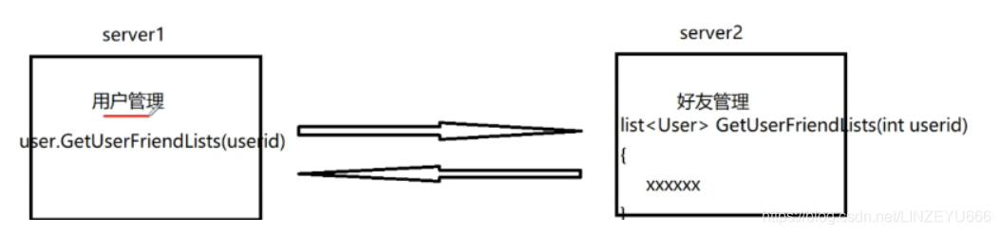
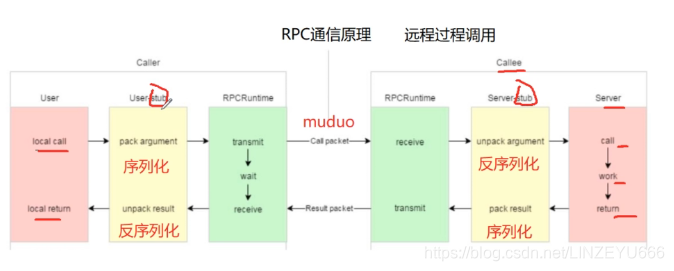
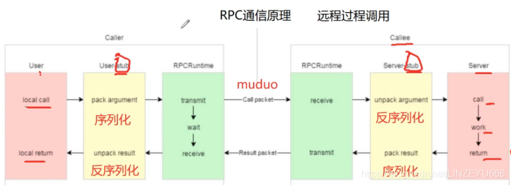
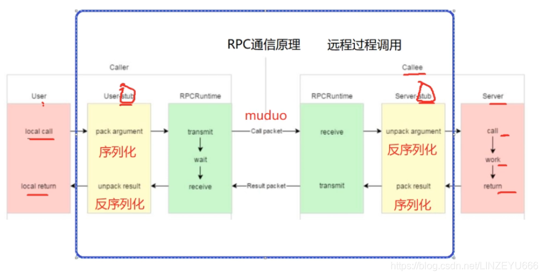

根据上一篇博客《单机，集群和分布式》的举的例子。  
我们最终合理地通过对大型软件的合理划分，划分成不同模块，按需求（硬件需求，高并发需求）进行分布式，一台机器上的模块不能单独构成聊天系统，所有机器上的模块构成一个聊天系统。

**即不同进程，不同机器上模块的调用**

**分布式的通信**：构建一个服务器系统，由很多不同的模块组成，这些模块进行了独立的部署，模块和模块之间的通信，这个模块调用另一个模块的方法，这就是分布式通信主要解决的问题。也叫做RPC通信。

## RPC[通信原理](https://so.csdn.net/so/search?q=%E9%80%9A%E4%BF%A1%E5%8E%9F%E7%90%86&spm=1001.2101.3001.7020)

**RPC（Remote Procedure Call Protocol）远程过程调用协议**  
  
**黄色部分**：设计rpc方法参数的打包和解析，也就是数据的序列化和反序列化，使用Protobuf。  
**绿色部分**：网络部分，包括寻找rpc服务主机，发起rpc调用请求和响应rpc调用结果，使用muduo网络库和zookeeper服务配置中心（专门做服务发现）。  
**mprpc框架主要包含以上两个部分的内容。**

## 解析上图（RPC通信图解）

**左边的caller**，就是调用者。相当于下图的server1这个角色，用户管理，用户发起的一个远程的方法调用，获取当前指定用户id的好友列表。上图的local call对应的状态就是server1用户管理的这个进程调用GetUserFriendList函数，这是一个远程的RPC方法，不是一个当前进程内的方法，首先得去服务配置中心查找，知道这个服务在server2里面，现在就是要把这个函数调用的请求通过网络发布到server2中，server2还得知道你要调用哪个函数！因为server2有很多模块，很多RPC方法。所以我们在传输的时候要把 **函数的标识**，**方法在远端调用涉及到的参数**进行打包。这就是对应上图的pack argument，打包参数，我们称作**序列化**。序列化好之后，我就可以把这个请求通过网络transmit传送过去到server2中，网络是用C++实现的开源的muduo库。  
远端接收到从网络接收到RPC调用请求（对应上图的receive)，从网络底层上报上来，上报上来的是打包完成后的参数，这时要把从网络接收的打包的参数解包，对应上图的unpack argument，我们称作反序列化，就是把从网络的接收的字节流反序列化成具体的RPC调用的细节信息，方法，标识，参数，然后就到server2上了，对应上图的call。  
此时，RPC的请求已经到达server2的好友管理的获取好友列表的函数上了，就是在机器的这个进程里执行这个list< User>GetUserFriendList函数，对应上图的work（工作，执行），然后return 返回值，不管是正常运行还是出错了，return 返回相应的东西，这时进行pack result，打包参数，即序列化成字节流，通过网络muduo库发到caller端。caller端收到后，即对应上图的receive，这个网络就会把字节流上报到User-stub上，把字节流反序列化，即对应上图的unpack result，反序列化后，就可以得到具体的应用程序可以认得的一个描述RPC调用方法请求的结果的数据，相当于上图的local return。  
  
  
**在分布式通信框架中，都有桩，stub就是“桩“，我们可以认为就是一个”代理“，因为RPC调用的发起方只需要关心业务，不用关心底层的网络上的RPC方法，通信的细节，细节都包装在stub，做数据的序列化和反序列化，网络数据的收发。执行RPC请求的这一端也是如此。**

## 再举个例子

**RPC方法：bool login(string name,string pwd)；  
调用这个方法，是远程调用另一个进程。**  
  
首先，我们在Caller的User，local call，发起login()；  
需要框架的User\_stub把我想调用的RPC的方法的方法名字，参数序列化，打包起来形成字节流，通过网络进行发送(使用muduo库）,发送到对端以后，对端receive，接收从网络得到的字节流，然后在Server-stub把字节流反序列化出来，然后根据解包的参数进行调用相应的函数。work调用执行，return登录执行的结果true或者false，有可能在执行的时候函数执行出现问题，我们可以在返回的东西中还可以加一些响应，响应码是0，表示这个方法在远端执行是正常的，如果执行错误，就返回一些信息（响应码，错误码，错误信息，具体的返回值）。然后经过打包（pack result）成字节流通过网络发送（muduo库）到对端。然后端端receive，在User-stub解包，反序列化，上报到应用程序，就知道了，根据返回的信息进行相应的操作。

## 我要完成的 基于RPC的分布式网络通信框架 项目就是完成下图的所圈起来的部分

  
**黄色部分，我将用protobuf完成，json也可以完成，但是protobuf相当于json的好处：**  
**1、protobuf是二进制存储，xml和json都是文本存储！！！**  
**二进制省空间！**  
protobuf在携带数据的时候，带宽的资源的利用率是高的。protobuf携带同样的数据，占用的字节少！  
**2、protubuf不需要存储额外的信息，**  
json的存储是：key-value  
name ：“zhangsan" pwd:“123456”  
而protobuf的存储是：“zhangsan" “123456”，它只存储有效数据！！！

**绿色部分我将用muduo网络库和zookeeper服务配置中心（专门做服务发现）完成。**