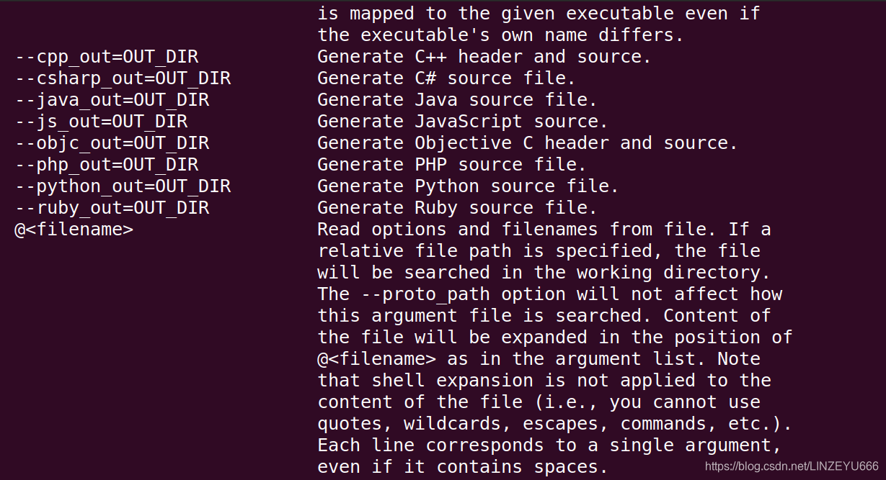

## protobuf介绍

**protobuf（protocol buffer）是google 的一种数据交换的格式，它独立于平台语言**。 google 提供了protobuf多种语言的实现：java、c#、c++、go 和 [python](https://so.csdn.net/so/search?q=python&spm=1001.2101.3001.7020)，每一种实现都包含了相应语言的编译器以及库文件。 由于它是一种**二进制**的格式，比使用 xml（20倍） 、json（10倍）进行数据交换快许多。可以把它用于分布式应用之间的数据通信或者异构环境下的数据交换。作为一种效率和兼容性都很优秀的二进制数据传输格式，可以用于诸如网络传输、配置文件、数据存储等诸多领域。

## ubuntu下protobuf的环境搭建

**github源代码下载地址：https://github.com/google/protobuf  
或者私信我获取安装包protobuf-master.zip**  
1、解压压缩包：unzip protobuf-master.zip  
2、进入解压后的文件夹：cd protobuf-master  
3、安装所需工具：sudo apt-get install autoconf automake libtool curl make g++ unzip  
4、自动生成configure配置文件：./autogen.sh  
5、配置环境：./configure  
6、编译源代码(时间比较长)：make  
7、安装：sudo make install  
8、刷新动态库：sudo ldconfig

**最后我们检查是否安装成功**  
在终端输入命令 **protoc**  
**出现下面运行结果即安装成功**  
  

## 在Ubuntu上的VScode的安装要件

  
