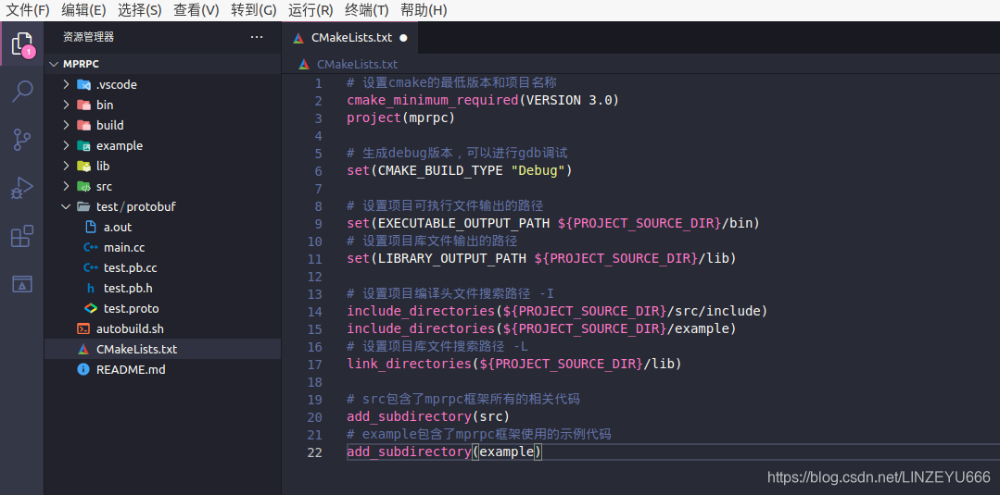

## 我的项目代码工程结构(mprpc)

**Ubuntu打开VScode**  
**我的项目名称为 mprpc**  
**项目工程目录如下：**  
  
**bin：可执行文件 build：  
项目编译文件  
lib：项目库文件  
src：源文件  
test：测试代码  
example：框架代码使用范例  
CMakeLists.txt：顶层的cmake文件  
README.md：项目自述文件  
autobuild.sh：一键编译脚本**

## CMakeLists.txt的配置

```xml
# 设置cmake的最低版本和项目名称
cmake_minimum_required(VERSION 3.0)
project(mprpc)

# 生成debug版本，可以进行gdb调试
set(CMAKE_BUILD_TYPE "Debug")

# 设置项目可执行文件输出的路径
set(EXECUTABLE_OUTPUT_PATH ${PROJECT_SOURCE_DIR}/bin)
# 设置项目库文件输出的路径
set(LIBRARY_OUTPUT_PATH ${PROJECT_SOURCE_DIR}/lib)

# 设置项目编译头文件搜索路径 -I
include_directories(${PROJECT_SOURCE_DIR}/src/include)
include_directories(${PROJECT_SOURCE_DIR}/example)
# 设置项目库文件搜索路径 -L
link_directories(${PROJECT_SOURCE_DIR}/lib)

# src包含了mprpc框架所有的相关代码
add_subdirectory(src)
# example包含了mprpc框架使用的示例代码
add_subdirectory(example)
```

