**关于protobuf的安装配置在之前的博客已经阐述。  
接下来我们打开Ubuntu下的vscode  
下图是我的项目代码工程。我们在test创建protobuf文件夹。  
然后在protobuf文件下创建main.cc和test.proto进行我们的实践。**  


## protobuf的实践(1)

**我们先在test.proto定义消息类型（message)**  
**注意**：里面的类型都是谷歌protobuf定义的类型，和C++的类型相似  
**我们用bytes定义字符串类型，多字节存储，处理的是字节，省时省消耗**  
**如果写成string，还要把字符转成字节存储。**  
因为protobuf的二进制存储的

```cpp
syntax = "proto3"; // 声明了protobuf的版本

package fixbug; // 声明了代码所在的包（对于C++来说是namespace）

message ResultCode//可以封装一下失败类，减少代码重复量
{
    int32 errcode = 1;//表示第1字段
    bytes errmsg = 2;//表示第2字段
}

// 定义登录请求消息类型  name   pwd
message LoginRequest
{
    bytes name = 1;//表示第1字段
    bytes pwd = 2;//表示第2字段
}

// 定义登录响应消息类型
message LoginResponse
{
    ResultCode result = 1;//表示第1字段
    bool success = 2;//表示第2字段
}
```

我们配置完test.proto之后，打开终端，进入到protobuf中  
**输入命令：protoc test.proto --cpp.out=./**  
**生成了teat.pb.cc和test.pb.h两个文件**  
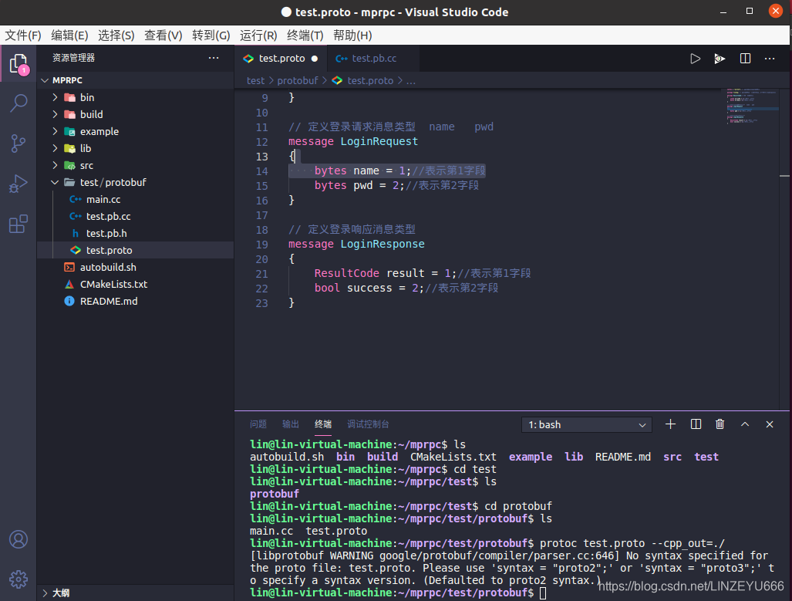  
  
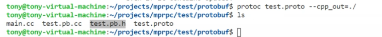

**温馨提示：我们写完文件退出保存后再去编译运行它！**  
可以看到我们之前定义的LoginRequest是一个class类！  
我们定义的name，pwd相当于就是LoginRequest类的成员变量，也有相应的成员方法！  
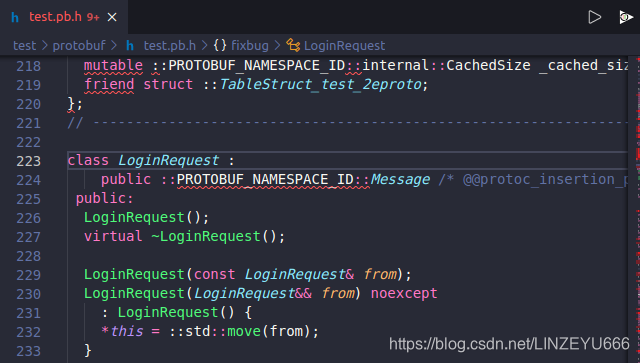  
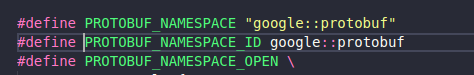  


**接下来我们打开main.cc，编码测试protobuf!**  
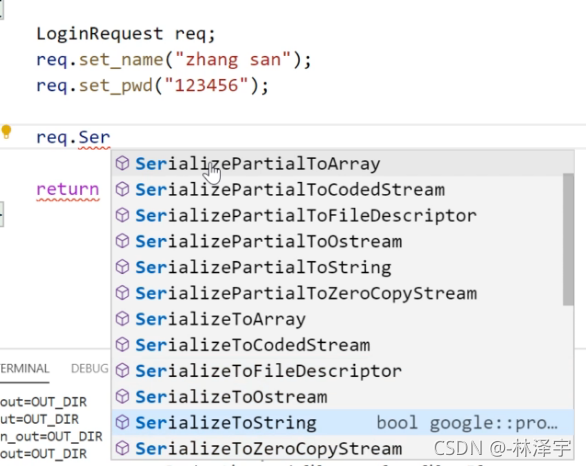

```cpp
#include "test.pb.h"
#include <iostream>
#include <string>
using namespace fixbug;

int main()
{
    // 封装了login请求对象的数据
    LoginRequest req;
    req.set_name("linzeyu");//用户名：林泽宇
    req.set_pwd("123456");//密码：123456

    // 对象数据序列化 =》 char*
    std::string send_str;
    if (req.SerializeToString(&send_str))
    {
        std::cout << send_str.c_str() << std::endl;
    }

    // 从send_str反序列化一个login请求对象
    LoginRequest reqB;
    if (reqB.ParseFromString(send_str))
    {
        std::cout << reqB.name() << std::endl;
        std::cout << reqB.pwd() << std::endl;
    }

    return 0;
}
```

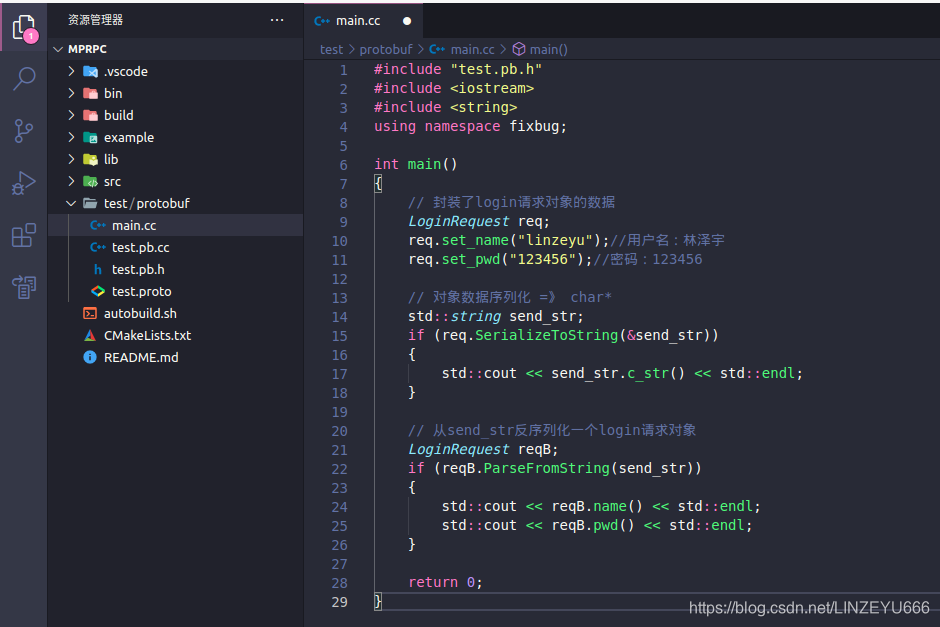  
**我们保存文件，打开终端，输入以下命令**  
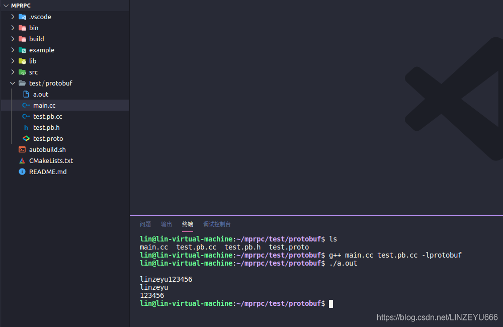  
**因为我们的protobuf是生成动态库，所以要加上-lprotobuf  
生成a.out文件  
运行成功了！！！**

**序列化成**  
linzeyu123456  
**反序列化成**  
linzeyu  
123456

## protobuf的实践(2)

我们在存储数据的时候，有3种形式：  
**数据 列表 映射表**  
接下来我们玩一下 **列表！**

**以获取好友列表为例**

**我们先在test.proto定义消息类型**

```cpp
syntax = "proto3"; // 声明了protobuf的版本

package fixbug; // 声明了代码所在的包（对于C++来说是namespace）

message ResultCode//封装一下失败类
{
    int32 errcode = 1;//表示第1字段
    bytes errmsg = 2;//表示第2字段
}

// 定义登录请求消息类型  name   pwd
message LoginRequest
{
    bytes name = 1;//表示第1字段
    bytes pwd = 2;//表示第2字段
}

// 定义登录响应消息类型
message LoginResponse
{
    ResultCode result = 1;//表示第1字段
    bool success = 2;//表示第2字段
}

//获取好友列表请求
message GetFriendListsRequest
{
    uint32 userid = 1;
}

//返回用户的信息
message User
{
    bytes name = 1;
    uint32 age = 2;
    enum Sex//枚举
    {
        MAN = 0;//枚举是从0开始的
        WOMAN = 1;
    }
    Sex sex = 3;
}

//获取好友列表请求的响应
message GetFriendListsResponse
{
    ResultCode result = 1;
    repeated User friend_list = 2; // 定义了一个列表类型
}
```

**保存，打开终端进入到protobuf，输入命令  
protoc test.proto --cpp\_out=./**  
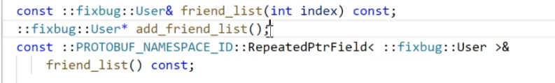  
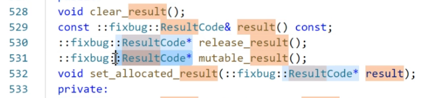

**接下来我们打开main.cc**

```cpp
#include "test.pb.h"
#include <iostream>
#include <string>
using namespace fixbug;


int main()
{
    // LoginResponse rsp; //登录响应
    // ResultCode *rc = rsp.mutable_result();//mutable是可变的意思
    // rc->set_errcode(1);
    // rc->set_errmsg("登录处理失败了");
    
    GetFriendListsResponse rsp;
    ResultCode *rc = rsp.mutable_result();
    rc->set_errcode(0);

    User *user1 = rsp.add_friend_list();
    user1->set_name("zhang san");
    user1->set_age(20);
    user1->set_sex(User::MAN);

    User *user2 = rsp.add_friend_list();
    user2->set_name("li si");
    user2->set_age(22);
    user2->set_sex(User::MAN);

    std::cout << rsp.friend_list_size() << std::endl;

    return 0;
}
```

**保存，编译，运行**  
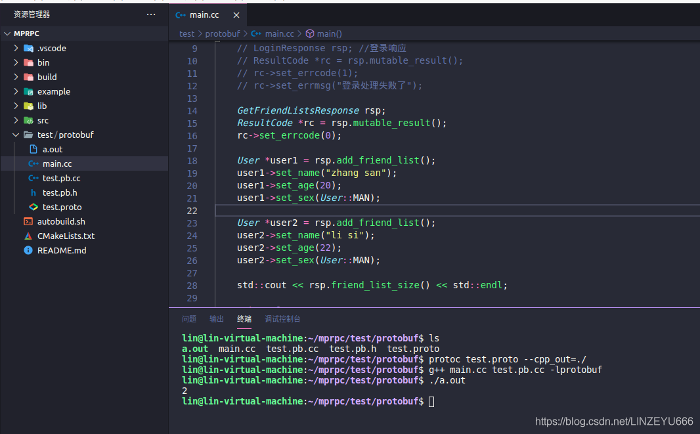  
**2个好友！**  
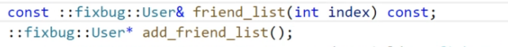  
**这个方法是根据下标index返回指定好友的信息**  
我们还可以定义成map映射表（google::protobuf::下专门定义的类型）  
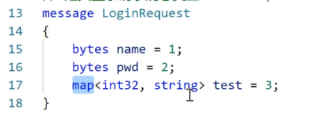  
然后根据protoc生成C++或者Java之类的代码

## protobuf的实践（定义RPC方法)

**在protobuf里面怎么定义描述rpc方法的类型？**  
**传输RPC方法名字和所调用方法的参数**

**protobuf本身没有提供rpc通信功能。  
我们是要它做RPC方法调用的序列化和反序列化！**  
**在test.proto配置如下**  
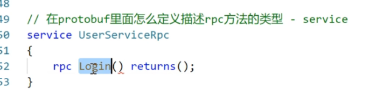  
**这相当于是定义一个login的rpc方法，login是rpc方法的名字，protobuf不支持rpc通信功能，只支持对于rpc方法的描述，通过这个描述，它就可以去做rpc请求的携带的参数的序列化和反序列化，login的小括号就存储实参的protobuf的类型表示，returns就是表示：这个rpc方法login()执行以后返回的protobuf打包的类型。**

```cpp
//定义下面的选项，表示生成service服务类和rpc方法描述，默认不生成
option cc_generic_services = true;
//在protobuf里面怎么定义描述rpc方法的类型 - service
service UserServiceRpc
{
    rpc Login(LoginRequest) returns(LoginResponse);
    rpc GetFriendLists(GetFriendListsRequest) returns(GetFriendListsResponse);
}//服务类及服务的方法
```

**test.proto全套代码：**  
message描述的都是class类

```cpp
syntax = "proto3"; // 声明了protobuf的版本

package fixbug; // 声明了代码所在的包（对于C++来说是namespace）

//定义下面的选项，表示生成service服务类和rpc方法描述，默认不生成
option cc_generic_services = true;

message ResultCode//封装一下失败类
{
    int32 errcode = 1;//表示第1字段
    bytes errmsg = 2;//表示第2字段
}

// 定义登录请求消息类型  name   pwd
message LoginRequest
{
    bytes name = 1;//表示第1字段
    bytes pwd = 2;//表示第2字段
}

// 定义登录响应消息类型
message LoginResponse
{
    ResultCode result = 1;//表示第1字段
    bool success = 2;//表示第2字段
}

//获取好友列表请求
message GetFriendListsRequest
{
    uint32 userid = 1;
}

//返回用户的信息
message User
{
    bytes name = 1;
    uint32 age = 2;
    enum Sex//枚举
    {
        MAN = 0;//枚举是从0开始的
        WOMAN = 1;
    }
    Sex sex = 3;
}

//获取好友列表请求的响应
message GetFriendListsResponse
{
    ResultCode result = 1;
    repeated User friend_list = 2; // 定义了一个列表类型
}

//在protobuf里面怎么定义描述rpc方法的类型 - service
service UserServiceRpc
{
    rpc Login(LoginRequest) returns(LoginResponse);
    rpc GetFriendLists(GetFriendListsRequest) returns(GetFriendListsResponse);
}
```

**保存，编译**  
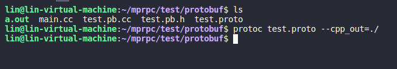  
**我们进入生成的test.pb.h看到，服务service生成了UserServiceRpc类和UserServiceRpc\_stub类（桩，代理类）**  
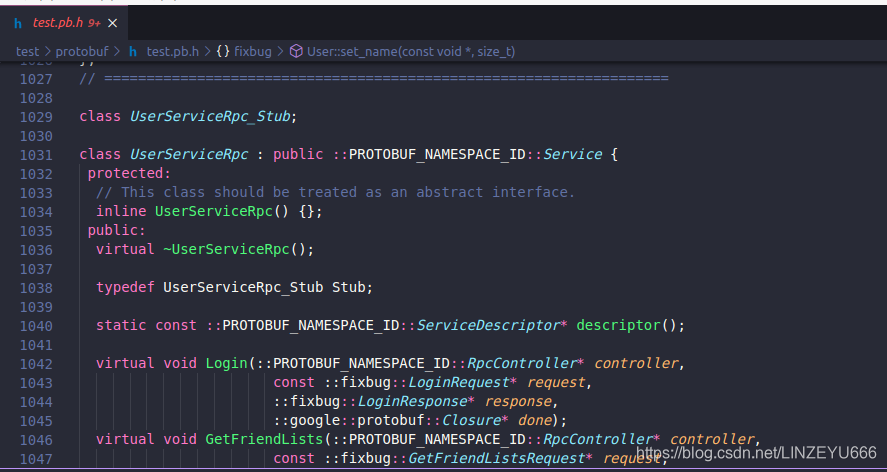  
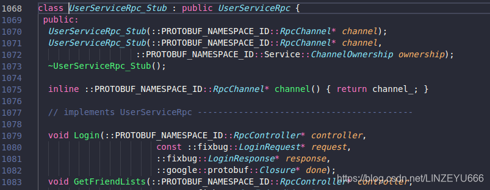  
**相当于是说，本地调用一个RPC方法的时候，底层要做很多事情，这些事情都是由代理类来做的。**

## 解析protobuf的message类

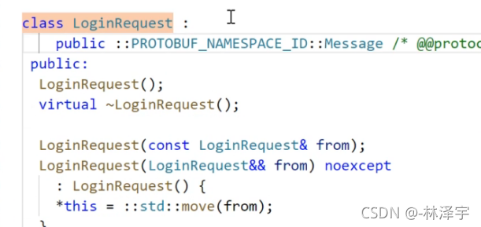

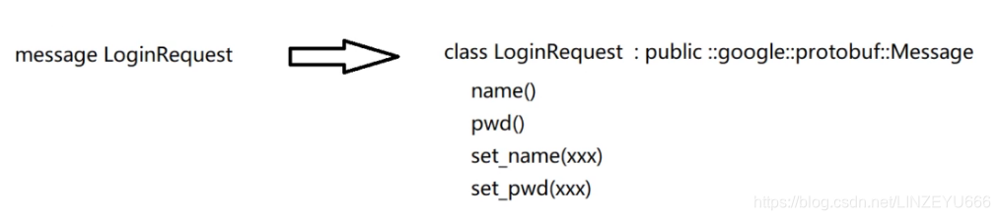

  
基类Message提供了很多成员方法！！！

## 解析protobuf的service类

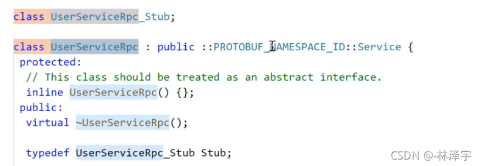

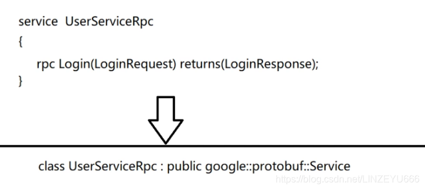

**我们先来看看生成的UserServiceRpc类有什么东西？**  
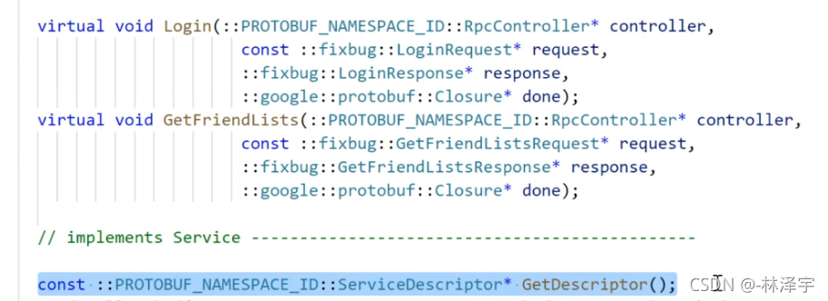

**是无参数的构造函数：**  
**UserServiceRpc类是使用在rpc服务的提供者（callee，远程方法的执行端）**  
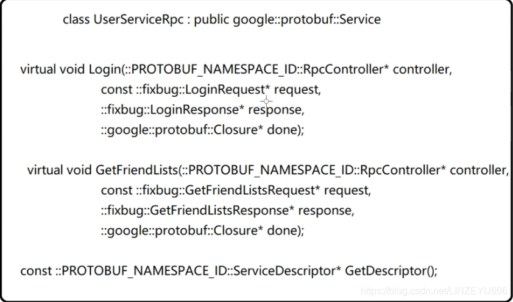  
**虚函数，让派生类重写。我们看到，这些方法的名字就是我们定义rpc服务的方法的名字。**  
**而且参数都是4个。而且是固定的。**

**我们得知道rpc方法的名字（属于哪一个类类型的方法）和调用函数方法的参数，都在ServiceDescriptor描述（服务的名字，服务里面的方法名字，参数，请求的是纯对象的oop方法）。**

**我们接着看**  
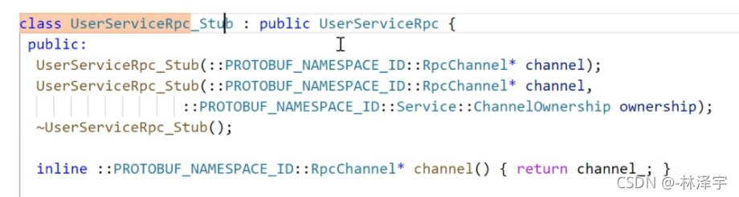  
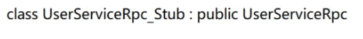  
**这个类Stub是用在RPC调用的发起端（caller端，rpc服务的消费者）。**  
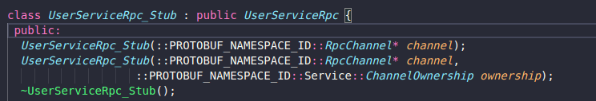  
**我们发现，stub类是没有默认构造函数的！！！**  
**是有带参数的构造函数！！！**  
**得传Rpcchannel指针！！！**  
**Rpcchannel是什么？**  
**我们还注意到有一个成员变量**  
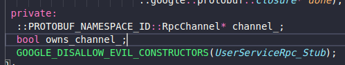  
**他也有这两个方法：**  
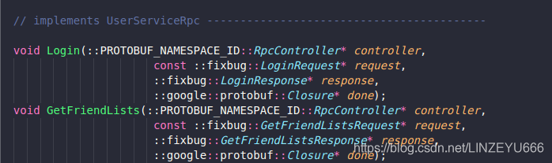  
**实际上是虚函数，因为都是从基类继承而来的，基类的方法是虚函数。**  
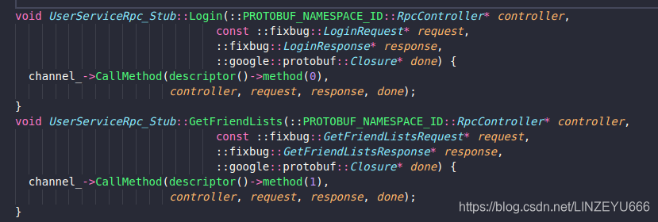  
**区别：**  
UserService有默认的构造函数，构造的时候不用传参数  
UserService\_Stub没有默认的构造函数，要传Rpcchannel指针，而且有一个成员变量：Rpcchannel指针，接收了构造函数的实参  
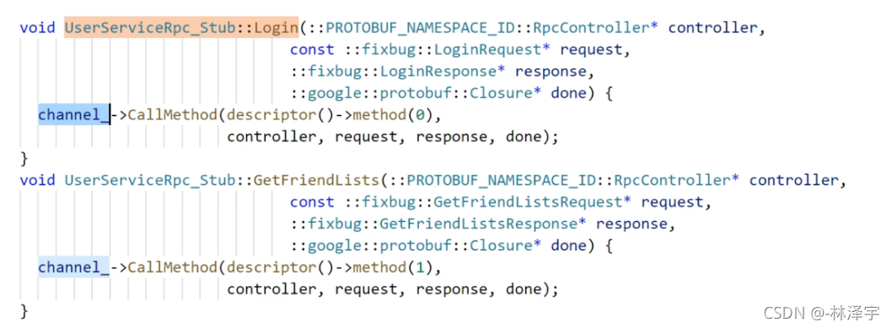

**我们发现：不管是调用什么方法，底层都是调用channel的CallMethod方法！**  
**method(0)和method1(1)肯定是区分方法的名字**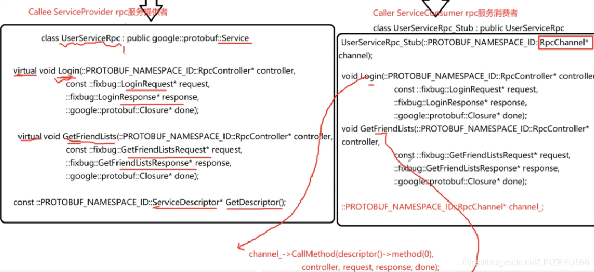

## Rpcchannel是什么呢？

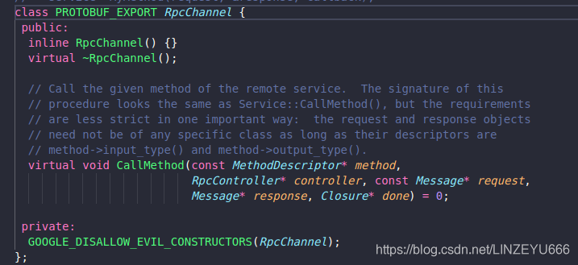**是一个抽象类！**  
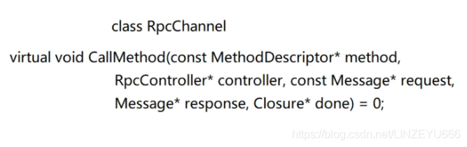  
**意味着我们必须自己去实现一个类，从Rpcchannel继承而来，重写CallMethod方法。**  
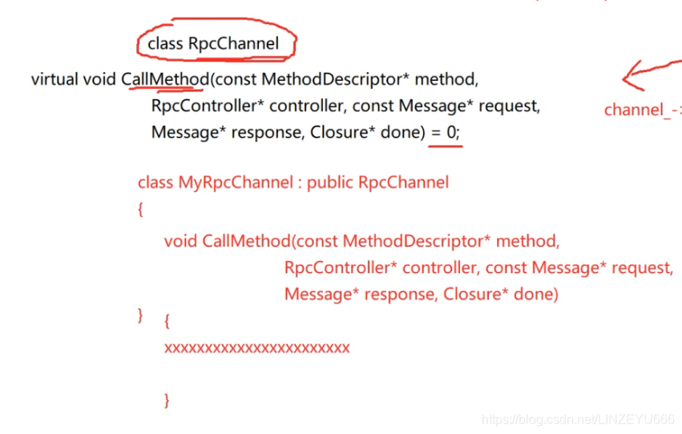  
**就是传自己实现的MyRpcChannel给Rpcchannel指针，派生类是可以用基类指针的。**  
**到时候，调用stub的login方法或者getfriendlist方法都是基类指针指向了派生类同名的方法。**  
  
**用stub桩类不管调用哪个方法，最终都调用到我们的MyRpcChannel的CallMethod方法，我们在这里就可以进行rpc方法的序列化和反序列化，然后发起远程的rpc调用请求。**

**message类是专门用作rpc方法的参数和返回值的序列化和反序列化的**