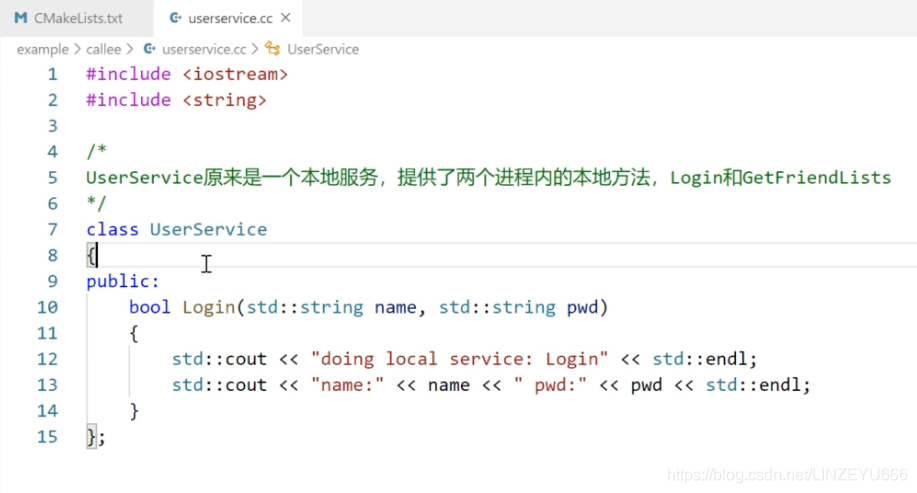
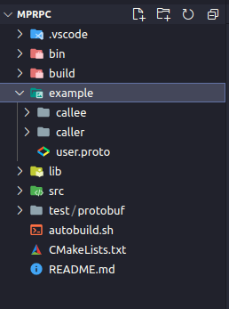
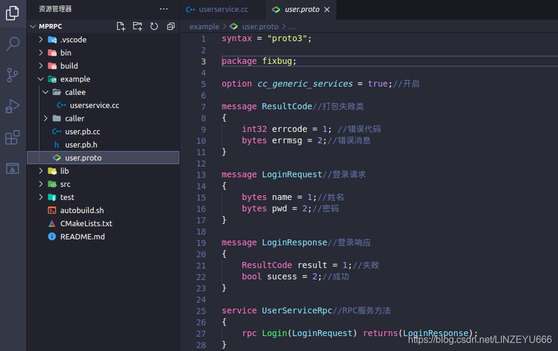
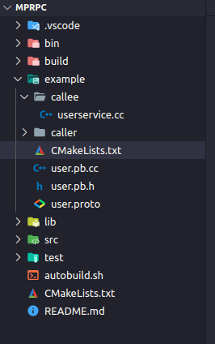
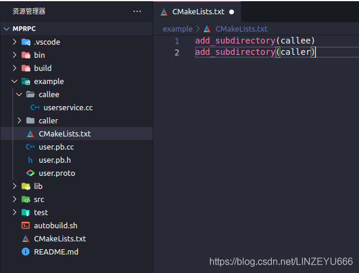

## 如何本地服务发布成RPC服务？

**example文件夹作为我们框架项目的使用实例，在example文件夹下创建callee和caller两个文件夹**  
  
**callee是RPC服务的提供者。  
我在callee创建一个文件：userservice.cc**  
  
**我们有没有这样一个框架，把这个UserService这个类生成的Login方法直接变成一个RPC远程方法？让在其他进程，其他机器都可以调用这个方法？**  
**在这里我们使用protobuf进行参数和调用方法标识的序列化和反序列化。**

**我们在example下再建一个文件：user.proto**  


## 示例

**接下来我们配置user.proto**

```cpp
syntax = "proto3";

package fixbug;

option cc_generic_services = true;//开启

message ResultCode//打包失败类
{
    int32 errcode = 1; //错误代码
    bytes errmsg = 2;//错误消息
}

message LoginRequest//登录请求
{
    bytes name = 1;//姓名
    bytes pwd = 2;//密码
}

message LoginResponse//登录响应
{
    ResultCode result = 1;//失败
    bool sucess = 2;//成功
}

service UserServiceRpc//RPC服务方法
{
    rpc Login(LoginRequest) returns(LoginResponse);
}
```



**保存退出，打开终端，进入到example下，执行**  
protoc user.proto --cpp\_out=./

**我们在CMakeLists.txt配置好相应的路径。  
我们在example中再创建一个CMakeLists.txt**  
  
**CMakeLists.txt配置如下：**

```cpp
add_subdirectory(callee)
add_subdirectory(caller)
```

  
**我们在callee和caller下各自再创建一个CMakeLists.txt**  
**在callee的CMakeLists.txt中配置如下：**

```cpp
set(SRC_LIST userservice.cc ../user.pb.cc)
add_executable(provider ${SRC_LIST})//可执行文件
```

**现在我们配置userservice.cc**

```cpp
#include <iostream>
#include <string>
#include "user.pb.h"

/*
UserService原来是一个本地服务，提供了两个进程内的本地方法，Login和GetFriendLists
*/
class UserService : public fixbug::UserServiceRpc//这个UserService是使用在rpc服务的发布端（rpc服务提供者）
{
public:
    bool Login(std::string name, std::string pwd)
    {
        std::cout << "doing local service: Login" << std::endl;
        std::cout << "name:" << name << " pwd:" << pwd << std::endl;  
        return false;
    }

    bool Register(uint32_t id, std::string name, std::string pwd)
    {
        std::cout << "doing local service: Register" << std::endl;
        std::cout << "id:" << id << "name:" << name << " pwd:" << pwd << std::endl;
        return true;
    }

/*我的角色是服务的提供者，你作为远端想发起一个调用我这个机器上的UserService的Login方法
首先你会发一个RPC请求，这个请求是先到RPC框架，RPC框架根据你发过来的请求，然后根据参数和标识
匹配到我的Login方法，然后它就把这个网络上发的请求上报来，我接收到这个请求后，从请求中拿取数据，
然后做本地业务，填写相应的响应，然后再执行一个回调，相当于把执行完的这个RPC方法的返回值再塞给框架
，然后框架再进行序列化，通过网络传送回去，发送给你。体现在Login的四个参数。
*/

/*
    重写基类UserServiceRpc的虚函数 下面这些方法都是框架直接调用的
    1. caller RPC调用者   ===>   Login(LoginRequest)打包  => muduo库 =>   callee端
    2. callee RPC提供者   ===>   根据接收到的Login(LoginRequest)  => 交到下面重写的这个Login方法上了
    */
    void Login(::google::protobuf::RpcController* controller,
                       const ::fixbug::LoginRequest* request,
                       ::fixbug::LoginResponse* response,
                       ::google::protobuf::Closure* done)
    {
        //框架给业务上报了请求参数LoginRequest，应用程序获取相应数据做本地业务（登录的本地业务）
        std::string name = request->name();
        std::string pwd = request->pwd();
/*这个就是使用protobuf的好处，protobuf直接把字节流反序列化成我们可以识别的LoginRequest对象，通过
他生成的方法获取姓名和密码。
*/

        //做本地业务
        bool login_result = Login(name, pwd);//等于当前的本地方法

        //框架只是创建一个LoginResponse，我们只需要把响应写入，包括错误码、错误消息、返回值
        fixbug::ResultCode *code = response->mutable_result();
        code->set_errcode(0);
        code->set_errmsg("");//没有错误
        response->set_sucess(login_result);

        //执行回调操作，执行响应对象数据的序列化和网络发送（都是由框架来完成的）
//Closure是一个抽象类，重写Run,让它去做一些事情
        done->Run();
    }
};
```

Closure是一个抽象类，重写Run,让它去做一些事情  
