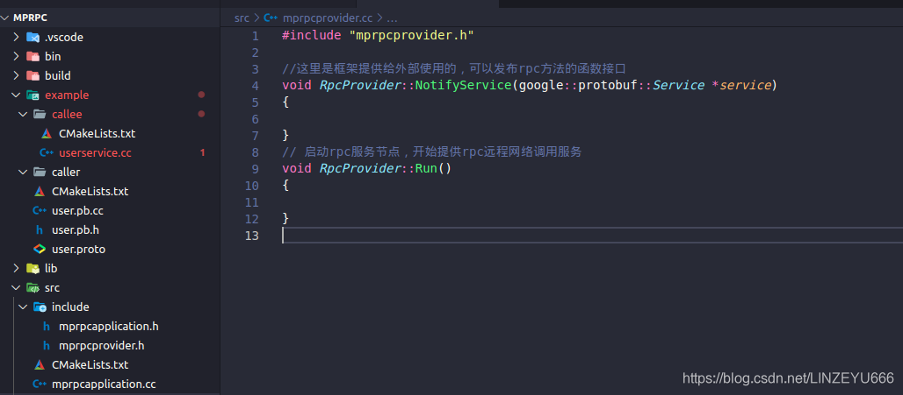

## mprpc框架怎么用？

**在上一节，我们完成了如何把本地服务发布成RPC服务。  
我们打开example下callee下的userservice.cc**

```cpp
#include <iostream>
#include <string>
#include "user.pb.h"

/*
UserService原来是一个本地服务，提供了两个进程内的本地方法，Login和GetFriendLists
*/
class UserService : public fixbug::UserServiceRpc//这个UserService是使用在rpc服务的发布端（rpc服务提供者）
{
public:
    bool Login(std::string name, std::string pwd)
    {
        std::cout << "doing local service: Login" << std::endl;
        std::cout << "name:" << name << " pwd:" << pwd << std::endl;  
        return false;
    }

    bool Register(uint32_t id, std::string name, std::string pwd)
    {
        std::cout << "doing local service: Register" << std::endl;
        std::cout << "id:" << id << "name:" << name << " pwd:" << pwd << std::endl;
        return true;
    }

/*我的角色是服务的提供者，你作为远端想发起一个调用我这个机器上的UserService的Login方法
首先你会发一个RPC请求，这个请求是先到RPC框架，RPC框架根据你发过来的请求，然后根据参数和标识
匹配到我的Login方法，然后它就把这个网络上发的请求上报来，我接收到这个请求后，从请求中拿取数据，
然后做本地业务，填写相应的响应，然后再执行一个回调，相当于把执行完的这个RPC方法的返回值再塞给框架
，然后框架再进行序列化，通过网络传送回去，发送给你。体现在Login的四个参数。
*/

/*
    重写基类UserServiceRpc的虚函数 下面这些方法都是框架直接调用的
    1. caller RPC调用者   ===>   Login(LoginRequest)打包  => muduo库 =>   callee端
    2. callee RPC提供者   ===>   根据接收到的Login(LoginRequest)  => 交到下面重写的这个Login方法上了
    */
    void Login(::google::protobuf::RpcController* controller,
                       const ::fixbug::LoginRequest* request,
                       ::fixbug::LoginResponse* response,
                       ::google::protobuf::Closure* done)
    {
        //框架给业务上报了请求参数LoginRequest，应用程序获取相应数据做本地业务（登录的本地业务）
        std::string name = request->name();
        std::string pwd = request->pwd();
/*这个就是使用protobuf的好处，protobuf直接把字节流反序列化成我们可以识别的LoginRequest对象，通过
他生成的方法获取姓名和密码。
*/

        //做本地业务
        bool login_result = Login(name, pwd);//等于当前的本地方法

        //框架只是创建一个LoginResponse，我们只需要把响应写入，包括错误码、错误消息、返回值
        fixbug::ResultCode *code = response->mutable_result();
        code->set_errcode(0);
        code->set_errmsg("");//没有错误
        response->set_sucess(login_result);

        //执行回调操作，执行响应对象数据的序列化和网络发送（都是由框架来完成的）
//Closure是一个抽象类，重写Run,让它去做一些事情
        done->Run();
    }
};
```

**我们现在书写主函数**

**我们希望实现后的mprpc框架，可以这么使用：**

```cpp
int main(int argc, char **argv)//需要配置文件
{
    //调用框架的初始化操作
    MprpcApplication::Init(argc, argv);//整个框架的初始化操作，日志，配置等等。

    //provider是一个rpc网络的服务对象。把UserService对象发布到rpc节点上。
    RpcProvider provider;
    provider.NotifyService(new UserService());//发布服务
//可以调用多次，生成多个远程RPC服务

    //启动一个rpc服务发布节点
    provider.Run();
//Run以后，进程进入阻塞状态，等待远程的rpc调用请求

    return 0;
}
```

**可以调用多次，生成多个远程RPC服务**  
**如果可以这么使用的话，想把本地业务变成远程服务就很简单了**：定义proto文件，继承UserServiceRpc类，然后重写方法，打4套动作。就OK了。  
然后要发布服务，就初始化框架，定义一个可以发布服务的对象，在这个对象上发布服务。provider是一个rpc网络的服务对象。把UserService对象发布到rpc节点上。Run以后，进程进入阻塞状态，等待远程的rpc调用请求。

**我们接下来将往这个方向去设计框架**

**我们实现框架的代码存放在src中  
我们在src下再创一个文件夹：include；用来存放头文件。**  
  
**我们在include下创建头文件：mprpcapplication.h**  


```cpp
#pragma once

// mprpc框架的基础类，负责框架的一些初始化操作
class MprpcApplication
{
public:
    static void Init(int argc, char **argv);//初始化 
    static MprpcApplication& GetInstance()//单例模式 
    {
    static MprpcApplication app;
return app;
}
private:
    MprpcApplication(){}//构造函数 
    MprpcApplication(const MprpcApplication&) = delete;//删除拷贝相关的 
    MprpcApplication(MprpcApplication&&) = delete;//删除拷贝相关的 
};
```

  
**RpcProvider是一个网络的服务对象，要做到高并发，使用muduo库实现。 我们再定义一个头文件：rpcprovider.h**

```cpp
#pragma once
#include "google/protobuf/service.h"

//框架提供的专门发布rpc服务的网络对象类
class RpcProvider
{
public:
    //这里是框架提供给外部使用的，可以发布rpc方法的函数接口
    void NotifyService(google::protobuf::Service *service);
    //框架是可以接收各种RPC服务的，不能依赖具体的某一个业务。 
    //基类指针指向子对象 

    //启动rpc服务节点，开始提供rpc远程网络调用服务
    void Run();

};
```

  
**我们把这2个头文件写到userservice.cc**  
  
**接下来我们在src下创建  
mprpcprovider.cc  
mprpcapplication.cc**  
  
**我们书写mprpcapplication.cc**  
  
**我们书写mprpcprovider.cc**  
