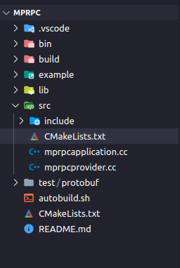
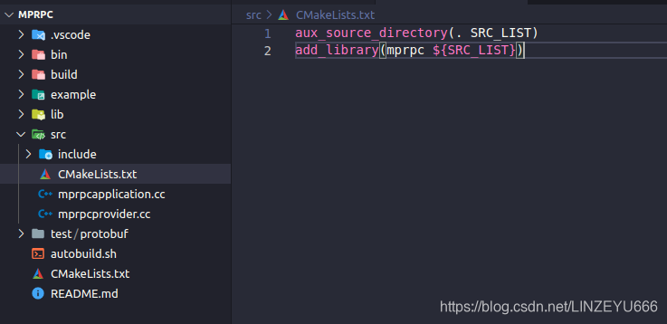
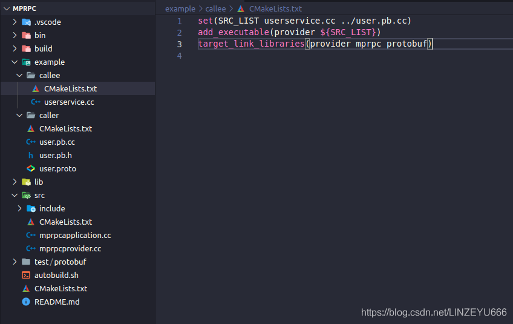
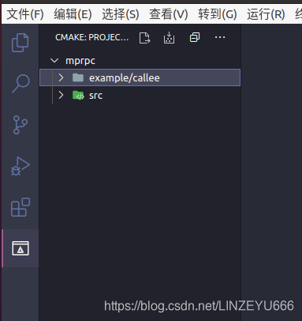
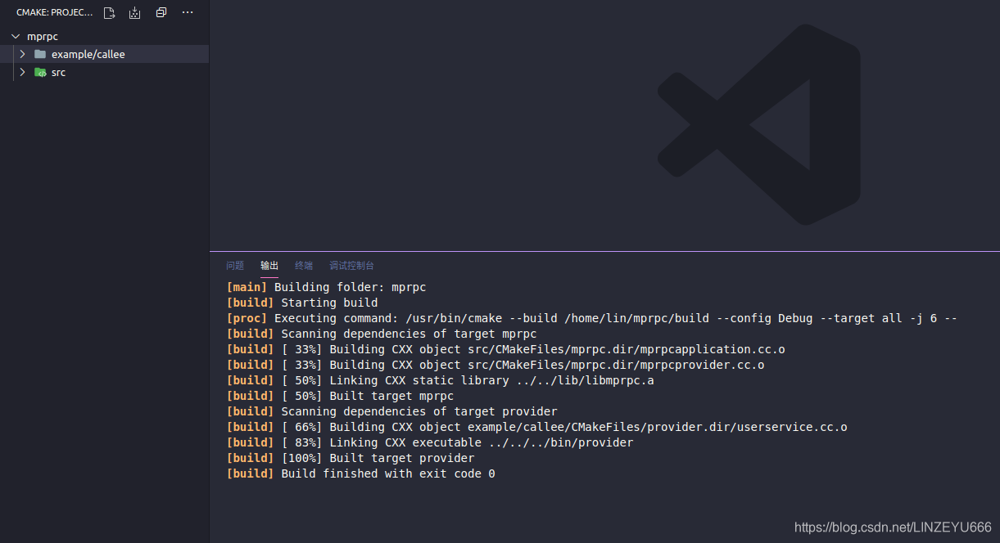
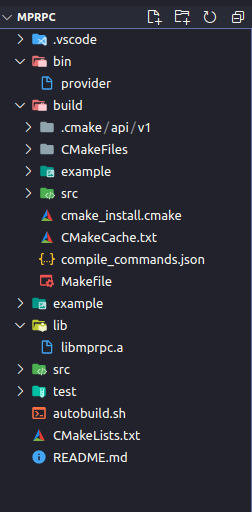

**首先完善mprpc目录下的CMakeLists.txt**  
  
**然后我们在src底下增加一个CMakeLists.txt**  


```xml
aux_source_directory(. SRC_LIST)
add_library(mprpc ${SRC_LIST})
```

  
**然后我们打开callee下的CMakeLists.txt**

```xml
set(SRC_LIST userservice.cc ../user.pb.cc)
add_executable(provider ${SRC_LIST})
target_link_libraries(provider mprpc protobuf)
```

  
**然后我们点击**  
  
  
**点击最上面中间那个键 编译**  


**编译后，我们查看项目工程列表，看看多出了什么**  
