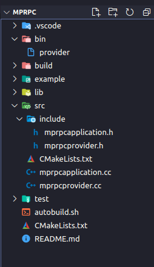
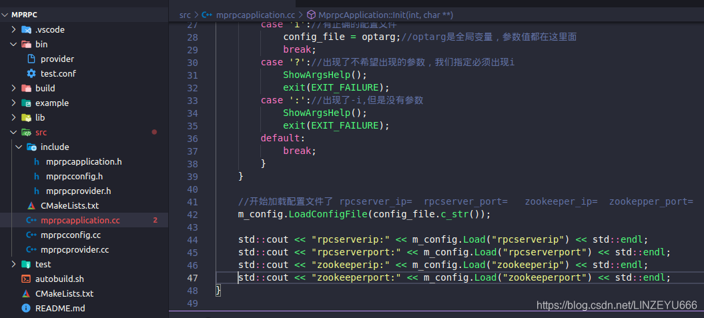
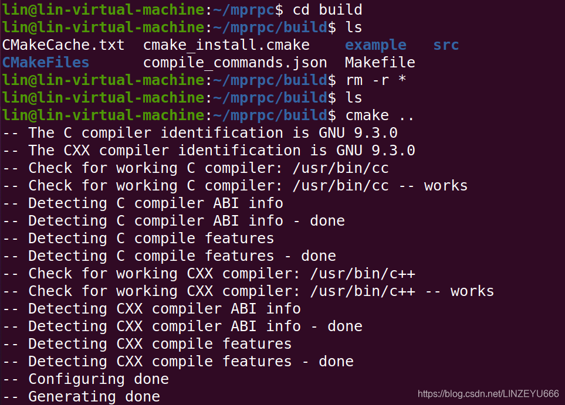
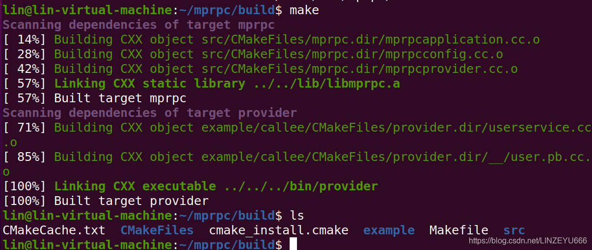
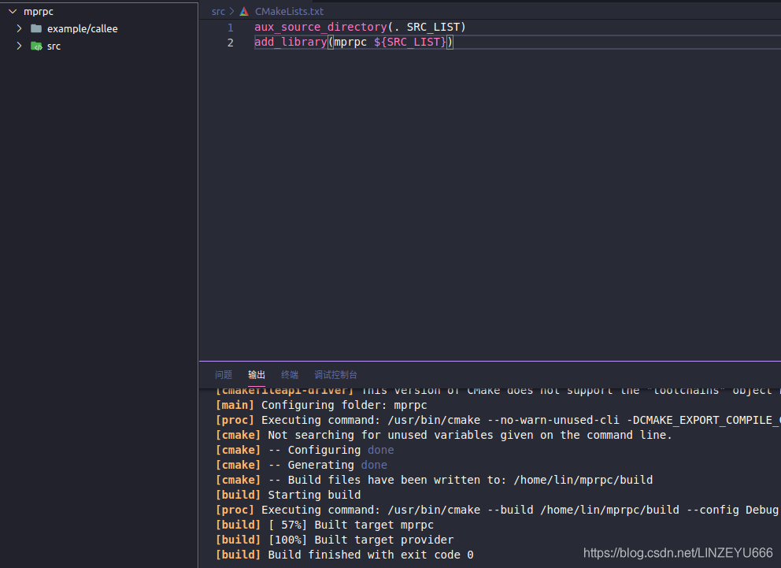
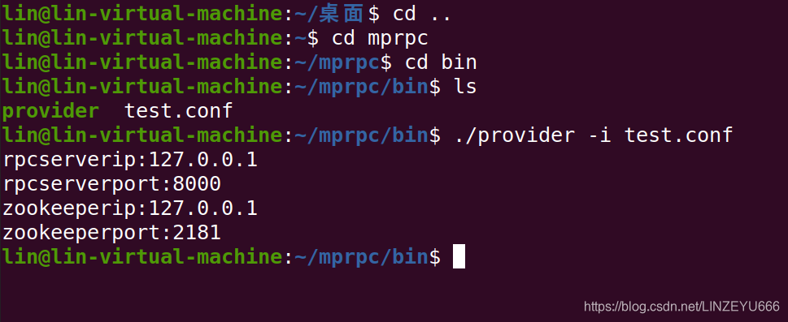
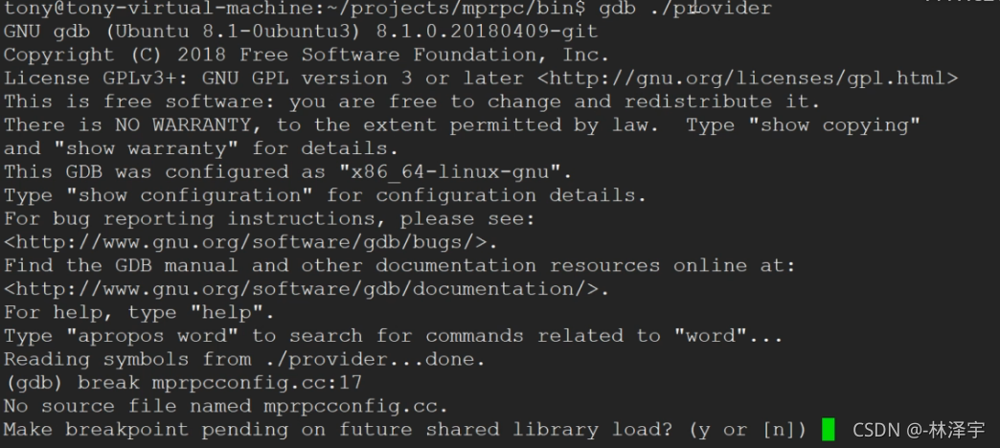
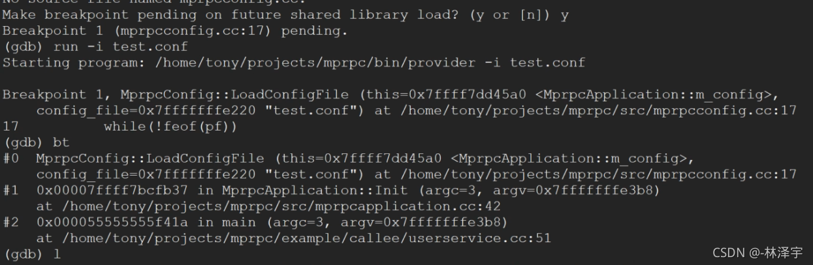

**我们先把之前的项目代码工程编译好，然后进入bin里面，执行  
./provider**  
  


**显示我们之前编的代码正确了！**  
**接下来，我们开始**



## mprpc[框架](https://so.csdn.net/so/search?q=%E6%A1%86%E6%9E%B6&spm=1001.2101.3001.7020)的配置文件加载

**我们在src的include中创建头文件：mprpcconfig.h**

```cpp
#pragma once//防止头文件被重复包含 

#include<unordered_map>//键值对，方便读取这个key值项 ，配置文件不会一直改变 
#include<string>

//用于存放rpcserverip  rpcserverport  zookeeperip zookeeperport
//框架读取配置文件类
class MprpcConfig
{
public:
    //负责解析加载配置文件
    void LoadConfigFile(const char *config_file);
    //查询配置项信息
    std::string Load(const std::string &key);//返回key所对应的值-字符串 
private:
    std::unordered_map<std::string, std::string> m_configMap;
    //去掉字符串前后的空格
    void Trim(std::string &src_buf);
};
```

**完善mprpcapplication.h**  


**完善mprpcapplication.cc**

```cpp
#include "mprpcapplication.h"
#include <iostream>
#include <unistd.h>//getopt的头文件
#include <string>

MprpcConfig MprpcApplication::m_config;

void ShowArgsHelp()
{
    std::cout<<"format: command -i <configfile>" << std::endl;//格式必须是command -i <configfile>
}

void MprpcApplication::Init(int argc, char **argv)
{
    if (argc < 2)//说明程序RPC服务站点根本没有传入任何参数
    {
        ShowArgsHelp();
        exit(EXIT_FAILURE);//退出
    }

    int c = 0;
    std::string config_file;
    while((c = getopt(argc, argv, "i:")) != -1)//我们需要-i参数，而且是必须有，所以加上：
    {
        switch (c)
        {
        case 'i'://有正确的配置文件
            config_file = optarg;//optarg是全局变量，参数值都在这里面
            break;
        case '?'://出现了不希望出现的参数，我们指定必须出现i
            ShowArgsHelp();
            exit(EXIT_FAILURE);
        case ':'://出现了-i,但是没有参数
            ShowArgsHelp();
            exit(EXIT_FAILURE);
        default:
            break;
        }
    }

    //开始加载配置文件了 rpcserver_ip=  rpcserver_port=   zookeeper_ip=  zookepper_port=
    m_config.LoadConfigFile(config_file.c_str());

    //std::cout << "rpcserverip:" << m_config.Load("rpcserverip") << std::endl;
    //std::cout << "rpcserverport:" << m_config.Load("rpcserverport") << std::endl;
    //std::cout << "zookeeperip:" << m_config.Load("zookeeperip") << std::endl;
    //std::cout << "zookeeperport:" << m_config.Load("zookeeperport") << std::endl;
}

MprpcApplication& MprpcApplication::GetInstance()//单例模式
{
    static MprpcApplication app;
    return app;
}

MprpcConfig& MprpcApplication::GetConfig()
{
    return m_config;
}
```

**我们在src下创建文件mprpcconfig.cc**

```cpp
#include "mprpcconfig.h"

#include <iostream>
#include <string>

//负责解析加载配置文件
void MprpcConfig::LoadConfigFile(const char *config_file)
{
    FILE *pf = fopen(config_file, "r");//以读的方式打开文件
    if (nullptr == pf)//该文件不存在
    {
        std::cout << config_file << " is note exist!" << std::endl;
        exit(EXIT_FAILURE);
    }

    //1.注释  2.正确的配置项 =  3.去掉开头的多余的空格 
    while(!feof(pf))//循环读取
    {
        char buf[512] = {0};
        fgets(buf, 512, pf);//读取一行

        //去掉字符串前面多余的空格
        std::string read_buf(buf);
        Trim(read_buf);

        //判断#的注释
        if (read_buf[0] == '#' || read_buf.empty())
        {
            continue;
        }

        //解析配置项
        int idx = read_buf.find('=');//找到=的下标
        if (idx == -1)
        {
            //配置项不合法
            continue;
        }

        std::string key;
        std::string value;
        key = read_buf.substr(0, idx);//分割
        Trim(key);//去掉字符串前后的空格
        // rpcserverip=127.0.0.1\n
        int endidx = read_buf.find('\n', idx);
        value = read_buf.substr(idx+1, endidx-idx-1);
        Trim(value);
        m_configMap.insert({key, value});
    }

    fclose(pf);//关闭文件
}

//查询配置项信息
std::string MprpcConfig::Load(const std::string &key)
{
    auto it = m_configMap.find(key);
    if (it == m_configMap.end())
    {
        return "";
    }
    return it->second;
}

//去掉字符串前后的空格
void MprpcConfig::Trim(std::string &src_buf)
{
    int idx = src_buf.find_first_not_of(' ');
    if (idx != -1)
    {
        // 说明字符串前面有空格
        src_buf = src_buf.substr(idx, src_buf.size()-idx);
    }
    // 去掉字符串后面多余的空格
    idx = src_buf.find_last_not_of(' ');
    if (idx != -1)
    {
        // 说明字符串后面有空格
        src_buf = src_buf.substr(0, idx+1);
    }
}
```

**我们在bin下创建一个配置文件：test.conf**

```xml
# rpc节点的ip地址
rpcserverip=127.0.0.1     
# rpc节点的port端口号
rpcserverport=8000
# zk的ip地址
zookeeperip=127.0.0.1
# zk的port端口号
zookeeperport=2181
```

## 我们来测试一下

  
**打开终端进入build**  
  
  
**打开vscode编译**  
  
**接下来我们来测试，打开终端，进入到mprpc的bin下**  


## 调试示例

  
