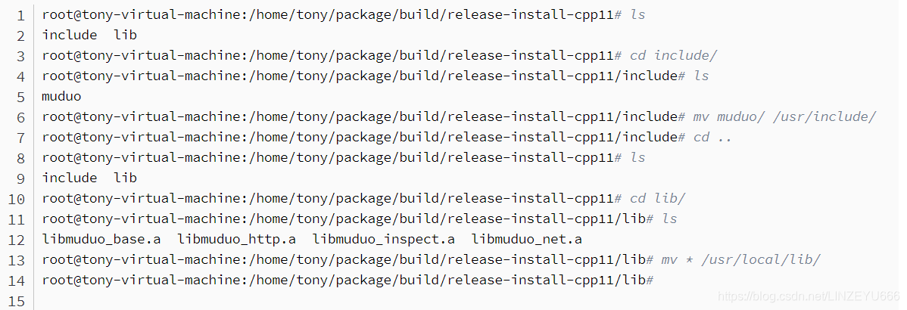
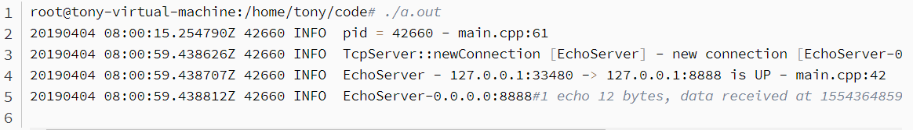
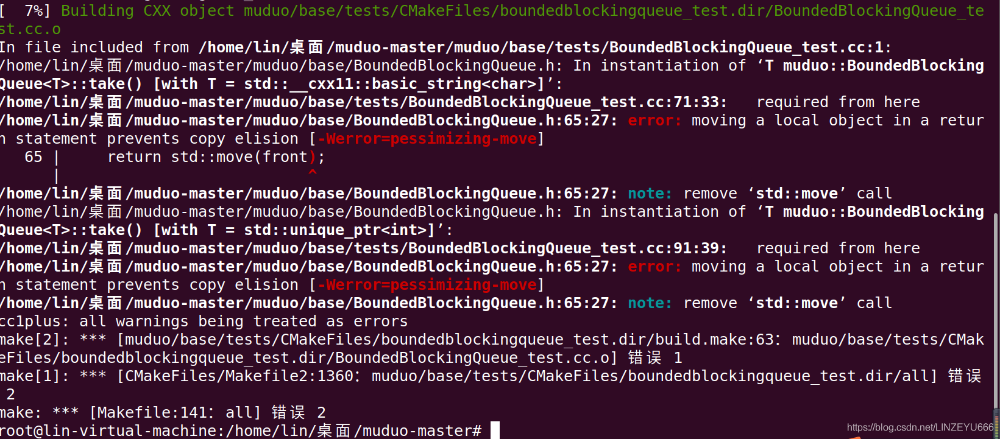

**muduo库是基于boost开发的，所以需要先在Linux平台上安装boost库。**

## [boost](https://so.csdn.net/so/search?q=boost&spm=1001.2101.3001.7020)库的安装

Boost::asio还没有正式的成为C++标准库，因此如果使用Boost::asio进行网络I/O编程，需要先在当前系统平台上（linux）安装boost库相关的头文件和lib库文件，我们采用的是boost库源码编译安装。  
WIndows和Linux平台的boost源码包下载云盘链接(zip是Windows版，**tar.gz是Linux版**，你也可以去boost官网下载最新版本)：  
**链接**：https://pan.baidu.com/s/11tNt-GNmt1xw\_fGQ-tARgA **提取码**：7yb9

**1、** 先把Linux系统下的boost源码包boost\_1\_69\_0.tar.gz拷贝到某一指定路径下，然后解压，如下：

```xml
tar -zxvf boost_1_69_0.tar.gz 
```

**2、**

```xml
cd boost_1_69_0/
```

**3、** `./bootstrap.sh`  
**4、** `./b2`  
**5、** `./b2 install`  
**验证安装boost是否成功，通过下面的代码验证一下：**

```cpp
#include <iostream>
#include <boost/bind.hpp>
#include <string>
using namespace std;

class Hello
{
public:
void say(string name) 
{ cout << name << " say: hello world!" << endl; }
};

int main()
{
Hello h;
auto func = boost::bind(&Hello::say, &h, "zhang san");
func();
return 0;
}
```

**通过g++编译上面的cpp代码，运行打印如下：**

```xml
zhang san say: hello world!
```

**至此，Linux下的boost库安装成功！**

## muduo库的安装

muduo库的介绍就是：一个基于reactor反应堆模型的多线程C++网络库。  
**muduo库源码github仓库地址：**  
https://github.com/chenshuo/muduo

**本文所使用muduo库源码云盘下载地址：**  
**链接**：https://pan.baidu.com/s/1Rqrnz8NY6UOiFemYQv-63Q **提取码**：8nio

**1.拷贝muduo的源码压缩包muduo-master.zip到Linux系统下**  
**2、**

```xml
unzip muduo-master.zip
```

**3、**

```xml
cd muduo-master
```

**4、**  
**我们执行命令：ls**  
看到有一个build.sh源码编译构建程序，运行该程序（注意：muduo是用cmake来构建的，需要先安装cmake，[ubuntu](https://so.csdn.net/so/search?q=ubuntu&spm=1001.2101.3001.7020)下直接sudo apt-get install cmake就可以，redhat或者centos可以从yum仓库直接安装）：

**拿ubuntu举例，如果没有安装cmake，执行下面的命令安装cmake：**

```xml
sudo apt-get install cmake
```

**5、  
然后执行build.sh程序：**

```xml
./build.sh
```

**6、  
编译完成后，在输入./build.sh install命令进行muduo库安装**

```xml
./build.sh install
```

**这个./build.sh install实际上把muduo的头文件和lib库文件放到了muduo-master同级目录下的build目录下的release-install-cpp11文件夹下面了：**  
  
**7、所以上面的install命令并没有把它们拷贝到系统路径下，导致我们每次编译程序都需要指定muduo库的头文件和库文件路径，很麻烦，所以我们选择直接把inlcude（头文件）和lib（库文件）目录下的文件拷贝到系统目录下：**  


**拷贝完成以后使用muduo库编写C++网络程序，不用在指定头文件和lib库文件路径信息了，因为g++会自动从/usr/include和/usr/local/lib路径下寻找所需要的文件。**

**8、写测试代码，测试muduo是否能够正常使用，如下：**  
把muduo库的头文件和lib库文件拷贝完成以后，使用muduo库编写一个简单的echo回显服务器，测试muduo库是否可以正常使用，代码如下：

```cpp
#include <muduo/net/TcpServer.h>
#include <muduo/base/Logging.h>
#include <boost/bind.hpp>
#include <muduo/net/EventLoop.h>

//使用muduo开发回显服务器
class EchoServer
{
 public:
  EchoServer(muduo::net::EventLoop* loop,
             const muduo::net::InetAddress& listenAddr);

  void start(); 

 private:
  void onConnection(const muduo::net::TcpConnectionPtr& conn);

  void onMessage(const muduo::net::TcpConnectionPtr& conn,
                 muduo::net::Buffer* buf,
                 muduo::Timestamp time);

  muduo::net::TcpServer server_;
};

EchoServer::EchoServer(muduo::net::EventLoop* loop,
                       const muduo::net::InetAddress& listenAddr)
  : server_(loop, listenAddr, "EchoServer")
{
  server_.setConnectionCallback(
      boost::bind(&EchoServer::onConnection, this, _1));
  server_.setMessageCallback(
      boost::bind(&EchoServer::onMessage, this, _1, _2, _3));
}

void EchoServer::start()
{
  server_.start();
}

void EchoServer::onConnection(const muduo::net::TcpConnectionPtr& conn)
{
  LOG_INFO << "EchoServer - " << conn->peerAddress().toIpPort() << " -> "
           << conn->localAddress().toIpPort() << " is "
           << (conn->connected() ? "UP" : "DOWN");
}

void EchoServer::onMessage(const muduo::net::TcpConnectionPtr& conn,
                           muduo::net::Buffer* buf,
                           muduo::Timestamp time)
{
  // 接收到所有的消息，然后回显
  muduo::string msg(buf->retrieveAllAsString());
  LOG_INFO << conn->name() << " echo " << msg.size() << " bytes, "
           << "data received at " << time.toString();
  conn->send(msg);
}


int main()
{
  LOG_INFO << "pid = " << getpid();
  muduo::net::EventLoop loop;
  muduo::net::InetAddress listenAddr(8888);
  EchoServer server(&loop, listenAddr);
  server.start();
  loop.loop();
}
```

**使用g++进行编译，注意链接muduo和pthread的库文件，编译命令如下：**

```xml
g++ main.cpp -lmuduo_net -lmuduo_base -lpthread -std=c++11
```

**编译链接完成，生成a.out可执行程序，上面的echo服务器监听8888端口，运行上面的a.out回显服务器如下：**

```xml
./a.out 
```

**运行结果是：**

```xml
20190404 08:00:15.254790Z 42660 INFO  pid = 42660 - main.cpp:61
```

**等待客户端连接，可以打开一个新的shell命令行用netcat命令模拟客户端连接echo服务器进行功能测试，命令如下：**

```xml
 echo "hello world" | nc localhost 8888
```

**运行结果是：**

```xml
hello world
```

**客户端数据回显正确，看看服务器接日志信息打印如下：**  
  
到此，muduo安装成功，能够正常进行C++网络程序开发！

## muduo库安装出现的问题

**我在执行./build.sh的时候，没有安装成功。**  


**这是因为我的gcc版本过高了，把警告全干成error错误了，所以编译不过。两个办法：**  
1、要么降低gcc版本到8.0以下  
2、你可以在目录下找到生成的Makefile文件，里面搜索-Werror，把这个编译标志去掉，然后继续编译。就可以了！！！