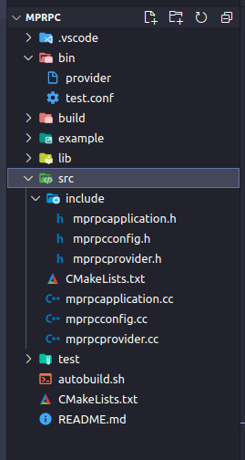
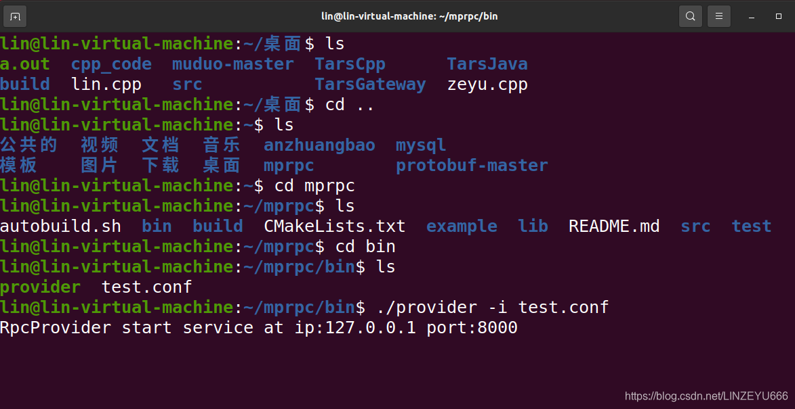

**我的项目代码工程目录如下：**  


## 开发RpcProvider的网络服务（muduo库）

**我们首先更改src的CMakeLists.txt的内容为：**

```xml
aux_source_directory(. SRC_LIST)
add_library(mprpc ${SRC_LIST})
target_link_libraries(mprpc muduo_net muduo_base pthread )
```


**我们打开mprpcprovider.h**

```cpp
#include <muduo/net/TcpServer.h>
#include <muduo/net/EventLoop.h>
#include <muduo/net/InetAddress.h>
#include <muduo/net/TcpConnection.h>
#include <string>
#include <functional>

//框架提供的专门发布rpc服务的网络对象类
class RpcProvider
{
public:
    //这里是框架提供给外部使用的，可以发布rpc方法的函数接口
    //void NotifyService(google::protobuf::Service *service);
    //框架是可以接收各种RPC服务的，不能依赖具体的某一个业务。 
    //基类指针指向子对象
    
    //启动rpc服务节点，开始提供rpc远程网络调用服务
    void Run();

private:
    //组合EventLoop
    muduo::net::EventLoop m_eventLoop;

    //新的socket连接回调
    void OnConnection(const muduo::net::TcpConnectionPtr&);
    //如果muduo库发现有读写，就做 已经建立连接用户的读写事件回调
    void OnMessage(const muduo::net::TcpConnectionPtr&, muduo::net::Buffer*, muduo::Timestamp);
};
```

**我们打开mprpcprovider.cc**

```cpp
#include "rpcprovider.h"
#include "mprpcapplication.h"
#include  <iostream>

//启动rpc服务节点，开始提供rpc远程网络调用服务
void RpcProvider::Run()
{
    //读取配置文件rpcserver的信息
    std::string ip = MprpcApplication::GetInstance().GetConfig().Load("rpcserverip");//ip
    uint16_t port = atoi(MprpcApplication::GetInstance().GetConfig().Load("rpcserverport").c_str());//port，因为atoi返回char *，所以要c_str()
    muduo::net::InetAddress address(ip, port);

    //创建TcpServer对象
    muduo::net::TcpServer server(&m_eventLoop, address, "RpcProvider");

    //绑定连接回调和消息读写回调方法 ，muduo库的好处是：分离了网络代码和业务代码
    server.setConnectionCallback(std::bind(&RpcProvider::OnConnection, this, std::placeholders::_1));//预留1个参数std::placeholders::_1
    server.setMessageCallback(std::bind(&RpcProvider::OnMessage, this, std::placeholders::_1, 
            std::placeholders::_2, std::placeholders::_3));//预留3个参数std::placeholders::_1,2,3

    //设置muduo库的线程数量
    server.setThreadNum(4);//1个是I/O线程，3个是工作线程

    //rpc服务端准备启动，打印信息
    std::cout << "RpcProvider start service at ip:" << ip << " port:" << port << std::endl;
    
    //启动网络服务
    server.start();
    m_eventLoop.loop();//相当于启动了epoll_wait，阻塞，等待远程连接
}

//新的socket连接回调
void RpcProvider::OnConnection(const muduo::net::TcpConnectionPtr &conn)
{
    
}


//已建立连接用户的读写事件回调 ，如果远程有一个rpc服务的调用请求，那么OnMessage方法就会响应
void RpcProvider::OnMessage(const muduo::net::TcpConnectionPtr &conn, 
                            muduo::net::Buffer *buffer, 
                            muduo::Timestamp)
{
  
}
```

**编译成功！！！**  
  
**我们去执行一下**  


**启动成功，在等待远端的rpc请求**

**用户怎么去注册可以支持的rpc服务呢？我们怎么去存储rpc服务呢？**  
**且听下回分解**