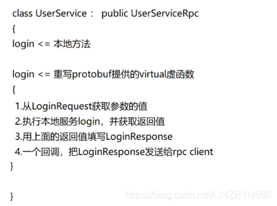
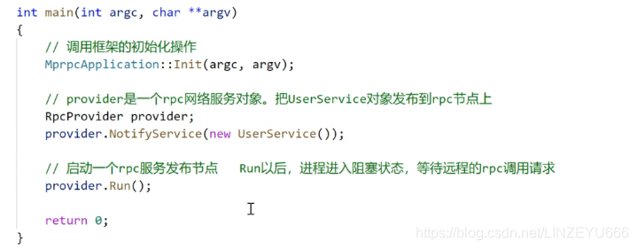
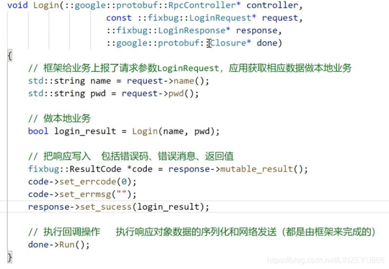
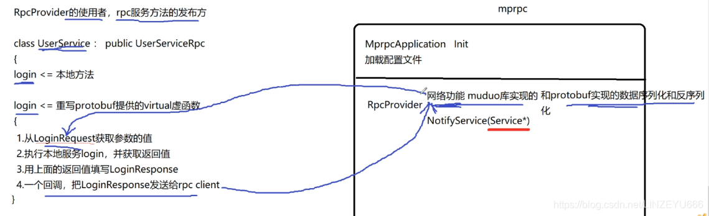
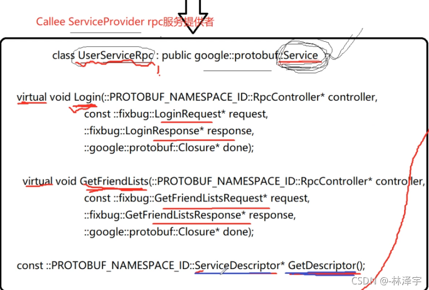
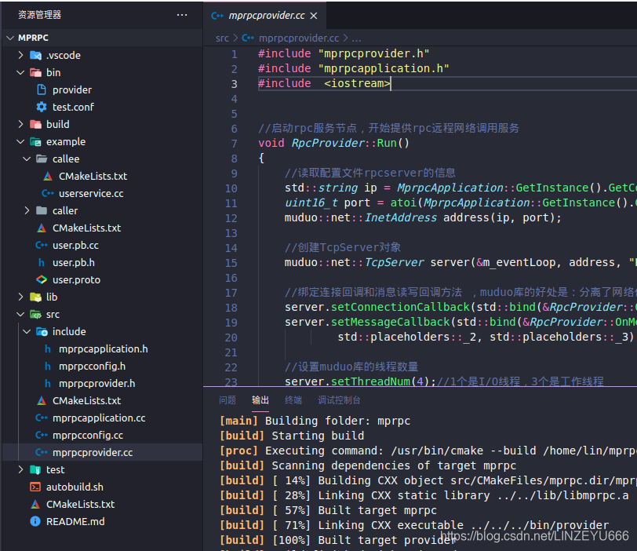
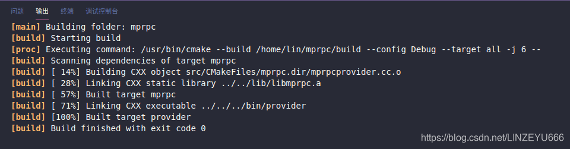
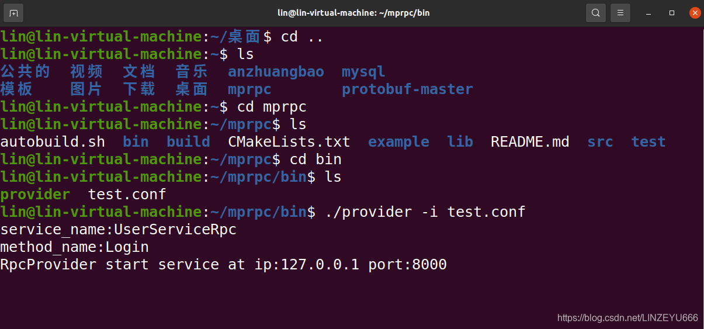

  
**我目前完成了mprpc框架项目中的以上的功能。**

**我作为rpcprovider的使用者，也就是rpc方法的发布方，**

  
**main函数如下：**  
  
**首先**我们init调用[框架](https://so.csdn.net/so/search?q=%E6%A1%86%E6%9E%B6&spm=1001.2101.3001.7020)的init，然后启动一个provider，然后向provider上注册服务对象方法，即userservice的login方法，当做一个可以远程调用的rpc方法，然后启动run，run相当于是一个网络服务器。  
**首先**，如果远端有[RPC](https://so.csdn.net/so/search?q=RPC&spm=1001.2101.3001.7020)请求的话，RpcProvider的网络模块（muduo）会帮助我们去接收数据，就是接收一个RPC请求，RPC请求里面有函数名，函数参数。RpcProvider先把这个请求上报到LoginRequest。我们作为用户，不管底层是怎么进行网络收发（muduo库完成），不管怎么把网络上的字节流反序列化成具体的LoginRequest的数据（protobuf完成），我们只管最后去使用就可以了。

  
**最后，我们又把响应的结果送给protobuf，RpcProvider首先通过protobuf进行对响应的结果 序列化，然后通过muduo库发送出去。**  


所以，接下去我们要完成：**框架的RpcProvider从网络上接收一个RPC调用请求时，他怎么知道要调用应用程序的哪个服务对象的哪个RPC方法呢？**

**我们将要实现NotifyService的：**  
需要生成**一张表**，记录服务对象和发布的所有服务方法。  
**比如说**：UserService 发布了Login , Register等方法  
FriendService发布了AddFriend，DelFriend，GetFriendList等方法  
**使用protobuf的好处：这些Service都是继承了protobuf的Service类，方法都是继承protobuf的Method类。**  
而且，我们用户不知道什么时候调用Login，框架才知道，有人请求，框架才调用，因为我们是作为服务方。  
  
当远端有RPC有请求过来时，RpcProvider就可以在这张表查调用的是哪个对象的哪个方法，它就去调用了。

## 开发RpcProvider的发布服务NotifyService



**我们开始完善mprpcprovider.cc**

```cpp
#include "mprpcprovider.h"
#include "mprpcapplication.h"

/*
service_name =>对于 service描述   
                        =》对应 service* 记录服务对象
                        多个method_name  =>对应多个method方法对象
*/
//这里是框架提供给外部使用的，可以发布rpc方法的函数接口
void RpcProvider::NotifyService(google::protobuf::Service *service)
{
    ServiceInfo service_info;//结构体

    //获取了服务对象的描述信息
    const google::protobuf::ServiceDescriptor *pserviceDesc = service->GetDescriptor();
//因为返回类型是指针。获取服务对象的描述信息。存储名字之类的。

    //获取服务的名字
    std::string service_name = pserviceDesc->name();
    //获取服务对象service的方法的数量
    int methodCnt = pserviceDesc->method_count();

    std::cout << "service_name:" << service_name << std::endl;

    for (int i=0; i < methodCnt; ++i)
    {
        //获取了服务对象指定下标的服务方法的描述（抽象的描述） UserService   Login
        const google::protobuf::MethodDescriptor* pmethodDesc = pserviceDesc->method(i);
        std::string method_name = pmethodDesc->name();
        service_info.m_methodMap.insert({method_name, pmethodDesc});//插入键值对到map中

        std::cout<<"method_name:"<<method_name<<std::endl;//打印
    }
    service_info.m_service = service;//记录服务对象
    m_serviceMap.insert({service_name, service_info});//存储一下服务及其具体的描述
}


//启动rpc服务节点，开始提供rpc远程网络调用服务
void RpcProvider::Run()
{
    //读取配置文件rpcserver的信息
    std::string ip = MprpcApplication::GetInstance().GetConfig().Load("rpcserverip");//ip
    uint16_t port = atoi(MprpcApplication::GetInstance().GetConfig().Load("rpcserverport").c_str());//port，因为atoi返回char *，所以要c_str()
    muduo::net::InetAddress address(ip, port);

    //创建TcpServer对象
    muduo::net::TcpServer server(&m_eventLoop, address, "RpcProvider");

    //绑定连接回调和消息读写回调方法 ，muduo库的好处是：分离了网络代码和业务代码
    server.setConnectionCallback(std::bind(&RpcProvider::OnConnection, this, std::placeholders::_1));//预留1个参数std::placeholders::_1
    server.setMessageCallback(std::bind(&RpcProvider::OnMessage, this, std::placeholders::_1, 
            std::placeholders::_2, std::placeholders::_3));//预留3个参数std::placeholders::_1,2,3

    //设置muduo库的线程数量
    server.setThreadNum(4);//1个是I/O线程，3个是工作线程

    //rpc服务端准备启动，打印信息
    std::cout << "RpcProvider start service at ip:" << ip << " port:" << port << std::endl;
    
    //启动网络服务
    server.start();
    m_eventLoop.loop();//相当于启动了epoll_wait，阻塞，等待远程连接
}

//新的socket连接回调
void RpcProvider::OnConnection(const muduo::net::TcpConnectionPtr &conn)
{
    
}


//已建立连接用户的读写事件回调 ，如果远程有一个rpc服务的调用请求，那么OnMessage方法就会响应
void RpcProvider::OnMessage(const muduo::net::TcpConnectionPtr &conn, 
                            muduo::net::Buffer *buffer, 
                            muduo::Timestamp)
{
  
}
```

**我们开始完善mprpcprovider.h**

```cpp
#pragma once
#include "google/protobuf/service.h"
#include <muduo/net/TcpServer.h>
#include <muduo/net/EventLoop.h>
#include <muduo/net/InetAddress.h>
#include <muduo/net/TcpConnection.h>
#include <string>
#include <functional>
#include <google/protobuf/descriptor.h>
#include <unordered_map>

//框架提供的专门发布rpc服务的网络对象类
class RpcProvider
{
public:
    //这里是框架提供给外部使用的，可以发布rpc方法的函数接口
    void NotifyService(google::protobuf::Service *service);
    //框架是可以接收各种RPC服务的，不能依赖具体的某一个业务。 
    //基类指针指向子对象
    
    //启动rpc服务节点，开始提供rpc远程网络调用服务
    void Run();

private:
    //组合EventLoop
    muduo::net::EventLoop m_eventLoop;
    //service服务类型信息
    struct ServiceInfo
    {
        google::protobuf::Service *m_service; //保存服务对象
        std::unordered_map<std::string, const google::protobuf::MethodDescriptor*> m_methodMap;//保存服务方法
    };
    //存储注册成功的服务对象和其服务方法的所有信息
    std::unordered_map<std::string, ServiceInfo> m_serviceMap;
    
    //新的socket连接回调
    void OnConnection(const muduo::net::TcpConnectionPtr&);
    //如果muduo库发现有读写，就做 已经建立连接用户的读写事件回调
    void OnMessage(const muduo::net::TcpConnectionPtr&, muduo::net::Buffer*, muduo::Timestamp);
};
```

**编译成功**  


**我们打开终端去执行**  
  
**protobuf提供了serviceRPC方法的描述，service类，method类，从抽象的层面描述服务对象，服务方法，到时候，由底层就直接可以用上层的服务方法了。notifyservice就是发布rpc服务的站点**