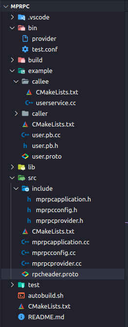

## 完善mprpcprovider.cc的OnConnection

**rpc的请求是短连接的，请求一次完了，服务端返回rpc的方法的响应，就主动关闭连接了。**

```cpp
//新的socket连接回调
void RpcProvider::OnConnection(const muduo::net::TcpConnectionPtr &conn)
{
    if (!conn->connected())
    {
        //和rpc client的连接断开了
        conn->shutdown();//关闭文件描述符 
    }
}
```

## 完善mprpcprovider.cc的OnMessage

在框架内部，RpcProvider和RpcConsumer协商好之间通信用的**protobuf**数据类型  
**怎么商量呢？**  
**包含**：service\_name method\_name args  


**对应**：16UserService Login zhang san123456  
我们在框架中定义proto的message类型，进行数据头的序列化和反序列化  
**service\_name method\_name args\_size(防止粘包的问题)**

**怎么去区分哪个是service\_name, method\_name, args**  
**我们把消息头表示出来**  
header\_size(4个字节) + header\_str + args\_str  
**前面几个字节是服务名和方法名。**  
**为了防止粘包，我们还要记录参数的字符串的长度**  
**我们统一：一开始读4个字节，数据头的长度，也就是除了方法参数之外的所有数据：服务名字和方法名字**

10 “10”  
10000 “1000000”  
**我们要用到std::string insert和copy方法**  
把header\_size按照内存的方式二进制的形式直接存4个字节。  
**所以，我们从字符流解析是按：数据头(4字节大小，表示service\_name method\_name args\_size的长度）+service\_name method\_name args\_size(防止粘包的问题)+args(参数）**  
**我们在src里面创建rpcheader.proto文件**  


```xml
syntax = "proto3";

package mprpc;

message RpcHeader
{
    bytes service_name = 1;//服务的名字
    bytes method_name = 2;//方法的名字
    uint32 args_size = 3;//参数的大小长度
}
```

  
**我们打开终端，进入到src下，执行命令。**  


## 我们新增mprpcprovider.cc的OnMessage内容

```cpp
/*
在框架内部，RpcProvider和RpcConsumer协商好之间通信用的protobuf数据类型
怎么商量呢？ 
包含：service_name  method_name   args   
对应：16UserService   Login    zhang san123456   
我们在框架中定义proto的message类型，进行数据头的序列化和反序列化
service_name method_name args_size(防止粘包的问题) 

怎么去区分哪个是service_name, method_name, args
我们把消息头表示出来 
header_size(4个字节) + header_str + args_str
前面几个字节是服务名和方法名。 
为了防止粘包，我们还要记录参数的字符串的长度 
我们统一：一开始读4个字节，数据头的长度，也就是除了方法参数之外的所有数据：服务名字和方法名字 
10 "10"
10000 "1000000"
std::string   insert和copy方法 
*/

//已建立连接用户的读写事件回调,如果远程有一个rpc服务的调用请求，那么OnMessage方法就会响应
void RpcProvider::OnMessage(const muduo::net::TcpConnectionPtr &conn, 
                            muduo::net::Buffer *buffer, 
                            muduo::Timestamp)
{
    //网络上接收的远程rpc调用请求的字符流 包含了RPC方法的名字Login和参数args
    std::string recv_buf = buffer->retrieveAllAsString();

    //从字符流中读取前4个字节的内容
    uint32_t header_size = 0;
    recv_buf.copy((char*)&header_size, 4, 0);//从0下标位置拷贝4个字节的内容到header_size 

    std::string rpc_header_str = recv_buf.substr(4, header_size);
//从第4个下标，前4个字节略过。读取包含了service_name method_name args_size 
//根据header_size读取数据头的原始字符流，反序列化数据，得到rpc请求的详细信息
    mprpc::RpcHeader rpcHeader;
    std::string service_name;
    std::string method_name;
    uint32_t args_size;
    if (rpcHeader.ParseFromString(rpc_header_str))
    {
        //数据头反序列化成功
        service_name = rpcHeader.service_name();
        method_name = rpcHeader.method_name();
        args_size = rpcHeader.args_size();
    }
    else
    {
        //数据头反序列化失败
        std::cout << "rpc_header_str:" << rpc_header_str << " parse error!" << std::endl;
        return;//不用往后走了 
    }

    //获取rpc方法参数的字符流数据
    std::string args_str = recv_buf.substr(4 + header_size, args_size);
    //header_size(4个字节) + header_str + args_str

    //打印调试信息
    std::cout << "============================================" << std::endl;
    std::cout << "header_size: " << header_size << std::endl; 
    std::cout << "rpc_header_str: " << rpc_header_str << std::endl; 
    std::cout << "service_name: " << service_name << std::endl; 
    std::cout << "method_name: " << method_name << std::endl; 
    std::cout << "args_str: " << args_str << std::endl; 
    std::cout << "============================================" << std::endl;

}
```

**目前mprpcprovider.cc的完整代码如下：**

```cpp
#include "mprpcprovider.h"
#include "mprpcapplication.h"
#include "rpcheader.pb.h" 

/*
service_name =>对于 service描述   
                        =》对应 service* 记录服务对象
                        多个method_name  =>对应多个method方法对象
*/
//这里是框架提供给外部使用的，可以发布rpc方法的函数接口
void RpcProvider::NotifyService(google::protobuf::Service *service)
{
    ServiceInfo service_info;//结构体

    //获取了服务对象的描述信息
    const google::protobuf::ServiceDescriptor *pserviceDesc = service->GetDescriptor();
//因为返回类型是指针。获取服务对象的描述信息。存储名字之类的。

    //获取服务的名字
    std::string service_name = pserviceDesc->name();
    //获取服务对象service的方法的数量
    int methodCnt = pserviceDesc->method_count();

    std::cout << "service_name:" << service_name << std::endl;

    for (int i=0; i < methodCnt; ++i)
    {
        //获取了服务对象指定下标的服务方法的描述（抽象的描述） UserService   Login
        const google::protobuf::MethodDescriptor* pmethodDesc = pserviceDesc->method(i);
        std::string method_name = pmethodDesc->name();
        service_info.m_methodMap.insert({method_name, pmethodDesc});//插入键值对到map中

        std::cout<<"method_name:"<<method_name<<std::endl;//打印
    }
    service_info.m_service = service;//记录服务对象
    m_serviceMap.insert({service_name, service_info});//存储一下服务及其具体的描述
}


//启动rpc服务节点，开始提供rpc远程网络调用服务
void RpcProvider::Run()
{
    //读取配置文件rpcserver的信息
    std::string ip = MprpcApplication::GetInstance().GetConfig().Load("rpcserverip");//ip
    uint16_t port = atoi(MprpcApplication::GetInstance().GetConfig().Load("rpcserverport").c_str());//port，因为atoi返回char *，所以要c_str()
    muduo::net::InetAddress address(ip, port);

    //创建TcpServer对象
    muduo::net::TcpServer server(&m_eventLoop, address, "RpcProvider");

    //绑定连接回调和消息读写回调方法 ，muduo库的好处是：分离了网络代码和业务代码
    server.setConnectionCallback(std::bind(&RpcProvider::OnConnection, this, std::placeholders::_1));//预留1个参数std::placeholders::_1
    server.setMessageCallback(std::bind(&RpcProvider::OnMessage, this, std::placeholders::_1, 
            std::placeholders::_2, std::placeholders::_3));//预留3个参数std::placeholders::_1,2,3

    //设置muduo库的线程数量
    server.setThreadNum(4);//1个是I/O线程，3个是工作线程

    //rpc服务端准备启动，打印信息
    std::cout << "RpcProvider start service at ip:" << ip << " port:" << port << std::endl;
    
    //启动网络服务
    server.start();
    m_eventLoop.loop();//相当于启动了epoll_wait，阻塞，等待远程连接
}

//新的socket连接回调
void RpcProvider::OnConnection(const muduo::net::TcpConnectionPtr &conn)
{
    if (!conn->connected())
    {
        //和rpc client的连接断开了
        conn->shutdown();//关闭文件描述符 
    }
}

/*
在框架内部，RpcProvider和RpcConsumer协商好之间通信用的protobuf数据类型
怎么商量呢？ 
包含：service_name  method_name   args   
对应：16UserService   Login    zhang san123456   
我们在框架中定义proto的message类型，进行数据头的序列化和反序列化
service_name method_name args_size(防止粘包的问题) 

怎么去区分哪个是service_name, method_name, args
我们把消息头表示出来 
header_size(4个字节) + header_str + args_str
前面几个字节是服务名和方法名。 
为了防止粘包，我们还要记录参数的字符串的长度 
我们统一：一开始读4个字节，数据头的长度，也就是除了方法参数之外的所有数据：服务名字和方法名字 
10 "10"
10000 "1000000"
std::string   insert和copy方法 
*/

//已建立连接用户的读写事件回调,如果远程有一个rpc服务的调用请求，那么OnMessage方法就会响应
void RpcProvider::OnMessage(const muduo::net::TcpConnectionPtr &conn, 
                            muduo::net::Buffer *buffer, 
                            muduo::Timestamp)
{
    //网络上接收的远程rpc调用请求的字符流 包含了RPC方法的名字Login和参数args
    std::string recv_buf = buffer->retrieveAllAsString();

    //从字符流中读取前4个字节的内容
    uint32_t header_size = 0;
    recv_buf.copy((char*)&header_size, 4, 0);//从0下标位置拷贝4个字节的内容到header_size 

    std::string rpc_header_str = recv_buf.substr(4, header_size);
//从第4个下标，前4个字节略过。读取包含了service_name method_name args_size 
//根据header_size读取数据头的原始字符流，反序列化数据，得到rpc请求的详细信息
    mprpc::RpcHeader rpcHeader;
    std::string service_name;
    std::string method_name;
    uint32_t args_size;
    if (rpcHeader.ParseFromString(rpc_header_str))
    {
        //数据头反序列化成功
        service_name = rpcHeader.service_name();
        method_name = rpcHeader.method_name();
        args_size = rpcHeader.args_size();
    }
    else
    {
        //数据头反序列化失败
        std::cout << "rpc_header_str:" << rpc_header_str << " parse error!" << std::endl;
        return;//不用往后走了 
    }

    //获取rpc方法参数的字符流数据
    std::string args_str = recv_buf.substr(4 + header_size, args_size);
    //header_size(4个字节) + header_str + args_str

    //打印调试信息
    std::cout << "============================================" << std::endl;
    std::cout << "header_size: " << header_size << std::endl; 
    std::cout << "rpc_header_str: " << rpc_header_str << std::endl; 
    std::cout << "service_name: " << service_name << std::endl; 
    std::cout << "method_name: " << method_name << std::endl; 
    std::cout << "args_str: " << args_str << std::endl; 
    std::cout << "============================================" << std::endl;

}
```

## 我们修改一下src的CMakeLists.txt

```xml
#aux_source_directory(. SRC_LIST)
set(SRC_LIST 
    mprpcapplication.cc 
    mprpcconfig.cc 
    rpcheader.pb.cc 
    mprpcprovider.cc 
)
add_library(mprpc ${SRC_LIST})
target_link_libraries(mprpc muduo_net muduo_base pthread )
```

**编译成功。**  
  
**为什么我们要修改CMakeLists.txt？**  
因为我们刚才proto生成了.cc文件，当前CMakeLists.txt识别不了。如果不修改成现在的样式，我们得到终端命令行的build里面，把文件全部删除，然后执行`cmake ..`  
和`make`

## 彻底完善好mprpcprovider.h

```cpp
#pragma once
#include "google/protobuf/service.h"
#include <muduo/net/TcpServer.h>
#include <muduo/net/EventLoop.h>
#include <muduo/net/InetAddress.h>
#include <muduo/net/TcpConnection.h>
#include <string>
#include <functional>
#include <google/protobuf/descriptor.h>
#include <unordered_map>

//框架提供的专门发布rpc服务的网络对象类
class RpcProvider
{
public:
    //这里是框架提供给外部使用的，可以发布rpc方法的函数接口
    void NotifyService(google::protobuf::Service *service);
    //框架是可以接收各种RPC服务的，不能依赖具体的某一个业务。 
    //基类指针指向子对象
    
    //启动rpc服务节点，开始提供rpc远程网络调用服务
    void Run();

private:
    //组合EventLoop
    muduo::net::EventLoop m_eventLoop;
    //service服务类型信息
    struct ServiceInfo
    {
        google::protobuf::Service *m_service; //保存服务对象
        std::unordered_map<std::string, const google::protobuf::MethodDescriptor*> m_methodMap;//保存服务方法
    };
    //存储注册成功的服务对象和其服务方法的所有信息
    std::unordered_map<std::string, ServiceInfo> m_serviceMap;
    
    //新的socket连接回调
    void OnConnection(const muduo::net::TcpConnectionPtr&);
    //如果muduo库发现有读写，就做 已经建立连接用户的读写事件回调
    void OnMessage(const muduo::net::TcpConnectionPtr&, muduo::net::Buffer*, muduo::Timestamp);
    //Closure的回调操作，用于序列化rpc的响应和网络发送
    void SendRpcResponse(const muduo::net::TcpConnectionPtr&, google::protobuf::Message*);
};
```

## 彻底完善好mprpcprovider.cc（获取service对象和method对象，Closure[回调](https://so.csdn.net/so/search?q=%E5%9B%9E%E8%B0%83&spm=1001.2101.3001.7020)）

```cpp
#include "mprpcprovider.h"
#include "mprpcapplication.h"
#include "rpcheader.pb.h" 

/*
service_name =>对于 service描述   
                        =》对应 service* 记录服务对象
                        多个method_name  =>对应多个method方法对象
*/
//这里是框架提供给外部使用的，可以发布rpc方法的函数接口
void RpcProvider::NotifyService(google::protobuf::Service *service)
{
    ServiceInfo service_info;//结构体

    //获取了服务对象的描述信息
    const google::protobuf::ServiceDescriptor *pserviceDesc = service->GetDescriptor();
//因为返回类型是指针。获取服务对象的描述信息。存储名字之类的。

    //获取服务的名字
    std::string service_name = pserviceDesc->name();
    //获取服务对象service的方法的数量
    int methodCnt = pserviceDesc->method_count();

    std::cout << "service_name:" << service_name << std::endl;

    for (int i=0; i < methodCnt; ++i)
    {
        //获取了服务对象指定下标的服务方法的描述（抽象的描述） UserService   Login
        const google::protobuf::MethodDescriptor* pmethodDesc = pserviceDesc->method(i);
        std::string method_name = pmethodDesc->name();
        service_info.m_methodMap.insert({method_name, pmethodDesc});//插入键值对到map中

        std::cout<<"method_name:"<<method_name<<std::endl;//打印
    }
    service_info.m_service = service;//记录服务对象
    m_serviceMap.insert({service_name, service_info});//存储一下服务及其具体的描述
}


//启动rpc服务节点，开始提供rpc远程网络调用服务
void RpcProvider::Run()
{
    //读取配置文件rpcserver的信息
    std::string ip = MprpcApplication::GetInstance().GetConfig().Load("rpcserverip");//ip
    uint16_t port = atoi(MprpcApplication::GetInstance().GetConfig().Load("rpcserverport").c_str());//port，因为atoi返回char *，所以要c_str()
    muduo::net::InetAddress address(ip, port);

    //创建TcpServer对象
    muduo::net::TcpServer server(&m_eventLoop, address, "RpcProvider");

    //绑定连接回调和消息读写回调方法 ，muduo库的好处是：分离了网络代码和业务代码
    server.setConnectionCallback(std::bind(&RpcProvider::OnConnection, this, std::placeholders::_1));//预留1个参数std::placeholders::_1
    server.setMessageCallback(std::bind(&RpcProvider::OnMessage, this, std::placeholders::_1, 
            std::placeholders::_2, std::placeholders::_3));//预留3个参数std::placeholders::_1,2,3

    //设置muduo库的线程数量
    server.setThreadNum(4);//1个是I/O线程，3个是工作线程

    //rpc服务端准备启动，打印信息
    std::cout << "RpcProvider start service at ip:" << ip << " port:" << port << std::endl;
    
    //启动网络服务
    server.start();
    m_eventLoop.loop();//相当于启动了epoll_wait，阻塞，等待远程连接
}

//新的socket连接回调
void RpcProvider::OnConnection(const muduo::net::TcpConnectionPtr &conn)
{
    if (!conn->connected())
    {
        //和rpc client的连接断开了
        conn->shutdown();//关闭文件描述符 
    }
}

/*
在框架内部，RpcProvider和RpcConsumer协商好之间通信用的protobuf数据类型
怎么商量呢？ 
包含：service_name  method_name   args   
对应：16UserService   Login    zhang san123456   
我们在框架中定义proto的message类型，进行数据头的序列化和反序列化
service_name method_name args_size(防止粘包的问题) 

怎么去区分哪个是service_name, method_name, args
我们把消息头表示出来 
header_size(4个字节) + header_str + args_str
前面几个字节是服务名和方法名。 
为了防止粘包，我们还要记录参数的字符串的长度 
我们统一：一开始读4个字节，数据头的长度，也就是除了方法参数之外的所有数据：服务名字和方法名字 
10 "10"
10000 "1000000"
std::string   insert和copy方法 
*/

//已建立连接用户的读写事件回调,如果远程有一个rpc服务的调用请求，那么OnMessage方法就会响应
void RpcProvider::OnMessage(const muduo::net::TcpConnectionPtr &conn, 
                            muduo::net::Buffer *buffer, 
                            muduo::Timestamp)
{
    //网络上接收的远程rpc调用请求的字符流 包含了RPC方法的名字Login和参数args
    std::string recv_buf = buffer->retrieveAllAsString();

    //从字符流中读取前4个字节的内容
    uint32_t header_size = 0;
    recv_buf.copy((char*)&header_size, 4, 0);//从0下标位置拷贝4个字节的内容到header_size 

    std::string rpc_header_str = recv_buf.substr(4, header_size);
//从第4个下标，前4个字节略过。读取包含了service_name method_name args_size 
//根据header_size读取数据头的原始字符流，反序列化数据，得到rpc请求的详细信息
    mprpc::RpcHeader rpcHeader;
    std::string service_name;
    std::string method_name;
    uint32_t args_size;
    if (rpcHeader.ParseFromString(rpc_header_str))
    {
        //数据头反序列化成功
        service_name = rpcHeader.service_name();
        method_name = rpcHeader.method_name();
        args_size = rpcHeader.args_size();
    }
    else
    {
        //数据头反序列化失败
        std::cout << "rpc_header_str:" << rpc_header_str << " parse error!" << std::endl;
        return;//不用往后走了 
    }

    //获取rpc方法参数的字符流数据
    std::string args_str = recv_buf.substr(4 + header_size, args_size);
    //header_size(4个字节) + header_str + args_str

    //打印调试信息
    std::cout << "============================================" << std::endl;
    std::cout << "header_size: " << header_size << std::endl; 
    std::cout << "rpc_header_str: " << rpc_header_str << std::endl; 
    std::cout << "service_name: " << service_name << std::endl; 
    std::cout << "method_name: " << method_name << std::endl; 
    std::cout << "args_str: " << args_str << std::endl; 
    std::cout << "============================================" << std::endl;
     
    //获取service对象和method对象
    auto it = m_serviceMap.find(service_name);//用[]会有副作用 
    if (it == m_serviceMap.end())//根本没有的服务 
    {
        std::cout << service_name << " is not exist!" << std::endl;
        return;
    }

    auto mit = it->second.m_methodMap.find(method_name);
    if (mit == it->second.m_methodMap.end())//服务里没有这个方法 
    {
        std::cout << service_name << ":" << method_name << " is not exist!" << std::endl;
        return;
    }

    google::protobuf::Service *service = it->second.m_service;//获取service对象  对应的就是像new UserService这种 
    const google::protobuf::MethodDescriptor *method = mit->second;//获取method对象 对应的是像Login这种 

    //生成rpc方法调用的请求request和响应response参数
    google::protobuf::Message *request = service->GetRequestPrototype(method).New();
//在框架以抽象的方式表示。new生成新对象，传给userservice 

    if (!request->ParseFromString(args_str))//解析 
    {
        std::cout << "request parse error, content:" << args_str << std::endl;
        return;
    }
    google::protobuf::Message *response = service->GetResponsePrototype(method).New();//响应 

    //CallMethod需要closure参数
//给下面的method方法的调用，绑定一个Closure的回调函数
    google::protobuf::Closure *done = google::protobuf::NewCallback<RpcProvider, 
                                                                    const muduo::net::TcpConnectionPtr&, 
                                                                    google::protobuf::Message*>
                                                                    (this, 
                                                                    &RpcProvider::SendRpcResponse, 
                                                                    conn, response);

    //在框架上根据远端rpc请求，调用当前rpc节点上发布的方法
    
    service->CallMethod(method, nullptr, request, response, done);//做完本地业务，根据结果写好reponse给框架，框架再给调用方 
    //相当于new UserService().Login(controller, request, response, done)
}

//Closure的回调操作，用于序列化rpc的响应和网络发送
void RpcProvider::SendRpcResponse(const muduo::net::TcpConnectionPtr& conn, google::protobuf::Message *response)
{
    std::string response_str;
    if (response->SerializeToString(&response_str))//对response进行序列化
    {
        //序列化成功后，通过网络把rpc方法执行的结果发送会rpc的调用方
        conn->send(response_str);
    }
    else//序列化失败
    {
        std::cout << "serialize response_str error!" << std::endl; 
    }
    conn->shutdown(); //模拟http的短链接服务，由rpcprovider主动断开连接，给更多的rpc调用方提供服务
}
```

**编译成功**  
  
