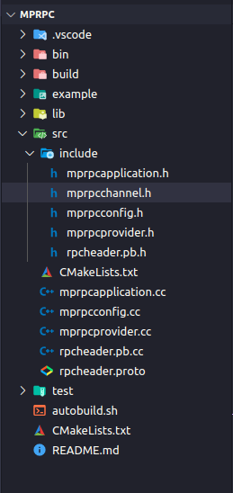
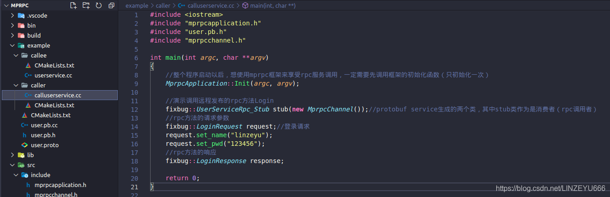

## [RPC](https://so.csdn.net/so/search?q=RPC&spm=1001.2101.3001.7020)调用方（caller）的调用(消费)过程

**caller就是按照提供rpc服务的那一方(callee)提供的proto协议，发起调用**  


**我们在caller下创建文件：calluserservice.cc**  
  
**UserServiceRpc\_Stub的构造函数必须要有RpcChannel参数**  
  
**我们知道，里面那些方法最终都是调用channel的CallMethod方法。**  
  
**这个RpcChannel是一个抽象类，new不了对象，我们得在框架上定义一个类从RpcChannel继承而来，然后重写CallMethod方法。**  


**所以，我们现在要在框架上写代码，针对RPC的调用方。**

## 我们在src的include下创建文件：mprpcchannel.h



```cpp
#pragma once

#include <google/protobuf/service.h>
#include <google/protobuf/descriptor.h>
#include <google/protobuf/message.h>

class MprpcChannel : public google::protobuf::RpcChannel
{
public:
    //所有通过stub代理对象调用的rpc方法，都走到这里了，统一做rpc方法调用的数据数据序列化和网络发送 
    void CallMethod(const google::protobuf::MethodDescriptor* method,
                          google::protobuf::RpcController* controller, 
                          const google::protobuf::Message* request,
                          google::protobuf::Message* response,
                          google::protobuf:: Closure* done);
};
```


## 我们更新一下example下的CmakeLists.txt

```xml
add_subdirectory(callee)
add_subdirectory(caller)
```

  
**我们在example下的caller下创建CMakeLists.txt**

```xml
set(SRC_LIST calluserservice.cc ../user.pb.cc)
add_executable(consumer ${SRC_LIST})
target_link_libraries(consumer mprpc protobuf)
```


## 我们在src下创建mprpcchannel.cc

```cpp
#include "mprpcchannel.h"


//所有通过stub代理对象调用的rpc方法，都走到这里了，统一做rpc方法调用的数据数据序列化和网络发送 
void MprpcChannel::CallMethod(const google::protobuf::MethodDescriptor* method,
                                google::protobuf::RpcController* controller, 
                                const google::protobuf::Message* request,
                                google::protobuf::Message* response,
                                google::protobuf:: Closure* done)
{
}
```

## 我们再简单书写一下calluserservice.cc

  
更新一下src的CMakeLists.txt  
  
**编译成功**  
