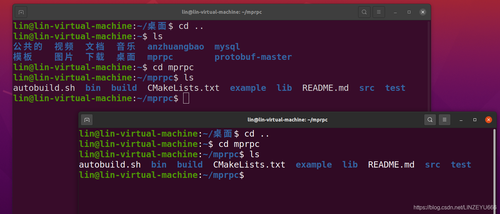
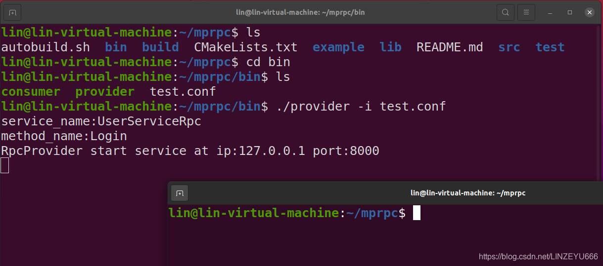
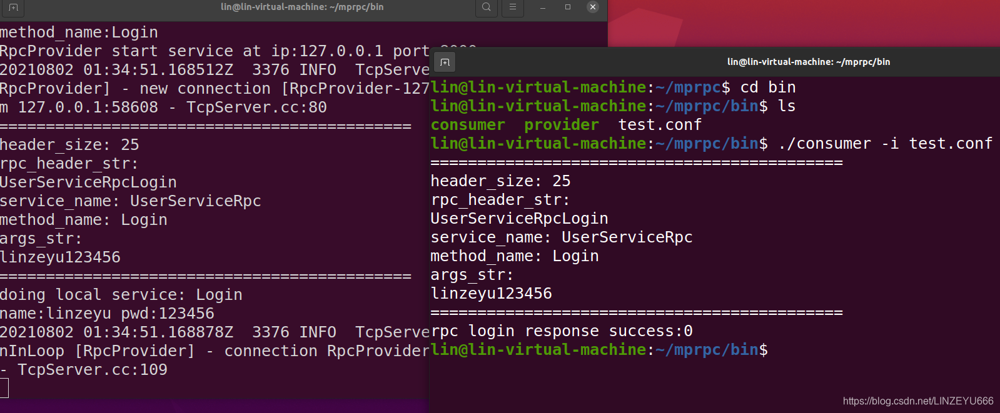

**我们先对之前的项目工程编译**  

## 点对点的[RPC](https://so.csdn.net/so/search?q=RPC&spm=1001.2101.3001.7020)通信功能测试

**我们打开2个终端**  
  
**我们先启动provider**  
  
**然后我们启动consumer**  
  
**运行成功**  
**因为我们的login函数设置返回的是false**