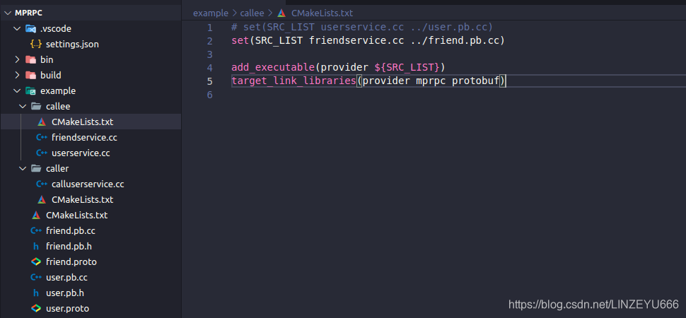

## mprpc框架的应用示例1（新增register注册）

**我们在之前演示了登录。**  
**现在我们演示一下注册！**  
  
**我们打开user.proto**  
**新增 注册（register）**

```xml
syntax = "proto3";

package fixbug;

option cc_generic_services = true;//开启

message ResultCode//打包失败类
{
    int32 errcode = 1; //错误代码
    bytes errmsg = 2;//错误消息
}

message LoginRequest//登录请求
{
    bytes name = 1;//姓名
    bytes pwd = 2;//密码
}

message LoginResponse//登录响应
{
    ResultCode result = 1;//失败
    bool sucess = 2;//成功
}

message RegisterRequest//注册请求
{
    uint32 id = 1;
    bytes name = 2;
    bytes pwd = 3;
}

message RegisterResponse//注册响应
{
    ResultCode result = 1;
    bool sucess = 2;
}

service UserServiceRpc//RPC服务方法
{
    rpc Login(LoginRequest) returns(LoginResponse);
    rpc Register(RegisterRequest) returns(RegisterResponse);
}
```

**保存。打开终端，执行命令。**  
  
**接下来我们打开userservice.cc新增发布这个方法（register）**

```cpp
#include <iostream>
#include <string>
#include "user.pb.h"
#include "mprpcapplication.h"
#include "mprpcprovider.h"

/*
UserService原来是一个本地服务，提供了两个进程内的本地方法，Login和GetFriendLists
*/
class UserService : public fixbug::UserServiceRpc//这个UserService是使用在rpc服务的发布端（rpc服务提供者）
{
public:
    bool Login(std::string name, std::string pwd)
    {
        std::cout << "doing local service: Login" << std::endl;
        std::cout << "name:" << name << " pwd:" << pwd << std::endl;  
        return false;
    }

    bool Register(uint32_t id, std::string name, std::string pwd)//注册方法
    {
        std::cout << "doing local service: Register" << std::endl;
        std::cout << "id:" << id << "name:" << name << " pwd:" << pwd << std::endl;
        return true;
    }

/*我的角色是服务的提供者，你作为远端想发起一个调用我这个机器上的UserService的Login方法
首先你会发一个RPC请求，这个请求是先到RPC框架，RPC框架根据你发过来的请求，然后根据参数和标识
匹配到我的Login方法，然后它就把这个网络上发的请求上报来，我接收到这个请求后，从请求中拿取数据，
然后做本地业务，填写相应的响应，然后再执行一个回调，相当于把执行完的这个RPC方法的返回值再塞给框架
，然后框架再进行序列化，通过网络传送回去，发送给你。体现在Login的四个参数。
*/

/*
    重写基类UserServiceRpc的虚函数 下面这些方法都是框架直接调用的
    1. caller RPC调用者   ===>   Login(LoginRequest)打包  => muduo库 =>   callee端
    2. callee RPC提供者   ===>   根据接收到的Login(LoginRequest)  => 交到下面重写的这个Login方法上了
    */
    void Login(::google::protobuf::RpcController* controller,
                       const ::fixbug::LoginRequest* request,
                       ::fixbug::LoginResponse* response,
                       ::google::protobuf::Closure* done)
    {
        //框架给业务上报了请求参数LoginRequest，应用程序获取相应数据做本地业务（登录的本地业务）
        std::string name = request->name();
        std::string pwd = request->pwd();
/*这个就是使用protobuf的好处，protobuf直接把字节流反序列化成我们可以识别的LoginRequest对象，通过
他生成的方法获取姓名和密码。
*/

        //做本地业务
        bool login_result = Login(name, pwd);//等于当前的本地方法

        //框架只是创建一个LoginResponse，我们只需要把响应写入，包括错误码、错误消息、返回值
        fixbug::ResultCode *code = response->mutable_result();
        code->set_errcode(0);
        code->set_errmsg("");//没有错误
        response->set_sucess(login_result);

        //执行回调操作，执行响应对象数据的序列化和网络发送（都是由框架来完成的）
//Closure是一个抽象类，重写Run,让它去做一些事情
        done->Run();
    }

    //注册的方法
    void Register(::google::protobuf::RpcController* controller,
                       const ::fixbug::RegisterRequest* request,
                       ::fixbug::RegisterResponse* response,
                       ::google::protobuf::Closure* done)
    {
        uint32_t id = request->id();
        std::string name = request->name();
        std::string pwd = request->pwd();

        bool ret = Register(id, name, pwd);

        response->mutable_result()->set_errcode(0);
        response->mutable_result()->set_errmsg("");
        response->set_sucess(ret);

        done->Run();
    }
};


int main(int argc, char **argv)//需要配置文件
{
    //调用框架的初始化操作
    MprpcApplication::Init(argc, argv);//整个框架的初始化操作，日志，配置等等。

    //provider是一个rpc网络的服务对象。把UserService对象发布到rpc节点上。
    RpcProvider provider;
    provider.NotifyService(new UserService());//发布服务
//可以调用多次，生成多个远程RPC服务

    //启动一个rpc服务发布节点
    provider.Run();
//Run以后，进程进入阻塞状态，等待远程的rpc调用请求

    return 0;
}
```

**接下来我们在calluserservice.cc（消费者）请求这个方法(register）**

```cpp
#include <iostream>
#include "mprpcapplication.h"
#include "user.pb.h"
#include "mprpcchannel.h"

int main(int argc, char **argv)
{
    //整个程序启动以后，想使用mprpc框架来享受rpc服务调用，一定需要先调用框架的初始化函数（只初始化一次）
    MprpcApplication::Init(argc, argv);

    //演示调用远程发布的rpc方法Login
    fixbug::UserServiceRpc_Stub stub(new MprpcChannel());//protobuf service生成的两个类，其中stub类作为是消费者（rpc调用者）
    //rpc方法的请求参数
    fixbug::LoginRequest request;//登录请求
    request.set_name("linzeyu");
    request.set_pwd("123456");
    //rpc方法的响应
    fixbug::LoginResponse response;
    //发起rpc方法的调用 ， 这是同步的rpc调用过程  MprpcChannel::callmethod
    stub.Login(nullptr, &request, &response, nullptr);//RpcChannel->RpcChannel::callMethod 集中来做所有rpc方法调用的参数序列化和网络发送

    //一次rpc调用完成，读调用的结果
    if (0 == response.result().errcode())
    {
        std::cout << "rpc login response success:" << response.sucess() << std::endl;
    }
    else
    {
        std::cout << "rpc login response error : " << response.result().errmsg() << std::endl;
    }

    //调用远程发布的rpc方法Register
    fixbug::RegisterRequest req;
    req.set_id(2001);
    req.set_name("linZY");
    req.set_pwd("666666");
    fixbug::RegisterResponse rsp;

    //以同步的方式发起rpc调用请求，等待返回结果
    stub.Register(nullptr, &req, &rsp, nullptr); 

    //一次rpc调用完成，读调用的结果
    if (0 == rsp.result().errcode())
    {
        std::cout << "rpc register response success:" << rsp.sucess() << std::endl;
    }
    else
    {
        std::cout << "rpc register response error : " << rsp.result().errmsg() << std::endl;
    }
    return 0;
}
```

**保存。我们编译一下工程。**  
  
**编译成功。我们打开2个终端，演示**  
**我们先启动provider**  
  
**然后我们启动消费者consumer**  
  
**通信成功！**

## mprpc框架的应用示例2（获取好友列表）

我们在之前谈到，获取好友列表是在另一个模块上实现的。  
**所以我们在example下单独定义一个proto文件：friend.proto**

```xml
syntax = "proto3";

package fixbug;

option cc_generic_services = true;

message ResultCode
{
    int32 errcode = 1; 
    bytes errmsg = 2;
}

message GetFriendsListRequest
{
    uint32 userid = 1;
}

message GetFriendsListResponse
{
    ResultCode result = 1;
    repeated bytes friends = 2;
}

//好友模块
service FiendServiceRpc
{
    rpc GetFriendsList(GetFriendsListRequest) returns(GetFriendsListResponse);
}
```


**保存。打开终端，执行命令。**  


**我们在example下的callee（服务的提供者）增加文件：friendservice.cc**

```cpp
#include <iostream>
#include <string>
#include "friend.pb.h"
#include "mprpcapplication.h"
#include "rpcprovider.h"
#include <vector>

class FriendService : public fixbug::FiendServiceRpc
{
public:
    std::vector<std::string> GetFriendsList(uint32_t userid)//返回好友的列表，本地方法
    {
        std::cout << "do GetFriendsList service! userid:" << userid << std::endl;
        std::vector<std::string> vec;
        vec.push_back("linyouhua");
        vec.push_back("lincanhui");
        vec.push_back("zhang san");
        return vec;
    }

    //重写基类方法,框架帮我们调用的
    void GetFriendsList(::google::protobuf::RpcController* controller,
                       const ::fixbug::GetFriendsListRequest* request,
                       ::fixbug::GetFriendsListResponse* response,
                       ::google::protobuf::Closure* done)
    {
        uint32_t userid = request->userid();//获取用户的id号
        std::vector<std::string> friendsList = GetFriendsList(userid);//调用本地方法
        response->mutable_result()->set_errcode(0);//执行成功
        response->mutable_result()->set_errmsg("");
        for (std::string &name : friendsList)//遍历好友列表
        {
            std::string *p = response->add_friends();//添加
            *p = name;
        }
        done->Run();
    }
};

int main(int argc, char **argv)
{

    //调用框架的初始化操作
    MprpcApplication::Init(argc, argv);

    //provider是一个rpc网络服务对象。把UserService对象发布到rpc节点上
    RpcProvider provider;
    provider.NotifyService(new FriendService());

    //启动一个rpc服务发布节点 Run以后，进程进入阻塞状态，等待远程的rpc调用请求
    provider.Run();

    return 0;
}
```

**保存。然后我们更新一下callee的CMakeLists.txt。**

```xml
# set(SRC_LIST userservice.cc ../user.pb.cc)
set(SRC_LIST friendservice.cc ../friend.pb.cc)

add_executable(provider ${SRC_LIST})
target_link_libraries(provider mprpc protobuf)
```

  
**我们新建并开始完成caller（消费者）的callfriendservice.cc**

```cpp
#include <iostream>
#include "mprpcapplication.h"
#include "friend.pb.h"
#include "mprpcchannel.h"

int main(int argc, char **argv)
{
//整个程序启动以后，想使用mprpc框架来享受rpc服务调用，一定需要先调用框架的初始化函数（只初始化一次）
MprpcApplication::Init(argc, argv);

//演示调用远程发布的rpc方法Login
fixbug::FiendServiceRpc_Stub stub(new MprpcChannel());
//rpc方法的请求参数
fixbug::GetFriendsListRequest request;
request.set_userid(1000);//设置用户的id号
//rpc方法的响应
fixbug::GetFriendsListResponse response;
//发起rpc方法的调用 同步的rpc调用过程  MprpcChannel::callmethod
stub.GetFriendsList(nullptr, &request, &response, nullptr); // RpcChannel->RpcChannel::callMethod 集中来做所有rpc方法调用的参数序列化和网络发送

//一次rpc调用完成，读调用的结果
if (0 == response.result().errcode())//响应成功
{
std::cout << "rpc GetFriendsList response success!" << std::endl;
int size = response.friends_size();//获取好友的数量
for (int i=0; i < size; ++i)//遍历，打印
{
std::cout << "index:" << (i+1) << " name:" << response.friends(i) << std::endl;
}
}
else//响应失败
{
std::cout << "rpc GetFriendsList response error : " << response.result().errmsg() << std::endl;
}

return 0;
}
```

**我们更新一下caller的CMakeLists.txt**

```xml
# set(SRC_LIST calluserservice.cc ../user.pb.cc)
set(SRC_LIST callfriendservice.cc ../friend.pb.cc)
add_executable(consumer ${SRC_LIST})
target_link_libraries(consumer mprpc protobuf)
```

  
**我们开始编译**  
  
**编译成功。我们打开2个终端开始示例。**  
**先启动provider（服务的提供者）**  
  
**我们在另一个终端启动consumer（服务的消费者）**  
  
**运行成功！**