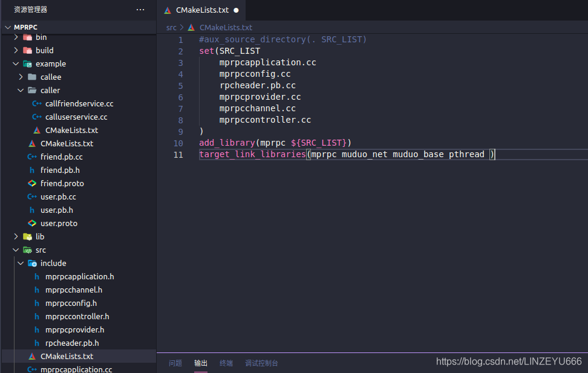

**框架需要用到RpcController的地方**  
  
**下图是RPC服务的调用方的调用步骤**  
  
实际上，这个RPC请求不一定是成功的，  
当我们用代理对象stub调用GetFriendList方法的时候，最终都是转到channel的CallMethod方法里面，CallMethod就是做我们RPC请求的序列化，网络发送，接收响应，[反序列化](https://so.csdn.net/so/search?q=%E5%8F%8D%E5%BA%8F%E5%88%97%E5%8C%96&spm=1001.2101.3001.7020)。才体现RPC的调用和响应完成了，然后我们才调用response.result().errcode()看响应码。

  
在CallMethod方法里面，每个步骤都有判断。如果一开始的获取参数的序列化字符串长度中，就失败了。连网络都没有发起，在数据的序列化就结束了，这时候我们访问response就没有必要了，肯定出错了。再往下走，CallMethod方法里面的每个步骤都有判断，失败就return了。这就没有response了。  
所以我们需要在这些里面得到一些控制信息，GetFriendList方法的第一个参数就是RpcController，它可以存储一些控制信息，让我们清楚地知道当前RPC调用的状态。  
**我们进去到RpcController里面看，这些方法都是纯虚函数，所以这是一个抽象类。**  


## RpcController控制模块的实现

**我们在src里面的include下创建头文件：mprpccontroller.h**

```cpp
#pragma once
#include <google/protobuf/service.h>
#include <string>

class MprpcController : public google::protobuf::RpcController
{
public:
    MprpcController();
    void Reset();
    bool Failed() const;
    std::string ErrorText() const;
    void SetFailed(const std::string& reason);

    //不需要
    void StartCancel();
    bool IsCanceled() const;
    void NotifyOnCancel(google::protobuf::Closure* callback);
private:
    bool m_failed; //RPC方法执行过程中的状态
    std::string m_errText; //RPC方法执行过程中的错误信息
};
```

  
**我们在src下创建mprpccontroller.cc**

```cpp
#include "mprpccontroller.h"

MprpcController::MprpcController()//初始化，一开始认为是正确的
{
    m_failed = false;
    m_errText = "";
}

void MprpcController::Reset()//重置
{
    m_failed = false;
    m_errText = "";
}

bool MprpcController::Failed() const//判断当前调用的成功与否
{
    return m_failed;
}

std::string MprpcController::ErrorText() const//错误信息
{
    return m_errText;
}

void MprpcController::SetFailed(const std::string& reason)//设置错误
{
    m_failed = true;
    m_errText = reason;
}

//不需要
void MprpcController::StartCancel(){}
bool MprpcController::IsCanceled() const {return false;}
void MprpcController::NotifyOnCancel(google::protobuf::Closure* callback) {}
```

## 如何使用？

**我们在mprpcchannel.cc增加头文件mprpccontroller.h并完善方法**

```cpp
#include "mprpcchannel.h"
#include <string>
#include "rpcheader.pb.h"
#include <sys/types.h>
#include <sys/socket.h>
#include <arpa/inet.h>
#include <netinet/in.h>
#include <unistd.h>
#include <errno.h>
#include "mprpcapplication.h"
#include <iostream>
#include "mprpccontroller.h"
/*
消息的格式是：
header_size + service_name method_name args_size + args
*/
// 所有通过stub代理对象调用的rpc方法，都走到这里了，统一做rpc方法调用的数据数据序列化和网络发送 
void MprpcChannel::CallMethod(const google::protobuf::MethodDescriptor* method,
                                google::protobuf::RpcController* controller, 
                                const google::protobuf::Message* request,
                                google::protobuf::Message* response,
                                google::protobuf:: Closure* done)
{
    const google::protobuf::ServiceDescriptor* sd = method->service();//知道这个方法属于哪个服务对象的
    std::string service_name = sd->name();//service_name
    std::string method_name = method->name();//method_name

    //获取参数的序列化字符串长度args_size
    uint32_t args_size = 0;
    std::string args_str;
    if (request->SerializeToString(&args_str))//序列化成功
    {
        args_size = args_str.size();
    }
    else//获取失败
    {
        controller->SetFailed("serialize request error!");
        return;
    }
    
    //定义rpc的请求header
    mprpc::RpcHeader rpcHeader;
    rpcHeader.set_service_name(service_name);
    rpcHeader.set_method_name(method_name);
    rpcHeader.set_args_size(args_size);

    uint32_t header_size = 0;
    std::string rpc_header_str;
    if (rpcHeader.SerializeToString(&rpc_header_str))//序列化成功
    {
        header_size = rpc_header_str.size();
    }
    else//序列化失败
    {
        controller->SetFailed("serialize rpc header error!");
        return;
    }

    //组织待发送的rpc请求的字符串
    std::string send_rpc_str;
    send_rpc_str.insert(0, std::string((char*)&header_size, 4));//header_size，从开头开始，写4个字节，二进制存储head_size，就是一个整数
    send_rpc_str += rpc_header_str;//rpcheader
    send_rpc_str += args_str;//args
//string类的好处

    //打印调试信息
    std::cout << "============================================" << std::endl;
    std::cout << "header_size: " << header_size << std::endl; 
    std::cout << "rpc_header_str: " << rpc_header_str << std::endl; 
    std::cout << "service_name: " << service_name << std::endl; 
    std::cout << "method_name: " << method_name << std::endl; 
    std::cout << "args_str: " << args_str << std::endl; 
    std::cout << "============================================" << std::endl;

    //因为是客户端，消费者，不需要高并发，只需要使用tcp编程，完成rpc方法的远程调用
    int clientfd = socket(AF_INET, SOCK_STREAM, 0);//连接套接字
    if (-1 == clientfd)//连接失败
    {
        char errtxt[512] = {0};
        sprintf(errtxt, "create socket error! errno:%d", errno);
        controller->SetFailed(errtxt);
        return;
    }
//读取配置文件rpcserver的信息
    std::string ip = MprpcApplication::GetInstance().GetConfig().Load("rpcserverip");
    uint16_t port = atoi(MprpcApplication::GetInstance().GetConfig().Load("rpcserverport").c_str());

    struct sockaddr_in server_addr;
    server_addr.sin_family = AF_INET;
    server_addr.sin_port = htons(port);
    server_addr.sin_addr.s_addr = inet_addr(ip.c_str());

    //发起连接。连接rpc服务节点
    if (-1 == connect(clientfd, (struct sockaddr*)&server_addr, sizeof(server_addr)))
    {
        close(clientfd);
        char errtxt[512] = {0};
        sprintf(errtxt, "connect error! errno:%d", errno);
        controller->SetFailed(errtxt);
        return;
    }

    //连接成功后，发送rpc请求
    if (-1 == send(clientfd, send_rpc_str.c_str(), send_rpc_str.size(), 0))
   {
        close(clientfd);
        char errtxt[512] = {0};
        sprintf(errtxt, "send error! errno:%d", errno);
        controller->SetFailed(errtxt);
        return;
    }

    //接收rpc请求的响应值
    char recv_buf[1024] = {0};
    int recv_size = 0;
    if (-1 == (recv_size = recv(clientfd, recv_buf, 1024, 0)))
    {
        close(clientfd);
        char errtxt[512] = {0};
        sprintf(errtxt, "recv error! errno:%d", errno);
        controller->SetFailed(errtxt);
        return;
    }

    // 反序列化rpc调用的响应数据
    // std::string response_str(recv_buf, 0, recv_size);//有bug,会出现问题，recv_buf中遇到\0后面的数据就存不下来了，导致反序列化失败
    // if (!response->ParseFromString(response_str))
    if (!response->ParseFromArray(recv_buf, recv_size))//反序列化，填到response里面
    {
        close(clientfd);
        char errtxt[512] = {0};
        sprintf(errtxt, "parse error! response_str:%s", recv_buf);
        controller->SetFailed(errtxt);
        return;
    }

    close(clientfd);
}
```

为了方便用户更简单地调用框架。  
**我们更新一下mprpcapplication.h**

```cpp
#pragma once
#include "mprpcconfig.h"
#include "mprpcchannel.h"
#include "mprpccontroller.h"

// mprpc框架的基础类，负责框架的一些初始化操作
class MprpcApplication
{
public:
    static void Init(int argc, char **argv);//初始化 
    static MprpcApplication& GetInstance();//单例模式
    static MprpcConfig& GetConfig();
private:
    static MprpcConfig m_config;
    MprpcApplication(){}//构造函数 
    MprpcApplication(const MprpcApplication&) = delete;//删除拷贝相关的 
    MprpcApplication(MprpcApplication&&) = delete;//删除拷贝相关的 
};
```

**我们打开caller（调用方）的callfriendservice.cc**

```cpp
#include <iostream>
#include "mprpcapplication.h"
#include "friend.pb.h"

int main(int argc, char **argv)
{
//整个程序启动以后，想使用mprpc框架来享受rpc服务调用，一定需要先调用框架的初始化函数（只初始化一次）
MprpcApplication::Init(argc, argv);

//演示调用远程发布的rpc方法Login
fixbug::FiendServiceRpc_Stub stub(new MprpcChannel());
//rpc方法的请求参数
fixbug::GetFriendsListRequest request;
request.set_userid(1000);//设置用户的id号
//rpc方法的响应
fixbug::GetFriendsListResponse response;
    //发起rpc方法的调用  同步的rpc调用过程  MprpcChannel::callmethod
    MprpcController controller;
    stub.GetFriendsList(&controller, &request, &response, nullptr);//RpcChannel->RpcChannel::callMethod 集中来做所有rpc方法调用的参数序列化和网络发送

    //一次rpc调用完成，读调用的结果
    if (controller.Failed())//RPC调用过程中出现错误了
    {
        std::cout << controller.ErrorText() << std::endl;
    }
    else//RPC调用成功
    {
        if (0 == response.result().errcode())//响应成功
        {
            std::cout << "rpc GetFriendsList response success!" << std::endl;
            int size = response.friends_size();//获取好友的个数
            for (int i=0; i < size; ++i)//变量，打印
            {
                std::cout << "index:" << (i+1) << " name:" << response.friends(i) << std::endl;
            }
        }
        else//响应失败
        {
            std::cout << "rpc GetFriendsList response error : " << response.result().errmsg() << std::endl;
        }
    }

return 0;
}
```

**我们在src的CMakeLists.txt更新一下**  
  
**我们编译一下**  
  
**编译成功**