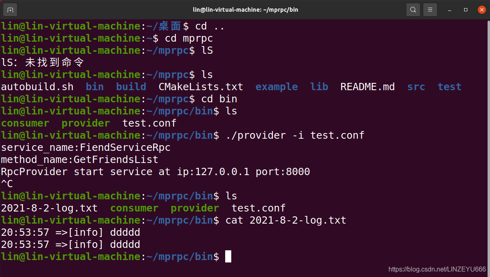
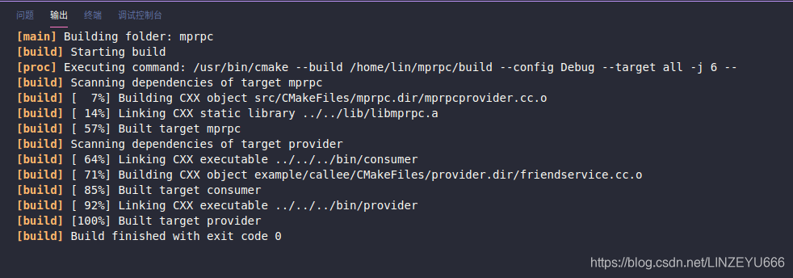

## logger日志系统的设计

  
图中画圆圈的是我们实现的mprpc[框架](https://so.csdn.net/so/search?q=%E6%A1%86%E6%9E%B6&spm=1001.2101.3001.7020)，这个框架是给别人使用的，把本地的服务发布成远程的RPC服务，框架里最重要的两个成员就是RpcProvider和RpcChannel，他们在运行的过程中会有很多正常的输出信息和错误的信息，我们不可能都cout它们到屏幕上，因为运行时间长了，屏幕上输出的信息特别多，如果万一有什么问题，我们也不好定位，真正用起来的话不方便。所以，一般出问题，我们最直接的方式就是看日志！！！  
**日志可以记录正常软件运行过程中出现的信息和错误的信息，当我们定位问题，就打开相应的日志去查看，查找。**  
假如我们在框架后边输出一个日志模块，我们想把框架运行中的正常的信息和错误信息都记录在日志文件，该怎么做？  
**左边的两个箭头表示RPC的请求和RPC的响应。**  
[RPC](https://so.csdn.net/so/search?q=RPC&spm=1001.2101.3001.7020)请求过来的时候，我们的框架在执行的时候会产生很多日志文件，我们要写日志，写日志信息的过程是磁盘I/O，磁盘I/O速度不快，我们不能把磁盘I/O的花销算在RPC请求的业务执行部门里面(否则造成RPC请求处理的效率慢)，我们不能把日志花费的时间算在框架业务的执行时间里面，所以，一般在我们的服务器中，增加一个kafka，就可以用在日志系统中做一个消息队列中间件，我们把日志写在一个缓存队列里（这个队列相当于异步的日志写入机制），我们的框架做的就是写日志到内存的队列里面，不做磁盘I/O操作。然后我们在后面有一个专门写日志的线程，就是做磁盘I/O操作，从队列头取出日志信息，然后把日志信息写到日志文件中，这样它的磁盘I/O就不会算在我们的RPC请求的业务当中。  
  
我们的mprpc框架的RpcProvier端是用muduo库实现的，采用的是epoll加多线程，很有可能RPC的处理过程是在多个线程中都会去做这个，多个线程都会去写日志，也就是多个线程都会在这个缓存队列里面添加数据，所以我们的这个缓存队列必须保证线程安全。  
我们的C++中有queue这个队列，也就是C++的容器，但是C++容器只考虑使用应用，没有考虑线程安全，所以我们用的是线程互斥机制来维护入队出队的线程按照，写日志的线程也是一个独立的线程，用唯一的互斥锁实现。  
如果队列是空的话，也就是之前的日志都写到日志文件了，写日志的线程这时就不用抢这把互斥锁了，因为没有东西可写。导致写入队列的线程无法及时获取锁，信息无法及时写到队列，破坏了RPC请求的业务的效率。  
  
**所以，我们还要处理的就是线程间的通信。**  
队列如果是空，写日志的线程就一直等待，队列不空的时候，写日志的线程才有必要去抢锁，把日志信息写到日志文件。  
我们的日志文件放在当前目录下log。  
每一天都生成新的日志文件，有助于在发生问题的时候快速定位。  
而且如果当天我们的日志文件如果容量太大，比如说超过20M，就会产生新的！  
  
kafka是开源的，非常著名，分布式消息队列，其中功能：在分布式环境中提供异步的日志写入服务器中间件，日志写入的系统，和我们的queue本质相同，但是它设计高级，高效，高可用性，可容灾，稳定。

## logger日志系统的实现

**我们在src下的include增加头文件：logger.h**

```cpp
#pragma once
#include "lockqueue.h"
#include <string>

//定义宏 LOG_INFO("xxx %d %s", 20, "xxxx")
//可变参，提供给用户更轻松的使用logger 
//snprintf， 缓冲区，缓冲区的长度，写的格式化字符串， ##__VA_ARGS__。
//代表了可变参的参数列表，填到缓冲区当中，然后 logger.Log(c)
#define LOG_INFO(logmsgformat, ...) \
    do \
    {  \
        Logger &logger = Logger::GetInstance(); \
        logger.SetLogLevel(INFO); \
        char c[1024] = {0}; \
        snprintf(c, 1024, logmsgformat, ##__VA_ARGS__); \
        logger.Log(c); \
    } while(0) \

#define LOG_ERR(logmsgformat, ...) \
    do \
    {  \
        Logger &logger = Logger::GetInstance(); \
        logger.SetLogLevel(ERROR); \
        char c[1024] = {0}; \
        snprintf(c, 1024, logmsgformat, ##__VA_ARGS__); \
        logger.Log(c); \
    } while(0) \

//定义日志的级别
enum LogLevel
{
    INFO, //普通信息
    ERROR,//错误信息
};

//Mprpc框架提供的日志系统
class Logger
{
public:
    //获取日志的单例
    static Logger& GetInstance();
    //设置日志级别 
    void SetLogLevel(LogLevel level);
    //写日志
    void Log(std::string msg);
private:
    int m_loglevel;//记录日志级别
    LockQueue<std::string>  m_lckQue;//日志缓冲队列

    Logger();
    Logger(const Logger&) = delete;
    Logger(Logger&&) = delete;
};
```

**我们在src下的include增加头文件：lockqueue.h**  
**(异步缓冲队列的实现）**

```cpp
#pragma once
#include <queue>
#include <thread>
#include <mutex>//其实就是调用pthread_mutex_t
#include <condition_variable>//其实就是调用pthread_condition_t

//异步写日志的日志队列
template<typename T>
class LockQueue
{
public:
    //多个worker线程都会写日志queue 
    void Push(const T &data)
    {
        std::lock_guard<std::mutex> lock(m_mutex);//获取锁，函数结束自动释放锁 
        m_queue.push(data);//入队列 
        m_condvariable.notify_one();//唤醒一个线程 
    }

    //一个线程读日志queue，写日志文件
    T Pop()
    {
        std::unique_lock<std::mutex> lock(m_mutex);//获取锁，函数结束自动释放锁 
        while (m_queue.empty())//为空 
        {
            //日志队列为空，线程进入wait状态
            m_condvariable.wait(lock);//线程挂起，阻塞，释放锁 
        }

        T data = m_queue.front();//取队列头 
        m_queue.pop();//出队列 
        return data;
    }
private:
    std::queue<T> m_queue;//队列 
    std::mutex m_mutex;//互斥锁 
    std::condition_variable m_condvariable;//条件变量 
};
```

**我们在src下创建logger.cc**

```cpp
#include "logger.h"
#include <time.h>
#include <iostream>

//获取日志的单例
Logger& Logger::GetInstance()//初始化
{
    static Logger logger;
    return logger;
}

Logger::Logger()
{
    //启动专门的写日志线程
    std::thread writeLogTask([&](){
        for (;;)
        {
            //获取当前的日期，然后取日志信息，写入相应的日志文件当中 a+ //追加的方式，如果没有就创建
            time_t now = time(nullptr);//获取当前的时间，按秒算的，1970年到现在的
            tm *nowtm = localtime(&now);//返回tm结构的指针

            char file_name[128];//文件名
            sprintf(file_name, "%d-%d-%d-log.txt", nowtm->tm_year+1900, nowtm->tm_mon+1, nowtm->tm_mday);//构建文件，年-月-日-log.txt

            FILE *pf = fopen(file_name, "a+");//追加的方式打开
            if (pf == nullptr)//打开失败
            {
                std::cout << "logger file : " << file_name << " open error!" << std::endl;
                exit(EXIT_FAILURE);
            }

            std::string msg = m_lckQue.Pop();//出队列

            char time_buf[128] = {0};
            sprintf(time_buf, "%d:%d:%d =>[%s] ", 
                    nowtm->tm_hour, 
                    nowtm->tm_min, 
                    nowtm->tm_sec,
                    (m_loglevel == INFO ? "info" : "error"));
            msg.insert(0, time_buf);//时 分 秒
            msg.append("\n");

            fputs(msg.c_str(), pf);
            fclose(pf);
        }
    });
    //设置分离线程，相当于一个守护线程，在后台专门去写日志
    writeLogTask.detach();
}

//设置日志级别 
void Logger::SetLogLevel(LogLevel level)
{
    m_loglevel = level;
}

//写日志，把日志信息写入lockqueue缓冲区当中，这是RPC请求的业务做的
void Logger::Log(std::string msg)
{
    m_lckQue.Push(msg);
}
```

**我们完善src的CMakeLists.txt**  
  
**保存。我们开始编译。**  
  
**编译成功。**

## 测试

**我们打开example下的callee（RPC服务的提供者）  
打开并提交logger.h到friendservice.cc**

```cpp
#include <iostream>
#include <string>
#include "friend.pb.h"
#include "mprpcapplication.h"
#include "mprpcprovider.h"
#include <vector>
#include "logger.h"

class FriendService : public fixbug::FiendServiceRpc
{
public:
    std::vector<std::string> GetFriendsList(uint32_t userid)//返回好友的列表，本地方法
    {
        std::cout << "do GetFriendsList service! userid:" << userid << std::endl;
        std::vector<std::string> vec;
        vec.push_back("linyouhua");
        vec.push_back("lincanhui");
        vec.push_back("zhang san");
        return vec;
    }

    //重写基类方法,框架帮我们调用的
    void GetFriendsList(::google::protobuf::RpcController* controller,
                       const ::fixbug::GetFriendsListRequest* request,
                       ::fixbug::GetFriendsListResponse* response,
                       ::google::protobuf::Closure* done)
    {
        uint32_t userid = request->userid();//获取用户的id号
        std::vector<std::string> friendsList = GetFriendsList(userid);//调用本地方法
        response->mutable_result()->set_errcode(0);//执行成功
        response->mutable_result()->set_errmsg("");
        for (std::string &name : friendsList)//遍历好友列表
        {
            std::string *p = response->add_friends();//添加
            *p = name;
        }
        done->Run();
    }
};

int main(int argc, char **argv)
{
    LOG_ERR("ddddd");
    LOG_INFO("ddddd");

    //调用框架的初始化操作
    MprpcApplication::Init(argc, argv);

    //provider是一个rpc网络服务对象。把UserService对象发布到rpc节点上
    RpcProvider provider;
    provider.NotifyService(new FriendService());

    //启动一个rpc服务发布节点 Run以后，进程进入阻塞状态，等待远程的rpc调用请求
    provider.Run();

    return 0;
}
```

**保存。  
重新编译。**  
  
**我们打开终端，输入命令测试。**  
  
**测试成功。**

## 把日志集成到系统中

**我们完善mprpcprovider.cc**

```cpp
#include "mprpcprovider.h"
#include "mprpcapplication.h"
#include "rpcheader.pb.h" 
#include "logger.h"

/*
service_name =>对于 service描述   
                        =》对应 service* 记录服务对象
                        多个method_name  =>对应多个method方法对象
*/
//这里是框架提供给外部使用的，可以发布rpc方法的函数接口
void RpcProvider::NotifyService(google::protobuf::Service *service)
{
    ServiceInfo service_info;//结构体

    //获取了服务对象的描述信息
    const google::protobuf::ServiceDescriptor *pserviceDesc = service->GetDescriptor();
//因为返回类型是指针。获取服务对象的描述信息。存储名字之类的。

    //获取服务的名字
    std::string service_name = pserviceDesc->name();
    //获取服务对象service的方法的数量
    int methodCnt = pserviceDesc->method_count();

    //std::cout << "service_name:" << service_name << std::endl;
    LOG_INFO("service_name:%s", service_name.c_str());   

    for (int i=0; i < methodCnt; ++i)
    {
        //获取了服务对象指定下标的服务方法的描述（抽象的描述） UserService   Login
        const google::protobuf::MethodDescriptor* pmethodDesc = pserviceDesc->method(i);
        std::string method_name = pmethodDesc->name();
        service_info.m_methodMap.insert({method_name, pmethodDesc});//插入键值对到map中

        //std::cout<<"method_name:"<<method_name<<std::endl;//打印
        LOG_INFO("method_name:%s", method_name.c_str());        
    }
    service_info.m_service = service;//记录服务对象
    m_serviceMap.insert({service_name, service_info});//存储一下服务及其具体的描述
}


//启动rpc服务节点，开始提供rpc远程网络调用服务
void RpcProvider::Run()
{
    //读取配置文件rpcserver的信息
    std::string ip = MprpcApplication::GetInstance().GetConfig().Load("rpcserverip");//ip
    uint16_t port = atoi(MprpcApplication::GetInstance().GetConfig().Load("rpcserverport").c_str());//port，因为atoi返回char *，所以要c_str()
    muduo::net::InetAddress address(ip, port);

    //创建TcpServer对象
    muduo::net::TcpServer server(&m_eventLoop, address, "RpcProvider");

    //绑定连接回调和消息读写回调方法 ，muduo库的好处是：分离了网络代码和业务代码
    server.setConnectionCallback(std::bind(&RpcProvider::OnConnection, this, std::placeholders::_1));//预留1个参数std::placeholders::_1
    server.setMessageCallback(std::bind(&RpcProvider::OnMessage, this, std::placeholders::_1, 
            std::placeholders::_2, std::placeholders::_3));//预留3个参数std::placeholders::_1,2,3

    //设置muduo库的线程数量
    server.setThreadNum(4);//1个是I/O线程，3个是工作线程

    //rpc服务端准备启动，打印信息
    std::cout << "RpcProvider start service at ip:" << ip << " port:" << port << std::endl;
    
    //启动网络服务
    server.start();
    m_eventLoop.loop();//相当于启动了epoll_wait，阻塞，等待远程连接
}

//新的socket连接回调
void RpcProvider::OnConnection(const muduo::net::TcpConnectionPtr &conn)
{
    if (!conn->connected())
    {
        //和rpc client的连接断开了
        conn->shutdown();//关闭文件描述符 
    }
}

/*
在框架内部，RpcProvider和RpcConsumer协商好之间通信用的protobuf数据类型
怎么商量呢？ 
包含：service_name  method_name   args   
对应：16UserService   Login    zhang san123456   
我们在框架中定义proto的message类型，进行数据头的序列化和反序列化
service_name method_name args_size(防止粘包的问题) 

怎么去区分哪个是service_name, method_name, args
我们把消息头表示出来 
header_size(4个字节) + header_str + args_str
前面几个字节是服务名和方法名。 
为了防止粘包，我们还要记录参数的字符串的长度 
我们统一：一开始读4个字节，数据头的长度，也就是除了方法参数之外的所有数据：服务名字和方法名字 
10 "10"
10000 "1000000"
std::string   insert和copy方法 
*/

//已建立连接用户的读写事件回调,如果远程有一个rpc服务的调用请求，那么OnMessage方法就会响应
void RpcProvider::OnMessage(const muduo::net::TcpConnectionPtr &conn, 
                            muduo::net::Buffer *buffer, 
                            muduo::Timestamp)
{
    //网络上接收的远程rpc调用请求的字符流 包含了RPC方法的名字Login和参数args
    std::string recv_buf = buffer->retrieveAllAsString();

    //从字符流中读取前4个字节的内容
    uint32_t header_size = 0;
    recv_buf.copy((char*)&header_size, 4, 0);//从0下标位置拷贝4个字节的内容到header_size 

    std::string rpc_header_str = recv_buf.substr(4, header_size);
//从第4个下标，前4个字节略过。读取包含了service_name method_name args_size 
//根据header_size读取数据头的原始字符流，反序列化数据，得到rpc请求的详细信息
    mprpc::RpcHeader rpcHeader;
    std::string service_name;
    std::string method_name;
    uint32_t args_size;
    if (rpcHeader.ParseFromString(rpc_header_str))
    {
        //数据头反序列化成功
        service_name = rpcHeader.service_name();
        method_name = rpcHeader.method_name();
        args_size = rpcHeader.args_size();
    }
    else
    {
        //数据头反序列化失败
        std::cout << "rpc_header_str:" << rpc_header_str << " parse error!" << std::endl;
        return;//不用往后走了 
    }

    //获取rpc方法参数的字符流数据
    std::string args_str = recv_buf.substr(4 + header_size, args_size);
    //header_size(4个字节) + header_str + args_str

    //打印调试信息
    std::cout << "============================================" << std::endl;
    std::cout << "header_size: " << header_size << std::endl; 
    std::cout << "rpc_header_str: " << rpc_header_str << std::endl; 
    std::cout << "service_name: " << service_name << std::endl; 
    std::cout << "method_name: " << method_name << std::endl; 
    std::cout << "args_str: " << args_str << std::endl; 
    std::cout << "============================================" << std::endl;
     
    //获取service对象和method对象
    auto it = m_serviceMap.find(service_name);//用[]会有副作用 
    if (it == m_serviceMap.end())//根本没有的服务 
    {
        std::cout << service_name << " is not exist!" << std::endl;
        return;
    }

    auto mit = it->second.m_methodMap.find(method_name);
    if (mit == it->second.m_methodMap.end())//服务里没有这个方法 
    {
        std::cout << service_name << ":" << method_name << " is not exist!" << std::endl;
        return;
    }

    google::protobuf::Service *service = it->second.m_service;//获取service对象  对应的就是像new UserService这种 
    const google::protobuf::MethodDescriptor *method = mit->second;//获取method对象 对应的是像Login这种 

    //生成rpc方法调用的请求request和响应response参数
    google::protobuf::Message *request = service->GetRequestPrototype(method).New();
//在框架以抽象的方式表示。new生成新对象，传给userservice 

    if (!request->ParseFromString(args_str))//解析 
    {
        std::cout << "request parse error, content:" << args_str << std::endl;
        return;
    }
    google::protobuf::Message *response = service->GetResponsePrototype(method).New();//响应 

    //CallMethod需要closure参数
//给下面的method方法的调用，绑定一个Closure的回调函数
    google::protobuf::Closure *done = google::protobuf::NewCallback<RpcProvider, 
                                                                    const muduo::net::TcpConnectionPtr&, 
                                                                    google::protobuf::Message*>
                                                                    (this, 
                                                                    &RpcProvider::SendRpcResponse, 
                                                                    conn, response);

    //在框架上根据远端rpc请求，调用当前rpc节点上发布的方法
    
    service->CallMethod(method, nullptr, request, response, done);//做完本地业务，根据结果写好reponse给框架，框架再给调用方 
    //相当于new UserService().Login(controller, request, response, done)
}

//Closure的回调操作，用于序列化rpc的响应和网络发送
void RpcProvider::SendRpcResponse(const muduo::net::TcpConnectionPtr& conn, google::protobuf::Message *response)
{
    std::string response_str;
    if (response->SerializeToString(&response_str))//对response进行序列化
    {
        //序列化成功后，通过网络把rpc方法执行的结果发送会rpc的调用方
        conn->send(response_str);
    }
    else//序列化失败
    {
        std::cout << "serialize response_str error!" << std::endl; 
    }
    conn->shutdown(); //模拟http的短链接服务，由rpcprovider主动断开连接，给更多的rpc调用方提供服务
}
```

**保存。编译。**  
**编译成功。**  
  
