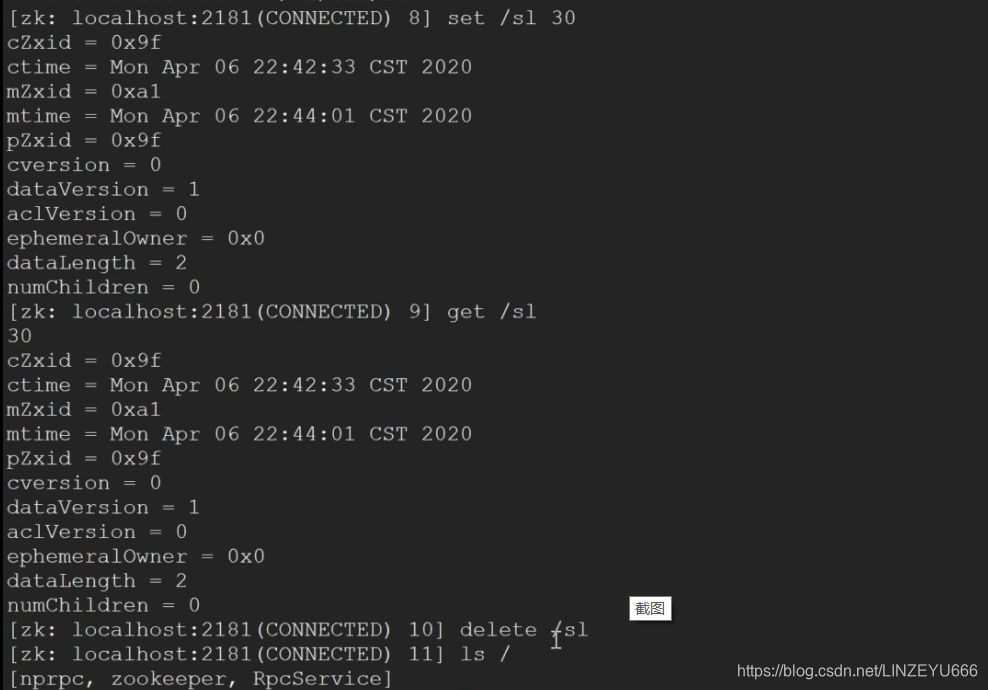
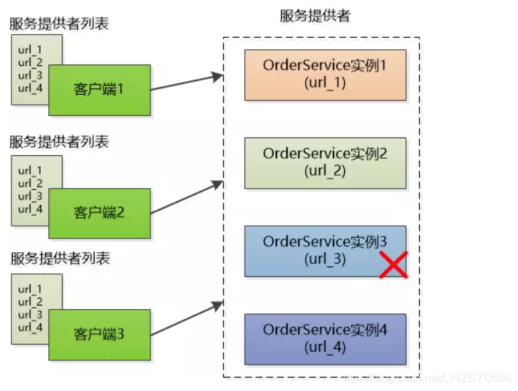
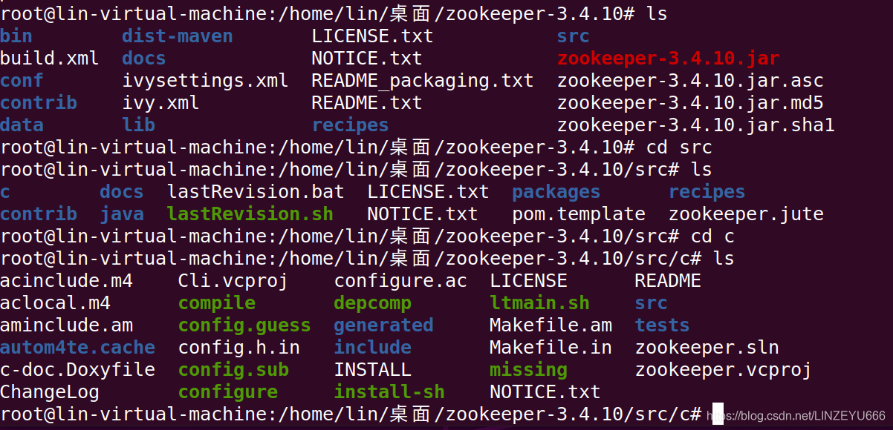

**Zookeeper**是在[分布式](https://so.csdn.net/so/search?q=%E5%88%86%E5%B8%83%E5%BC%8F&spm=1001.2101.3001.7020)环境中应用非常广泛，它的优秀功能很多，比如**分布式环境中全局命名服务**，**服务注册中心**，**全局分布式锁**（针对临界区代码段的编写，假如，我们是一个分布式系统，两个服务分别运行在两台机器上，这两台机器要竞争一个资源，这个资源是不能让同时2个[RPC](https://so.csdn.net/so/search?q=RPC&spm=1001.2101.3001.7020)节点去访问的，这时候需要一把分布式锁，此时普通的锁是不能解决的，因为普通的锁是在同一个进程里控制线程的）等等。  
**Zookeeper相当于动物园的管理员，也负责协调各种动物之间的。**

[ZooKeeper](https://so.csdn.net/so/search?q=ZooKeeper&spm=1001.2101.3001.7020)是一个分布式的，开放源码的分布式应用程序协调服务，是Google的Chubby一个开源的实现，是大数据生态中的重要组件。它是集群的管理者，监视着集群中各个节点的状态根据节点提交的反馈进行下一步合理操作。最终，将简单易用的接口和性能高效、功能稳定的系统提供给用户。

它是一个为分布式应用提供一致性协调服务的中间件  
**我们在做mprpc框架项目的时候**，消费者发起RPC的请求，我们需要知道这个RPC服务在哪个机器上运行的，我们需要**服务配置中心**，在这个分布式系统中，所有提供RPC服务的节点都会向配置中心注册服务，提供什么端口号，什么服务。在消费者发起RPC服务的请求，我们去**配置中心**查找一下就可以了！

## ZooKeeper提供了什么

**文件系统**  
Zookeeper提供一个多层级的节点命名空间（节点称为znode）。与文件系统不同的是，这些节点都可以设置关联的数据，而文件系统中只有文件节点可以存放数据而目录节点不行。Zookeeper为了保证高吞吐和低延迟，在内存中维护了这个树状的目录结构，这种特性使得Zookeeper不能用于存放大量的数据，每个节点的存放数据上限为1M。  
**通知机制**  
client端会对某个znode建立一个watcher事件，当该znode发生变化时，这些client会收到zk的通知，然后client可以根据znode变化来做出业务上的改变等。

## Zookeeper作用

1、master节点选举, 主节点down掉后, 从节点就会接手工作, 并且保证这个节点是唯一的,这也就是所谓首脑模式,从而保证我们集群是高可用的  
2、统一配置文件管理, 即只需要部署一台服务器, 则可以把相同的配置文件同步更新到其他所有服务器, 此操作在云计算中用的特别多(例如修改了redis统一配置)  
3、数据发布与订阅, 类似消息队列MQ  
4、分布式锁,分布式环境中不同进程之间争夺资源,类似于多进程中的锁  
5、集群管理, 保证集群中数据的强一致性

## Zookeeper的特性

一致性: 数据一致性, 数据按照顺序分批入库  
原子性: 事务要么成功要么失败  
单一视图: 客户端连接集群中的任意zk节点, 数据都是一致的  
可靠性:每次对zk的操作状态都会保存在服务端  
实时性: 客户端可以读取到zk服务端的最新数据

## 什么是分布式系统

很多台计算机组成一个整体, 一个整体一致对外并且处理同一请求  
内部的每台计算机都可以相互通信(rest/rpc)  
客户端到服务端的一次请求到响应结束会经历多台计算机  
**图1**  
  
**图2**  


## Zookeeper的安装

**1、官网上下载 zookeeper-3.4.10.tar.gz，拖进Ubuntu中**  
**2、执行**

```cpp
tar -zxvf zookeeper-3.4.10.tar.gz
```

**3、**  
`cd zookeeper-3.4.10`  
  
**4、**

```cpp
cd conf 
```

  
**5、**

```cpp
 mv zoo_sample.cfg zoo.cfg
```

**6、** 打开配置文件

```cpp
vim zoo.cfg
```

**我们知道zk的数据是怎么组织的 - znode节点，这些节点上的数据最终存储在磁盘上的。**  
我们在zookeeper-3.4.10下创建data文件夹专门存放数据。  
然后在zoo.cfg的目录修改data的地址  
  
**因为如果用默认的tmp，就是重启就tmp下的数据就全部清空了。**

  
**zk的默认端口号是2181**

**7、**

```cpp
cd ..
cd bin
```

  
**8、**  
**启动zkServer**

```cpp
 ./zkServer.sh start
```

  
**9、**

```cpp
ps -ef | grep zookeeper
```

  
**启动了**  
**10、**  
  
zookeeper是通过Java开发的，所以要有JDK环境，Ubuntu：sudo apt-get install openjdk

## znode节点存储格式

**就是zookeeper存储数据的方式。**  
  
**根目录的形式。和linux很相似。**  
**每一个节点都可以创建子节点，每个节点都可以存储数据，默认的大小是1M。  
用作分布式的协调服务，分布式锁，分布式服务名字，分布式配置中心的记录。**  
**每一个节点有名字和存储的数据。**

**我们刚才启动了服务端，现在我们再启动客户端**

```cpp
 ./zkCli.sh
```


**zk客户端常用命令**  
ls（查看有什么节点）、get（获取节点详细信息）、create（创建节点）、set（修改节点的值）、delete（删除节点）  
  
**注意：**  
我们访问每一个节点，必须是从根目录开始写路径。  
  
  
**想创建sl3这个节点，得保证它前面的父节点和祖先节点都是存在的！**

  
**删除的话，如果其有子节点，则不能直接删除**  


## 分布式系统的问题

**服务的动态注册和发现**，为了支持高并发，OrderService被部署了4份，每个客户端都保存了一份服务提供者的列表，但这个列表是静态的（在配置文件中写死的），如果服务的提供者发生了变化，例如有些机器down了，或者又新增了OrderService的实例，客户端根本不知道，想要得到最新的服务提供者的URL列表，必须手工更新配置文件，很不方便。  
**问题 : 客户端和服务提供者的紧耦合**  
  
右边的图表示这是一些RPC节点，上面运行的一些orderservice的实例。  
左边的图表示一些RPC的调用方，它们怎么知道这些RPC服务在哪里呢，它们在本地有配置文件，每个调用方都维持一个配置文件，怎么更新统一呢？不能及时更新啊，如果其中一个服务挂掉了的话。  
**解决方案:**  
解除耦合，增加一个中间层 – 注册中心它保存了能提供的服务的名称，以及URL（RPC服务所在的节点地址和端口号）。首先这些服务会在注册中心进行注册，当客户端来查询的时候，只需要给出名称，注册中心就会给出一个URL。所有的客户端在访问服务前，都需要向这个注册中心进行询问，以获得最新的地址。  
  
  
客户端拿服务的名字去服务配置中心查找，服务在哪个服务器节点，拿到IP地址和端口号，接着就去这个RPC节点上请求这个方法。

**注册中心可以是树形结构，每个服务下面有若干节点，每个节点表示服务的实例。**  
  


**注册中心和各个服务实例直接建立Session，要求实例们定期发送心跳，一旦特定时间收不到心跳，则认为实例挂了，删除该实例。**  
类似于我和你的TCP连接，使用心跳计数器，初始化为0，心跳超过多少值，你还没发给我消息，类似于没收到四次挥手的报文，我就认为你掉线了。要求我每一秒发1个心跳，每一秒对心跳计数加1，启动定时器，过了1秒加1，心跳计数超过3了，你还没给我发消息，就认为你掉线了。你如果每个1秒给我发心跳，我的心跳计数就减个1  
会话session就是存储客户端和服务端所有的发生过的状态消息。  
**临时性节点：rpc节点超时未发送心跳消息，zk会自动删除临时性节点。  
永久性节点：rpc节点超时未发送心跳消息，zk不会删除这个节点。**  
  
**Job协调问题**  
三个Job的功能相同，部署在三个不同的机器上，要求同一时刻只有一个可以运行，也就是如果有一个宕了的话，需要在剩下的两个中选举出  
  
**所以这三个Job需要互相协调**

使用共享数据库表。我们知道数据库主键不能冲突，可以让三个Job向表中插入同样的数据，谁成功谁就是Master。缺点是如果抢到Master的Job挂了，则记录永远存在，其他的Job无法插入数据。所以必须加上定期更新的机制。

让Job在启动之后，去注册中心注册，也就是创建一个树节点，谁成功谁是Master（注册中心必须保证只能创建成功一次）。  
  
**这样，如果节点删除了，就开始新一轮争抢。**  
  
**分布式锁, 多台机器上运行的不同的系统操作同一资源**  
  
使用Master选举的方式，让大家去抢，谁能抢到就创建一个/distribute\_lock节点，读完以后就删除，让大家再来抢。缺点是某个系统可能多次抢到，不够公平。

让每个系统在注册中心的/distribute\_lock下创建子节点，然后编号,每个系统检查自己的编号，谁的编号小认为谁持有了锁，比如下图中是系统1持有了锁  
  
系统1操作完成以后，就可以把process\_01删除了，再创建一个新的节点 process\_04。此时是process\_02最小了，所以认为系统2持有了锁。  
  
操作完成以后也要把process\_02节点删除，创建新的节点。这时候process\_03就是最小的了，可以持有锁了。  
  
**注册中心的高可用**  
如果注册中心只有一台机器，一旦挂了，整个系统就宕了。所以需要多台机器来保证高可用性。这样引出了新的问题，比如树形结构需要在多台机器之间进行同步，通信超时了怎么办，如何保证树形结构在机器之间的强一致性。

## zk的watcher机制（监听）

当我们客户端想要调用去rpc服务的时候，会拿RPC服务的名字和方法名字组成一个znode的节点路径，在服务配置中心上去查找一下，这个节点是否存在，如果存在，ip地址和端口号获取了，发起RPC方法的请求，如果找不到，就不用发起RPC请求了。

**而watcher机制相当于通知，回调机制**，客户端API可以添加一个watcher，观察器，监听事件类型，这个节点的变化，维护一个map表，键就是节点的名字，值就是节点的内容。  
我们的客户端可以向zk的一个父节点添加一个watcher，如果这个父节点的字节点有任何的变化，比如说子节点有增加或者挂掉，会由zk主动地告诉客户端这个节点发生了什么变化。  


## zk的原生开发API（c/c++接口）

**进入上面解压目录src/c下面，zookeeper已经提供了原生的C/C++和Java API开发接口，需要通过源码编译生成，过程如下：**  
  
**我们依次执行**

```cpp
./configure 
```

```cpp
make
```

```cpp
make install
```

  
mt是多线程版本  
st是单线程版本

**原生ZkClient API存在的问题**  
Zookeeper原生提供了C和Java的客户端编程接口，但是使用起来相对复杂，几个弱点：  
**1.不会自动发送心跳消息** <==== **错误**，[源码](https://so.csdn.net/so/search?q=%E6%BA%90%E7%A0%81&spm=1001.2101.3001.7020)上会在1/3的Timeout时间发送ping心跳消息  
**2.设置监听watcher只能是一次性的**  
每次触发后需要重复设置  
客户端在节点注册watcher的时候，数据的改动都通知给客户端，但是只通知1次。要它通知第2次得重新再去注册。  
**3.znode节点只存储简单的byte字节数组**  
如果存储对象，需要自己转换对象生成字节数组(自己用json或者protobuf）