## 封装[zookeeper](https://so.csdn.net/so/search?q=zookeeper&spm=1001.2101.3001.7020)的客户端类

**我们在src的include下创建头文件：zookeeperutil.h**

```cpp
#pragma once

#include <semaphore.h>
#include <zookeeper/zookeeper.h>
#include <string>

//封装的zk客户端类
class ZkClient
{
public:
    ZkClient();
    ~ZkClient();
    //zkclient启动连接zkserver
    void Start();
    //在zkserver上根据指定的path创建znode节点
    void Create(const char *path, const char *data, int datalen, int state=0);
    //节点的路径，节点数据，数据的长度，0就是永久性节点 
    
    //根据参数指定的znode节点路径，获取znode节点的值
    std::string GetData(const char *path);
private:
    //zk的客户端句柄，标识,通过这个句柄可以去操作zkserver
    zhandle_t *m_zhandle;
};
```

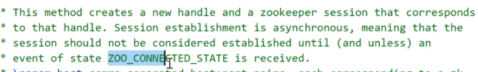

**我们在src下创建文件zookeeperutil.cc**

```cpp
#include "zookeeperutil.h"
#include "mprpcapplication.h"
#include <semaphore.h>
#include <iostream>

//全局的watcher观察器  zh表示zkserver给zkclient的通知
void global_watcher(zhandle_t *zh, int type,
                   int state, const char *path, void *watcherCtx)
{
    if (type == ZOO_SESSION_EVENT)//回调的消息类型  是和会话相关的消息类型
{
if (state == ZOO_CONNECTED_STATE)//zkclient和zkserver连接成功，才建立会话
{
sem_t *sem = (sem_t*)zoo_get_context(zh);//指定的句柄获取信号量
            sem_post(sem);//信号量资源加1
}
}
}

ZkClient::ZkClient() : m_zhandle(nullptr)
{
}

ZkClient::~ZkClient()//析构函数
{
    if (m_zhandle != nullptr)
    {
        zookeeper_close(m_zhandle);//关闭句柄，释放资源,相当于MySQL_Conn
    }
}

//连接zkserver，2181端口
void ZkClient::Start()
{
    std::string host = MprpcApplication::GetInstance().GetConfig().Load("zookeeperip");
    std::string port = MprpcApplication::GetInstance().GetConfig().Load("zookeeperport");
    std::string connstr = host + ":" + port;
    
/*
zookeeper_mt：多线程版本
zookeeper的API客户端程序提供了三个线程：
API调用线程 也就是当前线程 也就是调用的线程 zookeeper_init
网络I/O线程  zookeeper_init调用了pthread_create  poll专门连接网络
watcher回调线程 当客户端接收到zkserver的响应，再次调用pthread_create，产生watcher回调线程
*/
    m_zhandle = zookeeper_init(connstr.c_str(), global_watcher, 30000, nullptr, nullptr, 0);//global_watcher回调函数
//返回的就是句柄，会话的创建是异步的，并不是返回成功了就是表示连接成功的，等回调函数真正接收到zkserver响应进行回调

    if (nullptr == m_zhandle)//表示发起的动作没有产生，传的参数有问题
    {
        std::cout << "zookeeper_init error!" << std::endl;
        exit(EXIT_FAILURE);//直接退出
    }

    sem_t sem;//创建信号量
    sem_init(&sem, 0, 0);//初始化为0
    zoo_set_context(m_zhandle, &sem);//创建句柄资源成功后，向句柄资源上设置上下文，添加额外的信息

    sem_wait(&sem);//等待，因为初始的信号量是0，阻塞着，等着zkserver响应（回调）。等加1。成功了才向下走。
    std::cout << "zookeeper_init success!" << std::endl;//global_watcher执行成功，连接成功了
}

void ZkClient::Create(const char *path, const char *data, int datalen, int state)//创建节点
{
    char path_buffer[128];
    int bufferlen = sizeof(path_buffer);
    int flag;

//先判断path表示的znode节点是否存在，如果存在，就不再重复创建了
flag = zoo_exists(m_zhandle, path, 0, nullptr);
if (ZNONODE == flag)//表示path的znode节点不存在
{
//创建指定path的znode节点了
flag = zoo_create(m_zhandle, path, data, datalen,
&ZOO_OPEN_ACL_UNSAFE, state, path_buffer, bufferlen);
//句柄，路径，数据，数据长度，flag默认创建永久性
if (flag == ZOK)//创建成功
{
std::cout << "znode create success... path:" << path << std::endl;
}
else//创建失败
{
std::cout << "flag:" << flag << std::endl;
std::cout << "znode create error... path:" << path << std::endl;
exit(EXIT_FAILURE);
}
}
}

//根据指定的path，获取znode节点的值
std::string ZkClient::GetData(const char *path)
{
    char buffer[64];
int bufferlen = sizeof(buffer);
int flag = zoo_get(m_zhandle, path, 0, buffer, &bufferlen, nullptr);
if (flag != ZOK)//获取失败
{
std::cout << "get znode error... path:" << path << std::endl;
return "";
}
else
{
return buffer;
}
}
```

**下面这个表示永久性节点**  


**我们更新一下src的CMakeLists.txt**  


## zookeeper在mprpc项目上的实践

## 完善RPC服务的服务方

**服务发布方（RpcProvider）在zookeeper发布服务，消费者在zookeeper查找服务。**  
**我们完善mprpcprovider.cc**

```cpp
#include "mprpcprovider.h"
#include "mprpcapplication.h"
#include "rpcheader.pb.h" 
#include "logger.h"
#include "zookeeperutil.h"
/*
service_name =>对于 service描述   
                        =》对应 service* 记录服务对象
                        多个method_name  =>对应多个method方法对象
*/
//这里是框架提供给外部使用的，可以发布rpc方法的函数接口
void RpcProvider::NotifyService(google::protobuf::Service *service)
{
    ServiceInfo service_info;//结构体

    //获取了服务对象的描述信息
    const google::protobuf::ServiceDescriptor *pserviceDesc = service->GetDescriptor();
//因为返回类型是指针。获取服务对象的描述信息。存储名字之类的。

    //获取服务的名字
    std::string service_name = pserviceDesc->name();
    //获取服务对象service的方法的数量
    int methodCnt = pserviceDesc->method_count();

    //std::cout << "service_name:" << service_name << std::endl;
    LOG_INFO("service_name:%s", service_name.c_str());   

    for (int i=0; i < methodCnt; ++i)
    {
        //获取了服务对象指定下标的服务方法的描述（抽象的描述） UserService   Login
        const google::protobuf::MethodDescriptor* pmethodDesc = pserviceDesc->method(i);
        std::string method_name = pmethodDesc->name();
        service_info.m_methodMap.insert({method_name, pmethodDesc});//插入键值对到map中

        //std::cout<<"method_name:"<<method_name<<std::endl;//打印
        LOG_INFO("method_name:%s", method_name.c_str());
    }
    service_info.m_service = service;//记录服务对象
    m_serviceMap.insert({service_name, service_info});//存储一下服务及其具体的描述
}


//启动rpc服务节点，开始提供rpc远程网络调用服务
void RpcProvider::Run()
{
    //读取配置文件rpcserver的信息
    std::string ip = MprpcApplication::GetInstance().GetConfig().Load("rpcserverip");//ip
    uint16_t port = atoi(MprpcApplication::GetInstance().GetConfig().Load("rpcserverport").c_str());//port，因为atoi返回char *，所以要c_str()
    muduo::net::InetAddress address(ip, port);

    //创建TcpServer对象
    muduo::net::TcpServer server(&m_eventLoop, address, "RpcProvider");

    //绑定连接回调和消息读写回调方法 ，muduo库的好处是：分离了网络代码和业务代码
    server.setConnectionCallback(std::bind(&RpcProvider::OnConnection, this, std::placeholders::_1));//预留1个参数std::placeholders::_1
    server.setMessageCallback(std::bind(&RpcProvider::OnMessage, this, std::placeholders::_1, 
            std::placeholders::_2, std::placeholders::_3));//预留3个参数std::placeholders::_1,2,3

    //设置muduo库的线程数量
    server.setThreadNum(4);//1个是I/O线程，3个是工作线程

    //把当前rpc节点上要发布的服务全部注册到zk上面，让rpc client可以从zk上发现服务
    //session timeout   30s  zkclient 网络I/O线程  1/3 * timeout 时间发送ping消息
    ZkClient zkCli;
    zkCli.Start();//连接zkserver
    //service_name为永久性节点   method_name为临时性节点
    for (auto &sp : m_serviceMap) 
    {
        // /service_name   /UserServiceRpc
        std::string service_path = "/" + sp.first;
        zkCli.Create(service_path.c_str(), nullptr, 0);
        for (auto &mp : sp.second.m_methodMap)
        {
            // /service_name/method_name   /UserServiceRpc/Login 存储当前这个rpc服务节点主机的ip和port
            std::string method_path = service_path + "/" + mp.first;
            char method_path_data[128] = {0};
            sprintf(method_path_data, "%s:%d", ip.c_str(), port);
            //ZOO_EPHEMERAL表示znode是一个临时性节点，和zkserver断了，就是表示不提供这个RPC服务了，所以ZK自动删掉就好啦。
            zkCli.Create(method_path.c_str(), method_path_data, strlen(method_path_data), ZOO_EPHEMERAL);
        }
    }
    
    //rpc服务端准备启动，打印信息
    std::cout << "RpcProvider start service at ip:" << ip << " port:" << port << std::endl;
    
    //启动网络服务
    server.start();
    m_eventLoop.loop();//相当于启动了epoll_wait，阻塞，等待远程连接
}

//新的socket连接回调
void RpcProvider::OnConnection(const muduo::net::TcpConnectionPtr &conn)
{
    if (!conn->connected())
    {
        //和rpc client的连接断开了
        conn->shutdown();//关闭文件描述符 
    }
}

/*
在框架内部，RpcProvider和RpcConsumer协商好之间通信用的protobuf数据类型
怎么商量呢？ 
包含：service_name  method_name   args   
对应：16UserService   Login    zhang san123456   
我们在框架中定义proto的message类型，进行数据头的序列化和反序列化
service_name method_name args_size(防止粘包的问题) 

怎么去区分哪个是service_name, method_name, args
我们把消息头表示出来 
header_size(4个字节) + header_str + args_str
前面几个字节是服务名和方法名。 
为了防止粘包，我们还要记录参数的字符串的长度 
我们统一：一开始读4个字节，数据头的长度，也就是除了方法参数之外的所有数据：服务名字和方法名字 
10 "10"
10000 "1000000"
std::string   insert和copy方法 
*/

//已建立连接用户的读写事件回调,如果远程有一个rpc服务的调用请求，那么OnMessage方法就会响应
void RpcProvider::OnMessage(const muduo::net::TcpConnectionPtr &conn, 
                            muduo::net::Buffer *buffer, 
                            muduo::Timestamp)
{
    //网络上接收的远程rpc调用请求的字符流 包含了RPC方法的名字Login和参数args
    std::string recv_buf = buffer->retrieveAllAsString();

    //从字符流中读取前4个字节的内容
    uint32_t header_size = 0;
    recv_buf.copy((char*)&header_size, 4, 0);//从0下标位置拷贝4个字节的内容到header_size 

    std::string rpc_header_str = recv_buf.substr(4, header_size);
//从第4个下标，前4个字节略过。读取包含了service_name method_name args_size 
//根据header_size读取数据头的原始字符流，反序列化数据，得到rpc请求的详细信息
    mprpc::RpcHeader rpcHeader;
    std::string service_name;
    std::string method_name;
    uint32_t args_size;
    if (rpcHeader.ParseFromString(rpc_header_str))
    {
        //数据头反序列化成功
        service_name = rpcHeader.service_name();
        method_name = rpcHeader.method_name();
        args_size = rpcHeader.args_size();
    }
    else
    {
        //数据头反序列化失败
        std::cout << "rpc_header_str:" << rpc_header_str << " parse error!" << std::endl;
        return;//不用往后走了 
    }

    //获取rpc方法参数的字符流数据
    std::string args_str = recv_buf.substr(4 + header_size, args_size);
    //header_size(4个字节) + header_str + args_str

    //打印调试信息
    std::cout << "============================================" << std::endl;
    std::cout << "header_size: " << header_size << std::endl; 
    std::cout << "rpc_header_str: " << rpc_header_str << std::endl; 
    std::cout << "service_name: " << service_name << std::endl; 
    std::cout << "method_name: " << method_name << std::endl; 
    std::cout << "args_str: " << args_str << std::endl; 
    std::cout << "============================================" << std::endl;
     
    //获取service对象和method对象
    auto it = m_serviceMap.find(service_name);//用[]会有副作用 
    if (it == m_serviceMap.end())//根本没有的服务 
    {
        std::cout << service_name << " is not exist!" << std::endl;
        return;
    }

    auto mit = it->second.m_methodMap.find(method_name);
    if (mit == it->second.m_methodMap.end())//服务里没有这个方法 
    {
        std::cout << service_name << ":" << method_name << " is not exist!" << std::endl;
        return;
    }

    google::protobuf::Service *service = it->second.m_service;//获取service对象  对应的就是像new UserService这种 
    const google::protobuf::MethodDescriptor *method = mit->second;//获取method对象 对应的是像Login这种 

    //生成rpc方法调用的请求request和响应response参数
    google::protobuf::Message *request = service->GetRequestPrototype(method).New();
//在框架以抽象的方式表示。new生成新对象，传给userservice 

    if (!request->ParseFromString(args_str))//解析 
    {
        std::cout << "request parse error, content:" << args_str << std::endl;
        return;
    }
    google::protobuf::Message *response = service->GetResponsePrototype(method).New();//响应 

    //CallMethod需要closure参数
//给下面的method方法的调用，绑定一个Closure的回调函数
    google::protobuf::Closure *done = google::protobuf::NewCallback<RpcProvider, 
                                                                    const muduo::net::TcpConnectionPtr&, 
                                                                    google::protobuf::Message*>
                                                                    (this, 
                                                                    &RpcProvider::SendRpcResponse, 
                                                                    conn, response);

    //在框架上根据远端rpc请求，调用当前rpc节点上发布的方法
    
    service->CallMethod(method, nullptr, request, response, done);//做完本地业务，根据结果写好reponse给框架，框架再给调用方 
    //相当于new UserService().Login(controller, request, response, done)
}

//Closure的回调操作，用于序列化rpc的响应和网络发送
void RpcProvider::SendRpcResponse(const muduo::net::TcpConnectionPtr& conn, google::protobuf::Message *response)
{
    std::string response_str;
    if (response->SerializeToString(&response_str))//对response进行序列化
    {
        //序列化成功后，通过网络把rpc方法执行的结果发送会rpc的调用方
        conn->send(response_str);
    }
    else//序列化失败
    {
        std::cout << "serialize response_str error!" << std::endl; 
    }
    conn->shutdown(); //模拟http的短链接服务，由rpcprovider主动断开连接，给更多的rpc调用方提供服务
}
```

**保存。编译。**  
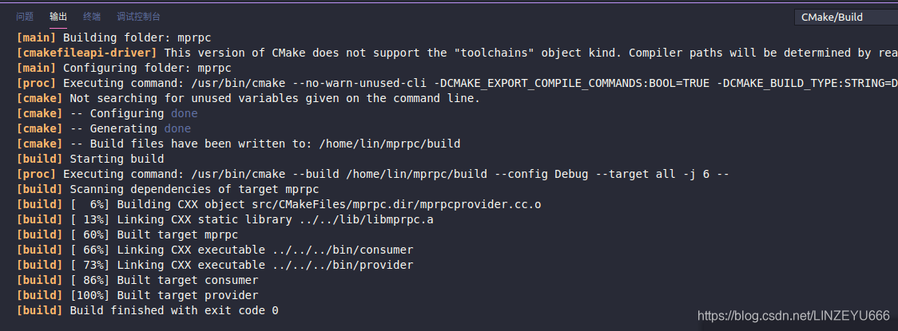  
**我们打开终端运行看看。**  
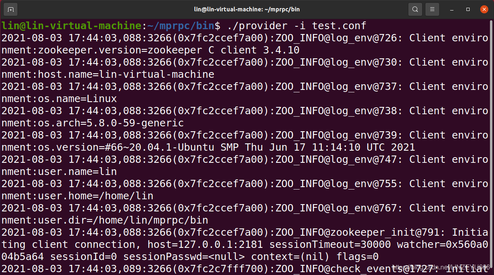

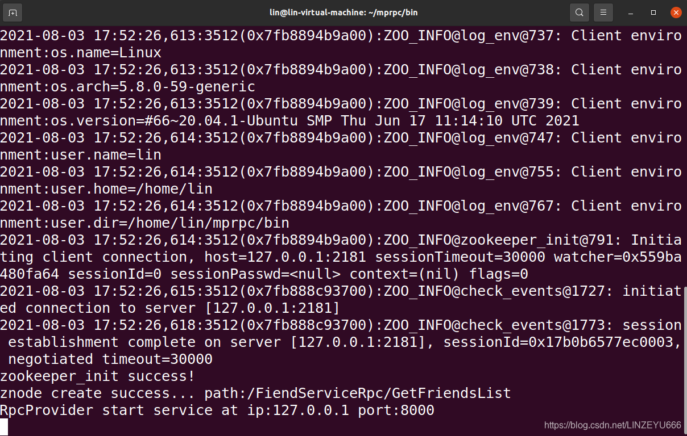

**我们打开zookeeper客户端查看**

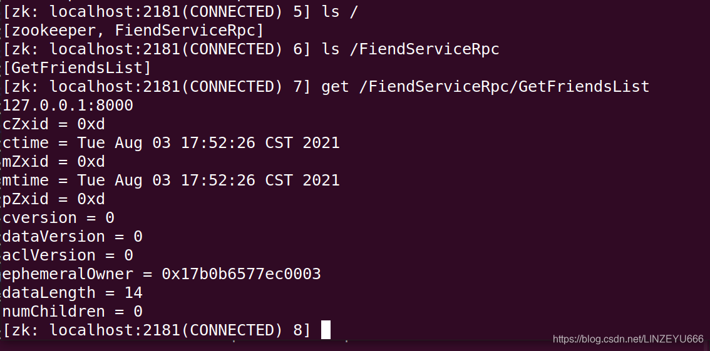

## tcpdump抓包

**ifconfig**  
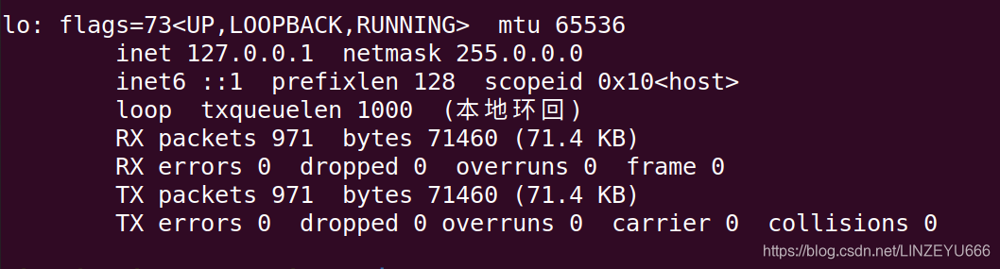

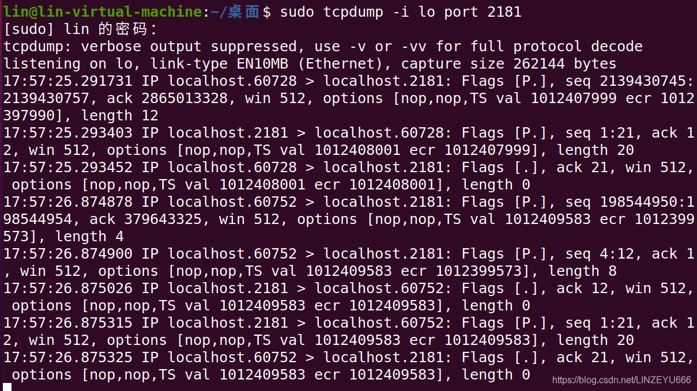  
30秒的timeout时间  
**源码上会在1/3的Timeout时间发送ping心跳消息**  
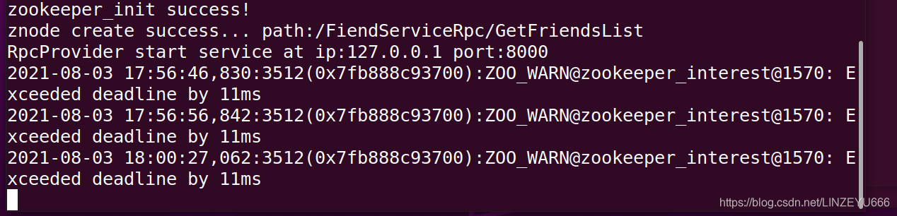

## 完善RPC服务的调用方

**我们完善mprpcchannel.cc**

```cpp
#include <string>
#include "rpcheader.pb.h"
#include <sys/types.h>
#include <sys/socket.h>
#include <arpa/inet.h>
#include <netinet/in.h>
#include <unistd.h>
#include <errno.h>
#include "mprpcapplication.h"
#include <iostream>
#include "zookeeperutil.h"

/*
消息的格式是：
header_size + service_name method_name args_size + args
*/
// 所有通过stub代理对象调用的rpc方法，都走到这里了，统一做rpc方法调用的数据数据序列化和网络发送 
void MprpcChannel::CallMethod(const google::protobuf::MethodDescriptor* method,
                                google::protobuf::RpcController* controller, 
                                const google::protobuf::Message* request,
                                google::protobuf::Message* response,
                                google::protobuf:: Closure* done)
{
    const google::protobuf::ServiceDescriptor* sd = method->service();//知道这个方法属于哪个服务对象的
    std::string service_name = sd->name();//service_name
    std::string method_name = method->name();//method_name

    //获取参数的序列化字符串长度args_size
    uint32_t args_size = 0;
    std::string args_str;
    if (request->SerializeToString(&args_str))//序列化成功
    {
        args_size = args_str.size();
    }
    else//获取失败
    {
        controller->SetFailed("serialize request error!");
        return;
    }
    
    //定义rpc的请求header
    mprpc::RpcHeader rpcHeader;
    rpcHeader.set_service_name(service_name);
    rpcHeader.set_method_name(method_name);
    rpcHeader.set_args_size(args_size);

    uint32_t header_size = 0;
    std::string rpc_header_str;
    if (rpcHeader.SerializeToString(&rpc_header_str))//序列化成功
    {
        header_size = rpc_header_str.size();
    }
    else//序列化失败
    {
        controller->SetFailed("serialize rpc header error!");
        return;
    }

    //组织待发送的rpc请求的字符串
    std::string send_rpc_str;
    send_rpc_str.insert(0, std::string((char*)&header_size, 4));//header_size，从开头开始，写4个字节，二进制存储head_size，就是一个整数
    send_rpc_str += rpc_header_str;//rpcheader
    send_rpc_str += args_str;//args
//string类的好处

    //打印调试信息
    std::cout << "============================================" << std::endl;
    std::cout << "header_size: " << header_size << std::endl; 
    std::cout << "rpc_header_str: " << rpc_header_str << std::endl; 
    std::cout << "service_name: " << service_name << std::endl; 
    std::cout << "method_name: " << method_name << std::endl; 
    std::cout << "args_str: " << args_str << std::endl; 
    std::cout << "============================================" << std::endl;

    //因为是客户端，消费者，不需要高并发，只需要使用tcp编程，完成rpc方法的远程调用
    int clientfd = socket(AF_INET, SOCK_STREAM, 0);//连接套接字
    if (-1 == clientfd)//连接失败
    {
        char errtxt[512] = {0};
        sprintf(errtxt, "create socket error! errno:%d", errno);
        controller->SetFailed(errtxt);
        return;
    }
    
    //读取配置文件rpcserver的信息
    //std::string ip = MprpcApplication::GetInstance().GetConfig().Load("rpcserverip");
    //uint16_t port = atoi(MprpcApplication::GetInstance().GetConfig().Load("rpcserverport").c_str());
    //rpc调用方想调用service_name的method_name服务，需要查询zk上该服务所在的host信息
    ZkClient zkCli;
    zkCli.Start();
    //  /UserServiceRpc/Login
    std::string method_path = "/" + service_name + "/" + method_name;
    //127.0.0.1:8000
    std::string host_data = zkCli.GetData(method_path.c_str());
    if (host_data == "")
    {
        controller->SetFailed(method_path + " is not exist!");
        return;
    }
    int idx = host_data.find(":");
    if (idx == -1)
    {
        controller->SetFailed(method_path + " address is invalid!");
        return;
    }
    std::string ip = host_data.substr(0, idx);
    uint16_t port = atoi(host_data.substr(idx+1, host_data.size()-idx).c_str()); 

    struct sockaddr_in server_addr;
    server_addr.sin_family = AF_INET;
    server_addr.sin_port = htons(port);
    server_addr.sin_addr.s_addr = inet_addr(ip.c_str());

    //发起连接。连接rpc服务节点
    if (-1 == connect(clientfd, (struct sockaddr*)&server_addr, sizeof(server_addr)))
    {
        close(clientfd);
        char errtxt[512] = {0};
        sprintf(errtxt, "connect error! errno:%d", errno);
        controller->SetFailed(errtxt);
        return;
    }

    //连接成功后，发送rpc请求
    if (-1 == send(clientfd, send_rpc_str.c_str(), send_rpc_str.size(), 0))
   {
        close(clientfd);
        char errtxt[512] = {0};
        sprintf(errtxt, "send error! errno:%d", errno);
        controller->SetFailed(errtxt);
        return;
    }

    //接收rpc请求的响应值
    char recv_buf[1024] = {0};
    int recv_size = 0;
    if (-1 == (recv_size = recv(clientfd, recv_buf, 1024, 0)))
    {
        close(clientfd);
        char errtxt[512] = {0};
        sprintf(errtxt, "recv error! errno:%d", errno);
        controller->SetFailed(errtxt);
        return;
    }

    //反序列化rpc调用的响应数据
    //std::string response_str(recv_buf, 0, recv_size);//有bug,会出现问题，recv_buf中遇到\0后面的数据就存不下来了，导致反序列化失败
    //if (!response->ParseFromString(response_str))
    if (!response->ParseFromArray(recv_buf, recv_size))//反序列化，填到response里面
    {
        close(clientfd);
        char errtxt[512] = {0};
        sprintf(errtxt, "parse error! response_str:%s", recv_buf);
        controller->SetFailed(errtxt);
        return;
    }

    close(clientfd);
}
```

**保存。编译。**  
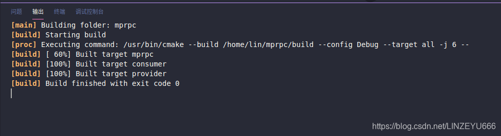  
**我们打开2个终端，分别启动provider和consumer**  
**我们先启动provider**  
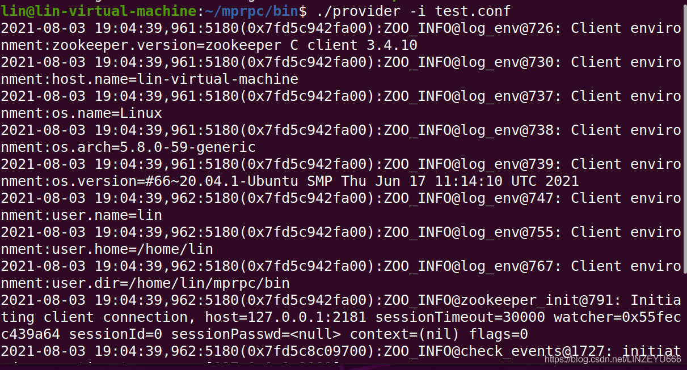  
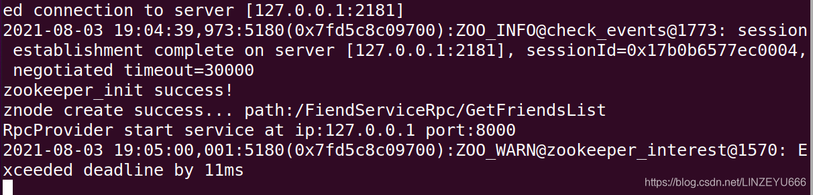  
**我们在另一个终端启动consumer**  
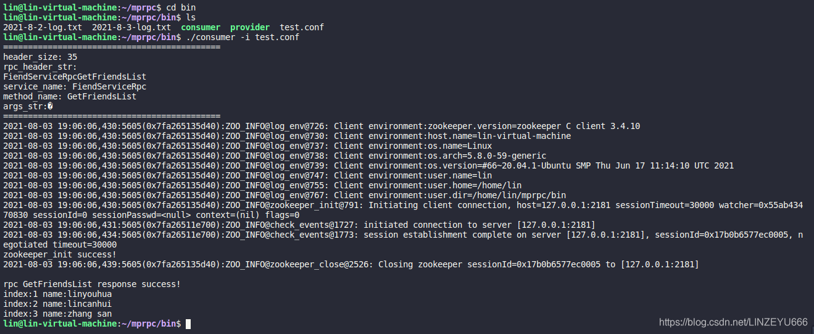  
**执行成功！**

## consumer首先连接zk，拿到想调用的RPC服务的IP地址和端口，然后才去连接provider