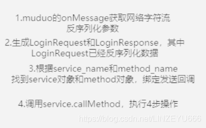
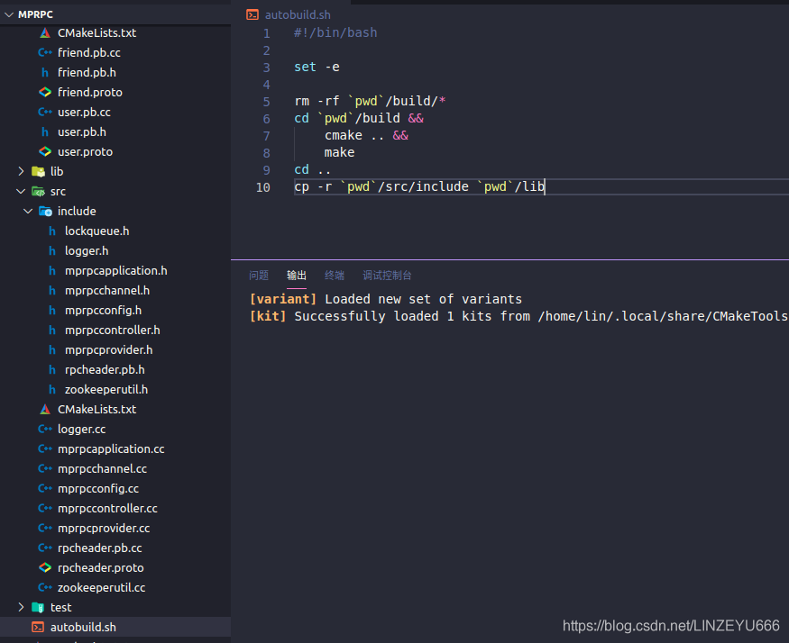
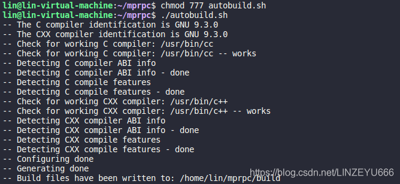
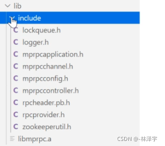

## mprpc框架项目总结


**首先，我们在使用框架的时候，框架体现出3个模块。**  
1个是RPC服务的调用方（mprpcchannel）。  
1个是RPC服务的提供方（mprpcprovider）。  
1个是[ZooKeeper](https://so.csdn.net/so/search?q=ZooKeeper&spm=1001.2101.3001.7020)，作为服务配置中心。

**提供服务的节点先启动**，和ZK创建会话（[session](https://so.csdn.net/so/search?q=session&spm=1001.2101.3001.7020)），然后在里面维护了一个RPC方法的map表，想发布服务会调用notifyservice函数，把发布服务的对象和RPC方法写到map表，然后通过ZKclient把这些服务和方法都注册在ZK上，放在相应的znode节点上，可以看一下图右边的根目录形式的写法。  
然后RPC服务的提供者就会去启动网络服务，采用的是muduo库，设置了4个线程，自动分配1个I/O线程和3个work线程，muduo绑定回调，（绑定了OnConnection和OnMessage），调用了start和loop方法，RPC服务节点就开始启动了。  
**然后RPC服务的调用方就发起了调用**，首先通过stub代理对象调用RPC方法，最终都是调用channel的CallMethod方法，统一进行参数的打包，数据的序列化，获取ZK的服务的IP地址和端口号，发起RPC调用。  
**在ZK查到调用服务的IP地址和端口号以后**，用header组装数据。header\_size表示rpcheader的长度。  
rpcheader包括servicename,methodname,和args的长度（防止粘包）。  
**建立RPC服务方建立连接后**  
**然后发起RPC调用请求。**  
**然后就是mprpcprovider的OnMessag做的事情。**  
  
**执行业务方的RPC方法做4步操作。**  
**最后RPC服务方执行done-> run,进行数据响应的序列化通过网络发送到RPC服务的调用方。**  
**然后RPC服务方主动关闭这条连接**

## 一键编译脚本代码

**完善autobuild.sh**

```xml
#!/bin/bash

set -e

rm -rf `pwd`/build/*
cd `pwd`/build &&
cmake .. &&
make
cd ..
cp -r `pwd`/src/include `pwd`/lib
```

  
**一键编译**  
  
  
我们可以把生成的libmprpc.a放在/usr/local/lib下或者 /usr/lib下  
生成的头文件放在/user/include 或者/user/local/include下  
别人使用的话就可以默认查到到 否则就要指定路径了