笔记23-26内容

## 介绍

客户端使用`RpcChannel`对象来构造`UserServiceRpc_Stub`对象，并利用该对象中`RpcChannel::CallMethod`来进行rpc调用请求,`RpcChannel`完成的工作是如下rpc调用流程图的红圈部分：

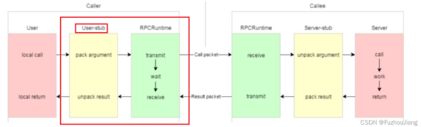

## 客户端使用mp[rpc框架](https://so.csdn.net/so/search?q=rpc%E6%A1%86%E6%9E%B6&spm=1001.2101.3001.7020)的业务代码

在example/caller中新建calluserservice.cc

1.程序启动后，想使用mprpc框架提供的rpc服务调用，一定要先调用框架的初始化函数

2.使用UserServiceRpc_Stub类对象来调用远程发布的rpc方法，传入的参数是RpcChannel

```C++
class UserServiceRpc_Stub : public UserServiceRpc {
 public:
  UserServiceRpc_Stub(::PROTOBUF_NAMESPACE_ID::RpcChannel* channel);
  UserServiceRpc_Stub(::PROTOBUF_NAMESPACE_ID::RpcChannel* channel,
                   ::PROTOBUF_NAMESPACE_ID::Service::ChannelOwnership ownership);
  ~UserServiceRpc_Stub();

  inline ::PROTOBUF_NAMESPACE_ID::RpcChannel* channel() { return channel_; }

  // implements UserServiceRpc ------------------------------------------

  void Login(::PROTOBUF_NAMESPACE_ID::RpcController* controller,
                       const ::fixbug::LoginRequest* request,
                       ::fixbug::LoginResponse* response,
                       ::google::protobuf::Closure* done);
 private:
  ::PROTOBUF_NAMESPACE_ID::RpcChannel* channel_;
  bool owns_channel_;
  GOOGLE_DISALLOW_EVIL_CONSTRUCTORS(UserServiceRpc_Stub);
};
```

并且我们发现它userservicerpcstub其中也包含Login rpc方法，这个方法在执行的时候，都是调用我们通过构造函数传入的RpcChannel的CallMethod的方法。

==所有通过桩类调用的rpc方法最终都转到rpc channel的call method方法上==

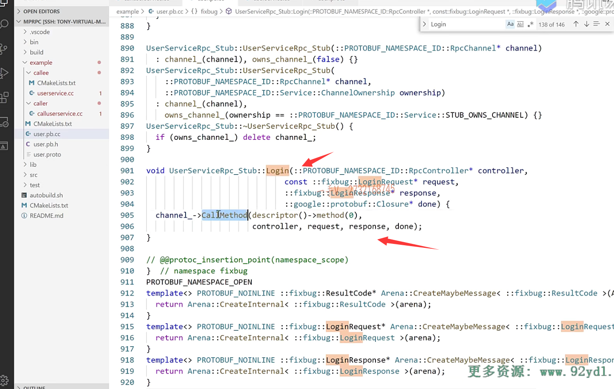

### 完成请求响应过程梳理

1.rpc调用请求发出，rpc调用方就会wait等待阻塞在这里。

2.rpc请求被rpc provider接收到，就会调用onMessage回调函数，接收网络字符流，然后进行反序列化，得到服务对象，服务方法，调用CallMethod方法，调用了rpc provider的本地服务login,然后done->run()，将login response序列化后通过网络发送返回。

3.然后Rpc Consumer再对响应进行反序列化，再报给rpc调用方应用程序你的rpc请求得到结果了。

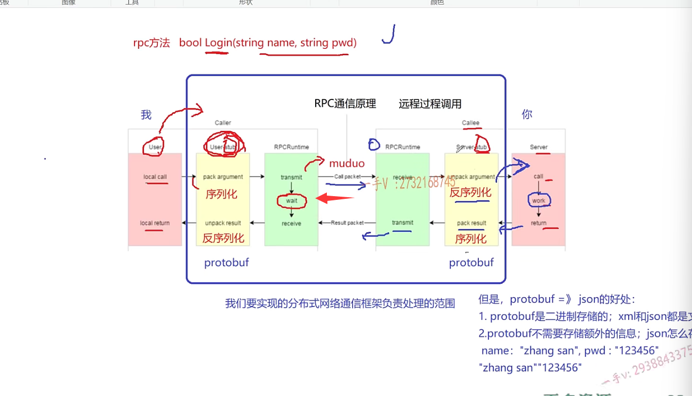


### calluserservice.cc具体实现

1.程序启动后，想使用mprpc框架提供的rpc服务调用，一定要先调用框架的初始化函数

2.使用UserServiceRpc_Stub类对象来调用远程发布的rpc方法，传入的参数是RpcChannel

3.rpc方法请求参数组织，rpc请求只需定义，由provider处理

4.stub.login底层都是转发到RpcChannel::CallMethod方法多态调用,所以要实现一个继承自 RpcChannel 的类，并重写CallMethod方法

5. 一次rpc 调用完成，读调用的结果

```cpp
// calluserservice.cc
#include <iostream>
#include "mprpcapplication.h"
#include "mprpcchannel.h"
#include "user.pb.h"

int main(int argc, char **argv)
{
    // 1.程序启动后，想使用mprpc框架提供的rpc服务调用，一定要先调用框架的初始化函数
    MprpcApplication::Init(argc, argv);

    // 演示调用远程发布的rpc方法Login
    fixbug::UserServiceRpc_Stub stub(new MprpcChannel());
    // rpc方法请求参数组织
    fixbug::LoginRequest request;
    request.set_name("li si");
    request.set_pwd("123456");
    // rpc方法的响应
    fixbug::LoginResponse response;
    // 发起rpc方法调用，同步的rpc调用过程
    // 底层都是转发到RpcChannel::CallMethod方法多态调用
    // 所以要实现一个继承自 RpcChannel 的类，并重写CallMethod方法
    stub.Login(nullptr, &request, &response, nullptr);

    // 一次rpc 调用完成，读调用的结果
    if (0 == response.result().errcode())
    {
        std::cout << "rpc login success:" << response.success() << std::endl;
    }
    else 
    {
        std::cout << "rpc login response error :" << response.result().errcode() << std::endl;
    }

    return 0;
}
```


# MprpcChannel类实现

因为我们使用UserServiceRpc_Stub来创建rpc调用对象，然后使用stub.login去调用provider处的login方法，最后都是转到rpcchannel中的callmethod方法，并且RpcChannel中的callmethod都是纯虚函数，需要我们定义派生类来继承后并重写此抽象方法。

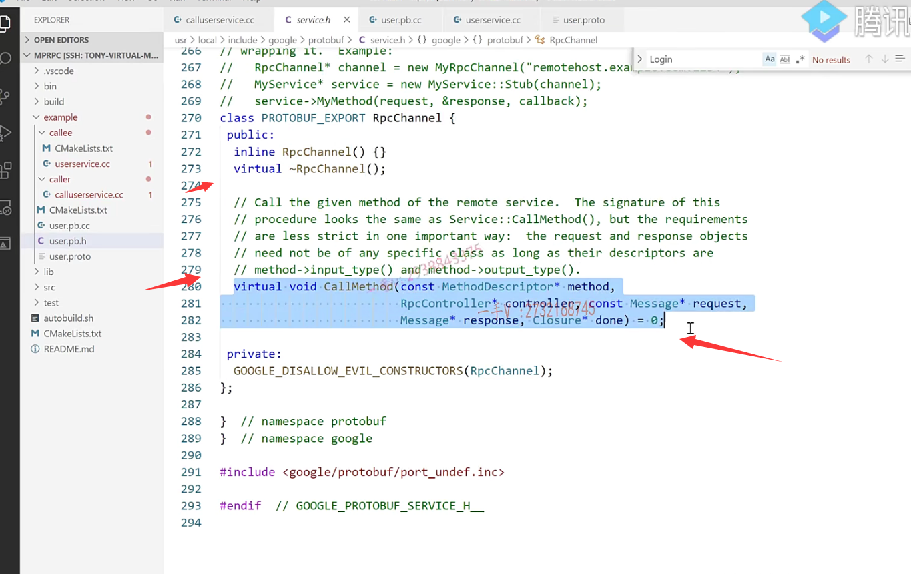

## MprpcChannel类具体实现

所以我们在src/include 中创建mprpcchannel.h文件

`MprpcChannel`是`mprpc`框架提供给客户端进行rpc调用

```cpp
// mprpcchannel.h
#pragma once
#include <google/protobuf/service.h>
#include <google/protobuf/descriptor.h>
#include <google/protobuf/message.h>

class MprpcChannel : public google::protobuf::RpcChannel //
{
public:
    // 客户端都是通过stub代理对象调用rpc方法，都到转发到这里调用，做rpc方法的数据序列化和网络发送
    void CallMethod(const google::protobuf::MethodDescriptor* method,
                          google::protobuf::RpcController* controller, const google::protobuf::Message* request,
                          google::protobuf::Message* response, google::protobuf::Closure* done); 
};

```

在src 中创建mprpcchannel.cpp

### rpc请求的序列化

主要目的是通过request的消息类结构来组织rpc调用请求字符串

这个字符串之前我们就已经定义过了，就是header_size + service_name method_name args_size + args组成的

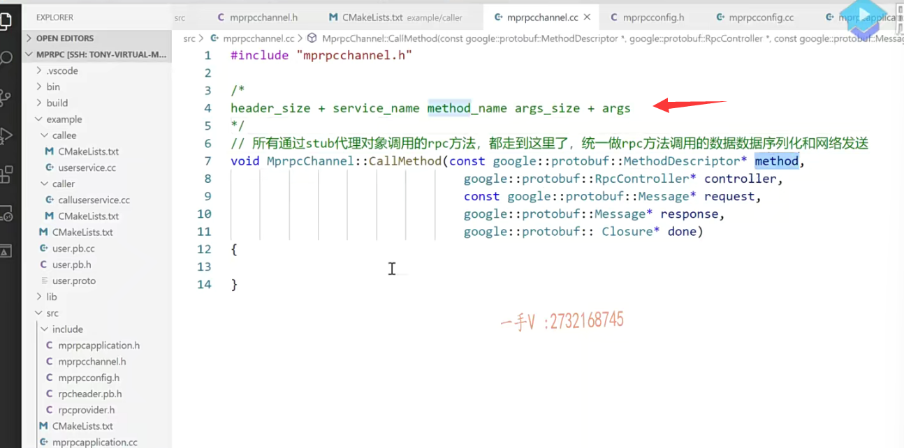

1.MethodDescriptor中有sercive()方法可以通过方法对象获取到服务对象指针，然后可以去获取服务对象名称，方法名称本身就可以通过name()方法获得。

2.将方法参数，即request Message类型通过SerializeToString序列化成字符串args_str，并且获取其长度args_size。

3.定义rpc的请求header,即rpcheader Message类型，主要是将之前服务对象名称，方法名称，方法参数大小放入rpcheader类对象中，然后进行序列化成为字符串rpc_header_str,再得到其大小rpc_header_size

4.组织待发送的rpc请求的字符串send_rpc_str,使用insert将整数转化为字符串，然后再加上之前序列化的rpcheader和args_str

```C++
void MprpcChannel::CallMethod(const google::protobuf::MethodDescriptor* method,
                                google::protobuf::RpcController* controller, 
                                const google::protobuf::Message* request,
                                google::protobuf::Message* response,
                                google::protobuf:: Closure* done)
{
    const google::protobuf::ServiceDescriptor* sd = method->service();
    std::string service_name = sd->name(); // service_name
    std::string method_name = method->name(); // method_name

    // 获取参数的序列化字符串长度 args_size
    uint32_t args_size = 0;
    std::string args_str;
    if (request->SerializeToString(&args_str))
    {
        args_size = args_str.size();
    }
    else
    {
        controller->SetFailed("serialize request error!");
        return;
    }
    
    // 定义rpc的请求header
    mprpc::RpcHeader rpcHeader;
    rpcHeader.set_service_name(service_name);
    rpcHeader.set_method_name(method_name);
    rpcHeader.set_args_size(args_size);

    uint32_t header_size = 0;
    std::string rpc_header_str;
    if (rpcHeader.SerializeToString(&rpc_header_str))
    {
        header_size = rpc_header_str.size();
    }
    else
    {
        controller->SetFailed("serialize rpc header error!");
        return;
    }

    // 组织待发送的rpc请求的字符串
    std::string send_rpc_str;
    send_rpc_str.insert(0, std::string((char*)&header_size, 4)); // header_size
    send_rpc_str += rpc_header_str; // rpcheader
    send_rpc_str += args_str; // args

    // 打印调试信息
    std::cout << "============================================" << std::endl;
    std::cout << "header_size: " << header_size << std::endl; 
    std::cout << "rpc_header_str: " << rpc_header_str << std::endl; 
    std::cout << "service_name: " << service_name << std::endl; 
    std::cout << "method_name: " << method_name << std::endl; 
    std::cout << "args_str: " << args_str << std::endl; 
    std::cout << "============================================" << std::endl;
}
```

完成了黄色部分

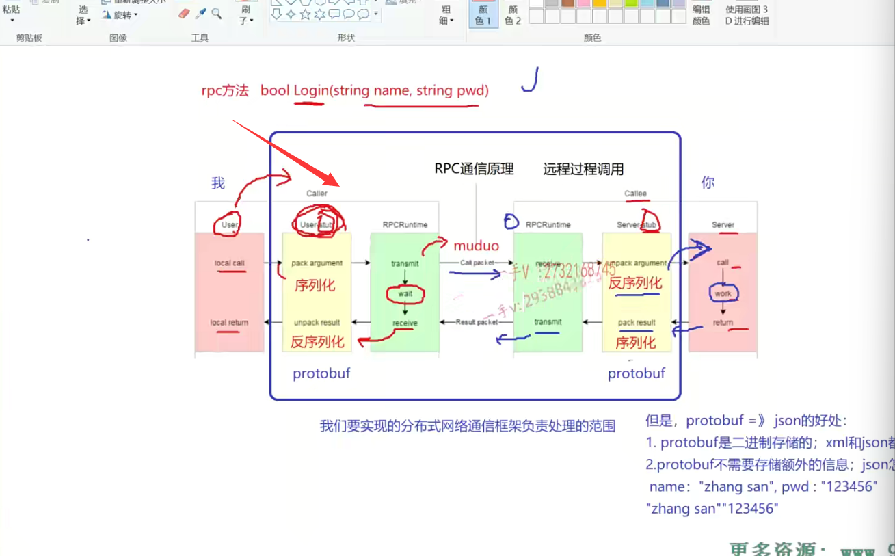

### 利用TCP编程完成rpc方法的远程调用

继续完成绿色部分,发送rpc调用请求

1.已经进行过mprpc框架的初始化，可以通过MprpcApplication类获取配置信息，读取rpc serverip,port

2.创建socket,绑定ip，port,使用connect()连接rpc服务节点和send)方法发送rpc请求

3.等待接收rpc请求的响应值，记录接收的字符串的大小

4.反序列化rpc调用的响应数据，这个响应就是纯方法参数，所以可以直接反序列化response->ParseFromArray()，数据填充到response中。

- 不使用ParseFromString是因为std::string response_str(recv_buf, 0, recv_size)  bug出现问题，recv_buf中遇到\0后面的数据就存不下来了，导致反序列化失败

```C++
   // 4.使用tcp编程，完成rpc方法的远程调用
    int clientfd = socket(AF_INET, SOCK_STREAM, 0);
    if(-1 == clientfd)
    {
        char errtxt[512] = {0};
        sprintf(errtxt, "create socket error! errno:%d", errno);
        std::cout << errtxt << std::endl;
        return ;
    }

    // 这个函数是从usercallservice.cc的main()进入，已调用过Init函数获得配置信息
    // 读取配置文件rpcserver信息
    std::string ip = MprpcApplication::GetInstance().GetConfig().Load("rpcserverip");
    uint16_t port = atoi(MprpcApplication::GetInstance().GetConfig().Load("rpcserverport").c_str());

    struct sockaddr_in server_addr;
    server_addr.sin_family = AF_INET;
    server_addr.sin_port = htons(port);
    server_addr.sin_addr.s_addr = inet_addr(ip.c_str());

    // 连接rpc服务节点
    if(-1 == connect(clientfd, (struct sockaddr*)&server_addr, sizeof(server_addr)))
    {
        close(clientfd);
        char errtxt[512] = {0};
        sprintf(errtxt, "connect error! errno:%d", errno);
        std::cout << errtxt << std::endl;
        return ;
    }

    // 发送rpc请求
    if(-1 == send(clientfd, send_rpc_str.c_str(), send_rpc_str.size(), 0))
    {
        close(clientfd);
        char errtxt[512] = {0};
        sprintf(errtxt, "send error! errno:%d", errno);
        std::cout << errtxt << std::endl;
        return ;
    }

    // 接收rpc请求的响应
    char recv_buf[1024] = {0};
    int recv_size = 0;
    if(-1 == (recv_size = recv(clientfd, recv_buf, 1024, 0)))
    {
        close(clientfd);
        char errtxt[512] = {0};
        sprintf(errtxt, "recv error! errno:%d", errno);
        std::cout << errtxt << std::endl;
        return ;
    }
	// 反序列化rpc调用的响应数据
    // std::string response_str(recv_buf, 0, recv_size); // bug出现问题，recv_buf中遇到\0后面的数据就存不下来了，导致反序列化失败
    // if (!response->ParseFromString(response_str))
    // 5.反序列化收到的rpc调用的响应数据
    if(!response->ParseFromArray(recv_buf, recv_size))
    {
        close(clientfd);
        char errtxt[1024] = {0};
        sprintf(errtxt, "parse error! response_str:%s", recv_buf);
        std::cout << errtxt << std::endl;
        return ;
    }

    close(clientfd);
```


总的实现

```cpp
// mprpcchannel.cpp
#include "mprpcchannel.h"
#include <string>
#include "rpcheader.pb.h"
#include <sys/types.h>
#include <sys/socket.h>
#include <arpa/inet.h>
#include <netinet/in.h>
#include <unistd.h>
#include <errno.h>
#include "mprpcapplication.h"

// 客户端都是通过stub代理对象调用rpc方法，都到转发到这里调用，做rpc方法的数据序列化和网络发送
void MprpcChannel::CallMethod(const google::protobuf::MethodDescriptor* method,
                          google::protobuf::RpcController* controller, const google::protobuf::Message* request,
                          google::protobuf::Message* response, google::protobuf::Closure* done)
{
    const google::protobuf::ServiceDescriptor *sd = method->service();
    std::string service_name = sd->name();
    std::string method_name = method->name();

    // 1.获取方法参数的序列化字符串长度
    uint32_t args_size = 0;
    std::string args_str;
    if(request->SerializeToString(&args_str))
    {
        args_size = args_str.size();
    }
    else 
    {
        std::cout << "serialize request error!" << std::endl;
        return;
    }

    // 2.定义rpc的请求header
    mprpc::RpcHeader rpcHeader;
    rpcHeader.set_service_name(service_name);
    rpcHeader.set_method_name(method_name);
    rpcHeader.set_args_size(args_size);

    uint32_t header_size = 0;
    std::string rpc_header_str;
    if(rpcHeader.SerializeToString(&rpc_header_str))
    {
        header_size = rpc_header_str.size();
    }
    else 
    {
        std::cout << "serialize rpc header error!" << std::endl;
        return;
    }
    // header_size | service_name | method_name| args_size | args_str(name password)
    // 3.组织待发送的rpc请求字符串（注意这里发送字符串的内容
    std::string send_rpc_str;
    send_rpc_str.insert(0, std::string((char*)&header_size, 4));
    send_rpc_str += rpc_header_str;
    send_rpc_str += args_str;

    // 打印调试信息
    std::cout << "============================================" << std::endl;
    std::cout << "header_size: " << header_size << std::endl; 
    std::cout << "rpc_header_str: " << rpc_header_str << std::endl; 
    std::cout << "service_name: " << service_name << std::endl; 
    std::cout << "method_name: " << method_name << std::endl; 
    std::cout << "args_str: " << args_str << std::endl; 
    std::cout << "============================================" << std::endl;

    // 4.使用tcp编程，完成rpc方法的远程调用
    int clientfd = socket(AF_INET, SOCK_STREAM, 0);
    if(-1 == clientfd)
    {
        char errtxt[512] = {0};
        sprintf(errtxt, "create socket error! errno:%d", errno);
        std::cout << errtxt << std::endl;
        return ;
    }

    // 这个函数是从usercallservice.cc的main()进入，已调用过Init函数获得配置信息
    // 读取配置文件rpcserver信息
    std::string ip = MprpcApplication::GetInstance().GetConfig().Load("rpcserverip");
    uint16_t port = atoi(MprpcApplication::GetInstance().GetConfig().Load("rpcserverport").c_str());

    struct sockaddr_in server_addr;
    server_addr.sin_family = AF_INET;
    server_addr.sin_port = htons(port);
    server_addr.sin_addr.s_addr = inet_addr(ip.c_str());

    // 连接rpc服务节点
    if(-1 == connect(clientfd, (struct sockaddr*)&server_addr, sizeof(server_addr)))
    {
        close(clientfd);
        char errtxt[512] = {0};
        sprintf(errtxt, "connect error! errno:%d", errno);
        std::cout << errtxt << std::endl;
        return ;
    }

    // 发送rpc请求
    if(-1 == send(clientfd, send_rpc_str.c_str(), send_rpc_str.size(), 0))
    {
        close(clientfd);
        char errtxt[512] = {0};
        sprintf(errtxt, "send error! errno:%d", errno);
        std::cout << errtxt << std::endl;
        return ;
    }

    // 接收rpc请求的响应
    char recv_buf[1024] = {0};
    int recv_size = 0;
    if(-1 == (recv_size = recv(clientfd, recv_buf, 1024, 0)))
    {
        close(clientfd);
        char errtxt[512] = {0};
        sprintf(errtxt, "recv error! errno:%d", errno);
        std::cout << errtxt << std::endl;
        return ;
    }

    // 5.反序列化收到的rpc调用的响应数据
    // 反序列化rpc调用的响应数据
    // std::string response_str(recv_buf, 0, recv_size); // bug出现问题，recv_buf中遇到\0后面的数据就存不下来了，导致反序列化失败
    // if (!response->ParseFromString(response_str))
    if(!response->ParseFromArray(recv_buf, recv_size))
    {
        close(clientfd);
        char errtxt[1024] = {0};
        sprintf(errtxt, "parse error! response_str:%s", recv_buf);
        std::cout << errtxt << std::endl;
        return ;
    }

    close(clientfd);
}

```

## 编译

src下CMakeLists.txt添加rpcchannel.cpp

```shell
#aux_source_directory(. SRC_LIST)
set(SRC_LIST 
    mprpcapplication.cpp
    mprpcconfig.cpp
    rpcprovider.cpp
    rpcheader.pb.cc
    mprpcchannel.cpp)
add_library(mprpc ${SRC_LIST})
target_link_libraries(mprpc muduo_net muduo_base pthread)
```


example/caller下的CMakeLists.txt

```shell
set(SRC_LIST calluserservice.cc ../user.pb.cc)
add_executable(consumer ${SRC_LIST})
target_link_libraries(consumer mprpc protobuf)
```

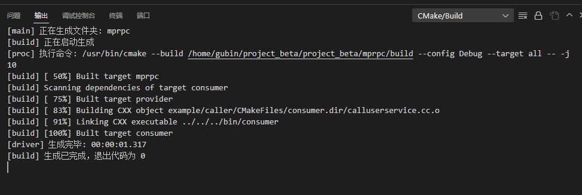

生成provider和consumer可执行文件

## 点对点RPC通信测试

### 启动发布服务的服务器

这个服务对象中有一个login方法

```
cd bin
./provider -i test.conf
```

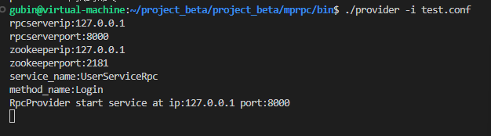

### 启动一个服务消费

```
./consumer -i test.conf
```

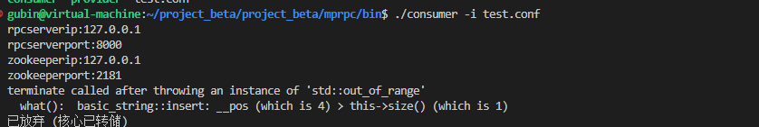

总是报错，那就修改下使用insert的另一种重载

发现错误了，括号打错位置了

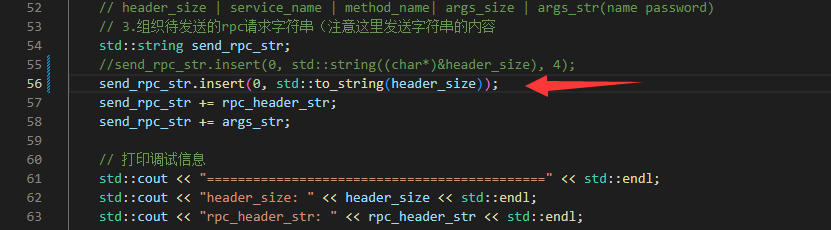

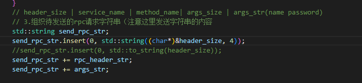

客户端和服务器都有打印

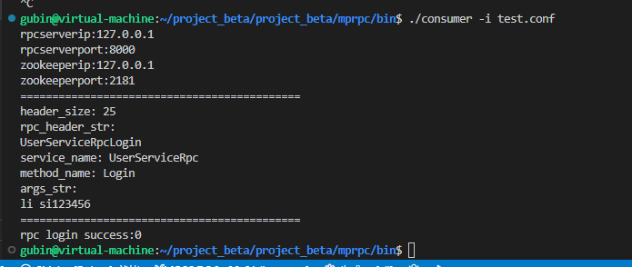

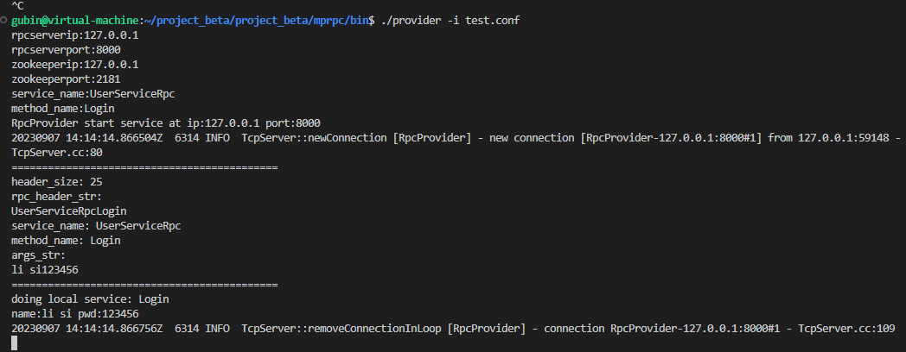
