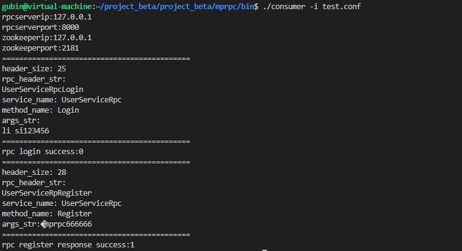

笔记27内容

## 发布一个服务提供[远程调用](https://so.csdn.net/so/search?q=%E8%BF%9C%E7%A8%8B%E8%B0%83%E7%94%A8&spm=1001.2101.3001.7020)方法的流程

若想要发布一个服务提供一些远程调用方法，步骤如下：

先在`protobuf`文件中添加参数和返回值的`message` 类型，然后再添加希望提供的服务 `service` 类型（如`UserServiceRpc`）和 其中的方法 rpc （如`Login`）；

然后自己实现一个提供服务的.cc文件（如`userservice.cc`）,重新写一个类（如`UserService`）继承自`proto`文件中 的`service`（即`UserServiceRpc`） ，并且重写对应的方法（从`proto`生成的.h文件中找函数的声明，如Login）

## 使用示例1

在`UserServiceRpc`服务类中添加一个注册`Register`的`rpc`方法。

编写`proto`文件，让其生成对应的服务类(`service`)和服务方法成员，以及一些相关的消息(`message`)类型

```protobuf
// mprpc/example/user.proto
syntax = "proto3";

package fixbug;

option cc_generic_services = true;

message ResultCode
{
    int32 errcode = 1;
    bytes errmsg = 2;
}

// 定义登录消息类型
message LoginRequest
{
    bytes name = 1; // =1 代表name是这个message第一个字段，不是指name的值
    bytes pwd = 2;
}

// 定义登录响应消息
message LoginResponse
{
    ResultCode result = 1;
    bool success = 2;
}

message RegisterRequest
{
    uint32 id = 1;
    bytes name = 2; // =1 代表name是这个message第一个字段，不是指name的值
    bytes pwd = 3;
}

message RegisterResponse
{
    ResultCode result = 1;
    bool success = 2;
}
service UserServiceRpc
{
    rpc Login(LoginRequest) returns(LoginResponse);
    rpc Register(RegisterRequest) returns(RegisterResponse);
}
```

执行[protobuf](https://so.csdn.net/so/search?q=protobuf&spm=1001.2101.3001.7020)编译生成对应的c++代码：

```sh
protoc user.proto --cpp_out=./
```

在**服务发布方**的业务代码中实现一个继承`UserServiceRpc`的类，并且在其中实现远程调用的目标函数，以及重写protobuf声明的目标方法的虚函数，并且在main函数中发布服务:

```cpp
// mprpc/example/callee/userservice.cc
#include <iostream>
#include <string>
#include "user.pb.h"
#include "mprpcapplication.h"
#include "rpcprovider.h"

// UserService 是一个本地服务，提供了两个进程内的本地方法Login和GetFriendLists
class UserService : public fixbug::UserServiceRpc // 使用在rpc服务的发布端（rpc服务提供者）
{
public:
    bool Login(std::string name, std::string pwd)
    {
        std::cout << "doing local service:Login" << std::endl;
        std::cout << "name:" << name << " pwd:" << pwd << std::endl;
        return false;
    }

    bool Register(uint32_t id, std::string name, std::string pwd)
    {
        std::cout << "doing local service:Register" << std::endl;
        std::cout << "id" << id << "name:" << name << " pwd:" << pwd << std::endl;
    }
    // 这是在使用角度分析RPC的功能
    // 重写基类 UserServiceRpc的虚函数
    // 1. caller（client） ==> Login(LoginRequest) => muduo => callee(server)
    // 2. callee(server) ==> Login(LoginRequest) => 转发到重写的Login方法上（如下）
    void Login(::google::protobuf::RpcController *controller,
               const ::fixbug::LoginRequest *request,
               ::fixbug::LoginResponse *response,
               ::google::protobuf::Closure *done)
    {
        // 1.框架给业务上报了请求参数LoginRequest，应用获取相应数据做本地业务
        std::string name = request->name();
        std::string pwd = request->pwd();

        // 2.做业务
        bool login_result = Login(name, pwd);

        // 3.把响应写入
        fixbug::ResultCode *code = response->mutable_result();
        code->set_errcode(0);
        code->set_errmsg("");
        response->set_success(login_result);

        // 4.做回调操作,执行响应对象数据的序列化和网络发送（都是由框架完成）
        done->Run();
    }

    void Register(::google::protobuf::RpcController *controller,
                  const ::fixbug::RegisterRequest *request,
                  ::fixbug::RegisterResponse *response,
                  ::google::protobuf::Closure *done)
    {
        // 1.框架给业务上报了请求参数RegisterRequest，应用获取相应数据做本地业务
        uint32_t id = request->id();
        std::string name = request->name();
        std::string pwd = request->pwd();

        // 2.做业务
        bool register_result = Register(id, name, pwd);

        // 3.把响应写入
        fixbug::ResultCode *code = response->mutable_result();
        code->set_errcode(0);
        code->set_errmsg("");
        response->set_success(register_result);

        // 4.做回调操作,执行响应对象数据的序列化和网络发送（都是由框架完成）
        done->Run();
    }
};

int main(int argc, char **argv)
{
    // 调用框架的初始化操作
    MprpcApplication::Init(argc, argv);

    // provider是一个rpc网络服务对象，把UserService对象发布到rpc节点上
    RpcProvider provider;
    provider.NotifyService(new UserService());

    // 启动一个rpc服务发布节点，Run之后，进程进入阻塞状态，等待远程rpc调用请求
    provider.Run();
}

```

然后在客户端（服务调用方caller）业务代码中使用Stub对象来调用希望调用的方法，并且接收响应

```cpp
// calluserservice.cc
#include <iostream>
#include "mprpcapplication.h"
#include "user.pb.h"
#include "mprpcchannel.h"

int main(int argc, char **argv)
{
    // 整个程序启动以后，想使用mprpc框架来享受rpc服务调用，一定需要先调用框架的初始化函数（只初始化一次）
    MprpcApplication::Init(argc, argv);

    // 演示调用远程发布的rpc方法Login
    fixbug::UserServiceRpc_Stub stub(new MprpcChannel());
    // rpc方法的请求参数
    fixbug::LoginRequest request;
    request.set_name("zhang san");
    request.set_pwd("123456");
    // rpc方法的响应
    fixbug::LoginResponse response;
    // 发起rpc方法的调用  同步的rpc调用过程  MprpcChannel::callmethod
    stub.Login(nullptr, &request, &response, nullptr); // RpcChannel->RpcChannel::callMethod 集中来做所有rpc方法调用的参数序列化和网络发送

    // 一次rpc调用完成，读调用的结果
    if (0 == response.result().errcode())
    {
        std::cout << "rpc login response success:" << response.success() << std::endl;
    }
    else
    {
        std::cout << "rpc login response error : " << response.result().errmsg() << std::endl;
    }

    // 演示调用远程发布的rpc方法Register
    fixbug::RegisterRequest req;
    req.set_id(2000);
    req.set_name("mprpc");
    req.set_pwd("666666");
    fixbug::RegisterResponse rsp;

    // 以同步的方式发起rpc调用请求，等待返回结果
    stub.Register(nullptr, &req, &rsp, nullptr); 

    // 一次rpc调用完成，读调用的结果
    if (0 == rsp.result().errcode())
    {
        std::cout << "rpc register response success:" << rsp.success() << std::endl;
    }
    else
    {
        std::cout << "rpc register response error : " << rsp.result().errmsg() << std::endl;
    }
    
    return 0;
}
```

## 编译

有2个rpc方法


发起rpc调用

感觉args_str反序列化出来的字符串前面有乱码（暂时没管）



## 使用示例2——新增加一个服务类，并且其中提供一个方法

新增一个好友服务（`FriendServiceRpc`），其中提供获取好友列表的rpc方法（`FriendServiceRpc`）

首先编写`protobuf`文件

```protobuf
// mprpc/example/friend.proto
syntax = "proto3";

package fixbug;

option cc_generic_services = true;

message ResultCode
{
    int32 errcode = 1;
    bytes errmsg = 2;
}

message GetFriendsListRequest
{
    uint32 userid = 1;
}
message GetFriendsListResponse
{
    ResultCode result = 1;
    repeated bytes friends = 2; // 列表
}

service FriendServiceRpc
{
    rpc GetFriendsList(GetFriendsListRequest)   returns(GetFriendsListResponse);
}

```

生成friend.pb.cc 和friend.pb.h

```
protoc friend.proto --cpp_out=./
```

修改example/callee下的CMakeLists.txt

```
# set(SRC_LIST userservice.cc ../user.pb.cc)
set(SRC_LIST friendservice.cc ../friend.pb.cc)

add_executable(provider ${SRC_LIST})
target_link_libraries(provider mprpc protobuf)
```


### 实现服务发布方(callee)的业务代码

callee中新建friendservice.cc

主要的工作就是实现一个新类继承于 UserServiceRpc，并且重写其对应的虚函数

```cpp
// friendservice.cc
#include <iostream>
#include <string>
#include "friend.pb.h"
#include "mprpcapplication.h"
#include "rpcprovider.h"
#include <vector>

// FriendService 是一个本地服务，提供了两个进程内的本地方法Login和GetFriendLists
class FriendService : public FriendServiceRpc // 使用在rpc服务的发布端（rpc服务提供者）
{
public:
    std::vector<std::string> GetFriendsList(uint32_t userid)
    {
        std::cout << "do GetFriendList service! userid:" << userid << std::endl;
        std::vector<std::string> vec;
        vec.push_back("Jiang tao");
        vec.push_back("shao pin");
        vec.push_back("shao an");
        return vec;
    }

    // 重写基类方法
    void GetFriendsList(::PROTOBUF_NAMESPACE_ID::RpcController *controller,
                        const ::fixbug::GetFriendsListRequest *request,
                        ::fixbug::GetFriendsListResponse *response,
                        ::google::protobuf::Closure *done)
    {
        // 1.框架给业务上报了请求参数 GetFriendsListRequest ，应用获取相应数据做本地业务
        uint32_t userid = request->userid();
        // 2.做业务
        std::vector<std::string> friendsList = GetFriendsList(userid);

        // 3.把响应写入
        fixbug::ResultCode *code = response->mutable_result();
        code->set_errcode(0);
        code->set_errmsg("");
        for(std::string &name : friendsList)
        {
            std::string *p = response->add_friends();
            *p = name;
        }

        // 4.做回调操作,执行响应对象数据的序列化和网络发送（都是由框架完成）
        done->Run();
    }
};

int main(int argc, char **argv)
{
    // 调用框架的初始化操作
    MprpcApplication::Init(argc, argv);

    // provider是一个rpc网络服务对象，把UserService对象发布到rpc节点上
    RpcProvider provider;
    provider.NotifyService(new FriendService());

    // 启动一个rpc服务发布节点，Run之后，进程进入阻塞状态，等待远程rpc调用请求
    provider.Run();
    return 0;
}

```


### 实现服务发起调用(caller)方的代码

在example/caller中新建callfriendservice.cc


```cpp
// callfriendservice.cc
#include <iostream>
#include "mprpcapplication.h"
#include "friend.pb.h"

int main(int argc, char **argv)
{
    MprpcApplication::Init(argc, argv);

    fixbug::FriendServiceRpc_Stub stub(new MprpcChannel());

    fixbug::GetFriendsListRequest request;
    request.set_userid(1000);
    fixbug::GetFriendsListResponse response;

    stub.GetFriendsList(nullptr, &request, &response, nullptr);

    if (0 == response.result().errcode())
    {
        std::cout << "rpc GetFriendsList Response success!" << std::endl;
        int size = response.friends_size();
        for (int i = 0; i < size; ++i)
        {
            std::cout << "index:" << i + 1 << " name:" << response.friends(i) << std::endl;
        }
    }
    else
    {
        std::cout << "rpc GetFriendsList Response error :" << response.result().errmsg() << std::endl;
    }

    return 0;
}

```

修改caller 中的CMakeLists.txt

```C++
#set(SRC_LIST calluserservice.cc ../user.pb.cc)
set(SRC_LIST callfriendservice.cc ../friend.pb.cc)

add_executable(consumer ${SRC_LIST})
target_link_libraries(consumer mprpc protobuf)
```

## 编译


### 测试

编译时注意cmake文件

```cmake
# mprpc/example/callee/CMakeLists.txt

set(SRC_LIST friendservice.cc ../friend.pb.cc)

# provider是目标文件，后面都是要链接的库 -lmprpc -lprotobuf

add_executable(provider ${SRC_LIST})

target_link_libraries(provider mprpc protobuf)
```

```cmake
# mprpc/example/caller/CMakeLists.txt
set(SRC_LIST callfriendservice.cc ../friend.pb.cc)
# provider是目标文件，后面都是要链接的库 -lmprpc -lprotobuf
add_executable(consumer ${SRC_LIST})
target_link_libraries(consumer mprpc protobuf)
```

**测试结果**

服务端


客户端

