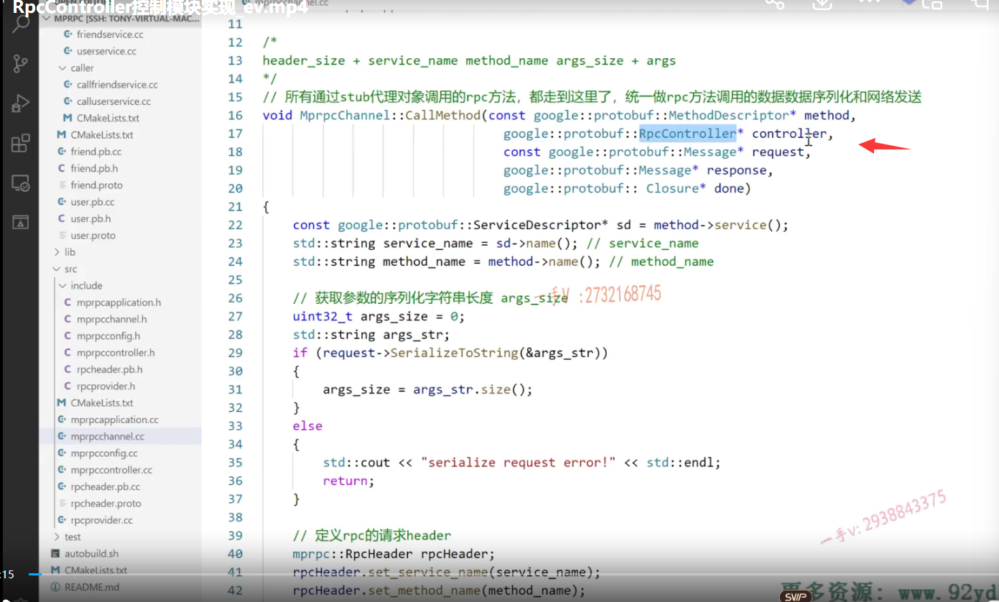
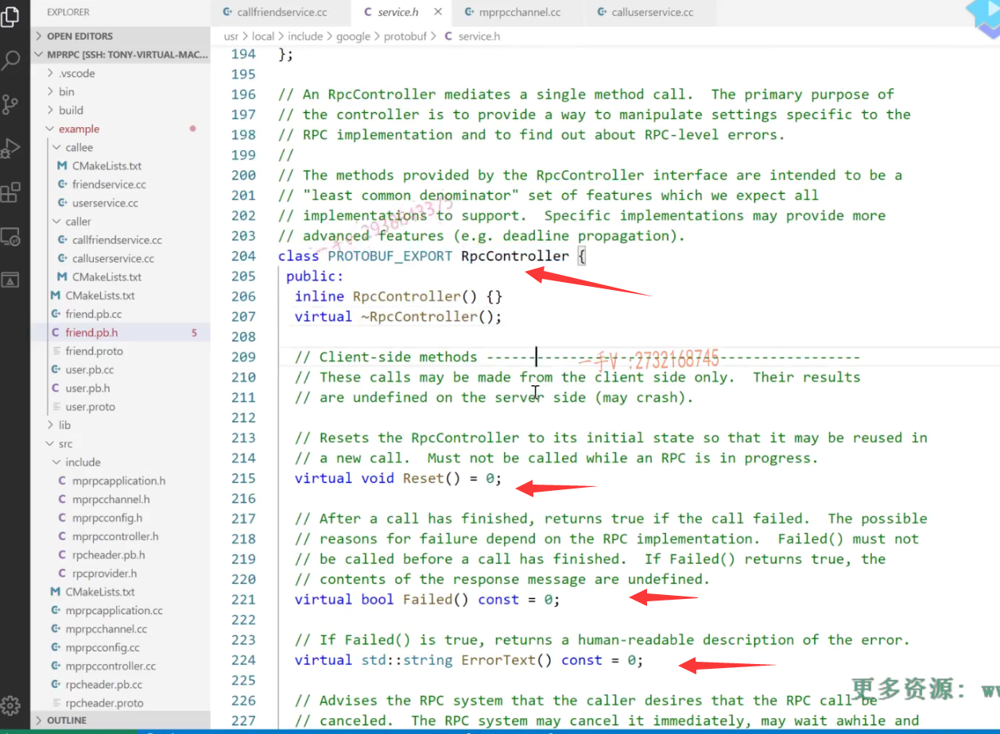

笔记28内容

# 前置知识

RpcController已经多次遇到了，但是这个参数我们写nullptr并不会影响我们mprpc框架的测试



又根据我们的rpc服务调用规则，当我们用代理对象调用这个rpc方法的时候,它最终所有的这个代理对象调用这个rpc方法都转到channel的call method里边,


直到最后，我们一个完整的rpc的这个调用以及响应完成了。


但是我们这个CallMethod方法中很多地方都会直接返回，就会导致整个过程没有完成。


## 添加Controller原因

需要知道当前rpc调用的状态，rpc controller可以储存一些控制信息


这个类本身就是个抽象类，你不能去实例化它的

比如set failed，参数有一个string，这就是控制的过程中发现rpc的调用过程中出错了，可以设置错误。




# RpcController

## rpc controller主要有多个方法 需要派生类继承重写

一个是判断rpc过程是否失败

一个是设置失败后的错误信息

一个是失败后的错误信息


## 具体实现

在src/include中添加mprpccontrller.h

```C++
#pragma once
#include <google/protobuf/service.h>
#include <string>

class MprpcController : public google::protobuf::RpcController
{
public:
    MprpcController();
    void Reset();
    bool Failed() const;
    std::string ErrorText() const;
    void SetFailed(const std::string& reason);

    // 目前未实现具体的功能
    void StartCancel();
    bool IsCanceled() const;
    void NotifyOnCancel(google::protobuf::Closure* callback);
private:
    bool m_failed; // RPC方法执行过程中的状态
    std::string m_errText; // RPC方法执行过程中的错误信息
};
```


在src中添加mprpccontroller.cpp

```C++
#include "mprpccontroller.h"

MprpcController::MprpcController()
{
    m_failed = false;
    m_errText = "";
}

void MprpcController::Reset()
{
    m_failed = false;
    m_errText = "";
}

bool MprpcController::Failed() const
{
    return m_failed;
}

std::string MprpcController::ErrorText() const
{
    return m_errText;
}

void MprpcController::SetFailed(const std::string& reason)
{
    m_failed = true;
    m_errText = reason;
}

// 目前未实现具体的功能
void MprpcController::StartCancel(){}
bool MprpcController::IsCanceled() const {return false;}
void MprpcController::NotifyOnCancel(google::protobuf::Closure* callback) {}
```


### 修改rpc调用方代码，callfriendservice.cc

先将mprpccontroller.h头文件，添加到mprpcapplication.h


rpc调用方法中传入controller

```C++
#include <iostream>
#include "mprpcapplication.h"
#include "friend.pb.h"

int main(int argc, char **argv)
{
    // 整个程序启动以后，想使用mprpc框架来享受rpc服务调用，一定需要先调用框架的初始化函数（只初始化一次）
    MprpcApplication::Init(argc, argv);

    // 演示调用远程发布的rpc方法Login
    fixbug::FriendServiceRpc_Stub stub(new MprpcChannel());
    // rpc方法的请求参数
    fixbug::GetFriendsListRequest request;
    request.set_userid(1000);
    // rpc方法的响应
    fixbug::GetFriendsListResponse response;
    // 发起rpc方法的调用  同步的rpc调用过程  MprpcChannel::callmethod
    //stub.GetFriendsList(nullptr, &request, &response, nullptr);

    MprpcController controller;
    stub.GetFriendsList(&controller, &request, &response, nullptr); // RpcChannel->RpcChannel::callMethod 集中来做所有rpc方法调用的参数序列化和网络发送

    // 一次rpc调用完成，读调用的结果
    if (controller.Failed())
    {
        std::cout << controller.ErrorText() << std::endl;
    }
    else
    {
        if (0 == response.result().errcode())
        {
            std::cout << "rpc GetFriendsList response success!" << std::endl;
            int size = response.friends_size();
            for (int i=0; i < size; ++i)
            {
                std::cout << "index:" << (i+1) << " name:" << response.friends(i) << std::endl;
            }
        }
        else
        {
            std::cout << "rpc GetFriendsList response error : " << response.result().errmsg() << std::endl;
        }
    }
    
    return 0;
}
```


### 修改mprpcchannel.cc代码

提供控制信息判断和设置

```C++
// mprpcchannel.cpp
#include "mprpcchannel.h"
#include <string>
#include "rpcheader.pb.h"
#include <sys/types.h>
#include <sys/socket.h>
#include <arpa/inet.h>
#include <netinet/in.h>
#include <unistd.h>
#include <errno.h>
#include "mprpcapplication.h"

// 客户端都是通过stub代理对象调用rpc方法，都到转发到这里调用，做rpc方法的数据序列化和网络发送
void MprpcChannel::CallMethod(const google::protobuf::MethodDescriptor* method,
                          google::protobuf::RpcController* controller, const google::protobuf::Message* request,
                          google::protobuf::Message* response, google::protobuf::Closure* done)
{
    const google::protobuf::ServiceDescriptor *sd = method->service();
    std::string service_name = sd->name();
    std::string method_name = method->name();

    // 1.获取方法参数的序列化字符串长度
    uint32_t args_size = 0;
    std::string args_str;
    if(request->SerializeToString(&args_str))
    {
        args_size = args_str.size();
    }
    else 
    {
        //std::cout << "serialize request error!" << std::endl;
        controller->SetFailed("serialize request error!");
        return;
    }

    // 2.定义rpc的请求header
    mprpc::RpcHeader rpcHeader;
    rpcHeader.set_service_name(service_name);
    rpcHeader.set_method_name(method_name);
    rpcHeader.set_args_size(args_size);

    uint32_t header_size = 0;
    std::string rpc_header_str;
    if(rpcHeader.SerializeToString(&rpc_header_str))
    {
        header_size = rpc_header_str.size();
    }
    else 
    {
        //std::cout << "serialize rpc header error!" << std::endl;
        controller->SetFailed("serialize rpc header error!");
        return;
    }
    // header_size | service_name | method_name| args_size | args_str(name password)
    // 3.组织待发送的rpc请求字符串（注意这里发送字符串的内容
    std::string send_rpc_str;
    send_rpc_str.insert(0, std::string((char*)&header_size, 4));
    //send_rpc_str.insert(0, std::to_string(header_size));
    send_rpc_str += rpc_header_str;
    send_rpc_str += args_str;

    // 打印调试信息
    std::cout << "============================================" << std::endl;
    std::cout << "header_size: " << header_size << std::endl; 
    std::cout << "rpc_header_str: " << rpc_header_str << std::endl; 
    std::cout << "service_name: " << service_name << std::endl; 
    std::cout << "method_name: " << method_name << std::endl; 
    std::cout << "args_str: " << args_str << std::endl; 
    std::cout << "============================================" << std::endl;

    // 4.使用tcp编程，完成rpc方法的远程调用
    int clientfd = socket(AF_INET, SOCK_STREAM, 0);
    if(-1 == clientfd)
    {
        char errtxt[512] = {0};
        sprintf(errtxt, "create socket error! errno:%d", errno);
        //std::cout << errtxt << std::endl;
        controller->SetFailed(errtxt);
        return ;
    }

    // 这个函数是从usercallservice.cc的main()进入，已调用过Init函数获得配置信息
    // 读取配置文件rpcserver信息
    std::string ip = MprpcApplication::GetInstance().GetConfig().Load("rpcserverip");
    uint16_t port = atoi(MprpcApplication::GetInstance().GetConfig().Load("rpcserverport").c_str());

    struct sockaddr_in server_addr;
    server_addr.sin_family = AF_INET;
    server_addr.sin_port = htons(port);
    server_addr.sin_addr.s_addr = inet_addr(ip.c_str());

    // 连接rpc服务节点
    if(-1 == connect(clientfd, (struct sockaddr*)&server_addr, sizeof(server_addr)))
    {
        close(clientfd);
        char errtxt[512] = {0};
        sprintf(errtxt, "connect error! errno:%d", errno);
        //std::cout << errtxt << std::endl;
        controller->SetFailed(errtxt);
        return ;
    }

    // 发送rpc请求
    if(-1 == send(clientfd, send_rpc_str.c_str(), send_rpc_str.size(), 0))
    {
        close(clientfd);
        char errtxt[512] = {0};
        sprintf(errtxt, "send error! errno:%d", errno);
        //std::cout << errtxt << std::endl;
        controller->SetFailed(errtxt);
        return ;
    }

    // 接收rpc请求的响应
    char recv_buf[1024] = {0};
    int recv_size = 0;
    if(-1 == (recv_size = recv(clientfd, recv_buf, 1024, 0)))
    {
        close(clientfd);
        char errtxt[512] = {0};
        sprintf(errtxt, "recv error! errno:%d", errno);
        //std::cout << errtxt << std::endl;
        controller->SetFailed(errtxt);
        return ;
    }

    // 5.反序列化收到的rpc调用的响应数据
    // 反序列化rpc调用的响应数据
    // std::string response_str(recv_buf, 0, recv_size); // bug出现问题，recv_buf中遇到\0后面的数据就存不下来了，导致反序列化失败
    // if (!response->ParseFromString(response_str))
    if(!response->ParseFromArray(recv_buf, recv_size))
    {
        close(clientfd);
        char errtxt[1024] = {0};
        sprintf(errtxt, "parse error! response_str:%s", recv_buf);
        //std::cout << errtxt << std::endl;
        controller->SetFailed(errtxt);
        return ;
    }

    close(clientfd);
}

```


## 编译

src中CMakeLists.txt添加mprpccontroller.cpp

```shell
#aux_source_directory(. SRC_LIST)
set(SRC_LIST 
    mprpcapplication.cpp
    mprpcconfig.cpp
    rpcprovider.cpp
    rpcheader.pb.cc
    mprpcchannel.cpp
    mprpccontroller.cpp)
add_library(mprpc ${SRC_LIST})
target_link_libraries(mprpc muduo_net muduo_base pthread)
```


## 测试

客户端


服务端


这里给的测试 实现的本地业务给出的好友列表都是写好的，暂时没有实现查询数据库这个环节


给出什么样的userid都会反应这个好友数据，后续考虑加入数据库查询


