笔记29-31内容

# 前置知识

## 日志的重要性

日志可以记录一些正常的软件运行过程中出现的一些信息和一些错误的信息

当我们发现问题的时候，就打开相应的日志，去搜索一下错误日志就可以了。

## 日志模块的设计

但是写日志的过程是一个磁盘IO，速度不快

我们不能把磁盘IO的花销算在rpc请求的业务执行过程，否则我们这个rpc的请求的处理过程，效率实在是太慢了。

所以我们一般不是直接在框架上产生一些日志。


添加一个中间件 消息队列

将日志都写入队列中，相当于是一个异步的日志写入机制。

会专门有一个写日志线程，专门做磁盘IO操作。

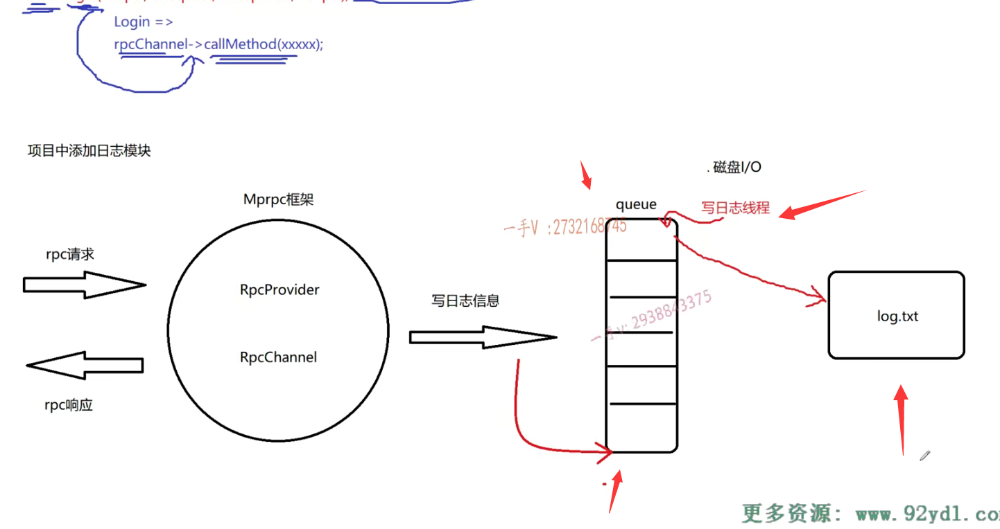

rpc请求的处理过程是在多个线程中去做一个rpc的请求处理过程，也就是多个线程都会去写日志，多个线程都会在这个缓冲区队列里去添加数据。所以queue必须保证线程安全。


C++ queue容器本身并不是线程安全的，需要通过线程的互斥机制来维护这个queue入队的一个线程安全。

队列为空，是不需要抢这把互斥锁的。否则这里效率不高。

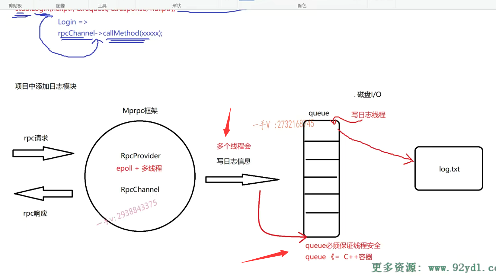

### 线程的互斥，线程的通信

队列如果为空，写日志线程应该是一直等待

队列不为空时候，才会去抢锁

使用C++11提供的mutex和condition variable条件变量


## 总结

本项目所实现的日志模块采用**异步**工作方式，多个线程往队列写日志，一个专门的写线程从队列中读取日志信息写入磁盘中的日志文件。

**要点**：线程安全，[线程间通信](https://so.csdn.net/so/search?q=%E7%BA%BF%E7%A8%8B%E9%97%B4%E9%80%9A%E4%BF%A1&spm=1001.2101.3001.7020)，队列，生产者消费者模型

日志模块设计图如下：

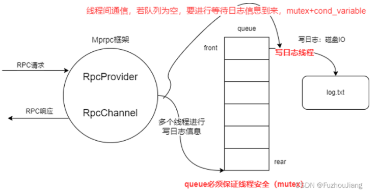


# logger

### log.txt的命名

以日期命名，并且当天写日志的文件大小超过20M的话，会在后面加序号


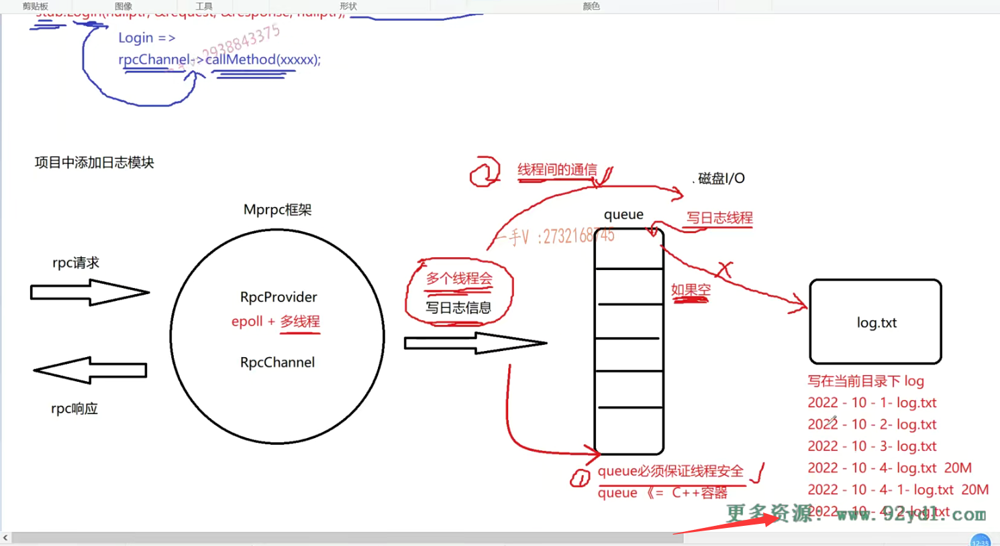


## 具体实现

### 1.在src/include下添加logger.h

1.定义日志的级别

```C++
#pragma once
#include "lockqueue.h"
#include <string>

// 定义日志级别
enum LogLevel
{
    INFO,  // 普通信息
    ERROR, // 错误信息
};

// Mprpc框架提供的日志系统
class Logger
{
public:
    // 设置日志级别 
    void SetLogLevel(LogLevel level);
private:
    int m_loglevel; // 记录日志级别
};
```


### 2.在src/include下创建lockqueue.h

完成消息队列

模板类的声明和成员函数实现最好都是实现在同一个头文件，分文件编写可能造成链接错误，日志模块是生产者消费者模型。

1.queue是从队尾入，队头出。

push()是从队尾入，使用类似于智能指针的这么一个lock guard，可以自动的加锁释放锁

2.pop()队列是空，就需要等待。使用线程间通信，生产者和消费者的简单版。

在这里边儿应该用while啊，防止线程的虚假唤醒。

条件变量本身进入这个wait状态，并把锁释放掉

==如果这里边儿有多个线程都在写日志文件，那这一块儿业务这个工作线程往队列里边儿写日志信息的话，你要notify all哦，把这儿所有写日志线程都唤醒去竞争一把锁==

最后，取出数据返回，释放锁

```C++
#pragma once
#include <queue>
#include <thread>
#include <mutex> // pthread_mutex_t
#include <condition_variable> // pthread_condition_t


// 模板类的声明和成员函数实现最好都是实现在同一个头文件
// 分文件编写可能造成链接错误
// 异步写日志使用的队列
// 生产者消费者模型
template<typename T>
class LockQueue
{
public:
    //producer
    // 多个worker线程都会写日志queue 
    void Push(const T &data)
    {
        std::lock_guard<std::mutex> lock(m_mutex);
        m_queue.push(data);
        m_condvariable.notify_one();//消费者只有一个写线程
    }

    // 一个写线程读日志queue，将其写入磁盘中的日志文件
    T Pop()
    {
        std::unique_lock<std::mutex> lock(m_mutex);
        while (m_queue.empty())// 防止虚假唤醒
        {
            // 日志队列为空，线程进入wait状态
            m_condvariable.wait(lock);
        }

        T data = m_queue.front();
        m_queue.pop();
        return data;
    }
private:
    std::queue<T> m_queue;
    std::mutex m_mutex;
    std::condition_variable m_condvariable;
};
```

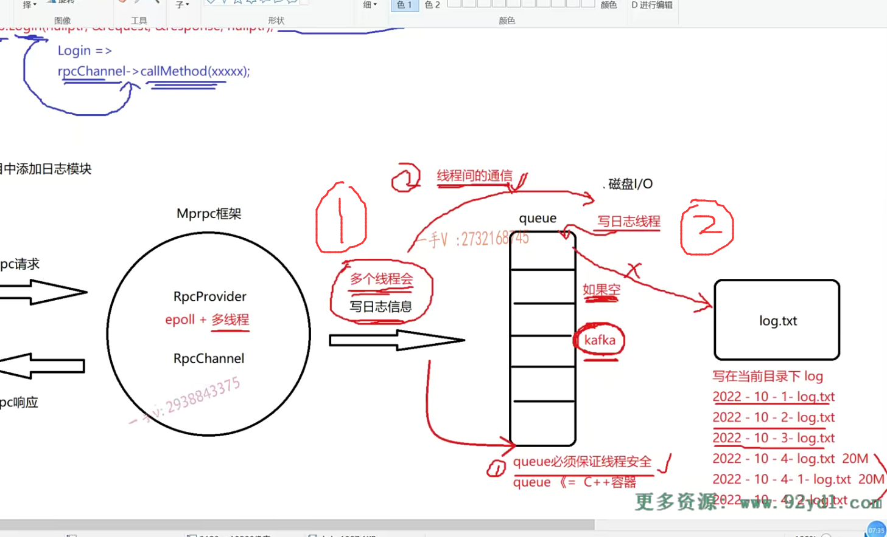


### 3.包含lockqueue.h头文件，并且logger成员变量添加日志缓冲队列，并且完善logger成员方法，添加写日志log方法

并且将logger类设计成单例模式，构造函数需要，拷贝构造都去掉

```C++
#pragma once
#include "lockqueue.h"
#include <string>

// 定义日志级别
enum LogLevel
{
    INFO,  // 普通信息
    ERROR, // 错误信息
};

// Mprpc框架提供的日志系统
class Logger
{
public:
    // 获取日志的单例
    static Logger& GetInstance();
    // 设置日志级别 
    void SetLogLevel(LogLevel level);
    // 写日志
    void Log(std::string msg);
private:
    int m_loglevel; // 记录日志级别
    LockQueue<std::string>  m_lckQue; // 日志缓冲队列

    Logger();
    Logger(const Logger&) = delete;
    Logger(Logger&&) = delete;
};
```


### 4.src中新建logger.cpp文件，并且修改CMakeLists.txt

```shell
#aux_source_directory(. SRC_LIST)
set(SRC_LIST 
    mprpcapplication.cpp
    mprpcconfig.cpp
    rpcprovider.cpp
    rpcheader.pb.cc
    mprpcchannel.cpp
    mprpccontroller.cpp
    logger.cpp)
add_library(mprpc ${SRC_LIST})
target_link_libraries(mprpc muduo_net muduo_base pthread)
```

实现logger的具体方法

1.日志单例模式的实现，static不需要实现时再加

2.线程使用C++11 thread，并且使用lambda表达式定义写事件绑定到线程中

- 获取当前的日期，然后取日志信息，写入相应的日志文件当中

  tm结构体，year需要加上1990，month需要加1,

  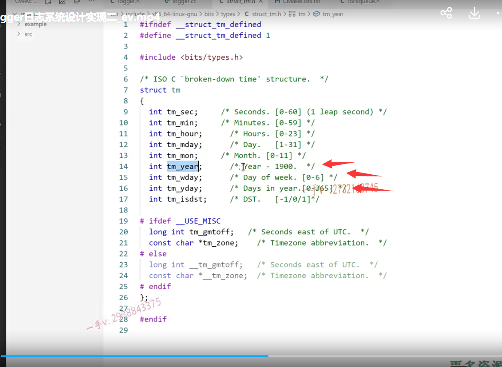

- 以追加的方法写日志文件内容 a+，其中内容时从消息队列中弹出，内容前加上日期时间和日志的级别（普通信息，错误信息），==注意需要在每行消息后面加换行==

3.设置日志级别方法完成

4.写日志， 把日志信息写入lockqueue缓冲区当中

```C++
#include "logger.h"
#include <time.h>
#include <iostream>

// 获取日志的单例
//懒汉式
Logger& Logger::GetInstance()
{
    static Logger logger;
    return logger;
}

Logger::Logger()
{
    // 启动专门的写日志线程
    std::thread writeLogTask([&](){
        for (;;)
        {
            // 获取当前的日期，然后取日志信息，写入相应的日志文件当中 a+
            time_t now = time(nullptr);
            tm *nowtm = localtime(&now);

            char file_name[128];
            sprintf(file_name, "%d-%d-%d-log.txt", nowtm->tm_year+1900, nowtm->tm_mon+1, nowtm->tm_mday);

            FILE *pf = fopen(file_name, "a+");
            if (pf == nullptr)
            {
                std::cout << "logger file : " << file_name << " open error!" << std::endl;
                exit(EXIT_FAILURE);
            }

            std::string msg = m_lckQue.Pop();

            char time_buf[128] = {0};
            sprintf(time_buf, "%d:%d:%d =>[%s] ", 
                    nowtm->tm_hour, 
                    nowtm->tm_min, 
                    nowtm->tm_sec,
                    (m_loglevel == INFO ? "info" : "error"));
            msg.insert(0, time_buf);
            msg.append("\n");

            fputs(msg.c_str(), pf);
            fclose(pf);
        }
    });
    // 设置分离线程，守护线程
    writeLogTask.detach();
}

// 设置日志级别 
void Logger::SetLogLevel(LogLevel level)
{
    m_loglevel = level;
}

// 写日志， 把日志信息写入lockqueue缓冲区当中
void Logger::Log(std::string msg)
{
    m_lckQue.Push(msg);
}
```


### 5.定义宏给用户提供更方便，更便捷的一个日志写入方法

LOG_INFO

1. `#define LOG_INFO(logmsgformat, ...)`：这是宏定义的开始。`LOG_INFO` 是宏的名称，它用于在代码中调用记录日志信息的操作。`logmsgformat` 是一个占位符，它用于指定日志消息的格式，`...` 则表示可变参数，用于传递填充格式占位符的实际值。

2. `do {`：这是一个 do-while 循环的开始，它允许宏定义包含多个语句。这里的目的是将多个语句组合在一起，以便它们可以一起使用。

3. `Logger &logger = Logger::GetInstance();`：这一行创建了一个名为 `logger` 的日志记录器对象，并初始化它。它假定有一个名为 `Logger` 的类，该类具有一个名为 `GetInstance` 的静态方法，用于获取日志记录器的实例。这是一个单例设计模式的示例，确保只有一个日志记录器实例存在。

4. `logger.SetLogLevel(INFO);`：这一行设置日志记录器的日志级别为 INFO。这意味着只有 INFO 级别及以上的日志消息才会被记录。可能存在不同的日志级别，如 DEBUG、INFO、WARNING、ERROR 等，以便根据需要记录不同重要性的信息。

5. `char c[1024] = {0};`：这一行声明一个长度为 1024 的字符数组 `c`，用于存储格式化后的日志消息。初始化数组的所有元素为零。

6. `snprintf(c, 1024, logmsgformat, ##__VA_ARGS__);`：这一行使用 `snprintf` 函数将格式化后的日志消息存储在字符数组 `c` 中。`snprintf` 函数类似于 `printf`，但它允许将格式化的消息写入字符数组中。`logmsgformat` 是格式化字符串，而 `##__VA_ARGS__` 则用于将可变参数传递给格式化字符串。

7. `logger.Log(c);`：最后，这一行将格式化后的日志消息传递给日志记录器的 `Log` 方法，以记录日志。

8. `while(0)`：这是 do-while 循环的结束，它是一个空循环，目的是使整个宏定义能够像单个语句一样使用，而不会引入额外的语法问题。

   使用这个宏定义时，你可以像下面这样在代码中记录 INFO 级别的日志信息：

   ```C++
   LOG_INFO("This is an INFO message: %s", "Hello, world!");
   ```

还有LOG_ERR

```
LOG_ERR("This is an ERROR message: %s", "An error occurred!");
```


```C++
#pragma once
#include "lockqueue.h"
#include <string>

// 定义宏 LOG_INFO("xxx %d %s", 20, "xxxx")
#define LOG_INFO(logmsgformat, ...) \
    do \
    {  \
        Logger &logger = Logger::GetInstance(); \
        logger.SetLogLevel(INFO); \
        char c[1024] = {0}; \
        snprintf(c, 1024, logmsgformat, ##__VA_ARGS__); \
        logger.Log(c); \
    } while(0) \

#define LOG_ERR(logmsgformat, ...) \
    do \
    {  \
        Logger &logger = Logger::GetInstance(); \
        logger.SetLogLevel(ERROR); \
        char c[1024] = {0}; \
        snprintf(c, 1024, logmsgformat, ##__VA_ARGS__); \
        logger.Log(c); \
    } while(0) \

// 定义日志级别
enum LogLevel
{
    INFO,  // 普通信息
    ERROR, // 错误信息
};

// Mprpc框架提供的日志系统
class Logger
{
public:
    // 获取日志的单例
    static Logger& GetInstance();
    // 设置日志级别 
    void SetLogLevel(LogLevel level);
    // 写日志
    void Log(std::string msg);
private:
    int m_loglevel; // 记录日志级别
    LockQueue<std::string>  m_lckQue; // 日志缓冲队列

    Logger();
    Logger(const Logger&) = delete;
    Logger(Logger&&) = delete;
};
```


## 编译

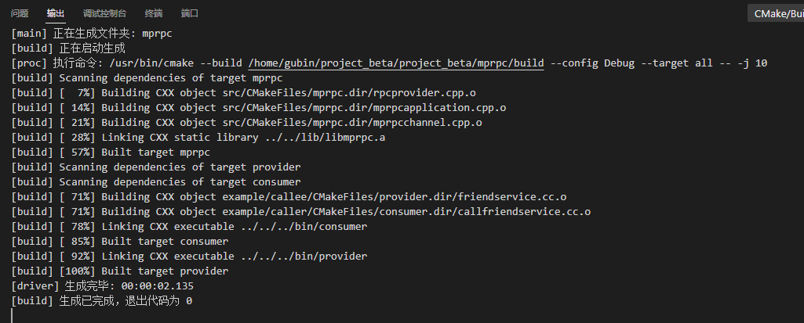

## 测试

在mprpcconfig.h中添加logger.h头文件

在friendservice.cc中添加日志宏


```C++
int main(int argc, char **argv)
{
    LOG_INFO("first log message");
    LOG_ERR("%s:%s:%d", __FILE__, __FUNCTION__, __LINE__);

    // 调用框架的初始化操作
    MprpcApplication::Init(argc, argv);

    // provider是一个rpc网络服务对象。把UserService对象发布到rpc节点上
    RpcProvider provider;
    provider.NotifyService(new FriendService());

    // 启动一个rpc服务发布节点   Run以后，进程进入阻塞状态，等待远程的rpc调用请求
    provider.Run();

    return 0;
}
```

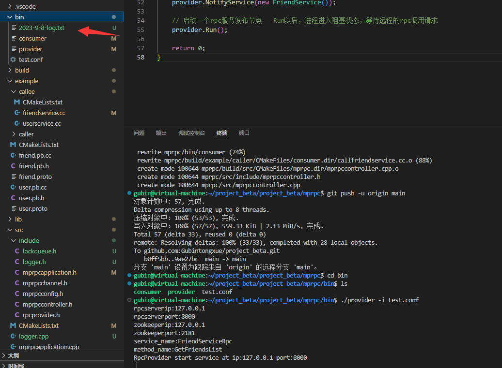


## 将日志模块集成到其他模块，比如说provider模块（发布服务、网络服务）

简单改了一些

```C++
/*
service_name =>  service描述   
                        =》 service* 记录服务对象
                        method_name  =>  method方法对象
json   protobuf
*/
// 这里是框架提供给外部使用的，可以发布rpc方法的函数接口
void RpcProvider::NotifyService(google::protobuf::Service *service)
{
    ServiceInfo service_info;

    // 获取了服务对象的描述信息
    const google::protobuf::ServiceDescriptor *pserviceDesc = service->GetDescriptor();
    // 获取服务的名字
    std::string service_name = pserviceDesc->name();
    // 获取服务对象service的方法的数量
    int methodCnt = pserviceDesc->method_count();

    //std::cout << "service_name:" << service_name << std::endl;
    LOG_INFO("service_name:%s", service_name.c_str());

    for (int i=0; i < methodCnt; ++i)
    {
        // 获取了服务对象指定下标的服务方法的描述（抽象描述） UserService   Login
        const google::protobuf::MethodDescriptor* pmethodDesc = pserviceDesc->method(i);
        std::string method_name = pmethodDesc->name();
        service_info.m_methodMap.insert({method_name, pmethodDesc});

        //std::cout << "method_name:" << method_name << std::endl;
        LOG_INFO("method_name:%s", method_name.c_str());
    }
    service_info.m_service = service;
    m_serviceMap.insert({service_name, service_info});
}
```


## 测试

客户端

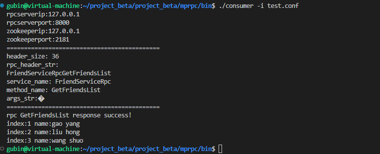

服务端

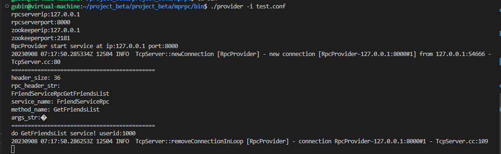

日志文件

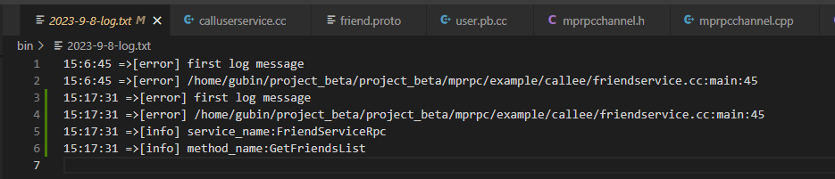

仅作为测试，并不是真正出现错误

比如我们也可以修改成下面

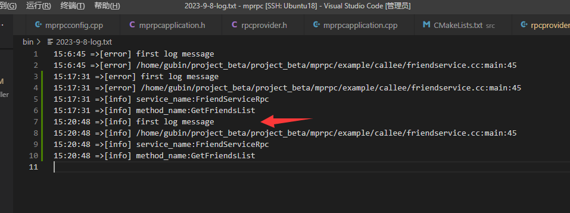