笔记32-34

## 简介

`zookeeper`（后文简称zk）提供功能有：服务[注册中心](https://so.csdn.net/so/search?q=%E6%B3%A8%E5%86%8C%E4%B8%AD%E5%BF%83&spm=1001.2101.3001.7020)、全局服务命名、以及分布式锁。  
RPC服务会被发布到不同的服务器上，本项目zk的作用就是找到某一个RPC服务在哪一个服务器上，提供服务注册发现功能。

## zk的数据如何组织？

### znode

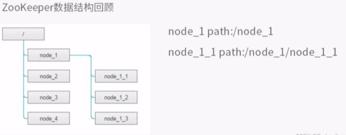

每个znode节点都只存储简单的`byte`字节数组，一般存少量状态信息，默认数据上限为1MB，我们项目中用来存服务的`IP:PORT`.

## zk的Client常用的命令

Client常用的命令有`ls` 、`get`、 `create`、`set` 、`delete`

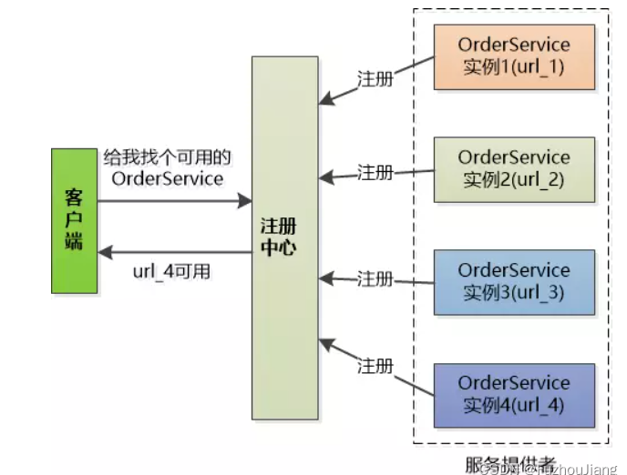

服务注册之后，注册中心和各个服务实例直接建立`Session`，要求实例们**定期发送心跳**，有一个心跳计数（定时增加），收到实例心跳后心跳计数恢复，一旦心跳计数超过某一特定值，则认为实例挂了，删除该实例。

临时性`ephemeral`节点，rpc节点超时未发送心跳消息，zk会自动删除临时性节点；

永久性节点，rpc节点超时未发送心跳消息，zk不会自动删除永久性节点。

zk会在在1/3的Timeout时间向服务提供方发送ping心跳消息，可以使用`tcpdump`进行测试：sudo tcpdump -i lo port 2181


## zookeeper安装和基本使用

可能需要java环境

```
sudo apt install openjdk-11-jre-headless
```


```sh
tar -zxvf zookeeper-3.4.10.tar.gz
cd zookeeper-3.4.10/
cd conf/
#首先进入conf文件夹下，将zoo_simple.cfg改名为zoo.cfg，这样zookeeper就能读取到该配置文件
mv zoo_sample.cfg zoo.cfg
```

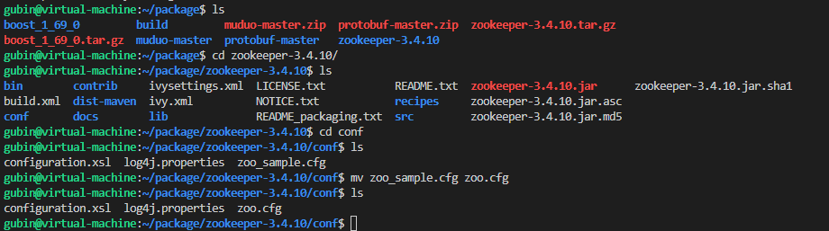

使用vim修改zk的配置文件`zoo.cfg`，将数据目录改为自己指定的路径

```cpp
vim zoo.cfg 
/home/gubin/package/zookeeper-3.4.10/data
gubin@virtual-machine:~/package/zookeeper-3.4.10$ mkdir data
```


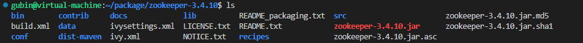

运行zk的`Server`端程序（后台运行）,直接 ./zkServer.sh好像不行

```sh
cd bin
./zkServer.sh start
```

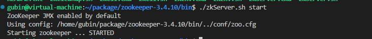

有后台进程了

```
ps -ef | grep zookeeper
```


查看网络有没有开启zookeeper server

```
sudo netstat -tanp
```

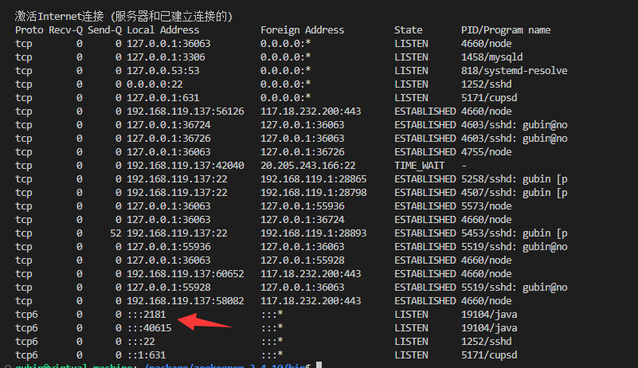

运行zk的`Client`程序

```sh
./zkCli.sh
```

连接上服务器

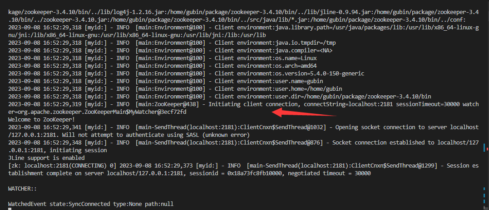


zk的Client常用的命令有：ls、get、 create、set 、delete

使用例子：

```sh
[zk: localhost:2181(CONNECTED) 0] ls /
[zookeeper]
# 查看 zookeeper目录 下有一个子节点 quota
[zk: localhost:2181(CONNECTED) 5] ls /zookeeper 
[quota]
#获取  /zookeeper/quota节点信息， 数据长度为0，孩子数为0
[zk: localhost:2181(CONNECTED) 9] get /zookeeper/quota

cZxid = 0x0
ctime = Thu Jan 01 08:00:00 CST 1970
mZxid = 0x0
mtime = Thu Jan 01 08:00:00 CST 1970
pZxid = 0x0
cversion = 0
dataVersion = 0
aclVersion = 0
ephemeralOwner = 0x0
dataLength = 0
numChildren = 0

# 根目录下创建了mprpc节点，值为20
[zk: localhost:2181(CONNECTED) 10] create /mprpc 20
Created /mprpc

```

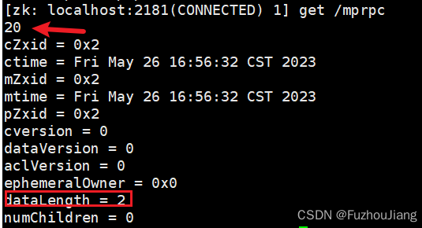


```sh
# zk删除父节点需要先把子节点删除
[zk: localhost:2181(CONNECTED) 2] create /mprpc/servic 22
Created /mprpc/servic
[zk: localhost:2181(CONNECTED) 3] delete /mprpc
Node not empty: /mprpc
[zk: localhost:2181(CONNECTED) 4] delete /mprpc/servic
[zk: localhost:2181(CONNECTED) 5] delete /mprpc       
[zk: localhost:2181(CONNECTED) 6] 

# zk不能一次创建多级目录，要逐级创建
[zk: localhost:2181(CONNECTED) 10] create /userServiceRpc 22
Created /userServiceRpc
[zk: localhost:2181(CONNECTED) 14] create /userServiceRpc/service_1/service_1_1 22
Node does not exist: /userServiceRpc/service_1/service_1_1
[zk: localhost:2181(CONNECTED) 15] create /userServiceRpc/service_1 11            
Created /userServiceRpc/service_1
[zk: localhost:2181(CONNECTED) 16] create /userServiceRpc/service_1/service_1_1 22
Created /userServiceRpc/service_1/service_1_1

```

## zk的原生开发API编译安装

```sh
cd src/c
sudo ./configure
```

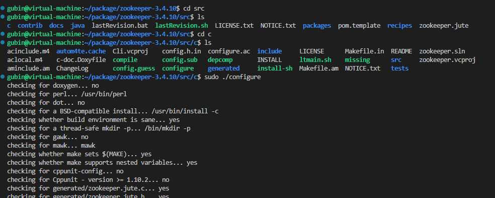


然后需要将Makefile文件中做修改，使gcc不要把编译警告当作错误（没修改）

```sh
sudo vim Makefile
```

保证下面红圈部分没有 `-Werror`

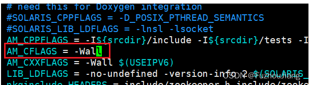

然后再执行以下步骤

```sh
~/share/zookeeper-3.4.10/src/c$ sudo make

~/share/zookeeper-3.4.10/src/c$ sudo make install
```

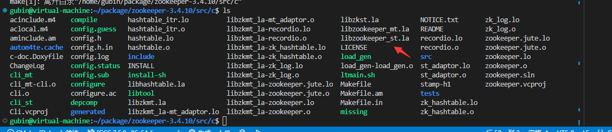


```
sudo find /usr -name "zookeeper"
cd /usr/local/include/zookeeper/
cd /usr/local/lib
```

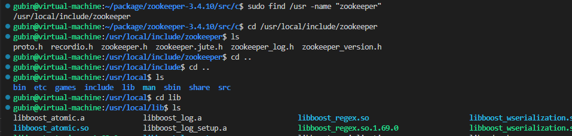

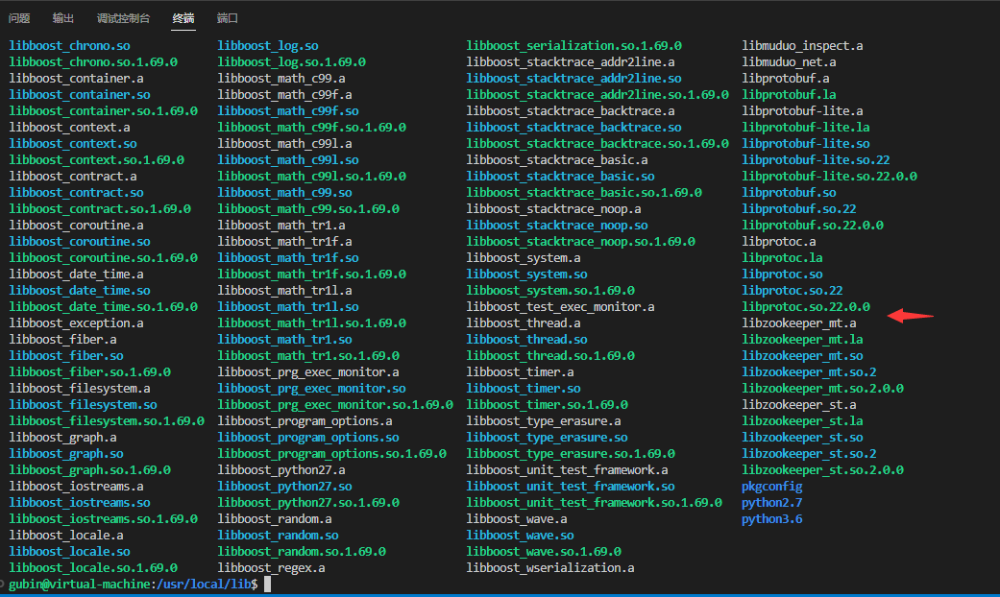


# 总结

第一个内容是理解 zookeeper的watcher监听器机制

第二个就是通过zookeeper的源码生成它的客户端开发API这么一个操作步骤，可以在usr/local/include和lib下查看头文件和so库

第三个是zookeeper原生API存在的问题

1.客户端不会自己主动发送心跳

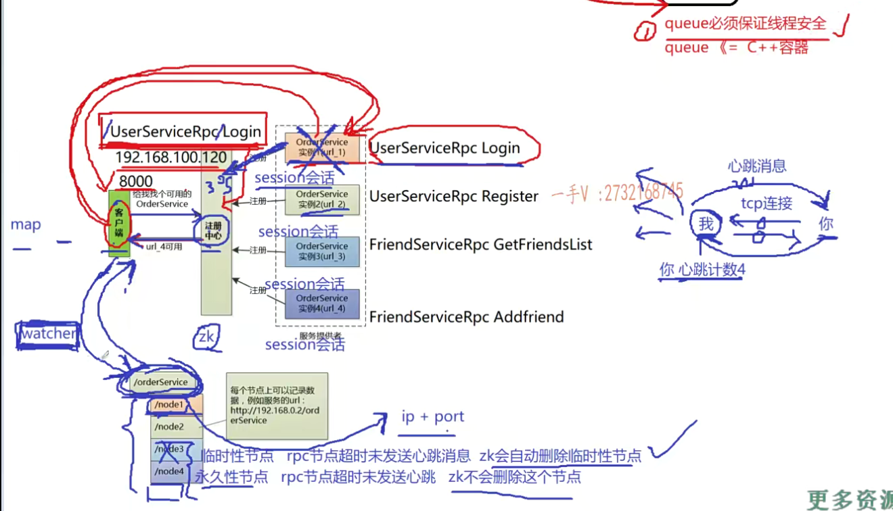

2.设置监听watcher，但是只是一次性的，每次触发后需要重复设置

3.zookeeper作为服务配置中心，我们只是存rpc节点的ip和port，但是znode的节点只能存bytes字节数组，我们想把一个对象信息存到znode中的话，需要自己进行一个数据的序列化，转化对象生成字节数组比如说我们用protobuf把一个对象转成一个字节流，可以存到这个znode的节点上。