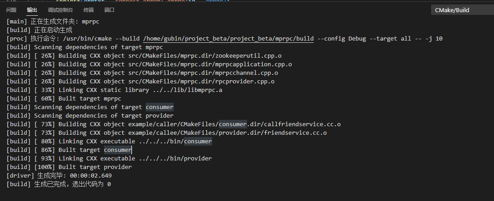
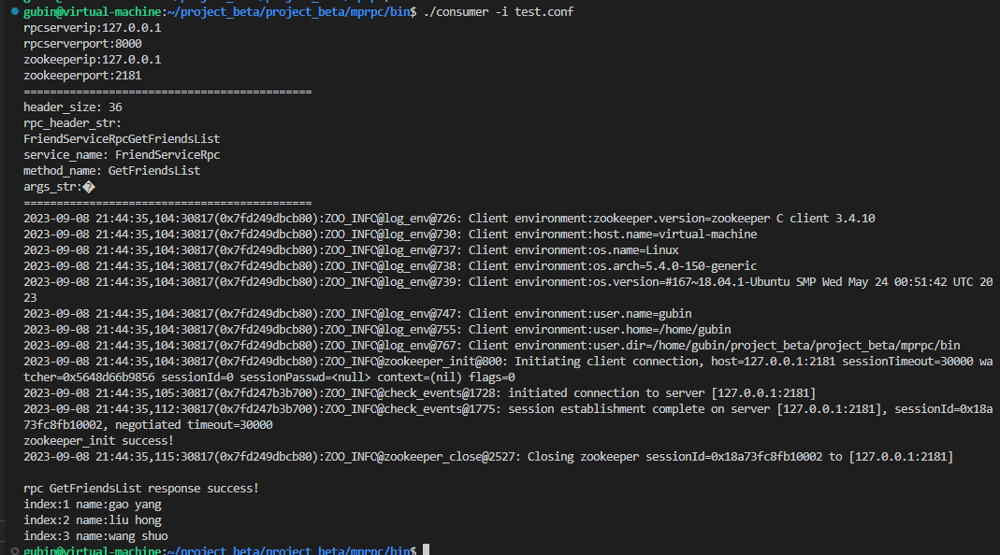
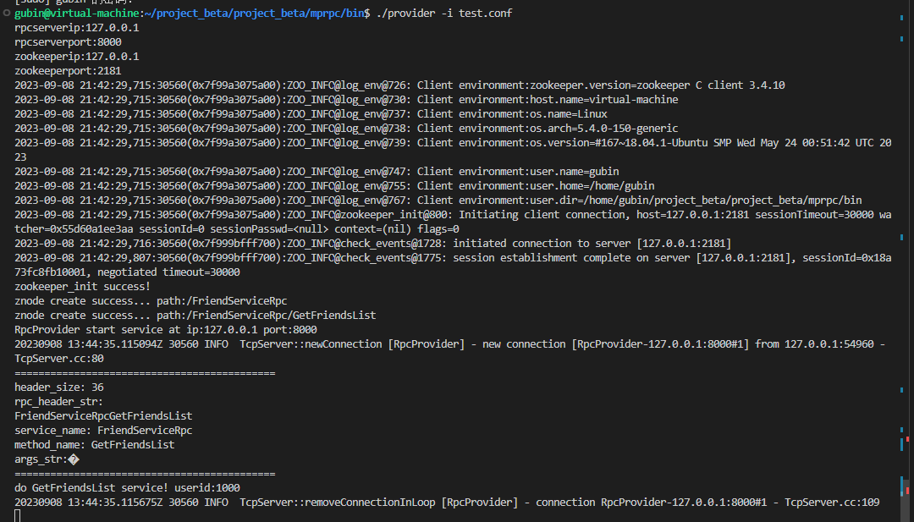
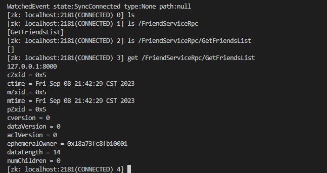
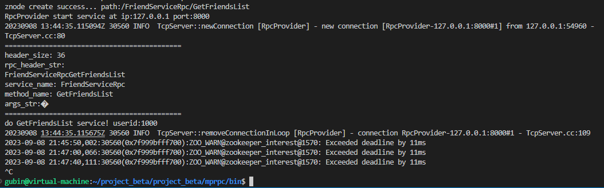
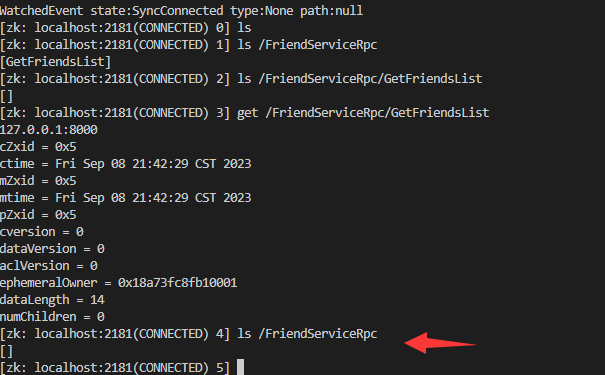

## 介绍

`zookeeper` C++客户端编程很类似于`MySQL`客户端编程，就是以C++代码实现zk客户端的常见功能，比如`get`、`delete`、`create`等.

主要是封装zookeeper的原生API，修改为我们需要的方法。

## 代码实现

### 在src/include中添加zookeeperutil.h

zookeeperutil类声明

1.构造析构

2.start()zkclient启动连接zkserver

3.create()根据指定的path创建这个znode的节点，并且还有这个节点的数据，数据的长度，以及这个节点状态（是永久性节点还是临时节点）
4.getdata()根据参数指定的path路径获取znode的值

5.成员变量 m_zhandle相当于zk的客户端句柄

```cpp
// zookeeperutil.h
#pragma once
#include <semaphore.h>
#include <zookeeper/zookeeper.h>
#include <string>

// 封装的zk客户端类
class ZkClient
{
public:
    ZkClient();
    ~ZkClient();
    // zkclient启动连接 zkserver
    void Start();
    // 在zkserver上根据指定的path创建znode节点
    void Create(const char *path, const char *data, int datalen, int state = 0);
    // 根据参数指定的znode节点路径，查找znode的值
    std::string GetData(const char *path);
private:
    // zk的客户端句柄
    zhandle_t *m_zhandle;
};
```


### 在src/include中添加zookeeperutil.cpp

### 前提

src下的CMakeLists.txt 添加zookeeperutil.cpp以及动态连接库 zookeeper_mt

```
#aux_source_directory(. SRC_LIST)
set(SRC_LIST 
    mprpcapplication.cpp
    mprpcconfig.cpp
    rpcprovider.cpp
    rpcheader.pb.cc
    mprpcchannel.cpp
    mprpccontroller.cpp
    logger.cpp
    zookeeperutil.cpp)
add_library(mprpc ${SRC_LIST})
target_link_libraries(mprpc muduo_net muduo_base pthread zookeeper_mt)
```


zookeeperutil类实现

1.构造函数，初始化这个客户端句柄为空

析构函数如果句柄不为空，就关闭句柄，释放资源 类似于Mysql_Conn

2.Start()方法

- 先在test.conf配置为文件中写好zookeeperip和zookeeperport，然后方法先读取zk server的ip和port

- 使用zookeeper.h库中的zookeeper_init()方法，所以链接的动态库包括zookeeper_mt

  - 第一个参数host是指定好了格式“127.0.0.1:3000”这种格式的字符串

  

  - 第二个参数需要一个回调函数

  

  - 第三个参数就是超时时间
  - 第四，五就填入nullptr，第六就填入0

- zookeeper_init创建与server的会话，这个创建是一个异步的，当它真正接收到zk server的响应的时候，它会去调用第二个参数的回调方法

- zookeeper的这个API客户端程序提供了三个线程

  - 第一个是API调用线程，也就是当前线程
  - 第二个线程就是网络IO线程，zookeeper_init这个函数底层会pthread_create创建一个线程，专门在这个线程中做网络IO操作，但是底层用的是poll，而不是select或者epoll,客户端不需要做到高并发
  - 第三个是watcher回调线程，这也是一个独立的线程

- 这里创建一个信号量后初始化，然后通过zoo_set_context给这个句柄添加一些额外信息，就是这个信号量。

  然后sem_wait()主线程一开始会阻塞在这

- ==这就是我们的全局回调函数global_watcher这个独立线程所需要做的==，zkserver给zkclient就是通过这个回调函数来通知是否连接上，是否超时。

  - 显示判断回调的消息类型，如果是会话相关的消息类型就是对的，然后再判断状态，如果是连接成功状态，就可以通过zoo_get_context获取到事先给句柄添加的额外信号信息，使用sem_post给信号量+1

- 然后主线程就可以从阻塞状态执行下去

3.create()方法 

- 使用zoo_exists判断path表示的znode节点是否存在，如果存在，就不再重复创建了
- 获取到返回值等于ZNONODE，就表示path的znode节点不存在，则可以创建节点
- 调用zoo_create()创建指定path的znode节点，第一个参数是句柄，第二个参数是路径，第三个参数是数据，第四个参数是数据长度，第5个参数是&ZOO_OPEN_ACL_UNSAFE，第六个参数是代表永久性还是临时性，第七个参数是新的路径字符串，第8个参数是新的路径字符串大小


4.GetDate()

- 调用zoo_get()来根据指定的路径获取znode节点的值，第一个参数是句柄，第二个参数是path,其余不用管
- 有结果返回值，没有就返回空字符串


```cpp
// zookeeperutil.cc
#include "zookeeperutil.h"
#include "mprpcapplication.h"
#include <semaphore.h>
#include <iostream>

// 全局的watcher观察器   zkserver给zkclient的通知
void global_watcher(zhandle_t *zh, int type,
                   int state, const char *path, void *watcherCtx)
{
    if (type == ZOO_SESSION_EVENT)  // 回调的消息类型是和会话相关的消息类型
{
if (state == ZOO_CONNECTED_STATE)  // zkclient和zkserver连接成功
{
sem_t *sem = (sem_t*)zoo_get_context(zh);
            sem_post(sem);
}
}
}

ZkClient::ZkClient() : m_zhandle(nullptr)
{
}

ZkClient::~ZkClient()
{
    if (m_zhandle != nullptr)
    {
        zookeeper_close(m_zhandle); // 关闭句柄，释放资源  MySQL_Conn
    }
}

// 连接zkserver
void ZkClient::Start()
{
    std::string host = MprpcApplication::GetInstance().GetConfig().Load("zookeeperip");
    std::string port = MprpcApplication::GetInstance().GetConfig().Load("zookeeperport");
    std::string connstr = host + ":" + port;
    
/*
zookeeper_mt：多线程版本
zookeeper的API客户端程序提供了三个线程
API调用线程 
网络I/O线程  pthread_create  poll
watcher回调线程 pthread_create
*/
    m_zhandle = zookeeper_init(connstr.c_str(), global_watcher, 30000, nullptr, nullptr, 0);
    if (nullptr == m_zhandle) 
    {
        std::cout << "zookeeper_init error!" << std::endl;
        exit(EXIT_FAILURE);
    }

    sem_t sem;
    sem_init(&sem, 0, 0);
    zoo_set_context(m_zhandle, &sem);

    sem_wait(&sem);
    std::cout << "zookeeper_init success!" << std::endl;
}

void ZkClient::Create(const char *path, const char *data, int datalen, int state)
{
    char path_buffer[128];
    int bufferlen = sizeof(path_buffer);
    int flag;
// 先判断path表示的znode节点是否存在，如果存在，就不再重复创建了
flag = zoo_exists(m_zhandle, path, 0, nullptr);
if (ZNONODE == flag) // 表示path的znode节点不存在
{
// 创建指定path的znode节点了
flag = zoo_create(m_zhandle, path, data, datalen,
&ZOO_OPEN_ACL_UNSAFE, state, path_buffer, bufferlen);
if (flag == ZOK)
{
std::cout << "znode create success... path:" << path << std::endl;
}
else
{
std::cout << "flag:" << flag << std::endl;
std::cout << "znode create error... path:" << path << std::endl;
exit(EXIT_FAILURE);
}
}
}

// 根据指定的path，获取znode节点的值
std::string ZkClient::GetData(const char *path)
{
    char buffer[64];
int bufferlen = sizeof(buffer);
int flag = zoo_get(m_zhandle, path, 0, buffer, &bufferlen, nullptr);
if (flag != ZOK)
{
std::cout << "get znode error... path:" << path << std::endl;
return "";
}
else
{
return buffer;
}
}

```

注意几点：

1.start主要是连接这个zk server，==它是一个异步连接过程，所以我们要绑定一个一个函数全局的一个回调函数。==这个zk server给我们zk client下发的通知都是在这回调函数中，这是一个独立的线程里边儿运行。


## RPC项目中使用zookeeper

### RpcProvider::run中 添加向zk server注册，使zkclient能发现服务

在`RpcProvider::Run`函数使用`zkClient`向`zkServer`注册服务

1.在mprpcapplication.h中包含zookeeperutil.h头文件，然后开始在RpcProvider中的run方法即提供网络服务的方法中添加zk客户端操作。

2.定义zkclient，并且使用Start()启动与zkserver的连接。

3.遍历m_serviceMap来找到服务对象的名称和服务对象描述的键值对

- 以服务对象名称来构建路径,并使用create创建节点
- 再遍历m_methodMap来找到rpc服务方法和服务方法描述的键值对
  - 以rpc服务方法名称来构建路径,并使用create创建节点,节点的值为rpc server的ip和port

```C++
 // 把当前rpc节点上要发布的服务全部注册到zk上面，让rpc client可以从zk上发现服务
    // session timeout   30s     zkclient 网络I/O线程  1/3 * timeout 时间发送ping消息
    ZkClient zkCli;
    zkCli.Start();
    // service_name为永久性节点    method_name为临时性节点
    for (auto &sp : m_serviceMap) 
    {
        // /service_name   /UserServiceRpc
        std::string service_path = "/" + sp.first;
        zkCli.Create(service_path.c_str(), nullptr, 0);
        for (auto &mp : sp.second.m_methodMap)
        {
            // /service_name/method_name   /UserServiceRpc/Login 存储当前这个rpc服务节点主机的ip和port
            std::string method_path = service_path + "/" + mp.first;
            char method_path_data[128] = {0};
            sprintf(method_path_data, "%s:%d", ip.c_str(), port);
            // ZOO_EPHEMERAL表示znode是一个临时性节点
            zkCli.Create(method_path.c_str(), method_path_data, strlen(method_path_data), ZOO_EPHEMERAL);
        }
    }
```


```cpp
// rpcprovider.cc
void RpcProvider::Run()
{
    std::string ip = MprpcApplication::getInstance().getConfig().Load("rpcserverip");
    uint16_t port = atoi(MprpcApplication::getInstance().getConfig().Load("rpcserverport").c_str());
    muduo::net::InetAddress address(ip, port);
    // 创建TcpServer对象
    muduo::net::TcpServer server(&m_eventLoop, address, "RpcProvider");

    // 绑定连接回调和消息读写回调方法
    server.setConnectionCallback(std::bind(&RpcProvider::onConnection, this, std::placeholders::_1));
    server.setMessageCallback(std::bind(&RpcProvider::onMessage, this, std::placeholders::_1, std::placeholders::_2, std::placeholders::_3));

    // 设置muduo库线程数量
    server.setThreadNum(4);

    // 把当前rpc节点上要发布的服务全部注册到zk上，让rpc client可以从zk上发现服务
    // session timeout 30s zkclient 网络IO线程 1/3 * timeout时间发送ping消息
    ZkClient zkCli;
    zkCli.Start();

    // service_name为永久性节点， method为临时性节点
    for (auto &sp : m_serviceMap)
    {
        // 组织服务节点路径
        std::string service_path = "/" + sp.first;
        zkCli.Create(service_path.c_str(), nullptr, 0);
        for (auto &mp : sp.second.m_methodMap)
        {
            // 组织方法节点路径
            std::string method_path = service_path + "/" + mp.first;
            // 方法节点的数据，即ip+port
            char method_path_data[128] = {0};
            sprintf(method_path_data, "%s:%d", ip.c_str(), port);
            // ZOO_EPHEMERAL代表是临时节点
            zkCli.Create(method_path.c_str(), method_path_data, strlen(method_path_data), ZOO_EPHEMERAL);
        }
    }

    server.start();
    std::cout << "RpcProvider start service at ip:" << ip << " port:" << port << std::endl;
    m_eventLoop.loop(); // epoll_wait
}


```

### MprpcChannel::callMethod中添加 zkclient从zkserver获取服务ip,port

以及在 `MprpcChannel::CallMethod` 中使用`ZkClient`来从`zkserver`（服务注册中心）获得服务的host（ip:port）从而获得服务


不需要再从配置文件中读取rpc server的ip和端口，但是肯定更加复杂一下

1.创建zk client，并且start()启动，获取服务方法znode节点的路径。

2.通过GetData()获取到"ip:port"字符串host

3.通过寻找冒号分拆host，得到ip和端口

从而继续连接rpc服务节点

```C++
// 读取配置文件rpcserver的信息
    // std::string ip = MprpcApplication::GetInstance().GetConfig().Load("rpcserverip");
    // uint16_t port = atoi(MprpcApplication::GetInstance().GetConfig().Load("rpcserverport").c_str());
    // rpc调用方想调用service_name的method_name服务，需要查询zk上该服务所在的host信息
    ZkClient zkCli;
    zkCli.Start();
    //  /UserServiceRpc/Login
    std::string method_path = "/" + service_name + "/" + method_name;
    // 127.0.0.1:8000
    std::string host_data = zkCli.GetData(method_path.c_str());
    if (host_data == "")
    {
        controller->SetFailed(method_path + " is not exist!");
        return;
    }
    int idx = host_data.find(":");
    if (idx == -1)
    {
        controller->SetFailed(method_path + " address is invalid!");
        return;
    }
    std::string ip = host_data.substr(0, idx);
    uint16_t port = atoi(host_data.substr(idx+1, host_data.size()-idx).c_str()); 
```


```cpp
// mprpcchannel.cc
void MprpcChannel::CallMethod(const google::protobuf::MethodDescriptor* method,
                          google::protobuf::RpcController* controller, const google::protobuf::Message* request,
                          google::protobuf::Message* response, google::protobuf::Closure* done)
{
    const google::protobuf::ServiceDescriptor *sd = method->service();
    std::string service_name = sd->name();
    std::string method_name = method->name();

    // 1.获取方法参数的序列化字符串长度
    
    // 2.定义rpc的请求header
    // header_size | service_name | method_name| args_size | args_str(name password)
    // 3.组织待发送的rpc请求字符串（注意这里发送字符串的内容
    std::string send_rpc_str;
    send_rpc_str.insert(0, (char*)&header_size, 4);
    send_rpc_str += rpc_header_str;
    send_rpc_str += args_str;

   
    // 4.使用tcp编程，完成rpc方法的远程调用
    int clientfd = socket(AF_INET, SOCK_STREAM, 0);
    if(-1 == clientfd)
    {
        char errtxt[512] = {0};
        sprintf(errtxt, "create socket error! errno:%d", errno);
        controller->SetFailed(errtxt);
        return ;
    }

    // 这个函数是从usercallservice.cc的main()进入，已调用过Init函数获得配置信息
    // 读取配置文件rpcserver信息
    // std::string ip = MprpcApplication::getInstance().getConfig().Load("rpcserverip");
    // uint16_t port = atoi(MprpcApplication::getInstance().getConfig().Load("rpcserverport").c_str());
    
    // !!!rpc方法向调用service_name的method_name服务，需要查询zk上该服务所在的host信息
    ZkClient zkCli;
    zkCli.Start();

    std::string method_path = "/" + service_name + "/" + method_name;
    std::string host_data = zkCli.GetData(method_path.c_str());

    if(host_data == "")
    {
        controller->SetFailed(method_path + "is not exist");
        return;
    }
    int idx = host_data.find(":");
    if(idx == -1)
    {
         controller->SetFailed(method_path + " address is invalid!");
        return;
    }
    std::string ip = host_data.substr(0, idx);
    uint32_t port = atoi(host_data.substr(idx + 1, host_data.size() - idx).c_str());

    struct sockaddr_in server_addr;
    server_addr.sin_family = AF_INET;
    server_addr.sin_port = htons(port);
    server_addr.sin_addr.s_addr = inet_addr(ip.c_str());

    // 连接rpc服务节点
    if(-1 == connect(clientfd, (struct sockaddr*)&server_addr, sizeof(server_addr)))
    {
        close(clientfd);
        char errtxt[512] = {0};
        sprintf(errtxt, "connect error! errno:%d", errno);
        controller->SetFailed(errtxt);
        return ;
    }

    // 发送rpc请求

    // 接收rpc请求的响应
    
    // 5.反序列化收到的rpc调用的响应数据
}

```

## 编译



## 测试结果

rpc服务提供方发布服务后，看到zkserver上有服务节点已经注册了。


如果出现下面的错误，没有找到libzookeeper_mt.so库


执行以下命令，主要是在默认搜寻目录(/lib和/usr/lib)以及动态库配置文件/etc/ld.so.conf内所列的目录下，搜索出可共享的动态链接库(格式如lib*.so*)，进而创建出动态装入程序(ld.so)所需的连接和缓存文件，缓存文件默认为/etc/ld.so.cache，此文件保存已排好序的动态链接库名字列表。

```shell
sudo ldconfig
```


客户端




服务端




通过./zkCli.sh查看zk server的节点信息




rpc服务提供方断开连接一段时间，由于`zkserver`没有按时收到[心跳](https://so.csdn.net/so/search?q=%E5%BF%83%E8%B7%B3&spm=1001.2101.3001.7020)就删除了服务方法节点（因为是**临时**节点`znode`）




服务对象是永久性节点，服务方法是临时性节点

