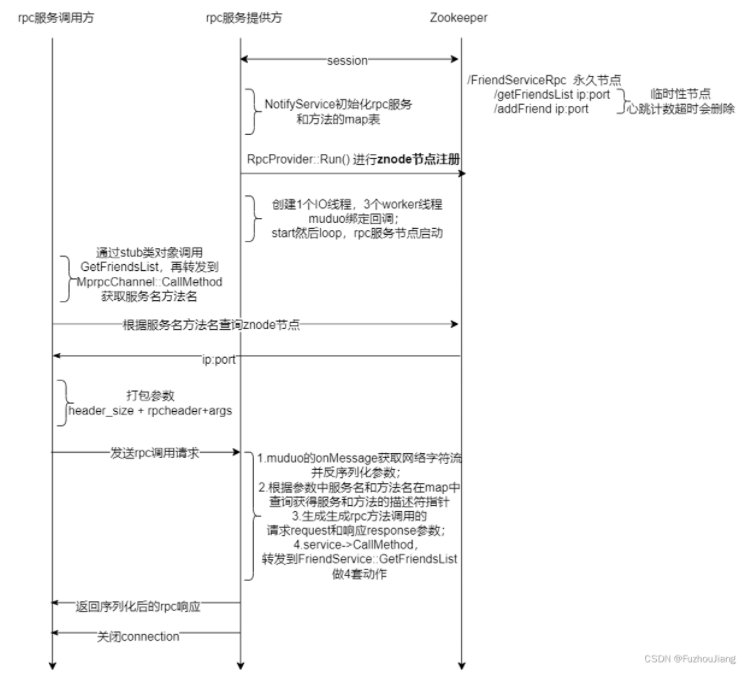

## 程序调用时序图

下图介绍了项目代码的调用时序，从rpc服务提供方开始看

## 简单描述项目、实现了怎样的功能？采用了哪些技术栈

这个项目是基于C++语言实现的一个RPC分布式[网络通信](httpsso.csdn.netsosearchq=%E7%BD%91%E7%BB%9C%E9%80%9A%E4%BF%A1&spm=1001.2101.3001.7020)框架项目，使用CMake在Linux平台上构建编译环境。它可以将任何单体架构系统的本地方法调用重构为基于TCP网络通信的RPC远程方法调用。该框架实现了同一台机器的不同进程之间或不同机器之间的服务调用。它适用于将单体架构系统拆分为基于分布式微服务调用的部署，通过将高并发性能要求的微服务部署多份来提升系统整体并发性能，并具有模块服务独立升级和服务间解耦的优势。

该项目的[网络层](httpsso.csdn.netsosearchq=%E7%BD%91%E7%BB%9C%E5%B1%82&spm=1001.2101.3001.7020)基于高并发的Reactor网络模型`muduo`开源网络库实现。这使得对网络IO层和RPC方法调用处理层进行代码解耦变得更加容易，并且具有良好的并发性能。RPC方法调用使用`protobuf`进行相关数据的序列化和反序列化，可以直接在同构和异构系统（注解2）中进行调用。微服务的服务注册、服务发现等功能是基于`zookeeper`实现的。`zookeeper`本身提供了C API，可以通过API与zookeeper服务器进行通信。

 异构系统指的是有的rpc 进程是C++写的服务，有的rpc 进程是Golang 或者Java 写的服务，但因为都是基于统一的protobuf 协议进行通信的，所以直接可以进行远程rpc 通信。

## 项目中采用线程同步解决了哪些问题？

微服务进程启动后，在代码上需要调用zoo_create 方法链接zookeeper server，但是全局的watcher 是在另外一个线程中工作的，zookeeper server 连接成功是通过watcher 回调来通知应用程序的，所以在这里我用了线程间的`sem`信号量同步等待watcher 中响应zk 连接成功后，程序再继续执行下面的操作。

## 你对这些服务器中间件有更深层的了解吗？你还了解他的哪些功能？

服务器中间件我了解过 zookeeper、consul、etcd（k8s底层就是用etcd做服务管理） 都可以完成常见的服务治理功能，包括服务注册、服务发现等，我的这个项目里主要通过zookeeper来完成这个功能，它的API接口操作起来方便，还实现了watcher回调功能，原生提供了心跳检测动态监听server的上下线。

当然除了服务治理，我了解到的zk 还可以支持分布式系统全局的一些统一公共配置信息，因为它是基于znode 实现的，和linux 的文件系统非常相似，分布式系统的各个服务可以通过读取zk 节点拉取统一配置信息。

zk还可以实现分布式锁，对于不同服务之间可以做一些跨服务的同步操作，使用起来方便。

zk还可以实现集群中的主备切换功能，可以应用在容灾的场景，master主机挂掉能否实现slave备机工作，主机恢复正常能够再切换回来提供服务。

## 消息传输为什么用protobuf,而不用json

json是纯文本操作，protobuf是基于二进制序列化数据的，进行rpc通信时数据占用带宽比json效率高很多，其次protofbuf 原生提供了基于rpc service 方法调用代码框架，封装了很好用的接口，实现rpc 方法远程调用非常简单，我只需要关注服务管理和rpc 通信流程的开发。而json 只是一个单纯的数

据序列化和反序列化协议，没有protobuf 上面说的这些额外的功能，所以我项目上选择了protobuf 作为rpc 数据通信协议。

## zookeeper在你的项目中起到什么作用

每个后台server 进程启动后，都会向zk 上去注册自己对外提供的rpc 服务；当调用rpc 方法的client 想要调用一个服务，会去zk 上查询下rpc 服务所在的server 节点，拉取服务所在server 的ip 地址和port 信息，然后进行远程服务调用。所在zk 在项目中主要做一些服务注册和服务发现。

服务治理的内容除了服务注册、服务发现，常见的还有服务熔断、服务降级等等，一般都会实现一个统一的微服务网关统一做这些处理，但是我这个分布式rpc 项目暂时没有涉及这么复杂的服务治理手段，像开源的大型分布式框架百度的brpc，腾讯的tars 等对于分布式治理非常详细，我通过这个项目把分布式微服务的优势，底层实现原理都搞清楚了，后续打算再研究一下上面的开源框架代码继续学习。

## 项目有什么需要改进的地方吗？

我目前把主要精力放在了分布式`rpc` 框架设计和服务调用的实现细节上了，暂时对远程服务调用没有做压力测试，后续计划做用专业的`Jmeter` 或者`LoadRunner` 工具做一下压力测试，看能否找到一些瓶颈以及在代码上可以优化的地方

我打算通过学习更多开源的分布式服务治理框架，在我的分布式框架项目上集成更多功能，比如我在实现的分布式部署框架上内嵌一个分布式服务治理网关，实现服务流量监控、调用监控、日志、服务熔断降级等功能

学习go语言

## 你的项目优势在哪里？

后台服务设计部署主要就三种类型，单体、集群和分布式微服务，我 之前做过基于nginx负载均衡的集群聊天服务器项目，对于分布式系统的设计优势以及通信方式不太了解。但是对于集群类的项目，只是在服务器的数量上进行扩展，存在很多的限制，修改模块项目代码还是要重新编译，而且要进行多次编译。比如后台管理不需要高并发，所以不需要每台机器都部署。

我之前只知道简单的`epoll` + 多线程的编程模型，没有接触过开源的高并发网络库，这个项目中使用了`muduo` 网络库，是基于C++实现的，它的好处是one loop per thread，我甚至还阅读了一下`muduo` 网络库的源码，并用C++11 实现了它的核心网络功能…

通过这个项目对于`protobuf` 也知道它的应用场景和优势了,它提供了基于rpc service 方法调用代码框架，封装了很好用的接口，之前只用过json。另外对于服务器中间件zookeeper 也学习了很多知识，还有服务注册、服务发现等分布式微服务必备的一些服务治理等等。

## 项目中遇到的难题

首先关于zookeeper 的使用和protobuf 的使用，也是自己查阅资料做出了很大的努力。zookeeper 的全局watcher 功能这一块，一开始也并没有意识到需要同步的操作，后来也是翻阅资料解决了这个问题。当然我在项目中也收获了其他的知识，比如我在使用bind 绑定器绑定一个函数对象的时候，用`const` 和不用`const` 修饰的两个函数实际上是构成重载的，所以一开始忽略了这一点，在后面经过不断地编译调试以后，解决了这些问题。

实现项目的过程中，出现rpc 请求方发送的数据没有问题，但是rpc 服务方法接收方接收到的数据不全，通过加关键日志打印和gdb 调试项目代码等，最终发现了问题，是发送方用了`strlen`，而没有写protobuf 正确的数据长度size

我的项目中，组织了protobuf 里面记录个各个数据段的长度，但是在接收方并没有进行tcp 粘包代码处理逻辑的实现，这里也是一个问题点可以修改代码改进

## 假如需要用json作为数据传输序列，你的项目哪里需要改动，怎么改动呢？

在数据序列化和反序列化方面可以直接修改成`json` 处理的代码即可。

但是json 没有办法实现protobuf 的`service rpc` 方法的定义，无法生成特有的封装好的rpc 方法调用的代码架构，json 根本就没有那一套机制，它只是简单的序列化和反序列化协议，json 没有什么配置文件，可以像protobuf 那样生成一套封装好的rpc 代码调用架构。

那么protobuf 生成的这一套rpc封装的代码逻辑如果换成json 的话，需要自己去实现一下，增加了比较大的工作量。

另外json 发送的都是文本数据，而protobuf 传输的是二进制数据，所以在解决tcp 粘包问题的代码上，也需要进行相应的修改。

## 假如我现在需要你的框架可以接受的并不是一个特定类型的序列，比如我客户端传输json，有protobuf等很多个序列，那么你该怎么做让你的框架同时支持这些序列技术呢？就是怎么判断收到的数据是protobuf 还是 json？有没有什么好的办法呢？

首先，考虑将代码中RpcService高度抽象出来，作为一个基类，基于多态实现不同的数据协议解析派生类，不同派生类都重写虚函数，分别处理各自负责的json 和 protobuf的解析，代码上的接口可基于基类指针或引用进行使用,后续就是增加新的协议处理，只需要添加新的派生类即可，rpc处理的相关代码逻辑都是基于基类处理的，不用做改动.

上面只是说在代码设计上的变化，至于框架上怎么区分具体的协议是json 还是 protobuf,主要方法有两种：

1.再增加一层抽象的数据协议，里面可携带不同数据类型，包括json的、protobuf的、可在抽象的数据协议里面添加一个字段表示协议类型方便判断框架识别具体是哪个协议

2.RpcServer端可以监听两个端口，一个端口专门收发处理json数据，另一个端口专门收发处理protobuf数据

## 对于框架这个概念，你觉得在你的项目中，具体体现在了哪一块，或者哪个类的哪个函数？

具体体现了在我这个框架对外提供了两个基础类`RpcClient`和`RpcServer`，任何模块要实现成提供分布式rpc服务的方式，都可以启动一个`RpcServer`，并注册相关的`Service`微服务方法到中间件上，当然这一套框架都是框架内部处理的，用户只需要使用注册方法即可；

`RpcClient`可以像调用一个本地方法一样调用一个远程的Rpc服务，查询服务中间件zookeeper查询到的具体提供服务的主机的ip和port信息，然后发起一个标准的rpc调用，包括参数的组装，请求调用的发起；

`RpcServer`端收到请求会反序列化调用参数和方法名称，执行方法调用，再返回响应等，这一套都在框架内部实现完了，对于调用者的使用感受来说，和调用一个本地方法没太大差别，因为具体的rpc调用细节都是框架处理完了。

## 你的项目设置了一个IO线程和3个工作线程，那么者几个线程具体怎么进行协调运行呢？

muduo库是一个典型的[Reactor](httpsso.csdn.netsosearchq=Reactor&spm=1001.2101.3001.7020) 网络模型的实现，IO 线程主要负责监听新连

接，通过事先创建的`evenfd` 来做IO 线程和工作线程之间的通信工作（当然实际过程中还可以用socketpair 做双向通信唤醒），IO 线程根据负载算法（这里muduo 采用轮询算法）把新连接的socketfd 通过evenfd 唤醒相应的工作线程，并注册到工作线程的epoll 上继续处理后续的数据读写事件。而且这里也不一定3 个工作线程，一般根据当前CPU 的核心数量来确定就可以，C++11 体提供了threadhardware_concurrency()可以获取CPU 核心数量。

## 如果要实现一个全部是异步模式的RPC框架，应该怎么做？

我现在实现的这个分布式rpc 框架确实是同步的，因为rpc 请求的调用结果响应并没有什么通知机制（同步和异步的概念原理对比在手写muduo 网络库课程中详细的做了说明讲解），是一直等待rpcserver 返回响应结果后再继续执行的，所以是一个典型的同步rpc 通信框架。

如果要实现一个异步的rpc 框架，也就是说rpcclient 发起rpc 请求后，就可以做其它逻辑处理，而不用一直死等rpc 接口响应后才继续执行，这样的话就需要一个异步回调通知的机制了（扩展：`nodejs`全部都是这样的异步回调机制，所以可以做到单线程也能高并发：）），具体的实现就需要更改框架的设

计，这里我可以实现两种不同的模式：

模式一：当应用层调用一个rpc 接口，框架把该rpc 接口调用封装成一个任务，并给这个任务分配一个`taskid`（或者叫rpcid 也行，名字任由你起），放到rpc 框架的一个任务队列中，当然需要把这个`taskid`返回给应用层（后面还要拿这个taskid 去异步查询结果的），这时应用层就可以去做其它事情，由rpc框架从任务队列中取rpc 任务发起请求，rpcserver 处理完成后进行响应（当然通信交互中都会携带这个`taskid`），rpc 框架会把响应结果放在另外一个存储rpc 响应结果的队列中，应用程序在合适的时候通过`taskid` 查询之前rpc 接口调用的结果，实现异步的rpc 通信机制。

模式二：当应用层调用一个rpc 接口，不仅传入rpc 接口调用所需要的参数，还需要传入一个回调函数（C 或者C++普通函数，或者lambda 表达式都可以），剩下的和模式一的流程基本是一样的这里省略若干个字，当rpc 框架最后接收到这个请求的响应后，根据taskid 找到该任务对应的回调函数进行调用

（当然这里实现的时候就可以用一个map 存储taskid=回调函数的映射关系了），这样应用层相当于就得到了通知并执行了相应的回调函数，实现了异步的rpc 通信机制（nodejs 的接口调用异步通知机制）。

## rpc服务接口调用出错了怎么办

首先这里提到的rpc 服务调用接口出错了，得分两种情况来看待：

1.  rpc 服务接口调用响应成功了，但是返回值的errcode 却不是0 导致的调用结果出现错误。这种是由于业务逻辑执行有问题而导致的接口出错，是程序正常逻辑的表现，比如调用login 这个rpc 接口，但是传入的用户名或者密码不正确，那么rpc 接口调用成功了，但是返回值携带了错误信息，可以提示用户重新输入用户名或者密码等。
2.  因为rpc 服务接口调用本质上还是一个tcp 网络通信，所以在网络环境比较差的情况下，调用过程中出错的可能性还是很大的。如果框架上要考虑rpc 调用的容错机制，增加rpc 框架服务调用的高可用性，在框架实现的时候可以增加更多的逻辑实现来保障可靠性。比如在框架中rpc 发起调用请求后，`recv`调用rpc 的响应结果时给socket 设置超时时间，那么如果`recv` 的返回值是-1（出错）或者0（连接断开），或者是由于超时timeout 返回，那么可以从zookeeper 上重新去搜索一下当前rpc服务还有哪个主机可以提供，再重新选择一个主机发起rpc 访问

## rpc服务接口调用的时候，服务端没有响应怎么办

这种问题可以在框架上发起rpc 请求的`socket` 设置`SO_RCVTIMEO` 的超时时间（默认的`recv` 是没有收到响应，也没有受到服务器的FIN 挥手报文的话，`recv` 会一直阻塞下去），也就是指定的timeout时间内没有收到rpc 请求的响应，判断当前rpc 请求失败，此处为了实现高可用性，可以再尝试请求比如3 次，3 次都失败的话，可以从zookeeper 上查询还有没有其它主机提供同样的rpc 服务，然后重新向新主机发起请求，直到请求成功，如果所有提供该rpc 服务的主机都没有响应或已经没有其它主机提供该rpc 服务了，那么尝试3 次后，可以判定请求失败（确实有其它因素导致所有的服务器都挂掉了，这一般是严重的线上bug）。

## 微服务网关了解吗？有什么作用？

当我把一个单体服务应用程序重构程分布式微服务，那么原来在客户端调用一个接口就能完成的业务现在客户端就要调用多个微服务接口才能完成业务处理，为了不增加客户端使用的复杂度，一般客户端都会和微服务网关直接通信，微服务网关相当于站在客户端对面，背后管理所有的微服务，客户端还是发起一个请求到微服务网关，由网关来负责调用该业务相关的所有其它微服务接口，最后统一给客户端返回，微服务网关本身也是一个微服务组件。

对于所有的rpc 微服务一般都会有一些通用的处理操作，比如rpc 服务调用的身份鉴权（检查token 是否合法，有没有过期等）、限流、降级、rpc 接口调用监控、日志等等，不可能在每一个rpc 服务中都实现一套这样的处理机制，因为实现起来这些代码都一样，还存在大量的重复，所以一般rpc 请求都是先经过微服务网关，由网关来做上面的通用处理操作，符合网关设置的rpc 访问规则，才会放行真正的去请求相应的rpc 服务，如果网关检查不符合规则，就会拒绝掉当前的rpc 请求。