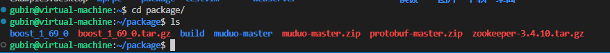
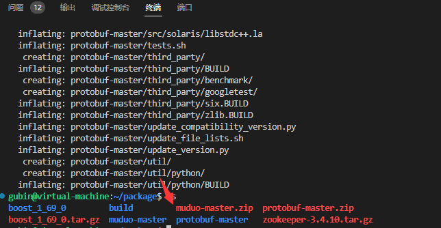
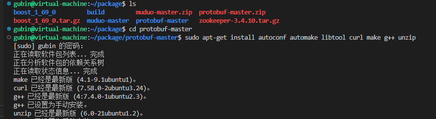
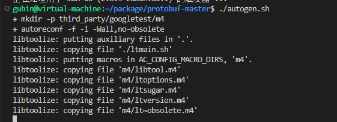
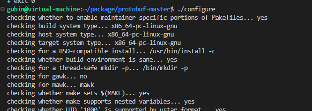
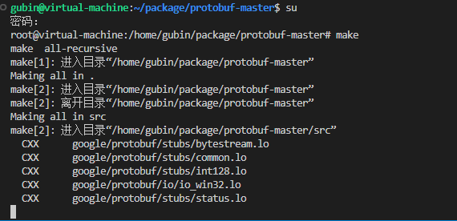
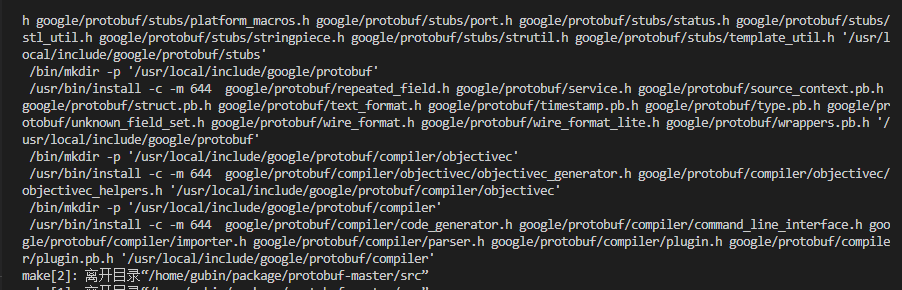
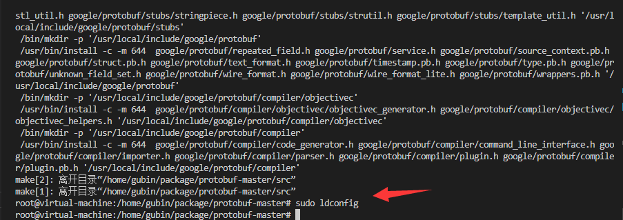
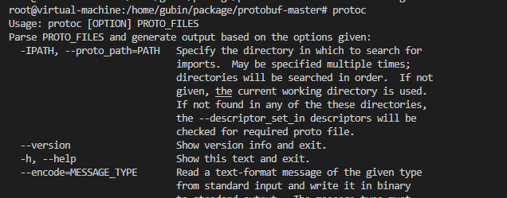
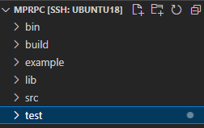

### xshell vscode 

### boost库，muduo库，cmake工具


## protobuf安装

建议安装时，都用管理员权限安装

### 上传安装包到package文件夹



### 1.解压压缩包

```
unzip protobuf-master.zip
```



### 2.进入解压后的文件夹

```
cd protobuf-master
```


### 3.安装所需工具

```
sudo apt-get install autoconf automake libtool curl make g++ unzip 
```



### 4.自动生成configure配置文件

一键执行配置文件

```
./autogen.sh
```



### 5.配置环境

一键执行环境配置文件

```
./configure
```




### 6.编译源代码（时间比较长）

cmake 生成makefile

```
make
```



### 7.安装

根据makefile来编译项目

```
sudo make install
```




### 8.刷新动态库

```
sudo ldconfig
```




### 测试一下

测试protoc命令，看是否protobuf安装成功

```
protoc
```




## 创建项目目录

```
cd mprpc
mkdir bin
mkdir build
mkdir example
mkdir lib
mkdir src

```


