### 安装插件proto3

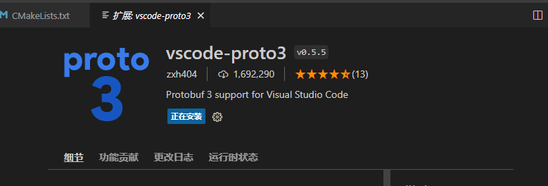

但是发现protoc的编译指令还是用不了，所以我们使用命令

```
sudo apt  install protobuf-compiler
```

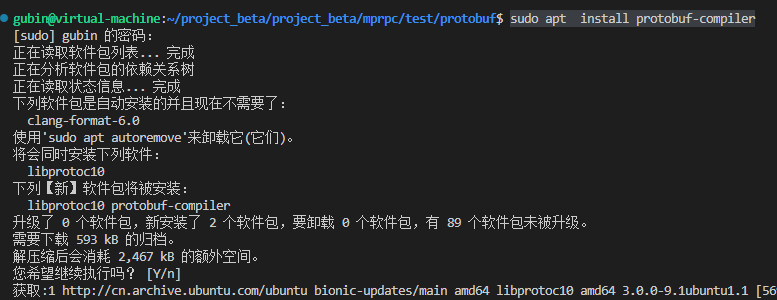

## 例子1

### proto文件的编写

```
syntax = "proto3"; //声明了protobuf的版本

package fixbug; //声明代码所在的包，对于C++来说就是namespace

//定义登录请求消息类型 name pwd
message LoginRequest{
    string name = 1; // =1 代表name是这个message第一个字段，不是指name的值
    string pwd = 2;
}

//定义登录响应消息类型
message LoginResponse{
    int32 errcode = 1;
    string errmsg = 2;
    bool success = 3;
}

```

### 对proto文件进行编译（后面没有空格）

```
protoc test.proto --cpp_out=./
```

### 产生两个cpp文件

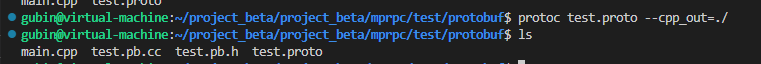


生成的就是我们刚才定义两个消息类

他们是继承于谷歌的Message类


### 测试main.cpp的编写

定义一个request对象，封装好之后，通过protobuf提供的序列化函数SerializeToString序列成string,然后再定义一个Loginrequest对象，通过反序列化函数ParseFromString到对象中，

主要就是一个序列化和反序列的过程

```C++
#include "test.pb.h"
#include <iostream>
#include <string>
using namespace fixbug; // 工作中不要这样！！防止命名空间污染

int main()
{
    // 封装login请求对象的数据
    LoginRequest req;
    req.set_name("lisi");
    req.set_pwd("123456");

    std::string send_str;
    // 将成员值序列化为字符串
    if(req.SerializeToString(&send_str))
    {
        std::cout << send_str.c_str() << std::endl;
    }

    // 从send_str反序列化一个login请求对象
    LoginRequest reqB;
    if(reqB.ParseFromString(send_str))
    {
        std::cout << reqB.name() << std::endl;
        std::cout << reqB.pwd() << std::endl;
    }

    return 0;
}
```

### 过程演示

编译main.cpp文件

```
g++ main.cpp test.pb.cc -o main -lprotobuf -L/usr/local/lib
或
g++ main.cpp test.pb.cc -lprotobuf 
```


运行main可执行文件

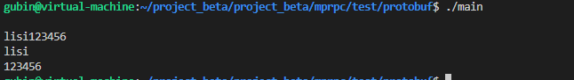

或

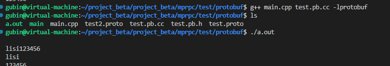


## 例子2——列表

### protobuf文件test.proto

列表需要在遍变量声明前加`repeated`

```protobuf
syntax = "proto3"; // 声明了protobuf版本

package fixbug; // 声明了代码所在的包（生成C++代码后就是namespace 名字）

//定义错误码，错误消息
message ResultCode
{
    int32 errcode = 1;
    bytes errmsg = 2;
}

// 定义登录消息类型
message LoginRequest
{
    bytes name = 1; // =1 代表name是这个message第一个字段，不是指name的值
    bytes pwd = 2;
}

// 定义登录响应消息
message LoginResponse
{
    ResultCode result = 1;
    bool success = 3;
}

//定义请求好友列表请求消息
message GetFriendListRequest
{
    uint32 userid = 1;
}

//定义好友信息
message User
{
    bytes name =1;
    uint32 age = 2;
    enum Sex
    {
        MAN = 0;
        WOMAN = 1;
    }
    Sex sex = 3;
}

//定义请求好友信息响应
message GetFriendListResponse
{
    ResultCode result = 1;
    repeated User friend_list = 2; // repeated表示列表类型！！！
}
```

对proto2文件编译

```
protoc test2.proto --cpp_out=./
```

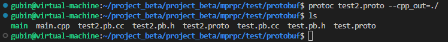

### 测试源代码 main.cc

==定义请求好友信息响应对象，其中有结果码对象，可以通过其中的mutable_result()返回结果码对象指针==

这个mutable修饰的是返回可以修改的成员变量，而不是const修饰

结果码对象设置错误码


好友信息响应对象中有好友列表，可以通过add方法返回指向User对象的指针

==然后我们设置user对象信息（感觉这些方法是先把我们添加对象，再去修改对象信息）==


然后再去打印User列表数据

==还支持随机访问==

```cpp
#include "test.pb.h"
#include <iostream>
#include <string>
using namespace fixbug; // 工作中不要这样！！防止命名空间污染

int main()
{
    // LoginResponse rsp;
    // // 对象成员的修改方法，要先获取成员的指针
    // ResultCode *rc = rsp.mutable_result();
    // rc->set_errcode(1);
    // rc->set_errmsg("登录失败");

    GetFriendListResponse rsp;
    ResultCode *rc = rsp.mutable_result();
    rc->set_errcode(0);
   
    User *user1 = rsp.add_friend_list(); // 返回一个指向User类型指针，我们往里填数据就是在新的位置加入元素了
    user1->set_name("zhangsan");
    user1->set_age(20);
    user1->set_sex(User::MAN);

    User *user2 = rsp.add_friend_list(); // 返回一个指向User类型指针，我们往里填数据就是在新的位置加入元素了
    user2->set_name("lisi");
    user2->set_age(21);
    user2->set_sex(User::MAN);

    //std::cout << rsp.friend_list_size() << std::endl;

    // 打印列表元素
    int n = rsp.friend_list_size();
    for(int i = 0; i < n; ++i)
    {
        std::cout << rsp.friend_list(i).name() << " "<< rsp.friend_list(i).age() << " " << rsp.friend_list(i).sex() << std::endl;
    }
    return 0;
}

```

编译执行

```shell
jyhlinux@ubuntu:~/share/mprpc/test/protobuf$ protoc test.proto  --cpp_out=./
jyhlinux@ubuntu:~/share/mprpc/test/protobuf$ g++ main.cc test.pb.cc -o main -lprotobuf -L/usr/local/lib
jyhlinux@ubuntu:~/share/mprpc/test/protobuf$ ./main 
```

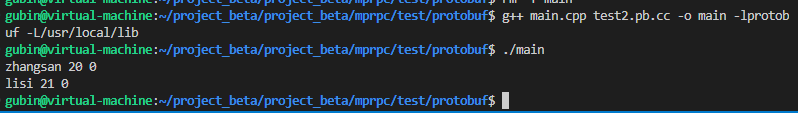


还可以定义map


## 例子3——定义方法类型（用于描述rpc方法）的成员

下面的例子使用`service` 关键字定义描述`rpc`方法的类型，并且注意开头要设置`option`

```protobuf
syntax = "proto3"; // 声明了protobuf版本

package fixbug; // 声明了代码所在的包（生成C++代码后就是namespace 名字）

// 定义下面的选项，表示生成service服务类和rpc方法描述，默认不生成
option cc_generic_services = true;

message ResultCode
{
    int32 errcode = 1;
    bytes errmsg = 2;
}

// 定义登录消息类型
message LoginRequest
{
    bytes name = 1; // =1 代表name是这个message第一个字段，不是指name的值
    bytes pwd = 2;
}

// 定义登录响应消息
message LoginResponse
{
    ResultCode result = 1;
    bool success = 3;
}

message GetFriendListRequest
{
    uint32 userid = 1;
}

message User
{
    bytes name =1;
    uint32 age = 2;
    enum Sex
    {
        MAN = 0;
        WOMAN = 1;
    }
    Sex sex = 3;
}

message GetFriendListResponse
{
    ResultCode result = 1;
    repeated User friend_list = 2; // repeated表示列表类型
}

// 在protobuf里定义描述rpc方法的类型
service UserServiceRpc
{
    rpc Login(LoginRequest) returns(LoginResponse);
    rpc GetFriendList(GetFriendListRequest) returns(GetFriendListResponse);
}
```

### protoc编译

```
protoc test3.proto --cpp_out=./
```

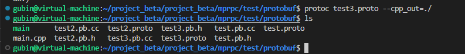


通过`protoc`会生成的`UserServiceRpc`类(服务提供方使用)和 `UserServiceRpc_Stub`类（服务调用方使用）

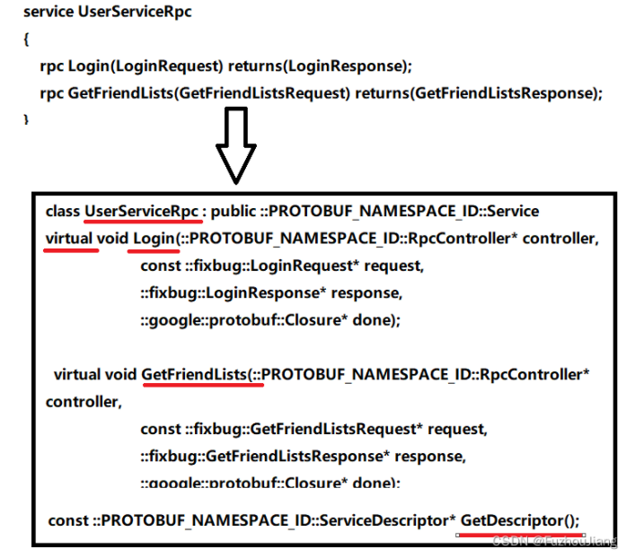

这也是`ServiceProvider`，即`rpc`服务提供者。

### ==产生的方法都是抽象的，虚函数，然后参数也是一样的==


### GetDescriptor()方法用来描述当前这个服务以及服务所拥有的方法这么一个成员函数啊


## caller方类

`UserServiceRpc_Stub`类是服务消费者即`serviceConsumer`


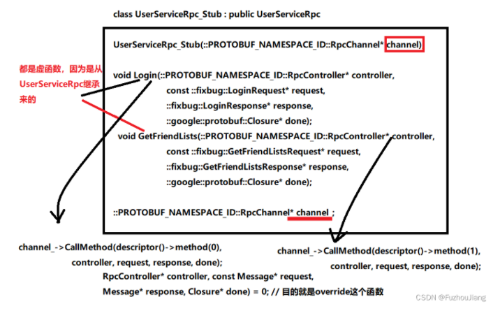

Userservicerpc_stub没有默认构造函数

==有参构造 参数是 rpcchannel==


方法也都是虚函数，因为他从基类UserServicerpc继承过来，是重写了原来的虚函数


### ==底层调用了channel的callmethod方法==

你不管用这个桩类调用哪一个服务方法，它最终都转到这个channel的call method方法上


现在一切的这个矛盾呢？都转到这个rpc channel上了，为什么呢？

因为我这一桩类里边儿所有的方法实现根本没有实现什么具体的业务逻辑。而是都直接调用了你这个channel的call method的方法。


## RPC channel

它是一个抽象类，因为他有一个纯虚函数callMethod

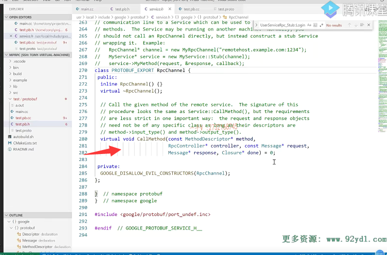

那也就意味着呢，我们必须自己去实现一个类从rpc channel继承而来，

然后把这个call method重写一下


==我们会去自己定义一个MyRpcchannel类，继承Rpcchannel，然后重写callmethod方法，==

==这样就会实现我们自己的调用逻辑==（自己想的）

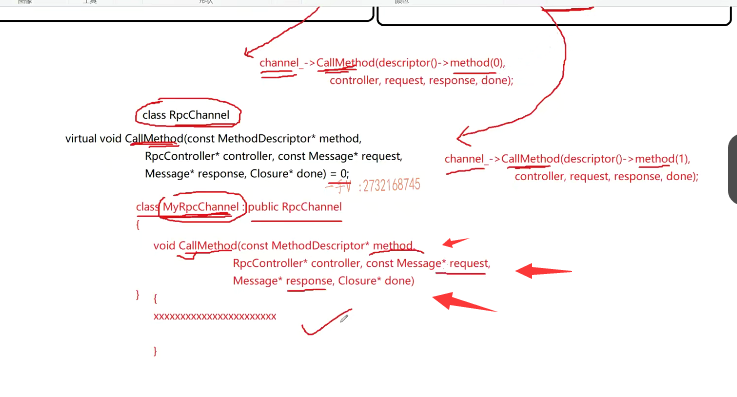

这个我后面具体实现，再理解

现在大多都是抽象概念，需要自己去实现
