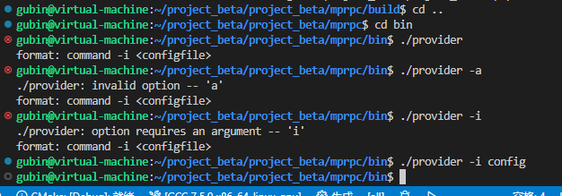

本章对应笔记14-16

其中16包含gdb调试找错误

### 前提知识：

框架中给出

1.初始化操作

2.provider做数据序列化，反序列化，数据网络发送

3.run()操作，这相当于进入进程，进入阻塞状态，等待远程的rpc进行一个调用请求


# cmake环境完善

### 在src下新建CMakeLists.txt

```
aux_source_directory(. SRC_LIST)
add_library(mprpc ${SRC_LIST})
```

或

```cpp
#aux_source_directory(. SRC_LIST)
set(SRC_LIST 
    mprpcapplication.cc 
    rpcprovider.cc)
add_library(mprpc ${SRC_LIST})
#target_link_libraries(mprpc muduo_net muduo_base pthread zookeeper_mt)
```


### callee下的CMakeLists.txt

这个provider编译 是需要我们的框架的代码的，那他就是动态链接我们的so库

所以需要加target_link_libraries

==生成provider 需要链接mprpc 和protobuf库==

```shell
#通过userservice和上一级的user.pb.cc生成
set(SRC_LIST userservice.cc ../user.pb.cc)

add_executable(provider ${SRC_LIST})
target_link_libraries(provider mprpc protobuf)
```


### 顶级目录cmakelist

主要在于可执行文件输出的路径，项目库文件输出的路径

```shell
# 设置cmake的最低版本和项目名称
cmake_minimum_required(VERSION 3.0)
project(mprpc)

# 生成debug版本，可以进行gdb调试
set(CMAKE_BUILD_TYPE "Debug")

# 设置项目可执行文件输出的路径
set(EXECUTABLE_OUTPUT_PATH ${PROJECT_SOURCE_DIR}/bin)
# 设置项目库文件输出的路径
set(LIBRARY_OUTPUT_PATH ${PROJECT_SOURCE_DIR}/lib)

# 设置项目编译头文件搜索路径 -I
include_directories(${PROJECT_SOURCE_DIR}/src/include)
include_directories(${PROJECT_SOURCE_DIR}/example)
# 设置项目库文件搜索路径 -L
link_directories(${PROJECT_SOURCE_DIR}/lib)

# src包含了mprpc框架所有的相关代码
add_subdirectory(src)
# example包含了mprpc框架使用的示例代码
add_subdirectory(example)
```

报了一次错误，


表明我们访问了一个不可访问的基类，应该是我们继承的时候，没有写public，默认使用了private

目前编译完成


# 完成框架的初始化代码书写

我们将来命令行输入，很有可能就是

```
provider -i config.conf
```


判断了参数的个数，因为启动时都会带一些参数

使用了getopt来判断参数

```C++
#include "mprpcapplication.h"
#include <iostream>
#include <unistd.h>

void ShowArgsHelp()
{
    std::cout<<"format: command -i <configfile>" << std::endl;
}

 void MprpcApplication::Init(int argc, char **argv)
 {
   //对参数的数量进行判断
    if (argc < 2)
    {
       ShowArgsHelp();
       //系统调用
       exit(EXIT_FAILURE);
    }
    //这一行定义了一个整数变量 c，用于存储 getopt 函数的返回值。
    int c = 0;
    //这一行定义了一个空的字符串变量 config_file，用于存储配置文件的路径。
    std::string config_file;
    //getopt函数的使用
    //这是一个 while 循环，它使用 getopt 函数来解析命令行参数。getopt 函数用于处理命令行选项，
    //它接受三个参数：参数数量 argc，参数数组 argv，和一个字符串，其中包含允许的选项字符，例如 "i:" 表示允许一个参数选项 -i，并且该选项后面必须跟一个参数值。
    while((c = getopt(argc, argv, "i:")) != -1)
    {
        switch (c)
        {
        case 'i':
        //将选项的参数值存储在 config_file 变量中，
        //optarg 是 getopt 函数提供的全局变量，用于获取当前选项的参数值。
            config_file = optarg;
            break;
        case '?':
            ShowArgsHelp();
            exit(EXIT_FAILURE);
        case ':':
            ShowArgsHelp();
            exit(EXIT_FAILURE);
        default:
            break;
        }
        
        //// 开始加载配置文件了 rpcserver_ip=  rpcserver_port   zookeeper_ip=  zookepper_port=

 }

 //单例模式
MprpcApplication& MprpcApplication::getInstance()
 {
    static MprpcApplication app;
    return app;
 }
```

### 先可以测试一下命令行的参数输入

编译后


测试通过

```shell
gubin@virtual-machine:~/project_beta/project_beta/mprpc/build$ cd ..
gubin@virtual-machine:~/project_beta/project_beta/mprpc$ cd bin
gubin@virtual-machine:~/project_beta/project_beta/mprpc/bin$ ./provider
format: command -i <configfile>
gubin@virtual-machine:~/project_beta/project_beta/mprpc/bin$ ./provider -a
./provider: invalid option -- 'a'
format: command -i <configfile>
gubin@virtual-machine:~/project_beta/project_beta/mprpc/bin$ ./provider -i
./provider: option requires an argument -- 'i'
format: command -i <configfile>
gubin@virtual-machine:~/project_beta/project_beta/mprpc/bin$ ./provider -i config
gubin@virtual-machine:~/project_beta/project_beta/mprpc/bin$ 
```




## 配置文件

新建测试配置文件bin/test.conf

```
# rpc节点的ip地址
rpcserverip=127.0.0.1     
# rpc节点的port端口号
rpcserverport=8000
# zk的ip地址
zookeeperip=127.0.0.1
# zk的port端口号
zookeeperport=2181
```


在mprpcapplication.h和mprpcapplication.cpp添加成员变量配置文件

```C++
// mprpcapplication.h
// singleton
#pragma once

#include "mprpcconfig.h"
#pragma once

// mprpc框架的基础类，负责框架的一些初始化操作
class MprpcApplication
{
public:
    static void Init(int argc, char **argv);
    static MprpcApplication& GetInstance();
   
private:
   	//添加配置文件，成员变量
    static MprpcConfig m_config;

    MprpcApplication(){}
    MprpcApplication(const MprpcApplication&) = delete;
    MprpcApplication(MprpcApplication&&) = delete;
};
```

静态成员变量，类内定义，类外初始化


新建include/mprpcconfig.h文件

主要由三个方法，负责解析加载的配置文件，查询配置项信息，去掉字符串前后空格

```C++
#pragma once

#include <unordered_map>
#include <string>

// rpcserverip   rpcserverport    zookeeperip   zookeeperport
// 框架读取配置文件类
class MprpcConfig
{
public:
    // 负责解析加载配置文件
    void LoadConfigFile(const char *config_file);
    // 查询配置项信息
    std::string Load(const std::string &key);
private:
    std::unordered_map<std::string, std::string> m_configMap;
    // 去掉字符串中的空格
    void Trim(std::string &src_buf);
};
```


新建mprpcconfig.cc文件

1.先判断文件是否存在

2.while循环读取，处理三种情况

一种是井号儿，这就开头的就表示注释，那这个我们肯定不不去处理啊。

然后就是有配置项的，就是有等号的啊。

==接着就是前边儿可能会出现空格儿啊，我们需要把它去掉。(不仅前后的空格，还有中间的空格也要去掉)==

我们就处理这三种情况就可以了。

```C++
#include "mprpcconfig.h"

#include <iostream>
#include <string>

// 负责解析加载配置文件
void MprpcConfig::LoadConfigFile(const char *config_file)
{
    //config_file相当于一个文件地址字符串
    FILE *pf = fopen(config_file, "r");
    if (nullptr == pf)
    {
        std::cout << config_file << " is note exist!" << std::endl;
        exit(EXIT_FAILURE);
    }

    // 1.注释   2.正确的配置项 =    3.去掉开头的多余的空格 
    while(!feof(pf))
    {
        char buf[512] = {0};
        fgets(buf, 512, pf);

        // 去掉字符串前面多余的空格
        std::string read_buf(buf);
        Trim(read_buf);

        // 判断#的注释
        if (read_buf[0] == '#' || read_buf.empty())
        {
            continue;
        }

        // 解析配置项
        //先判断等于号
        int idx = read_buf.find('=');
        if (idx == -1)
        {
            // 配置项不合法
            continue;
        }

        std::string key;
        std::string value;
        key = read_buf.substr(0, idx);
        Trim(key);
        // rpcserverip=127.0.0.1\n
        int endidx = read_buf.find('\n', idx);
        value = read_buf.substr(idx+1, endidx-idx-1);
        Trim(value);
        m_configMap.insert({key, value});
    }

    fclose(pf);
}

// 查询配置项信息
std::string MprpcConfig::Load(const std::string &key)
{
    auto it = m_configMap.find(key);
    if (it == m_configMap.end())
    {
        return "";
    }
    return it->second;
}

// 去掉字符串前后的空格
void MprpcConfig::Trim(std::string &src_buf)
{
    int idx = src_buf.find_first_not_of(' ');
    if (idx != -1)
    {
        // 说明字符串前面有空格
        src_buf = src_buf.substr(idx, src_buf.size()-idx);
    }
    // 去掉字符串后面多余的空格
    idx = src_buf.find_last_not_of(' ');
    if (idx != -1)
    {
        // 说明字符串后面有空格
        src_buf = src_buf.substr(0, idx+1);
    }
}
```


完善mprpcapplication.cpp文件

初始化框架的代码，加上读取配置文件

```
//// 开始加载配置文件了 rpcserver_ip=  rpcserver_port   zookeeper_ip=  zookepper_port=
    
    m_config.LoadConfigFile(config_file.c_str());

    // std::cout << "rpcserverip:" << m_config.Load("rpcserverip") << std::endl;
    // std::cout << "rpcserverport:" << m_config.Load("rpcserverport") << std::endl;
    // std::cout << "zookeeperip:" << m_config.Load("zookeeperip") << std::endl;
    // std::cout << "zookeeperport:" << m_config.Load("zookeeperport") << std::endl;
```


修改src下的CMakeLists.txt文件

主要是为了防止后续我们在编译的时候，还是用的之前的makefile文件

```
aux_source_directory(. SRC_LIST)
add_library(mprpc ${SRC_LIST})
```

改为 把所有源文件加进去

```
#aux_source_directory(. SRC_LIST)
set(SRC_LIST 
    mprpcapplication.cpp
    mprpcconfig.cpp
    mprpcprovider.cpp)
add_library(mprpc SHARED ${SRC_LIST})
```

生成共享库

编译 生成provider 可执行文案


## 测试 配置文件输入


测试时，得知我们需要不仅删除前后两端的空格，中间出现的空格也要删除

并且最后的换行符我们也是不需要的

我们只需要键值对，键是配置名称，值是ip，端口号


### 小总结

将来呢，我们的这个provider啊，就是想发布一个本地服务变成rpc服务，在任何的机器上都可以发布。

不需要再修改源码重，这个重新部署了，只需要修改相应的配置文件就可以了。


不需要考虑线程安全问题，框架只init一次

也可以自己去定义静态变量，来防止判断多次
