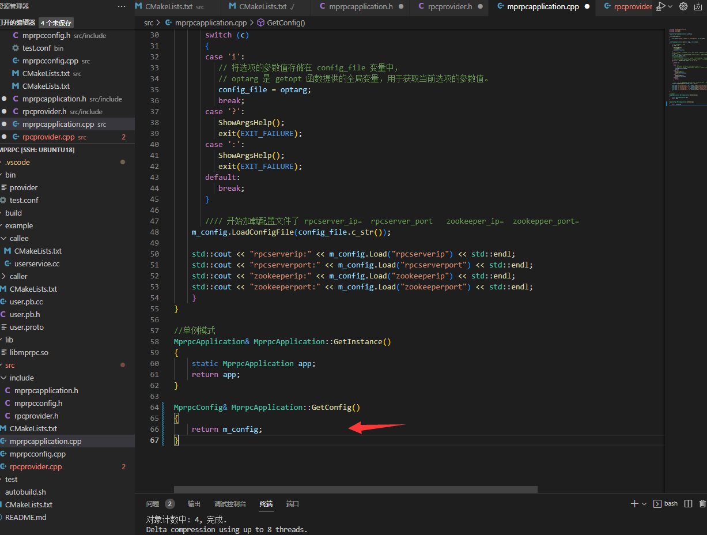
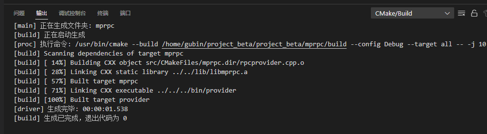

笔记17 内容


### rpcprovider.h中增加muduo库内容

```C++
#pragma once
#include "google/protobuf/service.h"
#include <muduo/net/TcpServer.h>
#include <muduo/net/EventLoop.h>
#include <muduo/net/InetAddress.h>
#include <muduo/net/TcpConnection.h>
#include <memory>
#include <functional>
#include <string>


// 框架提供的专门发布rpc服务的网络对象类
class RpcProvider
{
public:
    // 这里是框架提供给外部使用的，可以发布rpc方法的函数接口
    void NotifyService(google::protobuf::Service *service);

    // 启动rpc服务节点，开始提供rpc远程网络调用服务
    void Run();

private:
    // 组合EventLoop
    muduo::net::EventLoop m_eventLoop;
};
```

### rpcprovider.cpp中增加muduo库内容

```C++
#include "rpcprovider.h"
#include <mprpcapplication.h>


// 这里是框架提供给外部使用的，可以发布rpc方法的函数接口
void RpcProvider::NotifyService(google::protobuf::Service *service)
{
    
}

// 启动rpc服务节点，开始提供rpc远程网络调用服务
void RpcProvider::Run()
{
    // 读取配置文件rpcserver的信息
    std::string ip = MprpcApplication::GetInstance().GetConfig().Load("rpcserverip");
    uint16_t port = atoi(MprpcApplication::GetInstance().GetConfig().Load("rpcserverport").c_str());
    muduo::net::InetAddress address(ip, port);

    // 创建TcpServer对象
    muduo::net::TcpServer server(&m_eventLoop, address, "RpcProvider");

    // 绑定连接回调和消息读写回调方法  分离了网络代码和业务代码

    // 设置muduo库的线程数量
    server.setThreadNum(4);
}

```


==继续增加muduo网络库的连接和响应处理==

先增加mprpcapplication.h 中获取配置的方法,可以获取到配置信息map，根据配置名字获取到配置端口ip的信息

```C++
// mprpcapplication.h
// singleton
#pragma once

#include "mprpcconfig.h"
#pragma once

// mprpc框架的基础类，负责框架的一些初始化操作
class MprpcApplication
{
public:
    static void Init(int argc, char **argv);
    static MprpcApplication& GetInstance();
    //先增加mprpcapplication.h 中获取配置的方法
    static MprpcConfig& GetConfig();
   
private:
    static MprpcConfig m_config;

    MprpcApplication(){}
    MprpcApplication(const MprpcApplication&) = delete;
    MprpcApplication(MprpcApplication&&) = delete;
};
```




完善RpcProvider的网络服务代码

rpcprovider.h

```C++
#pragma once
#include "google/protobuf/service.h"
#include <muduo/net/TcpServer.h>
#include <muduo/net/EventLoop.h>
#include <muduo/net/InetAddress.h>
#include <muduo/net/TcpConnection.h>
#include <memory>
#include <functional>
#include <string>

// 框架提供的专门发布rpc服务的网络对象类
class RpcProvider
{
public:
    // 这里是框架提供给外部使用的，可以发布rpc方法的函数接口
    void NotifyService(google::protobuf::Service *service);

    // 启动rpc服务节点，开始提供rpc远程网络调用服务
    void Run();

private:
    // 组合EventLoop
    muduo::net::EventLoop m_eventLoop;

    // 新的socket连接回调
    void OnConnection(const muduo::net::TcpConnectionPtr&);
    // 已建立连接用户的读写事件回调
    void OnMessage(const muduo::net::TcpConnectionPtr&, muduo::net::Buffer*, muduo::Timestamp);
};
```


rpcprovider.cpp

```C++
#include "rpcprovider.h"
#include "mprpcapplication.h"

// 这里是框架提供给外部使用的，可以发布rpc方法的函数接口
void RpcProvider::NotifyService(google::protobuf::Service *service)
{
    
}

// 启动rpc服务节点，开始提供rpc远程网络调用服务
void RpcProvider::Run()
{
    // 读取配置文件rpcserver的信息
    std::string ip = MprpcApplication::GetInstance().GetConfig().Load("rpcserverip");
    uint16_t port = atoi(MprpcApplication::GetInstance().GetConfig().Load("rpcserverport").c_str());
    muduo::net::InetAddress address(ip, port);

    // 创建TcpServer对象
    muduo::net::TcpServer server(&m_eventLoop, address, "RpcProvider");

    // 绑定连接回调和消息读写回调方法  分离了网络代码和业务代码
    server.setConnectionCallback(std::bind(&RpcProvider::OnConnection, this, std::placeholders::_1));
    server.setMessageCallback(std::bind(&RpcProvider::OnMessage, this, std::placeholders::_1, 
            std::placeholders::_2, std::placeholders::_3));

    // 设置muduo库的线程数量
    server.setThreadNum(4);

    // rpc服务端准备启动，打印信息
    std::cout << "RpcProvider start service at ip:" << ip << " port:" << port << std::endl;

    // 启动网络服务
    server.start();
    m_eventLoop.loop(); 
}


// 新的socket连接回调
void RpcProvider::OnConnection(const muduo::net::TcpConnectionPtr &conn)
{
    
}
// 已建立连接用户的读写事件回调 如果远程有一个rpc服务的调用请求，那么OnMessage方法就会响应
void RpcProvider::OnMessage(const muduo::net::TcpConnectionPtr &conn, 
                            muduo::net::Buffer *buffer, 
                            muduo::Timestamp)
{

}
```


### 编译环境




补充：

注意一般出现未定义的引用问题，可定就是相应的cpp文件中没有去定义函数

之前出现过无法访问的基类，就是继承时忘了加public


