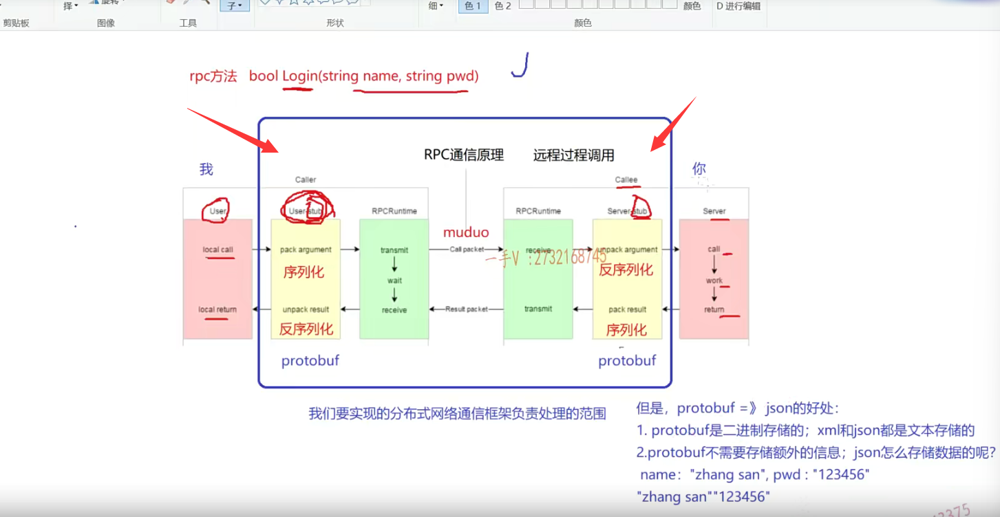
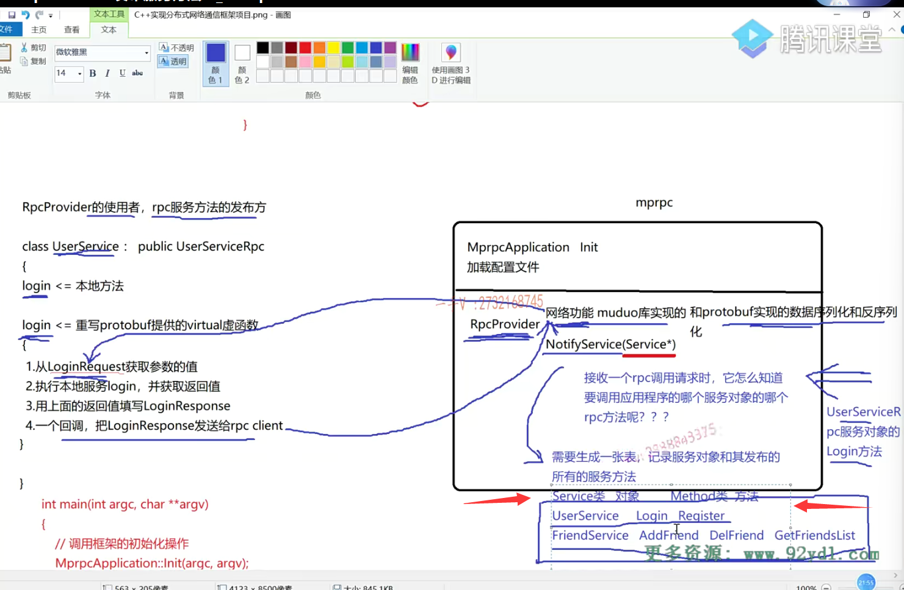

笔记18-19内容

## 前置知识

之前说过rpc概念，

这里边所谓的远端就是可以在不同的机器上，也可以在同一个机器的不同进程上都可以像调用本地方法一样，直接调用一个远程发布的rpc方法。

就是经常所说的这个微服务的这么一个概念啊。微服务就是把服务拆分成最小。根据它的这个对硬件对于这个高并发的这个需求进行非常灵活的部署。



### 目前已经完成的

**1.完成框架的init部分，加载配置文件，主要是MprpcApplication类**

**2.完成基于muduo网络服务部分，主要是RpcProvider类**


接下来实现Provider中的NotifyService方法，发布服务方法


==service是一个基类的指针，userservicerpc这些类都是从这个service继承而来。==


### 发布服务方法的使用

具体过程分析去看笔记18

==展示过程图==




`RpcProvider`，利用`muduo`库的来实现数据的收发，利用`protobuf`来实现数据的序列化（发送前）和[反序列化](https://so.csdn.net/so/search?q=%E5%8F%8D%E5%BA%8F%E5%88%97%E5%8C%96&spm=1001.2101.3001.7020)（接收后）

发布服务主要在`NotifyService` 实现，重点在于**生成一张表，记录服务对象和其发布的所有服务方法**

```cpp
struct ServiceInfo
{
    google::protobuf::Service *m_service; // 保存服务对象的地址
    std::unordered_map<std::string, const google::protobuf::MethodDescriptor*> m_methodMap; // 保存服务方法映射<方法名, 方法描述符指针>
};
 // 存储注册成功的 服务对象 和 其服务的所有信息
std::unordered_map<std::string, ServiceInfo> m_serviceMap;
```

RpcProvider.h文件中添加protobuf中提供的descriptor.h头文件，用于获取服务对象下的方法的抽象描述，其中的method方法可以根据序号，获取到服务对象中的第几号方法


新增加一个结构体ServiceInfo，

两个映射表m_methodMap,m_serviceMap，具体关系看cpp中的实现

```C++
#pragma once
#include "google/protobuf/service.h"
#include <muduo/net/TcpServer.h>
#include <muduo/net/EventLoop.h>
#include <muduo/net/InetAddress.h>
#include <muduo/net/TcpConnection.h>
#include <memory>
#include <functional>
#include <string>
#include <google/protobuf/descriptor.h>//++
#include <unordered_map>//++

// 框架提供的专门发布rpc服务的网络对象类
class RpcProvider
{
public:
    // 这里是框架提供给外部使用的，可以发布rpc方法的函数接口
    void NotifyService(google::protobuf::Service *service);

    // 启动rpc服务节点，开始提供rpc远程网络调用服务
    void Run();

private:
    // 组合EventLoop
    muduo::net::EventLoop m_eventLoop;
     // service服务类型信息
    struct ServiceInfo//++
    {
        google::protobuf::Service *m_service; // 保存服务对象
        std::unordered_map<std::string, const google::protobuf::MethodDescriptor*> m_methodMap; // 保存服务方法
    };
    // 存储注册成功的服务对象和其服务方法的所有信息
    std::unordered_map<std::string, ServiceInfo> m_serviceMap;//++

    // 新的socket连接回调
    void OnConnection(const muduo::net::TcpConnectionPtr&);
    // 已建立连接用户的读写事件回调
    void OnMessage(const muduo::net::TcpConnectionPtr&, muduo::net::Buffer*, muduo::Timestamp);
};
```


## NotifyService 函数实现代码


```cpp
#include "rpcprovider.h"
#include "mprpcapplication.h"

/*
service_name =>  service描述   
                        =》 service* 记录服务对象
                        method_name  =>  method方法对象
json   protobuf
*/
// 这里是框架提供给外部使用的，可以发布rpc方法的函数接口
void RpcProvider::NotifyService(google::protobuf::Service *service)
{
    ServiceInfo service_info;

    // 获取了服务对象的描述信息
    const google::protobuf::ServiceDescriptor *pserviceDesc = service->GetDescriptor();
    // 获取服务的名字
    std::string service_name = pserviceDesc->name();
    // 获取服务对象service的方法的数量
    int methodCnt = pserviceDesc->method_count();

    std::cout << "service_name:" << service_name << std::endl;

    for (int i=0; i < methodCnt; ++i)
    {
        // 获取了服务对象指定下标的服务方法的描述（抽象描述） UserService   Login
        const google::protobuf::MethodDescriptor* pmethodDesc = pserviceDesc->method(i);
        std::string method_name = pmethodDesc->name();
        service_info.m_methodMap.insert({method_name, pmethodDesc});

        std::cout << "method_name:" << method_name << std::endl;
    }
    service_info.m_service = service;
    m_serviceMap.insert({service_name, service_info});
}


// 启动rpc服务节点，开始提供rpc远程网络调用服务
void RpcProvider::Run()
{
    // 读取配置文件rpcserver的信息
    std::string ip = MprpcApplication::GetInstance().GetConfig().Load("rpcserverip");
    uint16_t port = atoi(MprpcApplication::GetInstance().GetConfig().Load("rpcserverport").c_str());
    muduo::net::InetAddress address(ip, port);

    // 创建TcpServer对象
    muduo::net::TcpServer server(&m_eventLoop, address, "RpcProvider");

    // 绑定连接回调和消息读写回调方法  分离了网络代码和业务代码
    server.setConnectionCallback(std::bind(&RpcProvider::OnConnection, this, std::placeholders::_1));
    server.setMessageCallback(std::bind(&RpcProvider::OnMessage, this, std::placeholders::_1, 
            std::placeholders::_2, std::placeholders::_3));

    // 设置muduo库的线程数量
    server.setThreadNum(4);

    // rpc服务端准备启动，打印信息
    std::cout << "RpcProvider start service at ip:" << ip << " port:" << port << std::endl;

    // 启动网络服务
    server.start();
    m_eventLoop.loop(); 
}


// 新的socket连接回调
void RpcProvider::OnConnection(const muduo::net::TcpConnectionPtr &conn)
{
    
}
// 已建立连接用户的读写事件回调 如果远程有一个rpc服务的调用请求，那么OnMessage方法就会响应
void RpcProvider::OnMessage(const muduo::net::TcpConnectionPtr &conn, 
                            muduo::net::Buffer *buffer, 
                            muduo::Timestamp)
{

}
```


1.可以看出我们先根据string 服务对象指针获取到服务对象的描述指针，可以获取到服务对象的名字(name())

2.然后再通过成员方法method_count()得到服务对象中服务方法个数

在通过轮询得到每个服务方法的名字，服务对象的抽象指针，插入service_info中的m_methodMap中

3.最后也将服务对象名称和对应的服务对象指针方法m_serviceMap

```C++
/*
service_name =>  service描述   
                        =》 service* 记录服务对象
                        method_name  =>  method方法对象
json   protobuf
*/
// 这里是框架提供给外部使用的，可以发布rpc方法的函数接口
void RpcProvider::NotifyService(google::protobuf::Service *service)
{
    ServiceInfo service_info;

    // 获取了服务对象的描述信息
    const google::protobuf::ServiceDescriptor *pserviceDesc = service->GetDescriptor();
    // 获取服务的名字
    std::string service_name = pserviceDesc->name();
    // 获取服务对象service的方法的数量
    int methodCnt = pserviceDesc->method_count();

    std::cout << "service_name:" << service_name << std::endl;

    for (int i=0; i < methodCnt; ++i)
    {
        // 获取了服务对象指定下标的服务方法的描述（抽象描述） UserService   Login
        const google::protobuf::MethodDescriptor* pmethodDesc = pserviceDesc->method(i);
        std::string method_name = pmethodDesc->name();
        service_info.m_methodMap.insert({method_name, pmethodDesc});

        std::cout << "method_name:" << method_name << std::endl;
    }
    service_info.m_service = service;
    m_serviceMap.insert({service_name, service_info});
}
```


## 测试


这是login方法，就是在proto文件里边定义的这个service服务对象的名字以及rpc服务方法 。


## 补充

### 数据协议 protobuf xml json 

不考虑xml太老了，json跟这个protobuffer。

json存储的就是键值对

protobuffer相对于json来说呢，使用起来大家看是不是稍微有那么一点点的成本儿啊

但是它比json好用多了啊。

### protobuf优点

==一个是pro to buffer是基于二进制存储的，而json是基于文本存储的。==

protobuffer效率会更高。

==protobuffer存储数据的时候是紧密存储的，不携带除数据以外，数据以外任何其他的信息，==

==而json呢？你的数据就是你value总得是不是给它对应一个键啊，==

==它有一个键的名字，然后再携带对应的数据。==

### 存储效率高 带宽资源少

==所以整体来说，protobuffer的存储的效率会更高啊，占用的带宽资源会更少，同样的带宽资源呢传输。这个数据量会更大。==

好吧啊，这是它就是使用我们使用它啊，不使用json的意义所在，


### protobuf提供了对象的描述和服务方法

另外一个就是它不仅仅像json可以定义类型，提供类型的序列化跟反序列化，

==更重要的是protobuf还提供了啊service rpc方法的一个描述，==

==人家还提供了我们现在看到的像这个service类。method类。==


可以从抽象的层面呢来去描述服务对象跟服务方法，

到时候由框架底层就直接可以利用上层的服务对象的方法了。我们永远都是这个上层调用下层

下层怎么能调用上层呢？这本身就是一个回调的概念啊？

回调的概念在这里边service跟method就可以做到这一点


只需要知道在这里边儿notify service。就是我们发布rpc服务的站点通过这个可以发布rpc服务啊，


那我们把它的这个相关的这个信息呢，就记录了什么信息呢，服务对象以及它的支持的服务方法。


到时候框架就可以帮你调用了。

