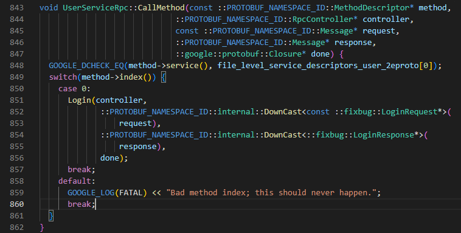

笔记20-22内容

## 前置知识

之前已经把rpc provider的网络功能提供了，上面这个绿色的这一块已经处理完了


接下来考虑黄色的这个序列化和反序列化的处理


主要一个是on connection的回调，一个是on message的回调，这两个函数呢，都不是我们自己调的这是由muduo库帮我们调的。

反序列化请求和序列化响应都是在onmessage中做，处理已建立连接用户的读写事件回调。


### 处理新的连接   onConnection()

rpcprovider.cpp中完善，主要是通过muduo中的TcpConnectionPtr类对象来处理连接断开时

```C++
// 新的socket连接回调
void RpcProvider::OnConnection(const muduo::net::TcpConnectionPtr &conn)
{
    if (!conn->connected())
    {
        // 和rpc client的连接断开了
        conn->shutdown();
    }
}
```

## 处理请求和响应 onMessage()回调方法

### 定义proto的message类型

rpc provider和rpc consumer需要事先协商好通信用的消息数据结构，远程调用的字符串数据至少先包含方法名字，方法需要的参数，

为了解决粘包问题，先定义数据头大小，然后定义数据头，其中包含了服务对象名称，方法名称，数据头中还记录方法参数大小，后面都是方法参数字符串


客户端（请求调用方）发送请求时需要发 `service_name`,`method_name`、`args_size`, 其中`args_size`防止粘包问题，于是采用如下的消息格式设计

`header_size`（消息成员长度，占4B） + `header_str`(消息成员)


```protobuf
// rpcheader.proto 
syntax = "proto3";

package mprpc;

// 定义RPC请求头消息格式
message RpcHeader
{
    bytes service_name = 1;  // 请求的服务名
    bytes method_name = 2;  // 请求的方法名
    uint32 args_size = 3;   // 请求的方法的参数大小
}
```


编译成cpp文件

```
protoc rpcheader.proto --cpp_out=./
```


在rpcprovider.cpp中包含一下头文件


## 分发rpc服务实现代码

rpcprovider.cpp中完善

```cpp
void RpcProvider::onMessage(const muduo::net::TcpConnectionPtr &conn, muduo::net::Buffer *buffer, muduo::Timestamp)
{
    // 1. 网络上接收远程rpc调用请求的字符流
    std::string recv_buf = buffer->retrieveAllAsString();

    // 2. 从字符流中（recv_buf）读取前4个字节内容
    uint32_t header_size = 0;
    recv_buf.copy((char *)&header_size, 4, 0);

    // 3.根据header_size读取数据头的原始字符流，反序列化数据，得到rpc请求的详细信息
    std::string rpc_header_str = recv_buf.substr(4, header_size);
    mprpc::RpcHeader rpcHeader;
    std::string service_name;
    std::string method_name;
    uint32_t args_size;

    if (rpcHeader.ParseFromString(rpc_header_str))
    {
        service_name = rpcHeader.service_name();
        method_name = rpcHeader.method_name();
        args_size = rpcHeader.args_size();
    }
    else
    {
        std::cout << "rpc_header_str" << rpc_header_str << "parse error" << std::endl;
        return;
    }

    // 获取rpc方法参数的字符流数据
    std::string args_str = recv_buf.substr(4 + header_size, args_size);

    // 打印调试信息
    std::cout << "============================================" << std::endl;
    std::cout << "header_size: " << header_size << std::endl;
    std::cout << "rpc_header_str: " << rpc_header_str << std::endl;
    std::cout << "service_name: " << service_name << std::endl;
    std::cout << "method_name: " << method_name << std::endl;
    std::cout << "args_str: " << args_str << std::endl;
    std::cout << "============================================" << std::endl;

    // 4.获取service对象和method对象
    auto it = m_serviceMap.find(service_name);
    if (it == m_serviceMap.end())
    {
        std::cout << service_name << "is not exist!" << std::endl;
        return;
    }
    // <std::string, const google::protobuf::MethodDescriptor *>::iterator
    auto mit = it->second.m_methodMap.find(method_name);
    if (mit == it->second.m_methodMap.end())
    {
        std::cout << service_name << ":" << method_name << "is not exist" << std::endl;
        return;
    }
// it->second 类型是ServiceInfo
    google::protobuf::Service *service = it->second.m_service; // 获取service对象
    const google::protobuf::MethodDescriptor *method = mit->second;

    // 5.生成rpc方法调用的请求request和响应response参数
    google::protobuf::Message *request = service->GetRequestPrototype(method).New();
    if (!request->ParseFromString(args_str))
    {
        std::cout << "request parse error, content:" << args_str << std::endl;
    }
    google::protobuf::Message *response = service->GetResponsePrototype(method).New();

    // 绑定一个方法调用后的回调
    google::protobuf::Closure *done = google::protobuf::NewCallback<RpcProvider, const muduo::net::TcpConnectionPtr &, google::protobuf::Message *>(this,
                                                                                                                                                    &RpcProvider::SendRpcResponse,
                                                                                                                                                    conn,
                                                                                                                                                    response);

    // 6.在框架上根据远端rpc请求， 调用当前rpc节点上发布的方法
    // done是执行完本地节点提供的方法后的回调，一般是把结果序列化发送回对端
    service->CallMethod(method, nullptr, request, response, done);
}
```


### 先是完成反序列化接收远程的rpc调用请求的字符流

分发rpc服务的实现在`RpcProvider::OnMessage`函数中：

1.调用Buffer类中retrieveAllAsString()接收rpc远程调用请求的字符流

2.调用string对象的copy方法去读前4个字节数据放入headersize整型中

3.根据header_size读取数据头的原始字符流，反序列化数据，得到rpc请求的详细信息

- 先使用substr获取header_str除了header_size部分
- 定义RpcHeader对象，然后利用protobuf提供的ParseFromString来解析rpc_header_str获取到服务对象名，服务方法名，参数字符串大小

4.获取rpc方法参数的字符流数据

```C++
/*
在框架内部，RpcProvider和RpcConsumer协商好之间通信用的protobuf数据类型
service_name method_name args    定义proto的message类型，进行数据头的序列化和反序列化
                                 service_name method_name args_size
16UserServiceLoginzhang san123456   

header_size(4个字节) + header_str + args_str
10 "10"
10000 "1000000"
std::string   insert和copy方法 
*/
// 已建立连接用户的读写事件回调 如果远程有一个rpc服务的调用请求，那么OnMessage方法就会响应
void RpcProvider::OnMessage(const muduo::net::TcpConnectionPtr &conn, 
                            muduo::net::Buffer *buffer, 
                            muduo::Timestamp)
{
    // 网络上接收的远程rpc调用请求的字符流    Login args
    std::string recv_buf = buffer->retrieveAllAsString();

    // 从字符流中读取前4个字节的内容
    uint32_t header_size = 0;
    recv_buf.copy((char*)&header_size, 4, 0);

    // 根据header_size读取数据头的原始字符流，反序列化数据，得到rpc请求的详细信息
    std::string rpc_header_str = recv_buf.substr(4, header_size);
    mprpc::RpcHeader rpcHeader;
    std::string service_name;
    std::string method_name;
    uint32_t args_size;
    if (rpcHeader.ParseFromString(rpc_header_str))
    {
        // 数据头反序列化成功
        service_name = rpcHeader.service_name();
        method_name = rpcHeader.method_name();
        args_size = rpcHeader.args_size();
    }
    else
    {
        // 数据头反序列化失败
        std::cout << "rpc_header_str:" << rpc_header_str << " parse error!" << std::endl;
        return;
    }

    // 获取rpc方法参数的字符流数据
    std::string args_str = recv_buf.substr(4 + header_size, args_size);

    // 打印调试信息
    std::cout << "============================================" << std::endl;
    std::cout << "header_size: " << header_size << std::endl; 
    std::cout << "rpc_header_str: " << rpc_header_str << std::endl; 
    std::cout << "service_name: " << service_name << std::endl; 
    std::cout << "method_name: " << method_name << std::endl; 
    std::cout << "args_str: " << args_str << std::endl; 
    std::cout << "============================================" << std::endl;
}
```


### 接着，获取这个service对象和method方法

1.根据解析出来的service对象名称获取到它的服务对象的描述结构体，

得到了服务对象的指针

然后就可以根据解析出来的方法名，轮询ServiceInfo中的m_methodMap获取到服务方法指针，

2.之后将获取的service对象和method方法对象来生成rpc方法调用的请求request和响应response参数，这个请求和响应是我们定义proto文件中的Message类型，我们可以获取Message request和response对象，这样就可以使用ParseFromString来解析

- google::protobuf::Message *request = service->GetRequestPrototype(method).New();还需要解析请求参数字符串args_str
- google::protobuf::Message *response = service->GetResponsePrototype(method).New();

3.接着需要完成CallMethod()方法，其中的参数有request,response,还有一个回调函数

这个回调函数我们使用protobuf提供的NewCallback生成。这个NewCallback也需要我们自己定义本地回调函数RpcSendResponse

- 框架调用CallMethod方法，这个方法需要我们提供多个参数，这些参数都会上述的步骤获取，包括method方法指针，controller暂时设为nullptr,Message*request解析获取,response通过回调函数RpcSendResponse填充，Closure * done回调函数



- CallMethod方法会帮我们调用user.proto定义好的rpc方法，做本地业务，

  done->run()会开启网络服务，并且done也绑定了用于序列化rpc的响应和网络发送SendRpcResponse方法，也会在开启网络服务后，去执行

  


#### 具体实现

```C++
   // 获取rpc方法参数的字符流数据
    std::string args_str = recv_buf.substr(4 + header_size, args_size);

    // 打印调试信息
    std::cout << "============================================" << std::endl;
    std::cout << "header_size: " << header_size << std::endl; 
    std::cout << "rpc_header_str: " << rpc_header_str << std::endl; 
    std::cout << "service_name: " << service_name << std::endl; 
    std::cout << "method_name: " << method_name << std::endl; 
    std::cout << "args_str: " << args_str << std::endl; 
    std::cout << "============================================" << std::endl;

    // 获取service对象和method对象
    auto it = m_serviceMap.find(service_name);
    if (it == m_serviceMap.end())
    {
        std::cout << service_name << " is not exist!" << std::endl;
        return;
    }

    auto mit = it->second.m_methodMap.find(method_name);
    if (mit == it->second.m_methodMap.end())
    {
        std::cout << service_name << ":" << method_name << " is not exist!" << std::endl;
        return;
    }

    google::protobuf::Service *service = it->second.m_service; // 获取service对象  new UserService
    const google::protobuf::MethodDescriptor *method = mit->second; // 获取method对象  Login

    // 生成rpc方法调用的请求request和响应response参数
    google::protobuf::Message *request = service->GetRequestPrototype(method).New();
    if (!request->ParseFromString(args_str))
    {
        std::cout << "request parse error, content:" << args_str << std::endl;
        return;
    }
    google::protobuf::Message *response = service->GetResponsePrototype(method).New();

    // 给下面的method方法的调用，绑定一个Closure的回调函数
    google::protobuf::Closure *done = google::protobuf::NewCallback<RpcProvider, const muduo::net::TcpConnectionPtr&,google::protobuf::Message*>(this,&RpcProvider::SendRpcResponse, 
conn, response);

    // 在框架上根据远端rpc请求，调用当前rpc节点上发布的方法
    // new UserService().Login(controller, request, response, done)
    service->CallMethod(method, nullptr, request, response, done);
```


## RpcProvider的rpc响应回调实现

### 我们利用protobuf提供的接口去绑定一个closure的回调函数

#### 前置知识

```C++
// See Closure.
template <typename Class, typename Arg1, typename Arg2>
inline Closure* NewCallback(Class* object, void (Class::*method)(Arg1, Arg2),
                            Arg1 arg1, Arg2 arg2) {
  return new internal::MethodClosure2<Class, Arg1, Arg2>(
    object, method, true, arg1, arg2);
}
```

我们需要使用NewCallback()这个方法的其中一个重载版本（模板特例化）生成closure对象，

模板特例化中，给的是类对象，回调函数的参数类型

方法的第一个参数传入类对象指针 this，第二个参数是方法的地址 &RpcProvider::SendRpcResponse,就是我们即将定义的回调函数地址，第三个和第四个是传入的方法实参，一个是TcpConnctionPtr conn, 一个是Message response，这个是传入指针，然后此回调函数被调用后，就会填充好response对象

### 回调函数SendRpcResponse实现

rpcprovider.h中添加Closure的回调函数声明，用于序列化rpc的响应和网络发送

```C++
#pragma once
#include "google/protobuf/service.h"
#include <muduo/net/TcpServer.h>
#include <muduo/net/EventLoop.h>
#include <muduo/net/InetAddress.h>
#include <muduo/net/TcpConnection.h>
#include <memory>
#include <functional>
#include <string>
#include <google/protobuf/descriptor.h>
#include <unordered_map>

// 框架提供的专门发布rpc服务的网络对象类
class RpcProvider
{
public:
    // 这里是框架提供给外部使用的，可以发布rpc方法的函数接口
    void NotifyService(google::protobuf::Service *service);

    // 启动rpc服务节点，开始提供rpc远程网络调用服务
    void Run();

private:
    // 组合EventLoop
    muduo::net::EventLoop m_eventLoop;
     // service服务类型信息
    struct ServiceInfo
    {
        google::protobuf::Service *m_service; // 保存服务对象
        std::unordered_map<std::string, const google::protobuf::MethodDescriptor*> m_methodMap; // 保存服务方法
    };
    // 存储注册成功的服务对象和其服务方法的所有信息
    std::unordered_map<std::string, ServiceInfo> m_serviceMap;

    // 新的socket连接回调
    void OnConnection(const muduo::net::TcpConnectionPtr&);
    // 已建立连接用户的读写事件回调
    void OnMessage(const muduo::net::TcpConnectionPtr&, muduo::net::Buffer*, muduo::Timestamp);

    // Closure的回调操作，用于序列化rpc的响应和网络发送
    void SendRpcResponse(const muduo::net::TcpConnectionPtr&, google::protobuf::Message*);
};
```

在rpcprovider.cpp中实现回调函数

主要是用于填充response，并且通过网络发送

```C++
// Closure的回调操作，用于序列化rpc的响应和网络发送
void RpcProvider::SendRpcResponse(const muduo::net::TcpConnectionPtr& conn, google::protobuf::Message *response)
{
    std::string response_str;
    if (response->SerializeToString(&response_str)) // response进行序列化
    {
        // 序列化成功后，通过网络把rpc方法执行的结果发送会rpc的调用方
        conn->send(response_str);
    }
    else
    {
        std::cout << "serialize response_str error!" << std::endl; 
    }
    conn->shutdown(); // 模拟http的短链接服务，由rpcprovider主动断开连接
}
```

## 补充

CallMethod会根据method中的index()来确定调用哪个rpc方法


之前在NotifyService()中我们就先是获取Service对象描述，然后得到rpc服务对象的方法数，然后就可以根据方法索引获取方法


## 编译

修改一下CMakeLists.txt添加rpcheader.pb.cc

```shell
#aux_source_directory(. SRC_LIST)
set(SRC_LIST 
    mprpcapplication.cpp
    mprpcconfig.cpp
    rpcprovider.cpp
    rpcheader.pb.cc)
add_library(mprpc ${SRC_LIST})
target_link_libraries(mprpc muduo_net muduo_base pthread)
```

